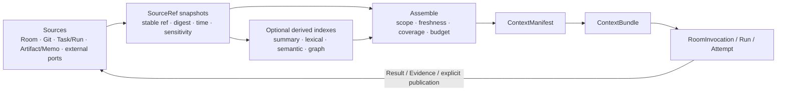

# HCTL2 Context 管理设计备忘

> 状态：讨论稿，非规范正文。本文用于收敛后续设计，不改变现有领域合同。
> 日期：2026-08-19
> 术语说明：成稿于 v0.9.1 概念归并前，文中 InvocationBinding / AttemptSpec 已合并为 ExecutionSpec（见[归并对照](../docs/design/spec/README.md#v091-归并对照)）。
> 核心判断：Context 是 Project 模块内的一组来源、投影、冻结与消费合同，不是 SQLite 聊天表，也不是 Project、Task、Run、Harness 之外的第五模块。

## 1. 要解决的问题

HCTL2 不能把 Context 理解成“把最近若干条聊天从 SQLite 填进 prompt”。这只能恢复文字，不能回答更重要的问题：

- 这次执行继承了哪些目标、决定、约束和未决问题？
- 每条信息来自哪里，是否仍然新鲜，检索覆盖了什么、漏了什么？
- Repo Room 中的研究如何有选择地进入 Project，Project 中的决定如何传到 Task、Run 和 Attempt？
- 在有限 token 中，哪些内容必须原样保留，哪些可以摘要，哪些可以舍弃？
- 运行中的 Agent 如何追加召回，而不绕过冻结的范围、权限与审计？
- 哪些临时信息值得成为长期知识，谁有权让它晋升？

Context 直接决定冷启动成本、重复核验次数、Agent 的有效工作时间和结果可复核性。目标不是“每次给得越多越好”，而是：

> 在获准范围内，用尽可能少且足够的信息恢复工作的因果链，并让每个结论都能回到来源。

## 2. 设计边界

### 2.1 不新增第五模块

Context 的所有权仍按四模块分配：

| 模块 | Context 职责 | 不拥有的内容 |
| --- | --- | --- |
| Project | Room working context、来源目录、组装、预览、Memo 晋升和 RoomInvocation 的 ContextManifest/Bundle | Task 契约、Run lifecycle、物理进程 |
| Task | 在 TaskRevision 中保存采用的 Project/source refs 与验收依据 | 通用 Context delta、检索服务或聊天记忆 |
| Run | 在 Run Manifest 中冻结 Project 产出的 ContextManifest ref+digest | 重新组装来源、长期知识写入 |
| Harness | 向执行体交付获准的 ContextBundle，记录 delivery/tool read 与 Evidence | 绕过 binding 读取 Room/Memo/外部 Context store，或声称模型实际注意了什么 |

实现上可以有 context assembler、indexer、retriever 等 Project 内部服务，但它们是服务或可重建投影，不形成新的领域权威。

### 2.2 Context 与几个相邻概念

| 概念 | 含义 |
| --- | --- |
| Room history | 完整、按序的协作记录；不是默认 prompt，也不是长期知识库 |
| Working Context | 由 RoomEvent、pin/exclude 与当前对象 refs 重建的工作投影；没有独立 lifecycle 或 writer |
| ContextManifest | 一次调用或 Run 获准使用什么、如何选择、基于哪个时间点的不可变说明与证据 |
| ContextBundle | 按某个消费者的权限和预算实际物化、送入执行体的内容 |
| Memo | 经明确预览、去敏和发布的稳定知识；有 scope、来源、有效期和 supersedes 链 |
| Artifact / Evidence | 工作产物与证明；可以被 Context 引用，但不会自动成为 Memo |

SQLite 可以保存 RoomEvent、索引、游标和 Manifest 元数据；Git 可以保存 Memo、Artifact 及共享配置。存储位置不决定 Context 语义，任何索引都必须能从权威来源和不可变引用重建。

## 3. 总体数据流

MyContext 值得吸收的重点不是某张表或某个图数据库，而是把“来源接入”和“Context 消费”分开，并保留逐层证据：



这条链包含四类 Context 动作：

1. **引用与规范化**：把获准来源表示为带版本、digest、时间和敏感级别的 SourceRef；adapter 的采集/恢复沿用受控端口通用合同。
2. **可选派生**：摘要、关键词、embedding 与图只用于候选召回，必须保留 lineage，不能覆盖来源。
3. **组装**：按调用目的、作用域、权限、新鲜度、覆盖度和 token budget 形成 Manifest 与 Bundle。
4. **消费与回流**：执行体只收到 Bundle；结果回到已有 Message、Artifact 或 Evidence，长期知识仍需显式发布 Memo。

## 4. Chat Room 内的 Working Context

Working Context 不是最近 N 条消息，也不是新聚合，而是由 RoomEvent、pin/exclude 和当前对象 refs 重建的投影。它至少包括：

1. 用户显式引用、置顶或本次 Composer 选择的 Message/文件/Artifact；
2. 当前讨论的连续窗口，以精确 `room_sequence` 上界锚定；
3. 当前目标、已确认决定、约束、Request 和待决分歧；
4. Project 当前版本，以及相关 TaskRevision、Run/Attempt 里程碑和 Receipt；
5. 相关 Git 片段、Artifact 和已发布 Memo；
6. 在当前 scope 内检索得到、且具有来源的候选片段。

Room 的完整历史仍然保留，但不会无条件进入 working set。晚于锚点的新消息也不会偷偷进入已经确认的 Invocation。

人类必须能在 Workbench 或等价第三方 Chat 客户端中查看并校正：

- 纳入原因、来源、版本、freshness、敏感级别，以及不可用、过期、未授权或因预算排除的内容；
- token 估算、各类配额和压缩方式；
- 用户的 pin、exclude、expand、refresh 和“回到来源”动作。

Trigger Preview 是从 evolving working context 到冻结 ContextManifest 的边界。外部 Chat 平台若不能提供等价预览，可以只支持显式引用的安全子集，或把复杂调用导向 Workbench；不能用“最近 N 条消息”猜测等价语义。

系统可以生成 working summary、候选决定和待决问题，但必须保留输入范围、生成器/模型版本、时间与 digest。派生物不能改写原始消息；用户纠正形成 correction；模型判断出的“已决定/已完成”不成为领域事实，自动摘要也不自动发布为 Memo。

## 5. 来源、采集与检索

第一阶段所需来源包括：

- HCTL 原生来源：Repo/Project/Scoped Room，以及 Project、Task、Run 公开 query/event projection 中的稳定对象 ref；
- Repo 来源：Git commit/blob/diff、工作区中明确获准的文件片段；
- 稳定内容：Memo、ArtifactRevision、ChangeSetRevision、Receipt、Verdict；
- 可选外部来源：通过已有受控端口取得的 Chat、Issue、文档、CI 精确 snapshot。

Context 不复制各模块 ledger，也不默认摄取 Harness 原始 trace。它只消费公开投影的稳定 ref；外部 snapshot 则记录 binding revision、外部 ID、版本/ETag/token、digest、时间、可读 scope 和已知 gap。来源端口决定“能读到什么”，Project 组装器才决定某次 Invocation 获准看到什么。

connector 的 checkpoint、幂等、回读、撤权和恢复沿用[系统边界](../docs/design/spec/system.md)及各受控端口合同，Context 不另建采集框架。SourceRef 只需说明：读取的版本、能否重取、digest/必要摘录/retention，以及当前 freshness、已知 gap 和派生索引失效条件。派生数据丢失只影响召回效率，重建索引不得改变 stable refs。

召回可以组合四种信号，而不是绑定一种数据库：

1. 显式引用和结构化关系，权重最高；
2. 本地全文/BM25 等词法匹配；
3. embedding 语义相似度；
4. provenance graph 中的实体、对象和关系邻接。

词法检索是第一阶段基线；semantic 与 graph 是可替换的后续派生索引。图只用于寻找“还应当看哪些来源”，不用于宣告事实；图中的关系或摘要必须回链 SourceRef。没有来源的节点只能作搜索提示，不能进入 Must Include，也不能支撑 Receipt、Verdict 或 Task 完成。

检索结果要先按权限和 scope 过滤，再做排序与物化；不能先把越权内容交给模型再要求模型忘记。多路结果融合后按内容 digest/语义近重复去重，同时保留来源多样性，避免十条相似聊天挤掉一份正式决定。

## 6. Provenance、Freshness 与 Coverage

三者解决不同问题，不能压成一个 `trusted=true`：

| 维度 | 回答的问题 | 最少记录 |
| --- | --- | --- |
| Provenance | 这条内容从哪里、经什么处理而来？ | source kind/ID、binding revision、版本/digest、locator、derivation chain、生成器、actor |
| Freshness | 它对当前时点是否仍适用？ | source observed/collected time、as-of anchor、TTL/refresh policy、valid-from/to、supersedes |
| Coverage | 本次查询查了哪些范围，哪里有缺口？ | requested scope/window/types、成功来源、cursor、denied/unavailable/truncated/gap、index lag |

Freshness 不是统一 TTL：不可变 Git blob/TaskRevision/MemoRevision 以 digest 固定，但可能被取代；Room 以 `room_sequence <= anchor` 固定；mutable document/Issue/CI 按 token 或策略回读；自动摘要同时受 source 与 derivation freshness 约束。探索性回答可披露 stale 后继续，StartRun、写入和 Gate 的 mandatory source 不能静默降级。

Manifest/Bundle 内嵌的 coverage ledger 不把“查询成功”等同于“内容完整”。它区分来源确实为空、无权限、adapter 不可用、cursor/时间窗缺口、预算截断和派生索引 lag。

模型可以看到这份 coverage 摘要，用户在 Preview 和结果卡也能看到。无法证明全覆盖时，应说“在已检索范围内”，不能生成完整性幻觉。

## 7. ContextManifest 与 ContextBundle

### 7.1 ContextManifest：冻结选择与证据

ContextManifest 是不可变 value object，至少包含：

- manifest ID/version/digest、owner（RoomInvocation 或 Run）和 as-of anchor；
- inherited refs、explicit delta、Must Include 与禁止来源；
- 初始 Bundle 实际采用的 source refs/version/digest；query/selector 只记录选择 lineage，不能替代实际输入枚举；
- provenance、freshness policy 与内嵌 coverage ledger；
- context/permission policy、actor、Participant、scope、sensitivity ceiling，以及检索/摘要器版本；
- token/cost/latency budget 与纳入、压缩、排除账本；
- 允许运行中追加查询的 `recall_policy`；
- required Skill refs/digests 与其他已经存在的 Invocation/Run 绑定引用。

Manifest 不保存 secret 值，也不因后来索引更新、Room 新消息或模型建议而改变。

### 7.2 ContextBundle：面向消费者的实际物化

ContextBundle 是 Manifest 对某个 Invocation/Attempt/Participant 的最小权限视图：

- 包含最终文本/结构化片段、稳定 refs、段落级 provenance、token ledger，以及 redaction/摘要/截断和 bundle digest；
- 敏感内容可短期、加密或仅运行时物化；即使不留明文，也保存足以验证交付 digest 的审计信息；
- 同一父 Manifest 为不同 Seat 生成的 Bundle 可以因角色权限而不同，但 Gate 的必需 reviewer Seat 必须遵守 Run 中冻结的同一 ContextManifest/Skill/policy 基线，不能借备用 Attempt 换依据。

Harness 不能绕过 binding 读取 Room、Memo 或外部 Context store 来“补上下文”。但 coding Harness 仍可在已授权的 file/Git/tool scope 内正常读取 repo；这些读取属于执行能力，按既有工具观测/Evidence 留痕，不要求全部经过 Project retriever。

## 8. Token budget 与组装策略

Context budget 不是模型窗口大小。可用输入预算应先扣除 system/policy、工具 schema、必需 Skill、输出预留和安全余量，再分配给 Context。

组装按下列机械顺序执行：

1. 锁定不可压缩的 Must Include：当前用户动作、显式引用、目标/验收、权限边界、阻塞 Request；
2. 按 stable ref 和 digest 去重，优先保留正式 revision 而非重复转述；
3. 为近期讨论、Task/Run 状态、Memo、Git/Artifact、检索证据设置独立配额，避免单一来源吞掉窗口；
4. 对可压缩内容使用分层摘要：原文片段 → source-grounded 摘要 → 目录/索引提示；
5. 在同等相关性下优先更新鲜、来源更直接、覆盖更多独立证据的内容；
6. 记录每个候选的 included/compressed/excluded 及原因；
7. 若 Must Include 已超过硬预算，停止并要求缩小范围、换更大窗口或显式确认新的压缩方案，不能从验收与权限条款中间截断。

每次 Preview 显示估算；实际 tokenizer 与最终 Bundle 产生实测账本。Context 的效率指标不是“塞满率”，而包括 grounded answer rate、必要来源覆盖率、无效 token 比例、重复核验次数和从 Room 到有效首个动作的时间。

## 9. Repo Room → Project → Task / Run / Attempt 的传承

传承使用 **引用 + 投影 + delta**，不复制整个上游聊天：

- **引用**：保留上游 stable ref、revision、digest 和来源链；
- **投影**：针对当前阶段从引用中产生可重建、可解释的工作视图；
- **delta**：本阶段明确新增、纠正、排除或收窄的内容。

delta 只在所属模块的 typed action 中被采用并固化为该模块已有字段或新 refs，不成为独立、可变的 Context 聚合。

可以把有效 Context 表达为：

```text
effective(stage) = budget(
  authorize(
    refresh_if_required(
      resolve(inherited_refs + explicit_delta), as_of
    ), actor, stage_scope
  )
)
```

继承引用不继承权限；每一阶段都必须重新授权。下游权限只能收窄。

| 阶段 | 继承与新增 | 冻结点 | 禁止行为 |
| --- | --- | --- | --- |
| Repo Room | repo-scoped 研究、显式文件/Message 引用 | 某次 RoomInvocation 的 sequence/source anchor | 把无关个人/跨 Project 历史默认带入 |
| Create Project | 提升预览中选择的 Repo Room refs + 名称/目标/范围 delta | CreateProjectIntent / 初始 Project version | 复制整段 Repo Room 或让后续消息改写 Project |
| Project Room | 初始 refs + Project 决定、Request、Memo、Artifact 和当前工作窗口 | 每次 Invocation 的 ContextManifest | 把 evolving Room context 当成已冻结输入 |
| TaskRevision | 采用的 Project/source refs + Task 自己的契约与验收字段 | Create/AdoptTaskRevisionIntent | 拥有通用 context delta；把聊天摘要冒充 Task 契约 |
| Run Manifest | Project 在 Start Preview 产出的 ContextManifest ref+digest，以及精确 Project/version、可选 TaskRevision、Workflow | StartRunIntent | Run 重新组装来源；运行中改目标、验收或权限 |
| AttemptSpec | Run 引用的 Manifest + 面向 Seat 的 least-privilege child Bundle | Attempt 创建/切换 generation | Harness 扩权；备用 Attempt 改 Context/Skill/Gate 基线 |
| Runtime recall | `recall_policy` 内追加的 source-grounded child Bundle/segment | child bundle digest + 普通 audit Evidence | 修改 root Manifest、访问未授权源或隐形改变语义合同 |

Run 可以不绑定 Task；此时 Project 在 StartRun Preview 中由 Project version 与明确来源产出 Manifest，Run 只冻结其 ref+digest。反向回流同样只产生引用：Attempt ResultProposal → Run Evidence/Artifact → Project Room projection。只有新的类型化 Task adoption 或人工 Memo publish 才能把结果变成下次工作的稳定输入。

Project 关闭后若要把经验提升到 Repo 范围，应发布带来源、去敏和 scope 审批的 Memo revision；不能自动把整个 Project Room 注入所有未来 Project。

## 10. 运行中的受限 Recall

冻结 Context 不等于一次性 prompt 后永不查询。长任务需要 recall，但查询本身是一种有成本和泄露风险的 effect。

建议流程：

```text
model/worker 给出 fetch draft（query/ref, reason）
  → control 校验 ContextManifest.recall_policy
  → Project-owned retriever 在 scope、权限、来源种类、预算和 deadline 内执行
  → 生成 immutable child ContextBundle/segment 与普通 delivery/audit Evidence
  → Harness 只把该 segment 送回同一 owner/generation
```

`recall_policy` 是 Manifest 的嵌套 value，至少限制可查 scope/source kinds、查询次数、累计 token/费用、freshness 下限、敏感级别、外部网络与有效期。child Bundle 及普通审计事件记录 query digest、实际 source refs/versions、retriever/index version、coverage、token、耗时与 segment digest；不另建 Context 专属 Proposal 或 Receipt 聚合。

Root Manifest 冻结“允许怎样 recall”；实际召回形成 append-only child Bundle 链，最终 Context trace 是 root + segments/Evidence，而不是暗中修改 root。请求越界时应拒绝或创建 Request。若新材料改变目标、验收、Gate、权限或必需 reviewer 基线，应替代 Run，而不是通过 recall 偷渡变化。

模型可以建议查询词和相关性，不能决定授权、freshness 达标、coverage 完整或事实晋升。Harness 也没有通用 Context store 凭证。

## 11. Memo 晋升与知识保鲜

First Tree 的 Context Tree 提醒了一个重要区别：长期 Context 应保存当前有效的决定、原因、约束和 ownership，而不是源码镜像、任务日志或 Chat 归档；历史由 Git 与原始账本承担。

HCTL2 保留更严格的晋升边界：

1. Room、Run 或模型可以形成 PublishMemoIntent Preview 中的候选草稿，但不新增 MemoProposal 聚合；
2. Preview 展示来源、适用 scope、敏感内容、与既有 Memo 的冲突/重复、有效期和预计消费者；
3. 有权 human actor 明确编辑、去敏并提交 PublishMemoIntent；
4. MemoRevision 固定 source refs、author、content digest、scope、valid-from/to、supersedes 和可选 review owner；更新产生新 revision，不能覆盖旧内容。

适合晋升的内容：重要 decision 及 rationale、稳定约束、术语与 ownership、跨阶段反复需要的操作知识。通常不晋升：原始聊天、执行流水、临时进度、可从源码直接取得的镜像、没有来源的模型概括。

自动系统可以检测重复核验、频繁 pin、多个 Project 重复引用等信号并建议晋升，但不能自行发布。Memo 被检索到也不表示它永远正确；freshness 和 supersedes 仍参与组装。

## 12. 作用域、权限与隐私

Context 同时有语义 scope 与安全 scope：

- 语义 scope：repo、project、room、task、run、attempt 以及明确的 source subset；
- 安全 scope：actor/role、Participant、数据分类、外部 provider 权限、secret/network policy。

组装取两者交集，而不是“只要和项目相关就能看到”。关键约束：

- 从 Repo Room 选择来源不会自动把其全部成员权限带到 Project；
- Project → Run → Attempt 权限逐级收窄；
- 向第三方 Chat 或远程数字员工物化 Bundle 前再次 redaction；
- 敏感来源的 embedding、摘要和图关系与原文适用同等访问控制，不能成为旁路；
- secret、撤权、runtime fence 和跨 RepoInstance 隔离沿用系统合同；Context 只记录交付时的权限、redaction 与 binding digest，不能声称已让模型“忘记”先前交付内容。

## 13. 故障与降级

| 故障 | 允许的降级 | 必须停止的情况 |
| --- | --- | --- |
| semantic/vector/graph index 不可用 | 使用显式 refs、结构化关系和本地词法检索，并标记 degraded | mandatory source 只有该索引才能定位且无法证明覆盖 |
| 来源 adapter 不可用或 cursor 有 gap | 使用已缓存版本并显示 stale/partial coverage | StartRun、写入或 Gate 策略要求 fresh readback |
| 摘要/embedding 模型不可用 | 使用原文、既有派生或词法结果 | Must Include 超预算且无法安全物化 |
| token budget 不足 | 去重、分层摘要、要求缩小范围或提高预算 | 必需验收、权限、用户引用无法完整保留 |
| provenance 缺失或 digest 不匹配 | 排除该派生物并重建索引 | 不能让其支撑写入、Verdict、Receipt 或完成 |
| recall 超时/超费 | 返回类型化 unavailable/partial，允许 worker 请求输入 | 不得由模型臆造缺失事实 |

探索性 Chat 可以在用户可见的 partial/stale 标记下继续；有副作用的 Invocation、Run 与 Gate 按冻结策略 fail closed。其他 CAS、撤权、cache 重建与 runtime recovery 直接沿用系统合同。Agent runtime 不可用时，像 MyContext 的降级原则一样返回有来源的本地搜索结果，而不是静默生成无依据答案。

## 14. Phase 1

第一阶段目标是先建立完整的因果链和安全边界，不一次性建设通用个人数据平台。

### 必须完成

1. 定义 SourceRef value、ContextManifest、ContextBundle 三个最小合同与 digest 规则；coverage ledger 和 recall policy 只是嵌套字段，segment 是 child Bundle/Evidence；
2. 消费 Room/Project/Task/Run 的公开投影、精确 Git refs、Memo 与 Artifact；不复制各模块 ledger，也不以外部全量采集为出门条件；
3. 实现 Room working set：显式引用、sequence 锚点、pin/exclude、当前对象投影和 Context Preview；
4. 实现显式关系 + 本地全文检索，以及 `recall_policy` 范围内 exact-ref/local lexical fetch；任意 semantic query、外部付费 recall 后置；
5. 实现 provenance/freshness/coverage 显示和 mandatory source 的 fail-closed 策略；
6. 实现有优先级、配额、去重和 Must Include 保护的 token assembler；
7. 打通 Repo Room → Project → Task/Run → Attempt 的引用 + 投影 + delta，并验证下游权限只缩小；
8. 实现人工 Memo Preview/去敏/PublishMemoIntent 与 supersedes，并验证派生索引可删重建而不改变领域事实。

### 后置

- 接入所有个人 IM、日历、会议、邮件和审批，形成 MyContext 式全工作源；
- 大规模 LLM fact extraction、community graph 和个人画像；
- 跨设备/跨 clone 的私有 Context 同步；
- 无人值守的 Memo 自动发布或 Context 自动扩权；
- 基于 Participant 人设的长期私人记忆——它需要与 Participant 专题共同确定隐私、ownership 和可移植性。

Phase 1 只利用已有显式 HCTL/Git/source 关系；语义 fact/community graph 是可替换的后续投影，不阻塞基本 Context 传承。

## 15. 验收信号

- 任一 Invocation/Attempt 都能回答“交付过什么、为何交付、召回或工具实际读过什么、覆盖漏了什么”，但不声称模型实际注意或使用了哪些内容；
- 任一已交付 Bundle 都有精确 digest 与 lineage；只有来源仍可得且 renderer/tokenizer 已冻结时才承诺重新物化等价 Bundle；
- Repo Room 后续消息不会改写已创建 Project，Project 后续变化不会改写活动 Run；
- 模型、Harness 或外部客户端不能绕过 Manifest 的 `recall_policy` 扩大 scope；
- graph/vector 故障后仍能用有来源的最小路径工作；
- Must Include 永不因自动截断丢失；
- 原始 Chat、运行日志和自动摘要不会自动成为长期知识；
- 重试或备用 Attempt 不改变其冻结的 Context/Skill/Gate 基线；
- 重复核验与 cold-start token 随项目推进下降，而 grounding 和 coverage 不下降。

## 16. 开放问题

1. ContextBundle 明文、摘要与仅 digest 审计各自的默认 retention 和加密策略是什么？
2. 不同 source kind 的默认 freshness policy 由 core 内置、Project policy 还是 adapter 建议？
3. Run 中 runtime recall 的何种差异仍算同一 Context 基线，何时必须 replacement Run？
4. 必需 Gate reviewer 应看到完全相同 Bundle，还是允许在同一 Manifest 基线上按角色 redaction？如何证明公平性？
5. Repo-scope Memo 提升是否需要独立 reviewer，如何处理跨 Project 冲突和 supersedes？
6. 外部 source 删除、legal hold 与“可重建执行证据”冲突时，保留哪些 digest/摘录？
7. semantic fact graph 的纠错、撤销、时效和 confidence 阈值如何进入检索，而不形成第二事实库？
8. Context 效率的离线 benchmark 使用哪些任务集，如何同时衡量 token、覆盖、freshness 和结果质量？
9. Participant 的 persona/private memory 与 Project Context 的边界如何划分，谁可导出和迁移？

## 17. 来源与取舍

- [openTrinity/MyContext](https://github.com/openTrinity/mycontext/tree/81b3c7ac178dbf141ca97cbe6b6682f73e3d3199)：采用“多来源、增量采集、规范化/派生、检索与图、AI 只是受控消费者、故障显式降级”的分层思想；不照搬其个人数字分身产品边界，也不把 SQLite vault 当成 HCTL2 Context 的定义。该项目为开发者预览，且采用 Elastic License 2.0；本文只作设计研究，没有复制实现。
- 用户提供的 First Tree 对比记录及其引用的 [Context Tree Policy](https://github.com/first-tree-ai/first-tree/blob/9a7dd4d94373921cfe2022bfef91c132fdf74824/packages/client/src/runtime/assets/context-tree-policy.md)：采用“共同认知应保存当前决定、原因、约束与 ownership；默认不把 Chat/日志写入长期知识；历史交给 Git”的经验；保留 HCTL2 的 Manifest 执行证据、显式 Memo 晋升与四模块权威边界。
- HCTL2 当前规范：沿用 `project.md` 已有的 Context 组装顺序、InvocationBinding 冻结、Repo Room 提升预览、Memo 人工发布，以及 `run.md` 中 AttemptSpec/Gate 对 ContextManifest digest 的约束。本 memo 只补足这些合同背后的 Context plane 设计。
