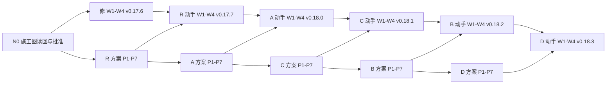

# 改写施工图：从 v0.17.6 到 v0.18.3 的节点、席位与判据

> 状态：待读回与批准 · 所有者 2026-09-12 同意五项后由 Fable 编成；v2 按所有者意见把 §六 改成成品提示词（按批、节点、席位填好，PR 用分支名定位）；v3 按 Muse 读回改：N0 补已决来源、裁决到达设成节点 X 并定信号、再读回的触发与上限、C 批拆分的分叉规则、陪审席数写清、修正批的依据写清、缺席换人、版本戳以检查为准；第二次读回后补一句 X 与在飞节点的关系（措辞，不再读回）；批准前先读回（读回席位见 §三），所有者批准即合入<br>
> 基线：main @ `4736316`（草案 v0.17.5）<br>
> 去向：改写期间的施工图；所有者以控制面加工作流引擎的身份按节点推进，每个节点做完在 §四 的表里打勾；规矩本身在 [`05-rewrite-process.md`](./05-rewrite-process.md) v2

## 一、上下文

**目标。** 把设计文档按单元模型改写到 v0.18，同时把 #216 审出的欠账清掉。所有者只做两件事：按判据机械推进节点（合入、贴提示词、把各家评论从自己的账号贴出、逐条拍板），以及在拍板节点上做人的选择。作者与评审是各个 harness。

**边界。** 只改 `docs/design/**`、`.memo/design/case-study-20260907/**`、决策史与台账、验证器一级检查；不动代码、不动 P2 工作包；P2.1 底座何时开工由所有者在 C 批合入后另定。

**为什么这样切。** 修正批先行，因为错句就在 main 上，每多一轮评审就多一次被带偏；R 小批紧跟，因为三处行为取舍自包含、评审各家的上下文正热；A 批是承重墙——#210/#211 已经把"Agency 是独立单元、控制面只持策略"写进 Participant 正文，架构正文却还没有「单元与连接」；C 提到 B 前，因为 B 被 09-11/09-12 消掉一半，而 P2.1 底座依赖 C 的控制面存储两半与 Repo 现场规则；D 最后。

**关键取舍。** 一次一批：上一批动手 PR 合入前，下一批只做方案讨论。方案阶段重审（独立一轮、交叉一轮、读回一步），动手 PR 轻审一轮加合并后核对。分歧由作者按论证质量先合成作者说明，合不拢的列成待裁项给所有者。

**已知风险。** C 批最重，方案里可切两个 PR；同一批 harness 连审五批会疲劳，所以每批只挑一个陪审（A 批多一个 Muse 试席）、读回固定由不在席位上的家做、缺席按 §五 第 7 条换人；所有者的裁决随时会来，来了按 §四 的节点 X 处理：在同一个 PR 里改方案或文档、改 05 §二 的表与本图。

## 二、三张清单（施工图的来料）

**已决**（能写成"交出什么、凭什么算交出"的，进图）：

| 编号 | 条目 | 出处 |
| --- | --- | --- |
| D1 | 一致性修正批先行，只有动手、不出方案，Grok 与 GLM 轻审 | 所有者 2026-09-12 同意五项之一；内容按 #216 §六家复核后的修订 |
| D2 | R 小批：F1、R1、R3 三处先定行为再改约束、配 CT；R2 归 B | 同上；05 §二 R 行 |
| D3 | A 架构批：内容按 05 §二 A 行；升 v0.18.0、立决策史 §37；一级检查沿用现有链接、版本戳与退休词表，不新增脚本 | 05 §二、§八；04 §四 |
| D4 | C 在 B 之前；C 由 Codex 写、Fable 主审 | 所有者 2026-09-12 同意 |
| D5 | B、D 按 05 §二 重切后的内容 | 05 §二 v2 |
| D6 | 人手：Codex 主审架构与愿景稿、Grok 每批副审、K3/GLM 按批挑一个陪审；Muse 在 A 批试陪审；Gemini 只做读回与范围明确的核对 | 05 §三 v2 |
| D7 | 方案六样东西；七问；评审产出形状固定（先七问表态，再逐条维持/修正/推翻，撤回要写明）；第一轮独立不读他家、第二轮交叉 | 05 §四、§五 |
| D8 | 方案拍板前先读回，读回者不在本批席位上，不投票 | 05 §六 v2 |
| D9 | 动手 PR 轻审只查三样：忠于方案、层对不对、约束改了配没配 CT | 05 §六 |
| D10 | 合入纪律：换词批之后并入旧分支按判别顺序重判；"已修回"先核再写；每批合入后由非作者做四种情况核对 | 05 §六 v2 |
| D11 | 所有者逐条拍板方案里的每处改法，不是整份一个"同意"；已拍板不重开，重开要有新证据 | 05 §七 |
| D12 | 合入方式：merge commit，主题为 PR 标题加编号，正文为 PR 描述；每家评论经所有者账号发出并在标题写明哪家哪轮 | 所有者 2026-09-06 裁定；05 §三 |
| D13 | 版本：修正批 v0.17.6、R 批 v0.17.7、A v0.18.0、C v0.18.1、B v0.18.2、D v0.18.3；每批改了约束就进台账一行 | 05 §八 v2 |
| D14 | 本施工图批准前先由不在讨论里的家读回，所有者批准即合入；读回走样处改后按 §四 P.6 的规则决定要不要再读回 | 05 §六 v2 读回纪律；所有者 2026-09-12「安排好 DAG 施工图……包括盲读等阶段……然后存档」 |

**尚未定形**（在对应批次的方案里定，不进图）：F1 的具体结算规则（等组稳定还是关闸时比较）；R1 清单快照的冻结来源；R3 无产出调用时回避策略的适用；C 批要不要切两个 PR；B 批待命与会话复用写不写进设计正文；A 批决策史 §37 的行文；P2.1 何时开工。

**出界**（不在本图）：P2 实现工作包与署名关卡的实现；Repo 身份长聊（冻结）；验证器二级、三级（随 P2.1）；把七问整理成技能（05 §十 待办）。

## 三、席位

| 批 | 作者 | 主审 | 副审 | 陪审 | 方案读回 | 合并后核对 |
| --- | --- | --- | --- | --- | --- | --- |
| 修 一致性修正 | Fable | —（轻审：Grok、GLM） | — | — | — | Codex（他写的清单） |
| R 计票与读回口径 | Fable | Codex | Grok | K3 | Muse（Gemini 2026-09-13 因 API 地区限制缺席，按 §五 第 7 条换人；Muse Spark 1.2） | GLM |
| A 架构 | Fable | Codex | Grok | GLM，另加 Muse 试一次逐行勾稽 | K3（Gemini 不可用，2026-09-13 起） | GLM |
| C Repo 与治理正文 | Codex | Fable | Grok | K3 | Muse（Gemini 不可用） | GLM |
| B 系统边界与 Participant | Fable | Codex | Grok | K3 | Muse（Gemini 不可用） | GLM |
| D 看板、Run 交接与交付 | Fable | Codex | Grok | GLM | Muse（Gemini 不可用） | K3 |
| 本施工图 | Fable | — | — | — | Muse（不在讨论里） | — |

轻审席位的产出只答三样（D9）；陪审按批的性质选（05 §三）；读回者不能是本批任何席位。

分支、文件与版本（预先定死，提示词按此写）：

| 批 | 方案文件 | 方案分支 | 动手分支 | 版本 |
| --- | --- | --- | --- | --- |
| 修 | 无（依据 #216 报告修订节与 05 §二「修」行） | — | `claude/fix-consistency-v0.17.6` | v0.17.6 |
| R | `09-batch-r-plan.md` | `claude/batch-r-plan` | `claude/batch-r` | v0.17.7 |
| A | `10-batch-a-plan.md` | `claude/batch-a-plan` | `claude/batch-a` | v0.18.0 |
| C | `11-batch-c-plan.md` | `codex/batch-c-plan` | `codex/batch-c` | v0.18.1 |
| B | `12-batch-b-plan.md` | `claude/batch-b-plan` | `claude/batch-b` | v0.18.2 |
| D | `13-batch-d-plan.md` | `claude/batch-d-plan` | `claude/batch-d` | v0.18.3 |

方案文件都在本目录；PR 编号事先不知道，提示词一律用分支名定位。

## 四、节点与边

节点分两种子图。**方案子图**（P）七个节点，**动手子图**（W）四个节点；修正批只有 W。边都是产物依赖：下游的开工条件引用上游交出的东西（PR 编号、合入提交、评论标题）。批与批之间两条边：`P(k).1 ← P(k-1).7`（方案讨论按批顺序，避免同一批 harness 同时审两份方案），`W(k).1 ← P(k).7 与 W(k-1).4`（动手一次只有一个在飞）。

### 方案子图 P（每批一套）

| 节点 | 交出什么 | 凭什么算交出（判据） | 依赖 | 席位 |
| --- | --- | --- | --- | --- |
| P.1 方案 v1 | 方案文件（§三 表里定死的那一份）v1，按 05 §四 六样东西写，走一遍 S1；开 PR，不自合 | PR 打开，描述三节齐、CI 绿 | 上一批 P.7 | 作者 |
| P.2 独立审阅 | 主审、副审、陪审各一条评论，标题「某家 · 某批方案 · 独立审阅」，先七问表态再逐条维持/修正/推翻 | 每个席位一条评论都在：R、C、B、D 三条，A 批陪审两席共四条 | P.1 | 主审、副审、陪审（并行） |
| P.3 作者说明与 v2 | 评论「作者说明 · 第一轮汇总与 v2」：逐条采纳/拒绝并说理由；推送 v2 | 评论在、v2 提交在 PR 上 | P.2 全部 | 作者 |
| P.4 交叉审阅 | 各席一条评论「某家 · 某批方案 · 交叉审阅」，读他家意见，撤回自己说错的要写明 | 评论齐 | P.3 | 同 P.2（并行） |
| P.5 作者说明与 v3 | 评论「作者说明 · 第二轮汇总与 v3」，末尾列待裁项；推送 v3 | 评论在、v3 在 | P.4 全部 | 作者 |
| P.6 读回 | 评论「某家 · 某批方案 · 读回」：只拿 v3 与 S1，逐处改法复述成人话、走 S1 每步与失败路径、单列不确定处；不投票 | 评论在；作者看过，走样处已改。只改措辞、不改任何改法或落点的，不再读回；改了改法、落点或待裁项的，由同一读回席位再读一次；最多两次，第二次仍走样的列为待裁项交所有者 | P.5 | 读回席位 |
| P.7 拍板与合入 | 所有者评论「拍板 · 某批方案」：逐条同意/改/待，待裁项逐条选；作者按拍板改 v4（若有）；所有者合入方案 PR | PR 合入（merge commit） | P.6 | 所有者 |

### 动手子图 W（每批一套）

| 节点 | 交出什么 | 凭什么算交出（判据） | 依赖 | 席位 |
| --- | --- | --- | --- | --- |
| W.1 动手 PR | 按合入的方案改文档（修正批没有方案文件，依据是 §三 表里写的两处裁决清单）；约束改动配 CT 用例；版本戳全库一致（以文档检查为准，当前 23 处）；台账一行；05 §二 表与本图打勾；描述"已修回"先用 `git log -S` 核 | PR 打开、CI 绿（含 `buck2 test root//build/docs/...` 13 项） | 本批 P.7、上一批 W.4 | 作者 |
| W.2 轻审 | 主审与副审各一条评论「某家 · 某批动手 · 轻审」，只答三样：忠于方案、层、CT | 评论齐 | W.1 | 主审、副审（修正批：Grok、GLM） |
| W.3 修正 | 作者按轻审改，评论「作者说明 · 轻审处理」 | 评论在；两家都写"可合"或"修正后可合"且修正已落 | W.2 | 作者 |
| W.4 合入与合并后核对 | 所有者合入；一个非作者一条评论「某家 · 某批 · 合并后核对」，按四种情况清单核本批改动的文件与 05 §二 表 | PR 合入；核对评论在；若核出回退，开一个修正 PR 走 W 子图 | W.3 | 所有者；核对席位 |

### 插入节点 X（裁决处理，任何时候都可能出现）

| 节点 | 交出什么 | 凭什么算交出（判据） | 依赖 | 席位 |
| --- | --- | --- | --- | --- |
| X 裁决处理 | 作者在裁决所在的 PR 上按裁决改方案或文档，改 05 §二 表与本图（消掉的行、变动的席位或顺序），评论「作者说明 · 裁决处理」逐条说明落在哪 | 评论在、改动已推送；被裁决影响的下游节点按改后的图走 | 所有者在对应 PR 上贴标题「裁决 · 某批 · 第几次」的评论。写进 `21-r2-rulings.md` 的裁决也要在 PR 上贴一条这样的评论指向它，引擎只认这条评论 | 作者 |

X 不在链上，它插在任何两个节点之间；点火它不改变其他节点的判据，只改变它们要对照的方案或图：正在进行中的节点不回退重判，X 完成后才进入的节点按改后的图走。C 批若拆分，拆分后的版本表写在 C 的拍板评论里，引擎以那张表为准。

**修正批没有 P 子图**：它的 W.1 依据不是方案 PR，而是 §三 表里写的两处裁决清单（#216 报告修订节与 05 §二「修」行）。

**C 批拆不拆两个 PR**，在 C 的 P.7 拍板时定。若拆：C 的 W 子图跑两遍，第二遍分支 `codex/batch-c-2`；两个动手 PR 各推进一个补丁号，B、D 的版本号顺延一位；§三 的表在 C 方案合入的同一个 PR 里改；B 的 P.1 仍依赖 C 的 P.7，B 的 W.1 依赖 C 最后一个 W.4。若不拆，图不变。

### 全图



N0 的判据（来源 D14）：Muse 的读回评论在本图的 PR 上，作者按走样处改过并按 P.6 的规则决定是否再读回，所有者合入本图的 PR。

### 进度（做完打勾，改在同一个 PR 里）

| 节点 | 状态 | 产物 |
| --- | --- | --- |
| N0 | 完成 · 读回两次通过 | #218 合入 |
| 修 W.1–W.4 | 合入 `7c16066`（v0.17.6）；合并后核对（Codex，https://github.com/yesme/hctl2/pull/219#issuecomment-5644873971 ）：无第一类回退，一处第二类——对照表 Execution Spec 行漏了 Room Invocation 一路；修法搭在 #220，#220 合入后本行记完成 | #219 |
| R P.1–P.7 | 完成 · 所有者 2026-09-13 逐条拍板（1 甲、2 是、3 甲、4 要声明、5 (a)），方案 v4 随 #220 合入 | PR #220 |
| R W.1–W.4 | 完成 · 合入 `0015380`（v0.17.7）；合并后核对（GLM，https://github.com/yesme/hctl2/pull/221#issuecomment-5647581370 ）：无回退 | #221 |
| A P.1–P.7 | 完成 · 所有者 2026-09-13 逐条拍板（五项全按推荐），方案 v4 随 #222 合入 | PR #222 |
| A W.1–W.4 | 完成 · 合入 bdc0c09；合并后核对（GLM）：一处链接文字随 C W.1 修 | #223，v0.18.0 |
| C P.1–P.7 | 进行中 · P.1–P.6 完成（Muse 一次读回、措辞修订）；待 P.7 拍板 | [11-batch-c-plan.md](./11-batch-c-plan.md)；#224，分支 `codex/batch-c-plan` |
| C W.1–W.4 | 未开始 | |
| B P.1–P.7 | 未开始 | |
| B W.1–W.4 | 未开始 | |
| D P.1–P.7 | 未开始 | |
| D W.1–W.4 | 未开始 | |

## 五、运行手册（给控制面与引擎）

每个节点三步：查上游判据是否满足；点火（作者节点与评审节点都到 §六 找到对应那一段原样贴给对应 harness，把它们的回复用提示词里写好的评论标题从所有者账号贴到 PR）；等本节点判据满足再看下一个。具体：

1. **点火作者节点（P.1、P.3、P.5、P.6 后半、P.7 后半、W.1、W.3）**：到 §六 本批「作者节点」下找到对应那一段，原样贴给作者（Fable 或 Codex）。作者的产物是 PR 或评论。
2. **点火评审节点（P.2、P.4、W.2、P.6、W.4 的核对席）**：到 §六 找到本批、本节点、本席位那一段，原样贴给对应 harness；它的回复以评论标题原样贴到 PR。等评论齐；不齐不进下一节点。独立审阅那一轮的 harness 不读他家评论，靠提示词里的一句话约束。
3. **拍板节点（P.7）**：读作者说明与读回，逐条写「同意 / 改成… / 待」，待裁项逐条选；然后合入方案 PR。
4. **合入节点（P.7、W.4）**：方案 PR 与动手 PR 各合一次，命令按分支各自一行。合入前分支若落后于 main，先让作者在自己的分支上把 main 并进来——那是作者解决冲突，不是合入；方案 PR 只有 memo 文件，照常并入即可，动手 PR 按 W.1 提示词里的冲突处置纪律重判。然后按分支原样运行下面对应的一行（主题为标题加编号，正文为 PR 描述）；合入后再看核对评论。
   - `claude/rewrite-dag`：`gh pr merge claude/rewrite-dag --merge --subject "$(gh pr view claude/rewrite-dag --json title -q .title) (#$(gh pr view claude/rewrite-dag --json number -q .number))" --body "$(gh pr view claude/rewrite-dag --json body -q .body)"`
   - `claude/fix-consistency-v0.17.6`：`gh pr merge claude/fix-consistency-v0.17.6 --merge --subject "$(gh pr view claude/fix-consistency-v0.17.6 --json title -q .title) (#$(gh pr view claude/fix-consistency-v0.17.6 --json number -q .number))" --body "$(gh pr view claude/fix-consistency-v0.17.6 --json body -q .body)"`
   - `claude/batch-r-plan`：`gh pr merge claude/batch-r-plan --merge --subject "$(gh pr view claude/batch-r-plan --json title -q .title) (#$(gh pr view claude/batch-r-plan --json number -q .number))" --body "$(gh pr view claude/batch-r-plan --json body -q .body)"`
   - `claude/batch-r`：`gh pr merge claude/batch-r --merge --subject "$(gh pr view claude/batch-r --json title -q .title) (#$(gh pr view claude/batch-r --json number -q .number))" --body "$(gh pr view claude/batch-r --json body -q .body)"`
   - `claude/batch-a-plan`：`gh pr merge claude/batch-a-plan --merge --subject "$(gh pr view claude/batch-a-plan --json title -q .title) (#$(gh pr view claude/batch-a-plan --json number -q .number))" --body "$(gh pr view claude/batch-a-plan --json body -q .body)"`
   - `claude/batch-a`：`gh pr merge claude/batch-a --merge --subject "$(gh pr view claude/batch-a --json title -q .title) (#$(gh pr view claude/batch-a --json number -q .number))" --body "$(gh pr view claude/batch-a --json body -q .body)"`
   - `codex/batch-c-plan`：`gh pr merge codex/batch-c-plan --merge --subject "$(gh pr view codex/batch-c-plan --json title -q .title) (#$(gh pr view codex/batch-c-plan --json number -q .number))" --body "$(gh pr view codex/batch-c-plan --json body -q .body)"`
   - `codex/batch-c`：`gh pr merge codex/batch-c --merge --subject "$(gh pr view codex/batch-c --json title -q .title) (#$(gh pr view codex/batch-c --json number -q .number))" --body "$(gh pr view codex/batch-c --json body -q .body)"`
   - `claude/batch-b-plan`：`gh pr merge claude/batch-b-plan --merge --subject "$(gh pr view claude/batch-b-plan --json title -q .title) (#$(gh pr view claude/batch-b-plan --json number -q .number))" --body "$(gh pr view claude/batch-b-plan --json body -q .body)"`
   - `claude/batch-b`：`gh pr merge claude/batch-b --merge --subject "$(gh pr view claude/batch-b --json title -q .title) (#$(gh pr view claude/batch-b --json number -q .number))" --body "$(gh pr view claude/batch-b --json body -q .body)"`
   - `claude/batch-d-plan`：`gh pr merge claude/batch-d-plan --merge --subject "$(gh pr view claude/batch-d-plan --json title -q .title) (#$(gh pr view claude/batch-d-plan --json number -q .number))" --body "$(gh pr view claude/batch-d-plan --json body -q .body)"`
   - `claude/batch-d`：`gh pr merge claude/batch-d --merge --subject "$(gh pr view claude/batch-d --json title -q .title) (#$(gh pr view claude/batch-d --json number -q .number))" --body "$(gh pr view claude/batch-d --json body -q .body)"`
5. **任何节点发现上游产物不对**（例如 CI 红、版本戳不齐）：退回作者，不跳。
6. **裁决随时来**：所有者在对应的方案 PR 或动手 PR 上贴一条标题「裁决 · 某批 · 第几次」的评论，这条评论就是引擎的信号；然后到 §六 本批「作者节点」下找「X 裁决处理」那一段贴给作者，等「作者说明 · 裁决处理」出现再继续。写进 `21-r2-rulings.md` 的裁决同样要贴这样一条评论指向它。
7. **缺席换人**：主审缺席不换，等；副审、陪审、读回、核对席位缺席时，所有者从 §三 未占本批席位的家里指定一位，在 PR 上贴一条「席位变更 · 某批 · 某节点：某家换某家」的评论，作者在同一个 PR 里改 §三 的表；提示词里的家名照换。
8. **版本戳与台账**：以文档检查（`cd src && ./buck2 test root//build/docs/...` 里的版本一致性用例）为准，当前 23 处；文件增删后以检查结果为准，不以本图的数字为准。

## 六、提示词（成品，按批、按节点、按席位；原样复制粘贴）

每段提示词自带上下文：仓库、要读的文件、席位、专门方向、评论标题。PR 一律用分支名定位（`gh pr list --head 分支 --state open`），所以不需要填编号；方案文件名、分支名、版本号在 §三 的表里定死。所有者自己写的只有 P.7 的拍板评论，格式在本节末尾。

### N0 · 本施工图的读回（Muse）

```
你在 yesme/hctl2 做读回，对象是 PR #218 里的 `.memo/design/case-study-20260907/08-rewrite-dag.md`。
只读这份文件、它引用的 `.memo/design/case-study-20260907/05-rewrite-process.md`，和 `.memo/notes/HCTL_case_study.md`；不读本 PR 上的评论，不读其他讨论。
产出一条评论，标题「Muse · 改写施工图 · 读回」，分三段：
一、按节点逐个用自己的话写：交出什么、凭什么算交出、依赖谁、我理解它是为了什么；不许引用原话。
二、对照：施工图 §二「已决」的每一条，对应到哪些节点；有节点却对不上任何已决条目的，单列；已决里有却没有节点承接的，单列；§一 上下文里提到、没有节点承接的，单列。
三、单列你不确定、猜了、或读两遍还不明白的地方，尤其是"所有者作为引擎按这张图推进，哪一步会不知道该做什么"。
你不投票不裁决。不改文件。
```

### 修 · 一致性修正批

#### 作者节点

W.1 动手 PR（Fable）

```
你是 yesme/hctl2 里 一致性修正批 的作者（Fable）。先 git fetch origin，读 AGENTS.md、CONSTRAINTS.md、`.memo/design/case-study-20260907/05-rewrite-process.md` v2 和 `.memo/design/case-study-20260907/08-rewrite-dag.md`（§二、§三、§四）。
现在进入 W.1。依据：#216 报告 `.memo/review/20260912-v0.17.5/codex-20260912.md` §六家复核后的修订（尤其「后续处置与本轮边界」表第一行）与 `.memo/design/case-study-20260907/05-rewrite-process.md` §二「修 一致性修正」行；本批没有方案文件，忠于的是这两处裁决清单。从最新 main 开分支 `claude/fix-consistency-v0.17.6`，按方案改文档；约束改动逐条配契约测试用例；版本戳改为 v0.17.6（全库一致，以文档检查为准，当前 23 处，根 README 在内）；决策史小修订台账加一行；改 `.memo/design/case-study-20260907/05-rewrite-process.md` §二 表与 `.memo/design/case-study-20260907/08-rewrite-dag.md` §四 进度表（本批打勾）。并入 main 时若遇冲突，逐句按 A0 §二 判别顺序重判，不按替换处理；PR 描述里写"已修回"之前先用 git log -S 核。跑 cd src && ./buck2 test root//build/docs/... 到 13 项通过。开 PR、不自合，描述三节，提交信息末尾不放 harness 会话链接。
```
W.3 轻审处理（Fable）

```
你是 yesme/hctl2 里 一致性修正批 的作者（Fable）。先 git fetch origin，读 AGENTS.md、CONSTRAINTS.md、`.memo/design/case-study-20260907/05-rewrite-process.md` v2 和 `.memo/design/case-study-20260907/08-rewrite-dag.md`（§二、§三、§四）。
现在进入 W.3：`gh pr list --head claude/fix-consistency-v0.17.6 --state open` 找到的那一个 PR 上已有两条「… 动手 · 轻审」。按它们改，写评论「作者说明 · 轻审处理」逐条说明；若两家都是"可合"且无修正，评论只写一句"无修正"。然后等所有者合入，不自合。
```
X 裁决处理（Fable，动手 PR）

```
你是 yesme/hctl2 里 一致性修正批 的作者（Fable）。所有者在 `gh pr list --head claude/fix-consistency-v0.17.6 --state open` 找到的那一个 PR 上贴了标题以「裁决 ·」开头的评论。
先 git fetch origin，读那条评论（有多条取最新一条，之前的已处理过）、`.memo/design/case-study-20260907/05-rewrite-process.md` §二 与 `.memo/design/case-study-20260907/08-rewrite-dag.md`。
按裁决改本 PR 里的文档；裁决消掉或改动了哪一批的哪一行、哪个席位、哪个顺序，就在同一个 PR 里改 05 §二 的表与 08 的 §三、§四；推送后写评论「作者说明 · 裁决处理」，逐条说明每条裁决落在哪个文件哪一节。已拍板的其他条目不动。不自合。
```

#### W.2 轻审

轻审（Grok）

```
你在 yesme/hctl2 轻审 一致性修正批 的动手 PR：`gh pr list --head claude/fix-consistency-v0.17.6 --state open` 找到的那一个 PR。拍板的方案：#216 报告 `.memo/review/20260912-v0.17.5/codex-20260912.md` §六家复核后的修订（尤其「后续处置与本轮边界」表第一行）与 `.memo/design/case-study-20260907/05-rewrite-process.md` §二「修 一致性修正」行；本批没有方案文件，忠于的是这两处裁决清单。你的席位：轻审（Grok）。
先 git fetch origin，读 AGENTS.md、CONSTRAINTS.md。
只查三样：一、改出来的文字是否忠于拍板的方案——逐处对，多改的、漏改的、改走样的各列一张小表；二、每句话的层对不对（愿景 / 架构 / 约束 / 交付 / 实现），实现名与约束用语有没有漏进上一层；三、约束改了的地方配没配契约测试用例，用例能不能失败。版本戳应为 v0.17.6，全库一致。
再跑 cd src && ./buck2 test root//build/docs/...，写结果。
产出一条评论，标题「Grok · 修正批动手 · 轻审」，第一句写"可合 / 修正后可合 / 不可合"。不审方案本身的对错。
不改文件，不开 PR，不 push，不合并。
```
轻审（GLM）

```
你在 yesme/hctl2 轻审 一致性修正批 的动手 PR：`gh pr list --head claude/fix-consistency-v0.17.6 --state open` 找到的那一个 PR。拍板的方案：#216 报告 `.memo/review/20260912-v0.17.5/codex-20260912.md` §六家复核后的修订（尤其「后续处置与本轮边界」表第一行）与 `.memo/design/case-study-20260907/05-rewrite-process.md` §二「修 一致性修正」行；本批没有方案文件，忠于的是这两处裁决清单。你的席位：轻审（GLM）。
先 git fetch origin，读 AGENTS.md、CONSTRAINTS.md。
只查三样：一、改出来的文字是否忠于拍板的方案——逐处对，多改的、漏改的、改走样的各列一张小表；二、每句话的层对不对（愿景 / 架构 / 约束 / 交付 / 实现），实现名与约束用语有没有漏进上一层；三、约束改了的地方配没配契约测试用例，用例能不能失败。版本戳应为 v0.17.6，全库一致。
再跑 cd src && ./buck2 test root//build/docs/...，写结果。
产出一条评论，标题「GLM · 修正批动手 · 轻审」，第一句写"可合 / 修正后可合 / 不可合"。不审方案本身的对错。
不改文件，不开 PR，不 push，不合并。
```
#### W.4 合并后核对（Codex）

```
你在 yesme/hctl2 做合并后核对。对象：一致性修正批 的动手 PR（分支 `claude/fix-consistency-v0.17.6`）合入后的 main，以它的合并提交为准（`gh pr view claude/fix-consistency-v0.17.6 --json mergeCommit`）；上一基线：main @ `4736316`（#217 合入后，本图的起点）；拍板的方案：#216 报告 `.memo/review/20260912-v0.17.5/codex-20260912.md` §六家复核后的修订（尤其「后续处置与本轮边界」表第一行）与 `.memo/design/case-study-20260907/05-rewrite-process.md` §二「修 一致性修正」行；本批没有方案文件，忠于的是这两处裁决清单；另读 `.memo/design/case-study-20260907/05-rewrite-process.md` §二 与 `.memo/design/case-study-20260907/08-rewrite-dag.md` §四 进度表。
先 git fetch origin，读 AGENTS.md、CONSTRAINTS.md。按指定提交读文件（git show 提交:路径），不以本地工作树为准。
只用四种情况的清单，对本批改动过的文件逐个核：一、已经改对、后来又改坏（尤其合并冲突处置把全库换词批改回去）；二、新规则与保留的旧规则不一致；三、已明确安排后续批次、尚未实施（只登记，不算问题）；四、所有者有意改变了原来的决定（不报作回退）。另核 05 §二 表与 08 进度表是否随本批更新。
产出一条评论，标题「Codex · 修正批 · 合并后核对」，第一句写"无回退 / 有回退（n 处）"；每处写位置、证据（提交）、四种里的哪一种、建议。纸面反例不等于运行故障；CI 通过不等于自然语言一致。
不改文件，不开 PR，不 push。
```
### R · R 批（Run 计票与读回口径）

#### 作者节点

P.1 方案 v1（Fable）

```
你是 yesme/hctl2 里 R 批（Run 计票与读回口径） 的作者（Fable）。先 git fetch origin，读 AGENTS.md、CONSTRAINTS.md、`.memo/design/case-study-20260907/05-rewrite-process.md` v2 和 `.memo/design/case-study-20260907/08-rewrite-dag.md`（§二、§三、§四）。
现在进入 P.1。方案写在 `.memo/design/case-study-20260907/09-batch-r-plan.md`，按 05 §四 的六样东西写：改哪些句子、各来自哪条不变量或用例事实；每处几种改法；各自好处坏处、代价谁付；推荐哪种、为什么；已拍板不重开的条目逐条引用裁决出处，自己的推论单独标「推论」；落点到文件与节。拿参考用例 `.memo/notes/HCTL_case_study.md` 的 S1 走一遍。本批内容与输入按 05 §二「R」行：#216 报告 §F1、§补充发现 R1/R3；`docs/design/spec/run.md` §Request、重试与 Gate、§Workflow 与 Run 授权；`docs/design/contract-tests.md` §CT-RUN；`docs/design/run.md` §关键规则。
分支 `claude/batch-r-plan`，开 PR、不自合，描述按模板三节；提交信息末尾不放 harness 会话链接。
```
P.3 作者说明与 v2（Fable）

```
你是 yesme/hctl2 里 R 批（Run 计票与读回口径） 的作者（Fable）。先 git fetch origin，读 AGENTS.md、CONSTRAINTS.md、`.memo/design/case-study-20260907/05-rewrite-process.md` v2 和 `.memo/design/case-study-20260907/08-rewrite-dag.md`（§二、§三、§四）。
现在进入 P.3：`gh pr list --head claude/batch-r-plan --state open` 找到的那一个 PR 上已有主审、副审、陪审的独立审阅。按论证质量逐条取舍，不按人数；写评论「作者说明 · 第一轮汇总与 v2」，逐条采纳 / 部分采纳 / 拒绝并说理由；推送 v2（同一分支，新提交，提交信息写改了什么、听了谁的哪条意见）。已拍板的不重开。
```
P.5 作者说明与 v3（Fable）

```
你是 yesme/hctl2 里 R 批（Run 计票与读回口径） 的作者（Fable）。先 git fetch origin，读 AGENTS.md、CONSTRAINTS.md、`.memo/design/case-study-20260907/05-rewrite-process.md` v2 和 `.memo/design/case-study-20260907/08-rewrite-dag.md`（§二、§三、§四）。
现在进入 P.5：`gh pr list --head claude/batch-r-plan --state open` 找到的那一个 PR 上已有交叉审阅。写评论「作者说明 · 第二轮汇总与 v3」，逐条处置，末尾单列「待裁项」——合不拢的分歧各给几种选法、利弊、你的推荐；推送 v3。
```
P.6 后半：读回处理（Fable）

```
你是 yesme/hctl2 里 R 批（Run 计票与读回口径） 的作者（Fable）。先 git fetch origin，读 AGENTS.md、CONSTRAINTS.md、`.memo/design/case-study-20260907/05-rewrite-process.md` v2 和 `.memo/design/case-study-20260907/08-rewrite-dag.md`（§二、§三、§四）。
现在进入 P.6 的后半：`gh pr list --head claude/batch-r-plan --state open` 找到的那一个 PR 上已有「Muse · R 批方案 · 读回」。凡复述走样、走用例走不通、读不明白的地方，改方案让人能读对，不是解释给读回者听；写评论「作者说明 · 读回处理」列出改了哪几处；只改措辞、不改任何改法或落点的，不再读回；改了改法、落点或待裁项的，在评论第一句写「需要再读回一次」（仍由同一读回席位做，最多两次，第二次仍走样列为待裁项）。
```
P.7 后半：拍板处理（Fable）

```
你是 yesme/hctl2 里 R 批（Run 计票与读回口径） 的作者（Fable）。先 git fetch origin，读 AGENTS.md、CONSTRAINTS.md、`.memo/design/case-study-20260907/05-rewrite-process.md` v2 和 `.memo/design/case-study-20260907/08-rewrite-dag.md`（§二、§三、§四）。
现在进入 P.7 的后半：`gh pr list --head claude/batch-r-plan --state open` 找到的那一个 PR 上已有所有者的「拍板 · R 批方案」。按拍板逐条改方案（同意的不动，改的照改，待的在方案里标「待裁」并留选法），推送 v4；写评论「作者说明 · 拍板处理」；然后等所有者合入，不自合。
```
W.1 动手 PR（Fable）

```
你是 yesme/hctl2 里 R 批（Run 计票与读回口径） 的作者（Fable）。先 git fetch origin，读 AGENTS.md、CONSTRAINTS.md、`.memo/design/case-study-20260907/05-rewrite-process.md` v2 和 `.memo/design/case-study-20260907/08-rewrite-dag.md`（§二、§三、§四）。
现在进入 W.1。依据：合入 main 的 `.memo/design/case-study-20260907/09-batch-r-plan.md` 与所有者的「拍板 · R 批方案」评论。从最新 main 开分支 `claude/batch-r`，按方案改文档；约束改动逐条配契约测试用例；版本戳改为 v0.17.7（全库一致，以文档检查为准，当前 23 处，根 README 在内）；决策史小修订台账加一行；改 `.memo/design/case-study-20260907/05-rewrite-process.md` §二 表与 `.memo/design/case-study-20260907/08-rewrite-dag.md` §四 进度表（本批打勾）。并入 main 时若遇冲突，逐句按 A0 §二 判别顺序重判，不按替换处理；PR 描述里写"已修回"之前先用 git log -S 核。跑 cd src && ./buck2 test root//build/docs/... 到 13 项通过。开 PR、不自合，描述三节，提交信息末尾不放 harness 会话链接。
```
W.3 轻审处理（Fable）

```
你是 yesme/hctl2 里 R 批（Run 计票与读回口径） 的作者（Fable）。先 git fetch origin，读 AGENTS.md、CONSTRAINTS.md、`.memo/design/case-study-20260907/05-rewrite-process.md` v2 和 `.memo/design/case-study-20260907/08-rewrite-dag.md`（§二、§三、§四）。
现在进入 W.3：`gh pr list --head claude/batch-r --state open` 找到的那一个 PR 上已有两条「… 动手 · 轻审」。按它们改，写评论「作者说明 · 轻审处理」逐条说明；若两家都是"可合"且无修正，评论只写一句"无修正"。然后等所有者合入，不自合。
```
X 裁决处理（Fable，方案 PR）

```
你是 yesme/hctl2 里 R 批（Run 计票与读回口径） 的作者（Fable）。所有者在 `gh pr list --head claude/batch-r-plan --state open` 找到的那一个 PR 上贴了标题以「裁决 ·」开头的评论。
先 git fetch origin，读那条评论（有多条取最新一条，之前的已处理过）、`.memo/design/case-study-20260907/05-rewrite-process.md` §二 与 `.memo/design/case-study-20260907/08-rewrite-dag.md`。
按裁决改本 PR 里的方案；裁决消掉或改动了哪一批的哪一行、哪个席位、哪个顺序，就在同一个 PR 里改 05 §二 的表与 08 的 §三、§四；推送后写评论「作者说明 · 裁决处理」，逐条说明每条裁决落在哪个文件哪一节。已拍板的其他条目不动。不自合。
```

X 裁决处理（Fable，动手 PR）

```
你是 yesme/hctl2 里 R 批（Run 计票与读回口径） 的作者（Fable）。所有者在 `gh pr list --head claude/batch-r --state open` 找到的那一个 PR 上贴了标题以「裁决 ·」开头的评论。
先 git fetch origin，读那条评论（有多条取最新一条，之前的已处理过）、`.memo/design/case-study-20260907/05-rewrite-process.md` §二 与 `.memo/design/case-study-20260907/08-rewrite-dag.md`。
按裁决改本 PR 里的文档；裁决消掉或改动了哪一批的哪一行、哪个席位、哪个顺序，就在同一个 PR 里改 05 §二 的表与 08 的 §三、§四；推送后写评论「作者说明 · 裁决处理」，逐条说明每条裁决落在哪个文件哪一节。已拍板的其他条目不动。不自合。
```

#### P.2 独立审阅

主审（Codex）

```
你在 yesme/hctl2 审 R 批（Run 计票与读回口径） 的方案 v1。PR：`gh pr list --head claude/batch-r-plan --state open` 找到的那一个 PR；方案文件 `.memo/design/case-study-20260907/09-batch-r-plan.md`。你的席位：主审（Codex）。
先 git fetch origin，读 AGENTS.md、CONSTRAINTS.md、`.memo/design/case-study-20260907/05-rewrite-process.md`（§四 方案六样东西、§五 七问、§七 拍板）和 `.memo/design/case-study-20260907/08-rewrite-dag.md` §四；再读方案文件和本批输入：#216 报告 §F1、§补充发现 R1/R3；`docs/design/spec/run.md` §Request、重试与 Gate、§Workflow 与 Run 授权；`docs/design/contract-tests.md` §CT-RUN；`docs/design/run.md` §关键规则。
第一轮不读本 PR 上其他评审者的评论。
产出一条评论，标题「Codex · R 批方案 · 独立审阅」。形状固定：先按七问（对、全、分、借、衡、层、验）对整批各表一句态；再逐条给维持 / 修正 / 推翻，每条写位置（文件 §节名）、依据、理由，修正与推翻要给替代写法。
方案标"已拍板不重开"的条目，只核它引用的裁决是否真有、范围有没有被扩大，不重开；标"推论"的条目可以驳。检查有没有为消一句歧义引入不必要的机制、对象或新规则，有没有把评审共识当成所有者裁决。纸面反例不等于运行故障。
专门方向：计票集合与结束条件能不能写成一条确定规则：重复组何时算一票、否决席未投时是否属于「剩余可撤」、候选切换中途成组按投票时实际配置判；R1 清单快照的冻结来源与 R3 无产出调用时的回避策略是否都落成可判的条件；方案有没有伪称已有裁决——F1 的结算规则、R1/R3 的来源都是本批才定的行为取舍。
不改文件，不开 PR，不 push。讲人话；引用写路径和节名，历史证据附 PR 或提交。
```
副审（Grok）

```
你在 yesme/hctl2 审 R 批（Run 计票与读回口径） 的方案 v1。PR：`gh pr list --head claude/batch-r-plan --state open` 找到的那一个 PR；方案文件 `.memo/design/case-study-20260907/09-batch-r-plan.md`。你的席位：副审（Grok）。
先 git fetch origin，读 AGENTS.md、CONSTRAINTS.md、`.memo/design/case-study-20260907/05-rewrite-process.md`（§四 方案六样东西、§五 七问、§七 拍板）和 `.memo/design/case-study-20260907/08-rewrite-dag.md` §四；再读方案文件和本批输入：#216 报告 §F1、§补充发现 R1/R3；`docs/design/spec/run.md` §Request、重试与 Gate、§Workflow 与 Run 授权；`docs/design/contract-tests.md` §CT-RUN；`docs/design/run.md` §关键规则。
第一轮不读本 PR 上其他评审者的评论。
产出一条评论，标题「Grok · R 批方案 · 独立审阅」。形状固定：先按七问（对、全、分、借、衡、层、验）对整批各表一句态；再逐条给维持 / 修正 / 推翻，每条写位置（文件 §节名）、依据、理由，修正与推翻要给替代写法。
方案标"已拍板不重开"的条目，只核它引用的裁决是否真有、范围有没有被扩大，不重开；标"推论"的条目可以驳。检查有没有为消一句歧义引入不必要的机制、对象或新规则，有没有把评审共识当成所有者裁决。纸面反例不等于运行故障。
专门方向：对撞：新句与 `docs/design/spec/run.md` §Request、重试与 Gate 现有各句（去重、最不利、否决优先、撤销剩余、quorum-unreachable、返工轮数）逐句勾稽；与 §Workflow 与 Run 授权 的读回准入四条、与 `spec/connections.md` 的结果准入与迟到结果、与 CT-RUN 现有行是否打架；每条新约束配的失败用例能不能真失败。
不改文件，不开 PR，不 push。讲人话；引用写路径和节名，历史证据附 PR 或提交。
```
陪审（K3）

```
你在 yesme/hctl2 审 R 批（Run 计票与读回口径） 的方案 v1。PR：`gh pr list --head claude/batch-r-plan --state open` 找到的那一个 PR；方案文件 `.memo/design/case-study-20260907/09-batch-r-plan.md`。你的席位：陪审（K3）。
先 git fetch origin，读 AGENTS.md、CONSTRAINTS.md、`.memo/design/case-study-20260907/05-rewrite-process.md`（§四 方案六样东西、§五 七问、§七 拍板）和 `.memo/design/case-study-20260907/08-rewrite-dag.md` §四；再读方案文件和本批输入：#216 报告 §F1、§补充发现 R1/R3；`docs/design/spec/run.md` §Request、重试与 Gate、§Workflow 与 Run 授权；`docs/design/contract-tests.md` §CT-RUN；`docs/design/run.md` §关键规则。
第一轮不读本 PR 上其他评审者的评论。
产出一条评论，标题「K3 · R 批方案 · 独立审阅」。形状固定：先按七问（对、全、分、借、衡、层、验）对整批各表一句态；再逐条给维持 / 修正 / 推翻，每条写位置（文件 §节名）、依据、理由，修正与推翻要给替代写法。
方案标"已拍板不重开"的条目，只核它引用的裁决是否真有、范围有没有被扩大，不重开；标"推论"的条目可以驳。检查有没有为消一句歧义引入不必要的机制、对象或新规则，有没有把评审共识当成所有者裁决。纸面反例不等于运行故障。
专门方向：失败路径：超时、撤销、迟到、重复投递、候选切换、Obligation 截止各种顺序下结算结果是否唯一且不需要新对象；等组稳定的上界是否钉在既有 Attempt 终态与 Obligation 截止上；无产出调用（人直接写图、多轮塑形）时回避策略怎么求值、拒绝还是标未知。
不改文件，不开 PR，不 push。讲人话；引用写路径和节名，历史证据附 PR 或提交。
```
#### P.4 交叉审阅

主审（Codex）

```
你在 yesme/hctl2 做第二轮交叉审阅：R 批（Run 计票与读回口径） 的方案。PR：`gh pr list --head claude/batch-r-plan --state open` 找到的那一个 PR；方案已改到 v2（见评论「作者说明 · 第一轮汇总与 v2」）。你的席位：主审（Codex）。
先 git fetch origin，读方案 v2 `.memo/design/case-study-20260907/09-batch-r-plan.md` 和本 PR 上全部评论（含你自己第一轮的）。
产出一条评论，标题「Codex · R 批方案 · 交叉审阅」：对作者说明里拒绝你的每一条，接受或反驳，反驳要有新证据；对他家意见，同意的说同意、不同意的说理由；撤回自己第一轮说错的要写明是哪条、为什么。仍是维持 / 修正 / 推翻的形状；不引入新议题，除非是 v2 新改出来的问题。
专门方向不变：计票集合与结束条件能不能写成一条确定规则：重复组何时算一票、否决席未投时是否属于「剩余可撤」、候选切换中途成组按投票时实际配置判；R1 清单快照的冻结来源与 R3 无产出调用时的回避策略是否都落成可判的条件；方案有没有伪称已有裁决——F1 的结算规则、R1/R3 的来源都是本批才定的行为取舍。
不改文件，不开 PR，不 push。
```
副审（Grok）

```
你在 yesme/hctl2 做第二轮交叉审阅：R 批（Run 计票与读回口径） 的方案。PR：`gh pr list --head claude/batch-r-plan --state open` 找到的那一个 PR；方案已改到 v2（见评论「作者说明 · 第一轮汇总与 v2」）。你的席位：副审（Grok）。
先 git fetch origin，读方案 v2 `.memo/design/case-study-20260907/09-batch-r-plan.md` 和本 PR 上全部评论（含你自己第一轮的）。
产出一条评论，标题「Grok · R 批方案 · 交叉审阅」：对作者说明里拒绝你的每一条，接受或反驳，反驳要有新证据；对他家意见，同意的说同意、不同意的说理由；撤回自己第一轮说错的要写明是哪条、为什么。仍是维持 / 修正 / 推翻的形状；不引入新议题，除非是 v2 新改出来的问题。
专门方向不变：对撞：新句与 `docs/design/spec/run.md` §Request、重试与 Gate 现有各句（去重、最不利、否决优先、撤销剩余、quorum-unreachable、返工轮数）逐句勾稽；与 §Workflow 与 Run 授权 的读回准入四条、与 `spec/connections.md` 的结果准入与迟到结果、与 CT-RUN 现有行是否打架；每条新约束配的失败用例能不能真失败。
不改文件，不开 PR，不 push。
```
陪审（K3）

```
你在 yesme/hctl2 做第二轮交叉审阅：R 批（Run 计票与读回口径） 的方案。PR：`gh pr list --head claude/batch-r-plan --state open` 找到的那一个 PR；方案已改到 v2（见评论「作者说明 · 第一轮汇总与 v2」）。你的席位：陪审（K3）。
先 git fetch origin，读方案 v2 `.memo/design/case-study-20260907/09-batch-r-plan.md` 和本 PR 上全部评论（含你自己第一轮的）。
产出一条评论，标题「K3 · R 批方案 · 交叉审阅」：对作者说明里拒绝你的每一条，接受或反驳，反驳要有新证据；对他家意见，同意的说同意、不同意的说理由；撤回自己第一轮说错的要写明是哪条、为什么。仍是维持 / 修正 / 推翻的形状；不引入新议题，除非是 v2 新改出来的问题。
专门方向不变：失败路径：超时、撤销、迟到、重复投递、候选切换、Obligation 截止各种顺序下结算结果是否唯一且不需要新对象；等组稳定的上界是否钉在既有 Attempt 终态与 Obligation 截止上；无产出调用（人直接写图、多轮塑形）时回避策略怎么求值、拒绝还是标未知。
不改文件，不开 PR，不 push。
```
#### P.6 读回（Muse，2026-09-13 换人）

```
你在 yesme/hctl2 做读回，对象是 R 批（Run 计票与读回口径） 的方案 v3。PR：`gh pr list --head claude/batch-r-plan --state open` 找到的那一个 PR；文件 `.memo/design/case-study-20260907/09-batch-r-plan.md`。
只读这份方案文件与参考用例 `.memo/notes/HCTL_case_study.md`（S1）；不读本 PR 上的任何评论，不读讨论历史，不读其他 memo。
产出一条评论，标题「Muse · R 批方案 · 读回」，分三段：
一、复述：按方案里每处改法逐条用自己的话写——改哪句、改成什么意思、为什么、代价谁付；不许引用方案原话。
二、走用例：拿 S1 的每一步和五条失败路径，在改后的规则下走一遍，每步写"走得通 / 走不通 / 看不出"。
三、单列你不确定、猜了、或读了两遍还不明白的地方。
你不投票不裁决；复述走样是给作者看的，不用改成"建议"。不改文件。
```
#### W.2 轻审

轻审（Codex）

```
你在 yesme/hctl2 轻审 R 批（Run 计票与读回口径） 的动手 PR：`gh pr list --head claude/batch-r --state open` 找到的那一个 PR。拍板的方案：`.memo/design/case-study-20260907/09-batch-r-plan.md`（合入 main 的版本）与所有者的评论「拍板 · R 批方案」。你的席位：轻审（Codex）。
先 git fetch origin，读 AGENTS.md、CONSTRAINTS.md。
只查三样：一、改出来的文字是否忠于拍板的方案——逐处对，多改的、漏改的、改走样的各列一张小表；二、每句话的层对不对（愿景 / 架构 / 约束 / 交付 / 实现），实现名与约束用语有没有漏进上一层；三、约束改了的地方配没配契约测试用例，用例能不能失败。版本戳应为 v0.17.7，全库一致。
再跑 cd src && ./buck2 test root//build/docs/...，写结果。
产出一条评论，标题「Codex · R 批动手 · 轻审」，第一句写"可合 / 修正后可合 / 不可合"。不审方案本身的对错。
不改文件，不开 PR，不 push，不合并。
```
轻审（Grok）

```
你在 yesme/hctl2 轻审 R 批（Run 计票与读回口径） 的动手 PR：`gh pr list --head claude/batch-r --state open` 找到的那一个 PR。拍板的方案：`.memo/design/case-study-20260907/09-batch-r-plan.md`（合入 main 的版本）与所有者的评论「拍板 · R 批方案」。你的席位：轻审（Grok）。
先 git fetch origin，读 AGENTS.md、CONSTRAINTS.md。
只查三样：一、改出来的文字是否忠于拍板的方案——逐处对，多改的、漏改的、改走样的各列一张小表；二、每句话的层对不对（愿景 / 架构 / 约束 / 交付 / 实现），实现名与约束用语有没有漏进上一层；三、约束改了的地方配没配契约测试用例，用例能不能失败。版本戳应为 v0.17.7，全库一致。
再跑 cd src && ./buck2 test root//build/docs/...，写结果。
产出一条评论，标题「Grok · R 批动手 · 轻审」，第一句写"可合 / 修正后可合 / 不可合"。不审方案本身的对错。
不改文件，不开 PR，不 push，不合并。
```
#### W.4 合并后核对（GLM）

```
你在 yesme/hctl2 做合并后核对。对象：R 批（Run 计票与读回口径） 的动手 PR（分支 `claude/batch-r`）合入后的 main，以它的合并提交为准（`gh pr view claude/batch-r --json mergeCommit`）；上一基线：上一批动手 PR（分支 `claude/fix-consistency-v0.17.6`）的合并提交；拍板的方案：`.memo/design/case-study-20260907/09-batch-r-plan.md` 与所有者的评论「拍板 · R 批方案」；另读 `.memo/design/case-study-20260907/05-rewrite-process.md` §二 与 `.memo/design/case-study-20260907/08-rewrite-dag.md` §四 进度表。
先 git fetch origin，读 AGENTS.md、CONSTRAINTS.md。按指定提交读文件（git show 提交:路径），不以本地工作树为准。
只用四种情况的清单，对本批改动过的文件逐个核：一、已经改对、后来又改坏（尤其合并冲突处置把全库换词批改回去）；二、新规则与保留的旧规则不一致；三、已明确安排后续批次、尚未实施（只登记，不算问题）；四、所有者有意改变了原来的决定（不报作回退）。另核 05 §二 表与 08 进度表是否随本批更新。
产出一条评论，标题「GLM · R 批 · 合并后核对」，第一句写"无回退 / 有回退（n 处）"；每处写位置、证据（提交）、四种里的哪一种、建议。纸面反例不等于运行故障；CI 通过不等于自然语言一致。
不改文件，不开 PR，不 push。
```
### A · A 批（架构）

#### 作者节点

P.1 方案 v1（Fable）

```
你是 yesme/hctl2 里 A 批（架构） 的作者（Fable）。先 git fetch origin，读 AGENTS.md、CONSTRAINTS.md、`.memo/design/case-study-20260907/05-rewrite-process.md` v2 和 `.memo/design/case-study-20260907/08-rewrite-dag.md`（§二、§三、§四）。
现在进入 P.1。方案写在 `.memo/design/case-study-20260907/10-batch-a-plan.md`，按 05 §四 的六样东西写：改哪些句子、各来自哪条不变量或用例事实；每处几种改法；各自好处坏处、代价谁付；推荐哪种、为什么；已拍板不重开的条目逐条引用裁决出处，自己的推论单独标「推论」；落点到文件与节。拿参考用例 `.memo/notes/HCTL_case_study.md` 的 S1 走一遍。本批内容与输入按 05 §二「A」行：`.memo/design/case-study-20260907/01-unit-model.md` §二、§四甲、§四戊；`.memo/design/case-study-20260907/04-scenario-validator.md` §四；`docs/design/architecture.md`、`docs/design/vision.md`、`README.md`、`docs/design/README.md`、`docs/design/delivery.md`、`docs/design/references/decision-history.md`、`docs/design/references/glossary.md`；#210 的 `docs/design/participant.md` §Agency 与执行体。
分支 `claude/batch-a-plan`，开 PR、不自合，描述按模板三节；提交信息末尾不放 harness 会话链接。
```
P.3 作者说明与 v2（Fable）

```
你是 yesme/hctl2 里 A 批（架构） 的作者（Fable）。先 git fetch origin，读 AGENTS.md、CONSTRAINTS.md、`.memo/design/case-study-20260907/05-rewrite-process.md` v2 和 `.memo/design/case-study-20260907/08-rewrite-dag.md`（§二、§三、§四）。
现在进入 P.3：`gh pr list --head claude/batch-a-plan --state open` 找到的那一个 PR 上已有主审、副审、陪审的独立审阅。按论证质量逐条取舍，不按人数；写评论「作者说明 · 第一轮汇总与 v2」，逐条采纳 / 部分采纳 / 拒绝并说理由；推送 v2（同一分支，新提交，提交信息写改了什么、听了谁的哪条意见）。已拍板的不重开。
```
P.5 作者说明与 v3（Fable）

```
你是 yesme/hctl2 里 A 批（架构） 的作者（Fable）。先 git fetch origin，读 AGENTS.md、CONSTRAINTS.md、`.memo/design/case-study-20260907/05-rewrite-process.md` v2 和 `.memo/design/case-study-20260907/08-rewrite-dag.md`（§二、§三、§四）。
现在进入 P.5：`gh pr list --head claude/batch-a-plan --state open` 找到的那一个 PR 上已有交叉审阅。写评论「作者说明 · 第二轮汇总与 v3」，逐条处置，末尾单列「待裁项」——合不拢的分歧各给几种选法、利弊、你的推荐；推送 v3。
```
P.6 后半：读回处理（Fable）

```
你是 yesme/hctl2 里 A 批（架构） 的作者（Fable）。先 git fetch origin，读 AGENTS.md、CONSTRAINTS.md、`.memo/design/case-study-20260907/05-rewrite-process.md` v2 和 `.memo/design/case-study-20260907/08-rewrite-dag.md`（§二、§三、§四）。
现在进入 P.6 的后半：`gh pr list --head claude/batch-a-plan --state open` 找到的那一个 PR 上已有「K3 · A 批方案 · 读回」。凡复述走样、走用例走不通、读不明白的地方，改方案让人能读对，不是解释给读回者听；写评论「作者说明 · 读回处理」列出改了哪几处；只改措辞、不改任何改法或落点的，不再读回；改了改法、落点或待裁项的，在评论第一句写「需要再读回一次」（仍由同一读回席位做，最多两次，第二次仍走样列为待裁项）。
```
P.7 后半：拍板处理（Fable）

```
你是 yesme/hctl2 里 A 批（架构） 的作者（Fable）。先 git fetch origin，读 AGENTS.md、CONSTRAINTS.md、`.memo/design/case-study-20260907/05-rewrite-process.md` v2 和 `.memo/design/case-study-20260907/08-rewrite-dag.md`（§二、§三、§四）。
现在进入 P.7 的后半：`gh pr list --head claude/batch-a-plan --state open` 找到的那一个 PR 上已有所有者的「拍板 · A 批方案」。按拍板逐条改方案（同意的不动，改的照改，待的在方案里标「待裁」并留选法），推送 v4；写评论「作者说明 · 拍板处理」；然后等所有者合入，不自合。
```
W.1 动手 PR（Fable）

```
你是 yesme/hctl2 里 A 批（架构） 的作者（Fable）。先 git fetch origin，读 AGENTS.md、CONSTRAINTS.md、`.memo/design/case-study-20260907/05-rewrite-process.md` v2 和 `.memo/design/case-study-20260907/08-rewrite-dag.md`（§二、§三、§四）。
现在进入 W.1。依据：合入 main 的 `.memo/design/case-study-20260907/10-batch-a-plan.md` 与所有者的「拍板 · A 批方案」评论。从最新 main 开分支 `claude/batch-a`，按方案改文档；约束改动逐条配契约测试用例；版本戳改为 v0.18.0（全库一致，以文档检查为准，当前 23 处，根 README 在内）；决策史小修订台账加一行；改 `.memo/design/case-study-20260907/05-rewrite-process.md` §二 表与 `.memo/design/case-study-20260907/08-rewrite-dag.md` §四 进度表（本批打勾）。并入 main 时若遇冲突，逐句按 A0 §二 判别顺序重判，不按替换处理；PR 描述里写"已修回"之前先用 git log -S 核。跑 cd src && ./buck2 test root//build/docs/... 到 13 项通过。开 PR、不自合，描述三节，提交信息末尾不放 harness 会话链接。
```
W.3 轻审处理（Fable）

```
你是 yesme/hctl2 里 A 批（架构） 的作者（Fable）。先 git fetch origin，读 AGENTS.md、CONSTRAINTS.md、`.memo/design/case-study-20260907/05-rewrite-process.md` v2 和 `.memo/design/case-study-20260907/08-rewrite-dag.md`（§二、§三、§四）。
现在进入 W.3：`gh pr list --head claude/batch-a --state open` 找到的那一个 PR 上已有两条「… 动手 · 轻审」。按它们改，写评论「作者说明 · 轻审处理」逐条说明；若两家都是"可合"且无修正，评论只写一句"无修正"。然后等所有者合入，不自合。
```
X 裁决处理（Fable，方案 PR）

```
你是 yesme/hctl2 里 A 批（架构） 的作者（Fable）。所有者在 `gh pr list --head claude/batch-a-plan --state open` 找到的那一个 PR 上贴了标题以「裁决 ·」开头的评论。
先 git fetch origin，读那条评论（有多条取最新一条，之前的已处理过）、`.memo/design/case-study-20260907/05-rewrite-process.md` §二 与 `.memo/design/case-study-20260907/08-rewrite-dag.md`。
按裁决改本 PR 里的方案；裁决消掉或改动了哪一批的哪一行、哪个席位、哪个顺序，就在同一个 PR 里改 05 §二 的表与 08 的 §三、§四；推送后写评论「作者说明 · 裁决处理」，逐条说明每条裁决落在哪个文件哪一节。已拍板的其他条目不动。不自合。
```

X 裁决处理（Fable，动手 PR）

```
你是 yesme/hctl2 里 A 批（架构） 的作者（Fable）。所有者在 `gh pr list --head claude/batch-a --state open` 找到的那一个 PR 上贴了标题以「裁决 ·」开头的评论。
先 git fetch origin，读那条评论（有多条取最新一条，之前的已处理过）、`.memo/design/case-study-20260907/05-rewrite-process.md` §二 与 `.memo/design/case-study-20260907/08-rewrite-dag.md`。
按裁决改本 PR 里的文档；裁决消掉或改动了哪一批的哪一行、哪个席位、哪个顺序，就在同一个 PR 里改 05 §二 的表与 08 的 §三、§四；推送后写评论「作者说明 · 裁决处理」，逐条说明每条裁决落在哪个文件哪一节。已拍板的其他条目不动。不自合。
```

#### P.2 独立审阅

主审（Codex）

```
你在 yesme/hctl2 审 A 批（架构） 的方案 v1。PR：`gh pr list --head claude/batch-a-plan --state open` 找到的那一个 PR；方案文件 `.memo/design/case-study-20260907/10-batch-a-plan.md`。你的席位：主审（Codex）。
先 git fetch origin，读 AGENTS.md、CONSTRAINTS.md、`.memo/design/case-study-20260907/05-rewrite-process.md`（§四 方案六样东西、§五 七问、§七 拍板）和 `.memo/design/case-study-20260907/08-rewrite-dag.md` §四；再读方案文件和本批输入：`.memo/design/case-study-20260907/01-unit-model.md` §二、§四甲、§四戊；`.memo/design/case-study-20260907/04-scenario-validator.md` §四；`docs/design/architecture.md`、`docs/design/vision.md`、`README.md`、`docs/design/README.md`、`docs/design/delivery.md`、`docs/design/references/decision-history.md`、`docs/design/references/glossary.md`；#210 的 `docs/design/participant.md` §Agency 与执行体。
第一轮不读本 PR 上其他评审者的评论。
产出一条评论，标题「Codex · A 批方案 · 独立审阅」。形状固定：先按七问（对、全、分、借、衡、层、验）对整批各表一句态；再逐条给维持 / 修正 / 推翻，每条写位置（文件 §节名）、依据、理由，修正与推翻要给替代写法。
方案标"已拍板不重开"的条目，只核它引用的裁决是否真有、范围有没有被扩大，不重开；标"推论"的条目可以驳。检查有没有为消一句歧义引入不必要的机制、对象或新规则，有没有把评审共识当成所有者裁决。纸面反例不等于运行故障。
专门方向：单元模型进架构的层与分：四类单元加底座的判据（能独立安装启动停止；两条义务）是否自洽，「部署对等不是权威对等」有没有写成绝对句；放置/权威/交付三种关系与总规则能不能被后面 C/B/D 批直接引用；「单元与连接」一节与 #210 的 `participant.md` §Agency 与执行体、与三面架构是否一致；决策史 §37 是否只记转折、把后面几批要改的列全。
不改文件，不开 PR，不 push。讲人话；引用写路径和节名，历史证据附 PR 或提交。
```
副审（Grok）

```
你在 yesme/hctl2 审 A 批（架构） 的方案 v1。PR：`gh pr list --head claude/batch-a-plan --state open` 找到的那一个 PR；方案文件 `.memo/design/case-study-20260907/10-batch-a-plan.md`。你的席位：副审（Grok）。
先 git fetch origin，读 AGENTS.md、CONSTRAINTS.md、`.memo/design/case-study-20260907/05-rewrite-process.md`（§四 方案六样东西、§五 七问、§七 拍板）和 `.memo/design/case-study-20260907/08-rewrite-dag.md` §四；再读方案文件和本批输入：`.memo/design/case-study-20260907/01-unit-model.md` §二、§四甲、§四戊；`.memo/design/case-study-20260907/04-scenario-validator.md` §四；`docs/design/architecture.md`、`docs/design/vision.md`、`README.md`、`docs/design/README.md`、`docs/design/delivery.md`、`docs/design/references/decision-history.md`、`docs/design/references/glossary.md`；#210 的 `docs/design/participant.md` §Agency 与执行体。
第一轮不读本 PR 上其他评审者的评论。
产出一条评论，标题「Grok · A 批方案 · 独立审阅」。形状固定：先按七问（对、全、分、借、衡、层、验）对整批各表一句态；再逐条给维持 / 修正 / 推翻，每条写位置（文件 §节名）、依据、理由，修正与推翻要给替代写法。
方案标"已拍板不重开"的条目，只核它引用的裁决是否真有、范围有没有被扩大，不重开；标"推论"的条目可以驳。检查有没有为消一句歧义引入不必要的机制、对象或新规则，有没有把评审共识当成所有者裁决。纸面反例不等于运行故障。
专门方向：对撞：架构正文改后，五份约束正文、术语表、根首页、设计地图、交付文档里指向架构的引用与锚点有没有断；「三面」与「单元」两套说法并存时哪句是权威；验证器一级检查（文档关联与已裁定词汇）的落点与既有退休词检查是否重复造轮子。
不改文件，不开 PR，不 push。讲人话；引用写路径和节名，历史证据附 PR 或提交。
```
陪审（GLM）

```
你在 yesme/hctl2 审 A 批（架构） 的方案 v1。PR：`gh pr list --head claude/batch-a-plan --state open` 找到的那一个 PR；方案文件 `.memo/design/case-study-20260907/10-batch-a-plan.md`。你的席位：陪审（GLM）。
先 git fetch origin，读 AGENTS.md、CONSTRAINTS.md、`.memo/design/case-study-20260907/05-rewrite-process.md`（§四 方案六样东西、§五 七问、§七 拍板）和 `.memo/design/case-study-20260907/08-rewrite-dag.md` §四；再读方案文件和本批输入：`.memo/design/case-study-20260907/01-unit-model.md` §二、§四甲、§四戊；`.memo/design/case-study-20260907/04-scenario-validator.md` §四；`docs/design/architecture.md`、`docs/design/vision.md`、`README.md`、`docs/design/README.md`、`docs/design/delivery.md`、`docs/design/references/decision-history.md`、`docs/design/references/glossary.md`；#210 的 `docs/design/participant.md` §Agency 与执行体。
第一轮不读本 PR 上其他评审者的评论。
产出一条评论，标题「GLM · A 批方案 · 独立审阅」。形状固定：先按七问（对、全、分、借、衡、层、验）对整批各表一句态；再逐条给维持 / 修正 / 推翻，每条写位置（文件 §节名）、依据、理由，修正与推翻要给替代写法。
方案标"已拍板不重开"的条目，只核它引用的裁决是否真有、范围有没有被扩大，不重开；标"推论"的条目可以驳。检查有没有为消一句歧义引入不必要的机制、对象或新规则，有没有把评审共识当成所有者裁决。纸面反例不等于运行故障。
专门方向：对象与用词：单元、连接、底座、放置、权威、交付、前端这些词的首现定义、中英对照、词汇表行是否一致；有没有实现名或约束用语漏进架构层；A0 定下的控制面 / 治理记录 / 控制面存储的判别在新句里是否守住。
不改文件，不开 PR，不 push。讲人话；引用写路径和节名，历史证据附 PR 或提交。
```
陪审（Muse）

```
你在 yesme/hctl2 审 A 批（架构） 的方案 v1。PR：`gh pr list --head claude/batch-a-plan --state open` 找到的那一个 PR；方案文件 `.memo/design/case-study-20260907/10-batch-a-plan.md`。你的席位：陪审（Muse）。
先 git fetch origin，读 AGENTS.md、CONSTRAINTS.md、`.memo/design/case-study-20260907/05-rewrite-process.md`（§四 方案六样东西、§五 七问、§七 拍板）和 `.memo/design/case-study-20260907/08-rewrite-dag.md` §四；再读方案文件和本批输入：`.memo/design/case-study-20260907/01-unit-model.md` §二、§四甲、§四戊；`.memo/design/case-study-20260907/04-scenario-validator.md` §四；`docs/design/architecture.md`、`docs/design/vision.md`、`README.md`、`docs/design/README.md`、`docs/design/delivery.md`、`docs/design/references/decision-history.md`、`docs/design/references/glossary.md`；#210 的 `docs/design/participant.md` §Agency 与执行体。
第一轮不读本 PR 上其他评审者的评论。
产出一条评论，标题「Muse · A 批方案 · 独立审阅」。形状固定：先按七问（对、全、分、借、衡、层、验）对整批各表一句态；再逐条给维持 / 修正 / 推翻，每条写位置（文件 §节名）、依据、理由，修正与推翻要给替代写法。
方案标"已拍板不重开"的条目，只核它引用的裁决是否真有、范围有没有被扩大，不重开；标"推论"的条目可以驳。检查有没有为消一句歧义引入不必要的机制、对象或新规则，有没有把评审共识当成所有者裁决。纸面反例不等于运行故障。
专门方向：逐行勾稽：架构正文新增与改动的每一句对应 `.memo/design/case-study-20260907/01-unit-model.md` v3 的哪一条，多出来的、漏掉的、改了意思的各列一张表；验证器一级检查的每条规则能不能对着现文跑一遍、会不会误报。
不改文件，不开 PR，不 push。讲人话；引用写路径和节名，历史证据附 PR 或提交。
```
#### P.4 交叉审阅

主审（Codex）

```
你在 yesme/hctl2 做第二轮交叉审阅：A 批（架构） 的方案。PR：`gh pr list --head claude/batch-a-plan --state open` 找到的那一个 PR；方案已改到 v2（见评论「作者说明 · 第一轮汇总与 v2」）。你的席位：主审（Codex）。
先 git fetch origin，读方案 v2 `.memo/design/case-study-20260907/10-batch-a-plan.md` 和本 PR 上全部评论（含你自己第一轮的）。
产出一条评论，标题「Codex · A 批方案 · 交叉审阅」：对作者说明里拒绝你的每一条，接受或反驳，反驳要有新证据；对他家意见，同意的说同意、不同意的说理由；撤回自己第一轮说错的要写明是哪条、为什么。仍是维持 / 修正 / 推翻的形状；不引入新议题，除非是 v2 新改出来的问题。
专门方向不变：单元模型进架构的层与分：四类单元加底座的判据（能独立安装启动停止；两条义务）是否自洽，「部署对等不是权威对等」有没有写成绝对句；放置/权威/交付三种关系与总规则能不能被后面 C/B/D 批直接引用；「单元与连接」一节与 #210 的 `participant.md` §Agency 与执行体、与三面架构是否一致；决策史 §37 是否只记转折、把后面几批要改的列全。
不改文件，不开 PR，不 push。
```
副审（Grok）

```
你在 yesme/hctl2 做第二轮交叉审阅：A 批（架构） 的方案。PR：`gh pr list --head claude/batch-a-plan --state open` 找到的那一个 PR；方案已改到 v2（见评论「作者说明 · 第一轮汇总与 v2」）。你的席位：副审（Grok）。
先 git fetch origin，读方案 v2 `.memo/design/case-study-20260907/10-batch-a-plan.md` 和本 PR 上全部评论（含你自己第一轮的）。
产出一条评论，标题「Grok · A 批方案 · 交叉审阅」：对作者说明里拒绝你的每一条，接受或反驳，反驳要有新证据；对他家意见，同意的说同意、不同意的说理由；撤回自己第一轮说错的要写明是哪条、为什么。仍是维持 / 修正 / 推翻的形状；不引入新议题，除非是 v2 新改出来的问题。
专门方向不变：对撞：架构正文改后，五份约束正文、术语表、根首页、设计地图、交付文档里指向架构的引用与锚点有没有断；「三面」与「单元」两套说法并存时哪句是权威；验证器一级检查（文档关联与已裁定词汇）的落点与既有退休词检查是否重复造轮子。
不改文件，不开 PR，不 push。
```
陪审（GLM）

```
你在 yesme/hctl2 做第二轮交叉审阅：A 批（架构） 的方案。PR：`gh pr list --head claude/batch-a-plan --state open` 找到的那一个 PR；方案已改到 v2（见评论「作者说明 · 第一轮汇总与 v2」）。你的席位：陪审（GLM）。
先 git fetch origin，读方案 v2 `.memo/design/case-study-20260907/10-batch-a-plan.md` 和本 PR 上全部评论（含你自己第一轮的）。
产出一条评论，标题「GLM · A 批方案 · 交叉审阅」：对作者说明里拒绝你的每一条，接受或反驳，反驳要有新证据；对他家意见，同意的说同意、不同意的说理由；撤回自己第一轮说错的要写明是哪条、为什么。仍是维持 / 修正 / 推翻的形状；不引入新议题，除非是 v2 新改出来的问题。
专门方向不变：对象与用词：单元、连接、底座、放置、权威、交付、前端这些词的首现定义、中英对照、词汇表行是否一致；有没有实现名或约束用语漏进架构层；A0 定下的控制面 / 治理记录 / 控制面存储的判别在新句里是否守住。
不改文件，不开 PR，不 push。
```
陪审（Muse）

```
你在 yesme/hctl2 做第二轮交叉审阅：A 批（架构） 的方案。PR：`gh pr list --head claude/batch-a-plan --state open` 找到的那一个 PR；方案已改到 v2（见评论「作者说明 · 第一轮汇总与 v2」）。你的席位：陪审（Muse）。
先 git fetch origin，读方案 v2 `.memo/design/case-study-20260907/10-batch-a-plan.md` 和本 PR 上全部评论（含你自己第一轮的）。
产出一条评论，标题「Muse · A 批方案 · 交叉审阅」：对作者说明里拒绝你的每一条，接受或反驳，反驳要有新证据；对他家意见，同意的说同意、不同意的说理由；撤回自己第一轮说错的要写明是哪条、为什么。仍是维持 / 修正 / 推翻的形状；不引入新议题，除非是 v2 新改出来的问题。
专门方向不变：逐行勾稽：架构正文新增与改动的每一句对应 `.memo/design/case-study-20260907/01-unit-model.md` v3 的哪一条，多出来的、漏掉的、改了意思的各列一张表；验证器一级检查的每条规则能不能对着现文跑一遍、会不会误报。
不改文件，不开 PR，不 push。
```
#### P.6 读回（K3，Gemini 不可用）

```
你在 yesme/hctl2 做读回，对象是 A 批（架构） 的方案 v3。PR：`gh pr list --head claude/batch-a-plan --state open` 找到的那一个 PR；文件 `.memo/design/case-study-20260907/10-batch-a-plan.md`。
只读这份方案文件与参考用例 `.memo/notes/HCTL_case_study.md`（S1）；不读本 PR 上的任何评论，不读讨论历史，不读其他 memo。
产出一条评论，标题「K3 · A 批方案 · 读回」，分三段：
一、复述：按方案里每处改法逐条用自己的话写——改哪句、改成什么意思、为什么、代价谁付；不许引用方案原话。
二、走用例：拿 S1 的每一步和五条失败路径，在改后的规则下走一遍，每步写"走得通 / 走不通 / 看不出"。
三、单列你不确定、猜了、或读了两遍还不明白的地方。
你不投票不裁决；复述走样是给作者看的，不用改成"建议"。不改文件。
```
#### W.2 轻审

轻审（Codex）

```
你在 yesme/hctl2 轻审 A 批（架构） 的动手 PR：`gh pr list --head claude/batch-a --state open` 找到的那一个 PR。拍板的方案：`.memo/design/case-study-20260907/10-batch-a-plan.md`（合入 main 的版本）与所有者的评论「拍板 · A 批方案」。你的席位：轻审（Codex）。
先 git fetch origin，读 AGENTS.md、CONSTRAINTS.md。
只查三样：一、改出来的文字是否忠于拍板的方案——逐处对，多改的、漏改的、改走样的各列一张小表；二、每句话的层对不对（愿景 / 架构 / 约束 / 交付 / 实现），实现名与约束用语有没有漏进上一层；三、约束改了的地方配没配契约测试用例，用例能不能失败。版本戳应为 v0.18.0，全库一致。
再跑 cd src && ./buck2 test root//build/docs/...，写结果。
产出一条评论，标题「Codex · A 批动手 · 轻审」，第一句写"可合 / 修正后可合 / 不可合"。不审方案本身的对错。
不改文件，不开 PR，不 push，不合并。
```
轻审（Grok）

```
你在 yesme/hctl2 轻审 A 批（架构） 的动手 PR：`gh pr list --head claude/batch-a --state open` 找到的那一个 PR。拍板的方案：`.memo/design/case-study-20260907/10-batch-a-plan.md`（合入 main 的版本）与所有者的评论「拍板 · A 批方案」。你的席位：轻审（Grok）。
先 git fetch origin，读 AGENTS.md、CONSTRAINTS.md。
只查三样：一、改出来的文字是否忠于拍板的方案——逐处对，多改的、漏改的、改走样的各列一张小表；二、每句话的层对不对（愿景 / 架构 / 约束 / 交付 / 实现），实现名与约束用语有没有漏进上一层；三、约束改了的地方配没配契约测试用例，用例能不能失败。版本戳应为 v0.18.0，全库一致。
再跑 cd src && ./buck2 test root//build/docs/...，写结果。
产出一条评论，标题「Grok · A 批动手 · 轻审」，第一句写"可合 / 修正后可合 / 不可合"。不审方案本身的对错。
不改文件，不开 PR，不 push，不合并。
```
#### W.4 合并后核对（GLM）

```
你在 yesme/hctl2 做合并后核对。对象：A 批（架构） 的动手 PR（分支 `claude/batch-a`）合入后的 main，以它的合并提交为准（`gh pr view claude/batch-a --json mergeCommit`）；上一基线：上一批动手 PR（分支 `claude/batch-r`）的合并提交；拍板的方案：`.memo/design/case-study-20260907/10-batch-a-plan.md` 与所有者的评论「拍板 · A 批方案」；另读 `.memo/design/case-study-20260907/05-rewrite-process.md` §二 与 `.memo/design/case-study-20260907/08-rewrite-dag.md` §四 进度表。
先 git fetch origin，读 AGENTS.md、CONSTRAINTS.md。按指定提交读文件（git show 提交:路径），不以本地工作树为准。
只用四种情况的清单，对本批改动过的文件逐个核：一、已经改对、后来又改坏（尤其合并冲突处置把全库换词批改回去）；二、新规则与保留的旧规则不一致；三、已明确安排后续批次、尚未实施（只登记，不算问题）；四、所有者有意改变了原来的决定（不报作回退）。另核 05 §二 表与 08 进度表是否随本批更新。
产出一条评论，标题「GLM · A 批 · 合并后核对」，第一句写"无回退 / 有回退（n 处）"；每处写位置、证据（提交）、四种里的哪一种、建议。纸面反例不等于运行故障；CI 通过不等于自然语言一致。
不改文件，不开 PR，不 push。
```
### C · C 批（Repo 与治理正文）

#### 作者节点

P.1 方案 v1（Codex）

```
你是 yesme/hctl2 里 C 批（Repo 与治理正文） 的作者（Codex）。先 git fetch origin，读 AGENTS.md、CONSTRAINTS.md、`.memo/design/case-study-20260907/05-rewrite-process.md` v2 和 `.memo/design/case-study-20260907/08-rewrite-dag.md`（§二、§三、§四）。
现在进入 P.1。方案写在 `.memo/design/case-study-20260907/11-batch-c-plan.md`，按 05 §四 的六样东西写：改哪些句子、各来自哪条不变量或用例事实；每处几种改法；各自好处坏处、代价谁付；推荐哪种、为什么；已拍板不重开的条目逐条引用裁决出处，自己的推论单独标「推论」；落点到文件与节。拿参考用例 `.memo/notes/HCTL_case_study.md` 的 S1 走一遍。本批内容与输入按 05 §二「C」行：`.memo/design/case-study-20260907/01-unit-model.md` §四乙 7、8、13，§四丙 2，§四丁 14、15；`.memo/design/case-study-20260907/03-governance-text.md` §八、§九、§十；`.memo/design/case-study-20260907/07-repo-instance-question.md` v4；#216 报告 §F4；`docs/design/spec/system.md`、`spec/repo.md`、`spec/project.md` §三种交付方式与 §根 Context Manifest、`spec/connections.md`、`docs/design/context.md`、`spec/task.md`、`docs/design/architecture.md` §5×3 归属矩阵；`docs/research/gitea.md`。
分支 `codex/batch-c-plan`，开 PR、不自合，描述按模板三节；提交信息末尾不放 harness 会话链接。
```
P.3 作者说明与 v2（Codex）

```
你是 yesme/hctl2 里 C 批（Repo 与治理正文） 的作者（Codex）。先 git fetch origin，读 AGENTS.md、CONSTRAINTS.md、`.memo/design/case-study-20260907/05-rewrite-process.md` v2 和 `.memo/design/case-study-20260907/08-rewrite-dag.md`（§二、§三、§四）。
现在进入 P.3：`gh pr list --head codex/batch-c-plan --state open` 找到的那一个 PR 上已有主审、副审、陪审的独立审阅。按论证质量逐条取舍，不按人数；写评论「作者说明 · 第一轮汇总与 v2」，逐条采纳 / 部分采纳 / 拒绝并说理由；推送 v2（同一分支，新提交，提交信息写改了什么、听了谁的哪条意见）。已拍板的不重开。
```
P.5 作者说明与 v3（Codex）

```
你是 yesme/hctl2 里 C 批（Repo 与治理正文） 的作者（Codex）。先 git fetch origin，读 AGENTS.md、CONSTRAINTS.md、`.memo/design/case-study-20260907/05-rewrite-process.md` v2 和 `.memo/design/case-study-20260907/08-rewrite-dag.md`（§二、§三、§四）。
现在进入 P.5：`gh pr list --head codex/batch-c-plan --state open` 找到的那一个 PR 上已有交叉审阅。写评论「作者说明 · 第二轮汇总与 v3」，逐条处置，末尾单列「待裁项」——合不拢的分歧各给几种选法、利弊、你的推荐；推送 v3。
```
P.6 后半：读回处理（Codex）

```
你是 yesme/hctl2 里 C 批（Repo 与治理正文） 的作者（Codex）。先 git fetch origin，读 AGENTS.md、CONSTRAINTS.md、`.memo/design/case-study-20260907/05-rewrite-process.md` v2 和 `.memo/design/case-study-20260907/08-rewrite-dag.md`（§二、§三、§四）。
现在进入 P.6 的后半：`gh pr list --head codex/batch-c-plan --state open` 找到的那一个 PR 上已有「Muse · C 批方案 · 读回」。凡复述走样、走用例走不通、读不明白的地方，改方案让人能读对，不是解释给读回者听；写评论「作者说明 · 读回处理」列出改了哪几处；只改措辞、不改任何改法或落点的，不再读回；改了改法、落点或待裁项的，在评论第一句写「需要再读回一次」（仍由同一读回席位做，最多两次，第二次仍走样列为待裁项）。
```
P.7 后半：拍板处理（Codex）

```
你是 yesme/hctl2 里 C 批（Repo 与治理正文） 的作者（Codex）。先 git fetch origin，读 AGENTS.md、CONSTRAINTS.md、`.memo/design/case-study-20260907/05-rewrite-process.md` v2 和 `.memo/design/case-study-20260907/08-rewrite-dag.md`（§二、§三、§四）。
现在进入 P.7 的后半：`gh pr list --head codex/batch-c-plan --state open` 找到的那一个 PR 上已有所有者的「拍板 · C 批方案」。按拍板逐条改方案（同意的不动，改的照改，待的在方案里标「待裁」并留选法），推送 v4；写评论「作者说明 · 拍板处理」；然后等所有者合入，不自合。
```
W.1 动手 PR（Codex）

```
你是 yesme/hctl2 里 C 批（Repo 与治理正文） 的作者（Codex）。先 git fetch origin，读 AGENTS.md、CONSTRAINTS.md、`.memo/design/case-study-20260907/05-rewrite-process.md` v2 和 `.memo/design/case-study-20260907/08-rewrite-dag.md`（§二、§三、§四）。
现在进入 W.1。依据：合入 main 的 `.memo/design/case-study-20260907/11-batch-c-plan.md` 与所有者的「拍板 · C 批方案」评论。从最新 main 开分支 `codex/batch-c`，按方案改文档；约束改动逐条配契约测试用例；版本戳改为 v0.18.1（全库一致，以文档检查为准，当前 23 处，根 README 在内）；决策史小修订台账加一行；改 `.memo/design/case-study-20260907/05-rewrite-process.md` §二 表与 `.memo/design/case-study-20260907/08-rewrite-dag.md` §四 进度表（本批打勾）。并入 main 时若遇冲突，逐句按 A0 §二 判别顺序重判，不按替换处理；PR 描述里写"已修回"之前先用 git log -S 核。跑 cd src && ./buck2 test root//build/docs/... 到 13 项通过。开 PR、不自合，描述三节，提交信息末尾不放 harness 会话链接。
```
W.3 轻审处理（Codex）

```
你是 yesme/hctl2 里 C 批（Repo 与治理正文） 的作者（Codex）。先 git fetch origin，读 AGENTS.md、CONSTRAINTS.md、`.memo/design/case-study-20260907/05-rewrite-process.md` v2 和 `.memo/design/case-study-20260907/08-rewrite-dag.md`（§二、§三、§四）。
现在进入 W.3：`gh pr list --head codex/batch-c --state open` 找到的那一个 PR 上已有两条「… 动手 · 轻审」。按它们改，写评论「作者说明 · 轻审处理」逐条说明；若两家都是"可合"且无修正，评论只写一句"无修正"。然后等所有者合入，不自合。
```
X 裁决处理（Codex，方案 PR）

```
你是 yesme/hctl2 里 C 批（Repo 与治理正文） 的作者（Codex）。所有者在 `gh pr list --head codex/batch-c-plan --state open` 找到的那一个 PR 上贴了标题以「裁决 ·」开头的评论。
先 git fetch origin，读那条评论（有多条取最新一条，之前的已处理过）、`.memo/design/case-study-20260907/05-rewrite-process.md` §二 与 `.memo/design/case-study-20260907/08-rewrite-dag.md`。
按裁决改本 PR 里的方案；裁决消掉或改动了哪一批的哪一行、哪个席位、哪个顺序，就在同一个 PR 里改 05 §二 的表与 08 的 §三、§四；推送后写评论「作者说明 · 裁决处理」，逐条说明每条裁决落在哪个文件哪一节。已拍板的其他条目不动。不自合。
```

X 裁决处理（Codex，动手 PR）

```
你是 yesme/hctl2 里 C 批（Repo 与治理正文） 的作者（Codex）。所有者在 `gh pr list --head codex/batch-c --state open` 找到的那一个 PR 上贴了标题以「裁决 ·」开头的评论。
先 git fetch origin，读那条评论（有多条取最新一条，之前的已处理过）、`.memo/design/case-study-20260907/05-rewrite-process.md` §二 与 `.memo/design/case-study-20260907/08-rewrite-dag.md`。
按裁决改本 PR 里的文档；裁决消掉或改动了哪一批的哪一行、哪个席位、哪个顺序，就在同一个 PR 里改 05 §二 的表与 08 的 §三、§四；推送后写评论「作者说明 · 裁决处理」，逐条说明每条裁决落在哪个文件哪一节。已拍板的其他条目不动。不自合。
```

#### P.2 独立审阅

主审（Fable）

```
你在 yesme/hctl2 审 C 批（Repo 与治理正文） 的方案 v1。PR：`gh pr list --head codex/batch-c-plan --state open` 找到的那一个 PR；方案文件 `.memo/design/case-study-20260907/11-batch-c-plan.md`。你的席位：主审（Fable）。
先 git fetch origin，读 AGENTS.md、CONSTRAINTS.md、`.memo/design/case-study-20260907/05-rewrite-process.md`（§四 方案六样东西、§五 七问、§七 拍板）和 `.memo/design/case-study-20260907/08-rewrite-dag.md` §四；再读方案文件和本批输入：`.memo/design/case-study-20260907/01-unit-model.md` §四乙 7、8、13，§四丙 2，§四丁 14、15；`.memo/design/case-study-20260907/03-governance-text.md` §八、§九、§十；`.memo/design/case-study-20260907/07-repo-instance-question.md` v4；#216 报告 §F4；`docs/design/spec/system.md`、`spec/repo.md`、`spec/project.md` §三种交付方式与 §根 Context Manifest、`spec/connections.md`、`docs/design/context.md`、`spec/task.md`、`docs/design/architecture.md` §5×3 归属矩阵；`docs/research/gitea.md`。
第一轮不读本 PR 上其他评审者的评论。
产出一条评论，标题「Fable · C 批方案 · 独立审阅」。形状固定：先按七问（对、全、分、借、衡、层、验）对整批各表一句态；再逐条给维持 / 修正 / 推翻，每条写位置（文件 §节名）、依据、理由，修正与推翻要给替代写法。
方案标"已拍板不重开"的条目，只核它引用的裁决是否真有、范围有没有被扩大，不重开；标"推论"的条目可以驳。检查有没有为消一句歧义引入不必要的机制、对象或新规则，有没有把评审共识当成所有者裁决。纸面反例不等于运行故障。
专门方向：架构原意与裁决边界：`.memo/design/case-study-20260907/03-governance-text.md` v5 §八 拍板结果与 §十 两半的范围有没有被扩大或缩小；`07-repo-instance-question.md` v4 的「不作必备对象、按操作各留引用」是否落成了对应的每处引用而不是又长出一个对象；#216 F4 残留清单每句是否核销；与 A 批架构句（放置 / 权威 / 交付）是否一致；Repo 身份长聊冻结的部分有没有被顺手定了。
不改文件，不开 PR，不 push。讲人话；引用写路径和节名，历史证据附 PR 或提交。
```
副审（Grok）

```
你在 yesme/hctl2 审 C 批（Repo 与治理正文） 的方案 v1。PR：`gh pr list --head codex/batch-c-plan --state open` 找到的那一个 PR；方案文件 `.memo/design/case-study-20260907/11-batch-c-plan.md`。你的席位：副审（Grok）。
先 git fetch origin，读 AGENTS.md、CONSTRAINTS.md、`.memo/design/case-study-20260907/05-rewrite-process.md`（§四 方案六样东西、§五 七问、§七 拍板）和 `.memo/design/case-study-20260907/08-rewrite-dag.md` §四；再读方案文件和本批输入：`.memo/design/case-study-20260907/01-unit-model.md` §四乙 7、8、13，§四丙 2，§四丁 14、15；`.memo/design/case-study-20260907/03-governance-text.md` §八、§九、§十；`.memo/design/case-study-20260907/07-repo-instance-question.md` v4；#216 报告 §F4；`docs/design/spec/system.md`、`spec/repo.md`、`spec/project.md` §三种交付方式与 §根 Context Manifest、`spec/connections.md`、`docs/design/context.md`、`spec/task.md`、`docs/design/architecture.md` §5×3 归属矩阵；`docs/research/gitea.md`。
第一轮不读本 PR 上其他评审者的评论。
产出一条评论，标题「Grok · C 批方案 · 独立审阅」。形状固定：先按七问（对、全、分、借、衡、层、验）对整批各表一句态；再逐条给维持 / 修正 / 推翻，每条写位置（文件 §节名）、依据、理由，修正与推翻要给替代写法。
方案标"已拍板不重开"的条目，只核它引用的裁决是否真有、范围有没有被扩大，不重开；标"推论"的条目可以驳。检查有没有为消一句歧义引入不必要的机制、对象或新规则，有没有把评审共识当成所有者裁决。纸面反例不等于运行故障。
专门方向：对撞：`docs/design/spec/repo.md`、`spec/system.md`、`spec/project.md`、`spec/connections.md` 四份约束与 CT-REPO / CT-SYSTEM / CT-PROJECT 现有行逐句勾稽；备份与恢复表、崩溃与回收表、写入顺序（封存事务外、准入事务内）在四份里是否一致；`docs/research/gitea.md` 的引用是否到位。
不改文件，不开 PR，不 push。讲人话；引用写路径和节名，历史证据附 PR 或提交。
```
陪审（K3）

```
你在 yesme/hctl2 审 C 批（Repo 与治理正文） 的方案 v1。PR：`gh pr list --head codex/batch-c-plan --state open` 找到的那一个 PR；方案文件 `.memo/design/case-study-20260907/11-batch-c-plan.md`。你的席位：陪审（K3）。
先 git fetch origin，读 AGENTS.md、CONSTRAINTS.md、`.memo/design/case-study-20260907/05-rewrite-process.md`（§四 方案六样东西、§五 七问、§七 拍板）和 `.memo/design/case-study-20260907/08-rewrite-dag.md` §四；再读方案文件和本批输入：`.memo/design/case-study-20260907/01-unit-model.md` §四乙 7、8、13，§四丙 2，§四丁 14、15；`.memo/design/case-study-20260907/03-governance-text.md` §八、§九、§十；`.memo/design/case-study-20260907/07-repo-instance-question.md` v4；#216 报告 §F4；`docs/design/spec/system.md`、`spec/repo.md`、`spec/project.md` §三种交付方式与 §根 Context Manifest、`spec/connections.md`、`docs/design/context.md`、`spec/task.md`、`docs/design/architecture.md` §5×3 归属矩阵；`docs/research/gitea.md`。
第一轮不读本 PR 上其他评审者的评论。
产出一条评论，标题「K3 · C 批方案 · 独立审阅」。形状固定：先按七问（对、全、分、借、衡、层、验）对整批各表一句态；再逐条给维持 / 修正 / 推翻，每条写位置（文件 §节名）、依据、理由，修正与推翻要给替代写法。
方案标"已拍板不重开"的条目，只核它引用的裁决是否真有、范围有没有被扩大，不重开；标"推论"的条目可以驳。检查有没有为消一句歧义引入不必要的机制、对象或新规则，有没有把评审共识当成所有者裁决。纸面反例不等于运行故障。
专门方向：失败路径：控制面崩溃、材料仓库不可达、平台停机、本地裸库损坏、写租约失权、跨控制面对同一仓库冲突写各情形下，恢复由谁做、对账怎么收口、有没有「结果未知」被写成了成功或失败；崩溃与回收表每格能不能配失败用例。
不改文件，不开 PR，不 push。讲人话；引用写路径和节名，历史证据附 PR 或提交。
```
#### P.4 交叉审阅

主审（Fable）

```
你在 yesme/hctl2 做第二轮交叉审阅：C 批（Repo 与治理正文） 的方案。PR：`gh pr list --head codex/batch-c-plan --state open` 找到的那一个 PR；方案已改到 v2（见评论「作者说明 · 第一轮汇总与 v2」）。你的席位：主审（Fable）。
先 git fetch origin，读方案 v2 `.memo/design/case-study-20260907/11-batch-c-plan.md` 和本 PR 上全部评论（含你自己第一轮的）。
产出一条评论，标题「Fable · C 批方案 · 交叉审阅」：对作者说明里拒绝你的每一条，接受或反驳，反驳要有新证据；对他家意见，同意的说同意、不同意的说理由；撤回自己第一轮说错的要写明是哪条、为什么。仍是维持 / 修正 / 推翻的形状；不引入新议题，除非是 v2 新改出来的问题。
专门方向不变：架构原意与裁决边界：`.memo/design/case-study-20260907/03-governance-text.md` v5 §八 拍板结果与 §十 两半的范围有没有被扩大或缩小；`07-repo-instance-question.md` v4 的「不作必备对象、按操作各留引用」是否落成了对应的每处引用而不是又长出一个对象；#216 F4 残留清单每句是否核销；与 A 批架构句（放置 / 权威 / 交付）是否一致；Repo 身份长聊冻结的部分有没有被顺手定了。
不改文件，不开 PR，不 push。
```
副审（Grok）

```
你在 yesme/hctl2 做第二轮交叉审阅：C 批（Repo 与治理正文） 的方案。PR：`gh pr list --head codex/batch-c-plan --state open` 找到的那一个 PR；方案已改到 v2（见评论「作者说明 · 第一轮汇总与 v2」）。你的席位：副审（Grok）。
先 git fetch origin，读方案 v2 `.memo/design/case-study-20260907/11-batch-c-plan.md` 和本 PR 上全部评论（含你自己第一轮的）。
产出一条评论，标题「Grok · C 批方案 · 交叉审阅」：对作者说明里拒绝你的每一条，接受或反驳，反驳要有新证据；对他家意见，同意的说同意、不同意的说理由；撤回自己第一轮说错的要写明是哪条、为什么。仍是维持 / 修正 / 推翻的形状；不引入新议题，除非是 v2 新改出来的问题。
专门方向不变：对撞：`docs/design/spec/repo.md`、`spec/system.md`、`spec/project.md`、`spec/connections.md` 四份约束与 CT-REPO / CT-SYSTEM / CT-PROJECT 现有行逐句勾稽；备份与恢复表、崩溃与回收表、写入顺序（封存事务外、准入事务内）在四份里是否一致；`docs/research/gitea.md` 的引用是否到位。
不改文件，不开 PR，不 push。
```
陪审（K3）

```
你在 yesme/hctl2 做第二轮交叉审阅：C 批（Repo 与治理正文） 的方案。PR：`gh pr list --head codex/batch-c-plan --state open` 找到的那一个 PR；方案已改到 v2（见评论「作者说明 · 第一轮汇总与 v2」）。你的席位：陪审（K3）。
先 git fetch origin，读方案 v2 `.memo/design/case-study-20260907/11-batch-c-plan.md` 和本 PR 上全部评论（含你自己第一轮的）。
产出一条评论，标题「K3 · C 批方案 · 交叉审阅」：对作者说明里拒绝你的每一条，接受或反驳，反驳要有新证据；对他家意见，同意的说同意、不同意的说理由；撤回自己第一轮说错的要写明是哪条、为什么。仍是维持 / 修正 / 推翻的形状；不引入新议题，除非是 v2 新改出来的问题。
专门方向不变：失败路径：控制面崩溃、材料仓库不可达、平台停机、本地裸库损坏、写租约失权、跨控制面对同一仓库冲突写各情形下，恢复由谁做、对账怎么收口、有没有「结果未知」被写成了成功或失败；崩溃与回收表每格能不能配失败用例。
不改文件，不开 PR，不 push。
```
#### P.6 读回（Muse，Gemini 不可用）

```
你在 yesme/hctl2 做读回，对象是 C 批（Repo 与治理正文） 的方案 v3。PR：`gh pr list --head codex/batch-c-plan --state open` 找到的那一个 PR；文件 `.memo/design/case-study-20260907/11-batch-c-plan.md`。
只读这份方案文件与参考用例 `.memo/notes/HCTL_case_study.md`（S1）；不读本 PR 上的任何评论，不读讨论历史，不读其他 memo。
产出一条评论，标题「Muse · C 批方案 · 读回」，分三段：
一、复述：按方案里每处改法逐条用自己的话写——改哪句、改成什么意思、为什么、代价谁付；不许引用方案原话。
二、走用例：拿 S1 的每一步和五条失败路径，在改后的规则下走一遍，每步写"走得通 / 走不通 / 看不出"。
三、单列你不确定、猜了、或读了两遍还不明白的地方。
你不投票不裁决；复述走样是给作者看的，不用改成"建议"。不改文件。
```
#### W.2 轻审

轻审（Fable）

```
你在 yesme/hctl2 轻审 C 批（Repo 与治理正文） 的动手 PR：`gh pr list --head codex/batch-c --state open` 找到的那一个 PR。拍板的方案：`.memo/design/case-study-20260907/11-batch-c-plan.md`（合入 main 的版本）与所有者的评论「拍板 · C 批方案」。你的席位：轻审（Fable）。
先 git fetch origin，读 AGENTS.md、CONSTRAINTS.md。
只查三样：一、改出来的文字是否忠于拍板的方案——逐处对，多改的、漏改的、改走样的各列一张小表；二、每句话的层对不对（愿景 / 架构 / 约束 / 交付 / 实现），实现名与约束用语有没有漏进上一层；三、约束改了的地方配没配契约测试用例，用例能不能失败。版本戳应为 v0.18.1，全库一致。
再跑 cd src && ./buck2 test root//build/docs/...，写结果。
产出一条评论，标题「Fable · C 批动手 · 轻审」，第一句写"可合 / 修正后可合 / 不可合"。不审方案本身的对错。
不改文件，不开 PR，不 push，不合并。
```
轻审（Grok）

```
你在 yesme/hctl2 轻审 C 批（Repo 与治理正文） 的动手 PR：`gh pr list --head codex/batch-c --state open` 找到的那一个 PR。拍板的方案：`.memo/design/case-study-20260907/11-batch-c-plan.md`（合入 main 的版本）与所有者的评论「拍板 · C 批方案」。你的席位：轻审（Grok）。
先 git fetch origin，读 AGENTS.md、CONSTRAINTS.md。
只查三样：一、改出来的文字是否忠于拍板的方案——逐处对，多改的、漏改的、改走样的各列一张小表；二、每句话的层对不对（愿景 / 架构 / 约束 / 交付 / 实现），实现名与约束用语有没有漏进上一层；三、约束改了的地方配没配契约测试用例，用例能不能失败。版本戳应为 v0.18.1，全库一致。
再跑 cd src && ./buck2 test root//build/docs/...，写结果。
产出一条评论，标题「Grok · C 批动手 · 轻审」，第一句写"可合 / 修正后可合 / 不可合"。不审方案本身的对错。
不改文件，不开 PR，不 push，不合并。
```
#### W.4 合并后核对（GLM）

```
你在 yesme/hctl2 做合并后核对。对象：C 批（Repo 与治理正文） 的动手 PR（分支 `codex/batch-c`）合入后的 main，以它的合并提交为准（`gh pr view codex/batch-c --json mergeCommit`）；上一基线：上一批动手 PR（分支 `claude/batch-a`）的合并提交；拍板的方案：`.memo/design/case-study-20260907/11-batch-c-plan.md` 与所有者的评论「拍板 · C 批方案」；另读 `.memo/design/case-study-20260907/05-rewrite-process.md` §二 与 `.memo/design/case-study-20260907/08-rewrite-dag.md` §四 进度表。
先 git fetch origin，读 AGENTS.md、CONSTRAINTS.md。按指定提交读文件（git show 提交:路径），不以本地工作树为准。
只用四种情况的清单，对本批改动过的文件逐个核：一、已经改对、后来又改坏（尤其合并冲突处置把全库换词批改回去）；二、新规则与保留的旧规则不一致；三、已明确安排后续批次、尚未实施（只登记，不算问题）；四、所有者有意改变了原来的决定（不报作回退）。另核 05 §二 表与 08 进度表是否随本批更新。
产出一条评论，标题「GLM · C 批 · 合并后核对」，第一句写"无回退 / 有回退（n 处）"；每处写位置、证据（提交）、四种里的哪一种、建议。纸面反例不等于运行故障；CI 通过不等于自然语言一致。
不改文件，不开 PR，不 push。
```
### B · B 批（系统边界与 Participant）

#### 作者节点

P.1 方案 v1（Fable）

```
你是 yesme/hctl2 里 B 批（系统边界与 Participant） 的作者（Fable）。先 git fetch origin，读 AGENTS.md、CONSTRAINTS.md、`.memo/design/case-study-20260907/05-rewrite-process.md` v2 和 `.memo/design/case-study-20260907/08-rewrite-dag.md`（§二、§三、§四）。
现在进入 P.1。方案写在 `.memo/design/case-study-20260907/12-batch-b-plan.md`，按 05 §四 的六样东西写：改哪些句子、各来自哪条不变量或用例事实；每处几种改法；各自好处坏处、代价谁付；推荐哪种、为什么；已拍板不重开的条目逐条引用裁决出处，自己的推论单独标「推论」；落点到文件与节。拿参考用例 `.memo/notes/HCTL_case_study.md` 的 S1 走一遍。本批内容与输入按 05 §二「B」行：`.memo/design/case-study-20260907/01-unit-model.md` §四乙 6、9、16、17，§四丙 3、5，§四丁 4、10，§六，§七；Grok 的对撞清单与 Kimi 的状态表（PR #193 评论）；`.memo/design/participant-model-20260911.md`；#216 报告 §补充发现 R2；`docs/design/spec/system.md` §固定内核与受控端口、§单写者、§代次家族；`docs/design/spec/participant.md`；`docs/design/spec/connections.md`。
分支 `claude/batch-b-plan`，开 PR、不自合，描述按模板三节；提交信息末尾不放 harness 会话链接。
```
P.3 作者说明与 v2（Fable）

```
你是 yesme/hctl2 里 B 批（系统边界与 Participant） 的作者（Fable）。先 git fetch origin，读 AGENTS.md、CONSTRAINTS.md、`.memo/design/case-study-20260907/05-rewrite-process.md` v2 和 `.memo/design/case-study-20260907/08-rewrite-dag.md`（§二、§三、§四）。
现在进入 P.3：`gh pr list --head claude/batch-b-plan --state open` 找到的那一个 PR 上已有主审、副审、陪审的独立审阅。按论证质量逐条取舍，不按人数；写评论「作者说明 · 第一轮汇总与 v2」，逐条采纳 / 部分采纳 / 拒绝并说理由；推送 v2（同一分支，新提交，提交信息写改了什么、听了谁的哪条意见）。已拍板的不重开。
```
P.5 作者说明与 v3（Fable）

```
你是 yesme/hctl2 里 B 批（系统边界与 Participant） 的作者（Fable）。先 git fetch origin，读 AGENTS.md、CONSTRAINTS.md、`.memo/design/case-study-20260907/05-rewrite-process.md` v2 和 `.memo/design/case-study-20260907/08-rewrite-dag.md`（§二、§三、§四）。
现在进入 P.5：`gh pr list --head claude/batch-b-plan --state open` 找到的那一个 PR 上已有交叉审阅。写评论「作者说明 · 第二轮汇总与 v3」，逐条处置，末尾单列「待裁项」——合不拢的分歧各给几种选法、利弊、你的推荐；推送 v3。
```
P.6 后半：读回处理（Fable）

```
你是 yesme/hctl2 里 B 批（系统边界与 Participant） 的作者（Fable）。先 git fetch origin，读 AGENTS.md、CONSTRAINTS.md、`.memo/design/case-study-20260907/05-rewrite-process.md` v2 和 `.memo/design/case-study-20260907/08-rewrite-dag.md`（§二、§三、§四）。
现在进入 P.6 的后半：`gh pr list --head claude/batch-b-plan --state open` 找到的那一个 PR 上已有「Muse · B 批方案 · 读回」。凡复述走样、走用例走不通、读不明白的地方，改方案让人能读对，不是解释给读回者听；写评论「作者说明 · 读回处理」列出改了哪几处；只改措辞、不改任何改法或落点的，不再读回；改了改法、落点或待裁项的，在评论第一句写「需要再读回一次」（仍由同一读回席位做，最多两次，第二次仍走样列为待裁项）。
```
P.7 后半：拍板处理（Fable）

```
你是 yesme/hctl2 里 B 批（系统边界与 Participant） 的作者（Fable）。先 git fetch origin，读 AGENTS.md、CONSTRAINTS.md、`.memo/design/case-study-20260907/05-rewrite-process.md` v2 和 `.memo/design/case-study-20260907/08-rewrite-dag.md`（§二、§三、§四）。
现在进入 P.7 的后半：`gh pr list --head claude/batch-b-plan --state open` 找到的那一个 PR 上已有所有者的「拍板 · B 批方案」。按拍板逐条改方案（同意的不动，改的照改，待的在方案里标「待裁」并留选法），推送 v4；写评论「作者说明 · 拍板处理」；然后等所有者合入，不自合。
```
W.1 动手 PR（Fable）

```
你是 yesme/hctl2 里 B 批（系统边界与 Participant） 的作者（Fable）。先 git fetch origin，读 AGENTS.md、CONSTRAINTS.md、`.memo/design/case-study-20260907/05-rewrite-process.md` v2 和 `.memo/design/case-study-20260907/08-rewrite-dag.md`（§二、§三、§四）。
现在进入 W.1。依据：合入 main 的 `.memo/design/case-study-20260907/12-batch-b-plan.md` 与所有者的「拍板 · B 批方案」评论。从最新 main 开分支 `claude/batch-b`，按方案改文档；约束改动逐条配契约测试用例；版本戳改为 v0.18.2（全库一致，以文档检查为准，当前 23 处，根 README 在内）；决策史小修订台账加一行；改 `.memo/design/case-study-20260907/05-rewrite-process.md` §二 表与 `.memo/design/case-study-20260907/08-rewrite-dag.md` §四 进度表（本批打勾）。并入 main 时若遇冲突，逐句按 A0 §二 判别顺序重判，不按替换处理；PR 描述里写"已修回"之前先用 git log -S 核。跑 cd src && ./buck2 test root//build/docs/... 到 13 项通过。开 PR、不自合，描述三节，提交信息末尾不放 harness 会话链接。
```
W.3 轻审处理（Fable）

```
你是 yesme/hctl2 里 B 批（系统边界与 Participant） 的作者（Fable）。先 git fetch origin，读 AGENTS.md、CONSTRAINTS.md、`.memo/design/case-study-20260907/05-rewrite-process.md` v2 和 `.memo/design/case-study-20260907/08-rewrite-dag.md`（§二、§三、§四）。
现在进入 W.3：`gh pr list --head claude/batch-b --state open` 找到的那一个 PR 上已有两条「… 动手 · 轻审」。按它们改，写评论「作者说明 · 轻审处理」逐条说明；若两家都是"可合"且无修正，评论只写一句"无修正"。然后等所有者合入，不自合。
```
X 裁决处理（Fable，方案 PR）

```
你是 yesme/hctl2 里 B 批（系统边界与 Participant） 的作者（Fable）。所有者在 `gh pr list --head claude/batch-b-plan --state open` 找到的那一个 PR 上贴了标题以「裁决 ·」开头的评论。
先 git fetch origin，读那条评论（有多条取最新一条，之前的已处理过）、`.memo/design/case-study-20260907/05-rewrite-process.md` §二 与 `.memo/design/case-study-20260907/08-rewrite-dag.md`。
按裁决改本 PR 里的方案；裁决消掉或改动了哪一批的哪一行、哪个席位、哪个顺序，就在同一个 PR 里改 05 §二 的表与 08 的 §三、§四；推送后写评论「作者说明 · 裁决处理」，逐条说明每条裁决落在哪个文件哪一节。已拍板的其他条目不动。不自合。
```

X 裁决处理（Fable，动手 PR）

```
你是 yesme/hctl2 里 B 批（系统边界与 Participant） 的作者（Fable）。所有者在 `gh pr list --head claude/batch-b --state open` 找到的那一个 PR 上贴了标题以「裁决 ·」开头的评论。
先 git fetch origin，读那条评论（有多条取最新一条，之前的已处理过）、`.memo/design/case-study-20260907/05-rewrite-process.md` §二 与 `.memo/design/case-study-20260907/08-rewrite-dag.md`。
按裁决改本 PR 里的文档；裁决消掉或改动了哪一批的哪一行、哪个席位、哪个顺序，就在同一个 PR 里改 05 §二 的表与 08 的 §三、§四；推送后写评论「作者说明 · 裁决处理」，逐条说明每条裁决落在哪个文件哪一节。已拍板的其他条目不动。不自合。
```

#### P.2 独立审阅

主审（Codex）

```
你在 yesme/hctl2 审 B 批（系统边界与 Participant） 的方案 v1。PR：`gh pr list --head claude/batch-b-plan --state open` 找到的那一个 PR；方案文件 `.memo/design/case-study-20260907/12-batch-b-plan.md`。你的席位：主审（Codex）。
先 git fetch origin，读 AGENTS.md、CONSTRAINTS.md、`.memo/design/case-study-20260907/05-rewrite-process.md`（§四 方案六样东西、§五 七问、§七 拍板）和 `.memo/design/case-study-20260907/08-rewrite-dag.md` §四；再读方案文件和本批输入：`.memo/design/case-study-20260907/01-unit-model.md` §四乙 6、9、16、17，§四丙 3、5，§四丁 4、10，§六，§七；Grok 的对撞清单与 Kimi 的状态表（PR #193 评论）；`.memo/design/participant-model-20260911.md`；#216 报告 §补充发现 R2；`docs/design/spec/system.md` §固定内核与受控端口、§单写者、§代次家族；`docs/design/spec/participant.md`；`docs/design/spec/connections.md`。
第一轮不读本 PR 上其他评审者的评论。
产出一条评论，标题「Codex · B 批方案 · 独立审阅」。形状固定：先按七问（对、全、分、借、衡、层、验）对整批各表一句态；再逐条给维持 / 修正 / 推翻，每条写位置（文件 §节名）、依据、理由，修正与推翻要给替代写法。
方案标"已拍板不重开"的条目，只核它引用的裁决是否真有、范围有没有被扩大，不重开；标"推论"的条目可以驳。检查有没有为消一句歧义引入不必要的机制、对象或新规则，有没有把评审共识当成所有者裁决。纸面反例不等于运行故障。
专门方向：系统边界与 Participant 的分责：撤销 Agency 端点归属者代次后按执行排他是否还能保证单写者；信任边界改缺省回环加非本地认证是否与单元模型「部署对等」一致；证据三档（直报 / 旁路 / 转述）与 R2 的判定时点是否写成机器可判；待命与会话复用按参与者一侧定位后，设计正文写不写、写多少；三条底线的钥匙改权限分层有没有把 Agency 的凭据边界弄丢。
不改文件，不开 PR，不 push。讲人话；引用写路径和节名，历史证据附 PR 或提交。
```
副审（Grok）

```
你在 yesme/hctl2 审 B 批（系统边界与 Participant） 的方案 v1。PR：`gh pr list --head claude/batch-b-plan --state open` 找到的那一个 PR；方案文件 `.memo/design/case-study-20260907/12-batch-b-plan.md`。你的席位：副审（Grok）。
先 git fetch origin，读 AGENTS.md、CONSTRAINTS.md、`.memo/design/case-study-20260907/05-rewrite-process.md`（§四 方案六样东西、§五 七问、§七 拍板）和 `.memo/design/case-study-20260907/08-rewrite-dag.md` §四；再读方案文件和本批输入：`.memo/design/case-study-20260907/01-unit-model.md` §四乙 6、9、16、17，§四丙 3、5，§四丁 4、10，§六，§七；Grok 的对撞清单与 Kimi 的状态表（PR #193 评论）；`.memo/design/participant-model-20260911.md`；#216 报告 §补充发现 R2；`docs/design/spec/system.md` §固定内核与受控端口、§单写者、§代次家族；`docs/design/spec/participant.md`；`docs/design/spec/connections.md`。
第一轮不读本 PR 上其他评审者的评论。
产出一条评论，标题「Grok · B 批方案 · 独立审阅」。形状固定：先按七问（对、全、分、借、衡、层、验）对整批各表一句态；再逐条给维持 / 修正 / 推翻，每条写位置（文件 §节名）、依据、理由，修正与推翻要给替代写法。
方案标"已拍板不重开"的条目，只核它引用的裁决是否真有、范围有没有被扩大，不重开；标"推论"的条目可以驳。检查有没有为消一句歧义引入不必要的机制、对象或新规则，有没有把评审共识当成所有者裁决。纸面反例不等于运行故障。
专门方向：对撞：`docs/design/spec/system.md`、`spec/participant.md`、`spec/connections.md` 与 CT-PARTICIPANT / CT-CONNECTION / CT-SYSTEM 现有行逐句勾稽；#210/#211 已落的工种 / 选入 / 执行体句子有没有被本批改回去；派工步骤与失败恢复表和现有连接约束总表是否重复或冲突。
不改文件，不开 PR，不 push。讲人话；引用写路径和节名，历史证据附 PR 或提交。
```
陪审（K3）

```
你在 yesme/hctl2 审 B 批（系统边界与 Participant） 的方案 v1。PR：`gh pr list --head claude/batch-b-plan --state open` 找到的那一个 PR；方案文件 `.memo/design/case-study-20260907/12-batch-b-plan.md`。你的席位：陪审（K3）。
先 git fetch origin，读 AGENTS.md、CONSTRAINTS.md、`.memo/design/case-study-20260907/05-rewrite-process.md`（§四 方案六样东西、§五 七问、§七 拍板）和 `.memo/design/case-study-20260907/08-rewrite-dag.md` §四；再读方案文件和本批输入：`.memo/design/case-study-20260907/01-unit-model.md` §四乙 6、9、16、17，§四丙 3、5，§四丁 4、10，§六，§七；Grok 的对撞清单与 Kimi 的状态表（PR #193 评论）；`.memo/design/participant-model-20260911.md`；#216 报告 §补充发现 R2；`docs/design/spec/system.md` §固定内核与受控端口、§单写者、§代次家族；`docs/design/spec/participant.md`；`docs/design/spec/connections.md`。
第一轮不读本 PR 上其他评审者的评论。
产出一条评论，标题「K3 · B 批方案 · 独立审阅」。形状固定：先按七问（对、全、分、借、衡、层、验）对整批各表一句态；再逐条给维持 / 修正 / 推翻，每条写位置（文件 §节名）、依据、理由，修正与推翻要给替代写法。
方案标"已拍板不重开"的条目，只核它引用的裁决是否真有、范围有没有被扩大，不重开；标"推论"的条目可以驳。检查有没有为消一句歧义引入不必要的机制、对象或新规则，有没有把评审共识当成所有者裁决。纸面反例不等于运行故障。
专门方向：失败路径：失联 / 截止已过 / 身份不可证三分在派工、观测、结果准入、撤销各步的表现；失败恢复表每行能不能配失败用例；恢复等级与代次栅栏在新边界下是否仍然可判。
不改文件，不开 PR，不 push。讲人话；引用写路径和节名，历史证据附 PR 或提交。
```
#### P.4 交叉审阅

主审（Codex）

```
你在 yesme/hctl2 做第二轮交叉审阅：B 批（系统边界与 Participant） 的方案。PR：`gh pr list --head claude/batch-b-plan --state open` 找到的那一个 PR；方案已改到 v2（见评论「作者说明 · 第一轮汇总与 v2」）。你的席位：主审（Codex）。
先 git fetch origin，读方案 v2 `.memo/design/case-study-20260907/12-batch-b-plan.md` 和本 PR 上全部评论（含你自己第一轮的）。
产出一条评论，标题「Codex · B 批方案 · 交叉审阅」：对作者说明里拒绝你的每一条，接受或反驳，反驳要有新证据；对他家意见，同意的说同意、不同意的说理由；撤回自己第一轮说错的要写明是哪条、为什么。仍是维持 / 修正 / 推翻的形状；不引入新议题，除非是 v2 新改出来的问题。
专门方向不变：系统边界与 Participant 的分责：撤销 Agency 端点归属者代次后按执行排他是否还能保证单写者；信任边界改缺省回环加非本地认证是否与单元模型「部署对等」一致；证据三档（直报 / 旁路 / 转述）与 R2 的判定时点是否写成机器可判；待命与会话复用按参与者一侧定位后，设计正文写不写、写多少；三条底线的钥匙改权限分层有没有把 Agency 的凭据边界弄丢。
不改文件，不开 PR，不 push。
```
副审（Grok）

```
你在 yesme/hctl2 做第二轮交叉审阅：B 批（系统边界与 Participant） 的方案。PR：`gh pr list --head claude/batch-b-plan --state open` 找到的那一个 PR；方案已改到 v2（见评论「作者说明 · 第一轮汇总与 v2」）。你的席位：副审（Grok）。
先 git fetch origin，读方案 v2 `.memo/design/case-study-20260907/12-batch-b-plan.md` 和本 PR 上全部评论（含你自己第一轮的）。
产出一条评论，标题「Grok · B 批方案 · 交叉审阅」：对作者说明里拒绝你的每一条，接受或反驳，反驳要有新证据；对他家意见，同意的说同意、不同意的说理由；撤回自己第一轮说错的要写明是哪条、为什么。仍是维持 / 修正 / 推翻的形状；不引入新议题，除非是 v2 新改出来的问题。
专门方向不变：对撞：`docs/design/spec/system.md`、`spec/participant.md`、`spec/connections.md` 与 CT-PARTICIPANT / CT-CONNECTION / CT-SYSTEM 现有行逐句勾稽；#210/#211 已落的工种 / 选入 / 执行体句子有没有被本批改回去；派工步骤与失败恢复表和现有连接约束总表是否重复或冲突。
不改文件，不开 PR，不 push。
```
陪审（K3）

```
你在 yesme/hctl2 做第二轮交叉审阅：B 批（系统边界与 Participant） 的方案。PR：`gh pr list --head claude/batch-b-plan --state open` 找到的那一个 PR；方案已改到 v2（见评论「作者说明 · 第一轮汇总与 v2」）。你的席位：陪审（K3）。
先 git fetch origin，读方案 v2 `.memo/design/case-study-20260907/12-batch-b-plan.md` 和本 PR 上全部评论（含你自己第一轮的）。
产出一条评论，标题「K3 · B 批方案 · 交叉审阅」：对作者说明里拒绝你的每一条，接受或反驳，反驳要有新证据；对他家意见，同意的说同意、不同意的说理由；撤回自己第一轮说错的要写明是哪条、为什么。仍是维持 / 修正 / 推翻的形状；不引入新议题，除非是 v2 新改出来的问题。
专门方向不变：失败路径：失联 / 截止已过 / 身份不可证三分在派工、观测、结果准入、撤销各步的表现；失败恢复表每行能不能配失败用例；恢复等级与代次栅栏在新边界下是否仍然可判。
不改文件，不开 PR，不 push。
```
#### P.6 读回（Muse，Gemini 不可用）

```
你在 yesme/hctl2 做读回，对象是 B 批（系统边界与 Participant） 的方案 v3。PR：`gh pr list --head claude/batch-b-plan --state open` 找到的那一个 PR；文件 `.memo/design/case-study-20260907/12-batch-b-plan.md`。
只读这份方案文件与参考用例 `.memo/notes/HCTL_case_study.md`（S1）；不读本 PR 上的任何评论，不读讨论历史，不读其他 memo。
产出一条评论，标题「Muse · B 批方案 · 读回」，分三段：
一、复述：按方案里每处改法逐条用自己的话写——改哪句、改成什么意思、为什么、代价谁付；不许引用方案原话。
二、走用例：拿 S1 的每一步和五条失败路径，在改后的规则下走一遍，每步写"走得通 / 走不通 / 看不出"。
三、单列你不确定、猜了、或读了两遍还不明白的地方。
你不投票不裁决；复述走样是给作者看的，不用改成"建议"。不改文件。
```
#### W.2 轻审

轻审（Codex）

```
你在 yesme/hctl2 轻审 B 批（系统边界与 Participant） 的动手 PR：`gh pr list --head claude/batch-b --state open` 找到的那一个 PR。拍板的方案：`.memo/design/case-study-20260907/12-batch-b-plan.md`（合入 main 的版本）与所有者的评论「拍板 · B 批方案」。你的席位：轻审（Codex）。
先 git fetch origin，读 AGENTS.md、CONSTRAINTS.md。
只查三样：一、改出来的文字是否忠于拍板的方案——逐处对，多改的、漏改的、改走样的各列一张小表；二、每句话的层对不对（愿景 / 架构 / 约束 / 交付 / 实现），实现名与约束用语有没有漏进上一层；三、约束改了的地方配没配契约测试用例，用例能不能失败。版本戳应为 v0.18.2，全库一致。
再跑 cd src && ./buck2 test root//build/docs/...，写结果。
产出一条评论，标题「Codex · B 批动手 · 轻审」，第一句写"可合 / 修正后可合 / 不可合"。不审方案本身的对错。
不改文件，不开 PR，不 push，不合并。
```
轻审（Grok）

```
你在 yesme/hctl2 轻审 B 批（系统边界与 Participant） 的动手 PR：`gh pr list --head claude/batch-b --state open` 找到的那一个 PR。拍板的方案：`.memo/design/case-study-20260907/12-batch-b-plan.md`（合入 main 的版本）与所有者的评论「拍板 · B 批方案」。你的席位：轻审（Grok）。
先 git fetch origin，读 AGENTS.md、CONSTRAINTS.md。
只查三样：一、改出来的文字是否忠于拍板的方案——逐处对，多改的、漏改的、改走样的各列一张小表；二、每句话的层对不对（愿景 / 架构 / 约束 / 交付 / 实现），实现名与约束用语有没有漏进上一层；三、约束改了的地方配没配契约测试用例，用例能不能失败。版本戳应为 v0.18.2，全库一致。
再跑 cd src && ./buck2 test root//build/docs/...，写结果。
产出一条评论，标题「Grok · B 批动手 · 轻审」，第一句写"可合 / 修正后可合 / 不可合"。不审方案本身的对错。
不改文件，不开 PR，不 push，不合并。
```
#### W.4 合并后核对（GLM）

```
你在 yesme/hctl2 做合并后核对。对象：B 批（系统边界与 Participant） 的动手 PR（分支 `claude/batch-b`）合入后的 main，以它的合并提交为准（`gh pr view claude/batch-b --json mergeCommit`）；上一基线：上一批动手 PR（分支 `codex/batch-c`）的合并提交；拍板的方案：`.memo/design/case-study-20260907/12-batch-b-plan.md` 与所有者的评论「拍板 · B 批方案」；另读 `.memo/design/case-study-20260907/05-rewrite-process.md` §二 与 `.memo/design/case-study-20260907/08-rewrite-dag.md` §四 进度表。
先 git fetch origin，读 AGENTS.md、CONSTRAINTS.md。按指定提交读文件（git show 提交:路径），不以本地工作树为准。
只用四种情况的清单，对本批改动过的文件逐个核：一、已经改对、后来又改坏（尤其合并冲突处置把全库换词批改回去）；二、新规则与保留的旧规则不一致；三、已明确安排后续批次、尚未实施（只登记，不算问题）；四、所有者有意改变了原来的决定（不报作回退）。另核 05 §二 表与 08 进度表是否随本批更新。
产出一条评论，标题「GLM · B 批 · 合并后核对」，第一句写"无回退 / 有回退（n 处）"；每处写位置、证据（提交）、四种里的哪一种、建议。纸面反例不等于运行故障；CI 通过不等于自然语言一致。
不改文件，不开 PR，不 push。
```
### D · D 批（看板、Run 交接与交付）

#### 作者节点

P.1 方案 v1（Fable）

```
你是 yesme/hctl2 里 D 批（看板、Run 交接与交付） 的作者（Fable）。先 git fetch origin，读 AGENTS.md、CONSTRAINTS.md、`.memo/design/case-study-20260907/05-rewrite-process.md` v2 和 `.memo/design/case-study-20260907/08-rewrite-dag.md`（§二、§三、§四）。
现在进入 P.1。方案写在 `.memo/design/case-study-20260907/13-batch-d-plan.md`，按 05 §四 的六样东西写：改哪些句子、各来自哪条不变量或用例事实；每处几种改法；各自好处坏处、代价谁付；推荐哪种、为什么；已拍板不重开的条目逐条引用裁决出处，自己的推论单独标「推论」；落点到文件与节。拿参考用例 `.memo/notes/HCTL_case_study.md` 的 S1 走一遍。本批内容与输入按 05 §二「D」行：`.memo/design/case-study-20260907/01-unit-model.md` §五、§六、§八；GLM 的看板对象表（PR #193 评论）；`.memo/design/case-study-20260907/04-scenario-validator.md` v2 §二；`docs/design/spec/task.md`、`docs/design/task.md`、`docs/design/spec/run.md` §Run → Task、`docs/design/delivery.md`、`.memo/design/p2-control-20260906/01-plan.md`；`docs/research/sdk/README.md`。
分支 `claude/batch-d-plan`，开 PR、不自合，描述按模板三节；提交信息末尾不放 harness 会话链接。
```
P.3 作者说明与 v2（Fable）

```
你是 yesme/hctl2 里 D 批（看板、Run 交接与交付） 的作者（Fable）。先 git fetch origin，读 AGENTS.md、CONSTRAINTS.md、`.memo/design/case-study-20260907/05-rewrite-process.md` v2 和 `.memo/design/case-study-20260907/08-rewrite-dag.md`（§二、§三、§四）。
现在进入 P.3：`gh pr list --head claude/batch-d-plan --state open` 找到的那一个 PR 上已有主审、副审、陪审的独立审阅。按论证质量逐条取舍，不按人数；写评论「作者说明 · 第一轮汇总与 v2」，逐条采纳 / 部分采纳 / 拒绝并说理由；推送 v2（同一分支，新提交，提交信息写改了什么、听了谁的哪条意见）。已拍板的不重开。
```
P.5 作者说明与 v3（Fable）

```
你是 yesme/hctl2 里 D 批（看板、Run 交接与交付） 的作者（Fable）。先 git fetch origin，读 AGENTS.md、CONSTRAINTS.md、`.memo/design/case-study-20260907/05-rewrite-process.md` v2 和 `.memo/design/case-study-20260907/08-rewrite-dag.md`（§二、§三、§四）。
现在进入 P.5：`gh pr list --head claude/batch-d-plan --state open` 找到的那一个 PR 上已有交叉审阅。写评论「作者说明 · 第二轮汇总与 v3」，逐条处置，末尾单列「待裁项」——合不拢的分歧各给几种选法、利弊、你的推荐；推送 v3。
```
P.6 后半：读回处理（Fable）

```
你是 yesme/hctl2 里 D 批（看板、Run 交接与交付） 的作者（Fable）。先 git fetch origin，读 AGENTS.md、CONSTRAINTS.md、`.memo/design/case-study-20260907/05-rewrite-process.md` v2 和 `.memo/design/case-study-20260907/08-rewrite-dag.md`（§二、§三、§四）。
现在进入 P.6 的后半：`gh pr list --head claude/batch-d-plan --state open` 找到的那一个 PR 上已有「Muse · D 批方案 · 读回」。凡复述走样、走用例走不通、读不明白的地方，改方案让人能读对，不是解释给读回者听；写评论「作者说明 · 读回处理」列出改了哪几处；只改措辞、不改任何改法或落点的，不再读回；改了改法、落点或待裁项的，在评论第一句写「需要再读回一次」（仍由同一读回席位做，最多两次，第二次仍走样列为待裁项）。
```
P.7 后半：拍板处理（Fable）

```
你是 yesme/hctl2 里 D 批（看板、Run 交接与交付） 的作者（Fable）。先 git fetch origin，读 AGENTS.md、CONSTRAINTS.md、`.memo/design/case-study-20260907/05-rewrite-process.md` v2 和 `.memo/design/case-study-20260907/08-rewrite-dag.md`（§二、§三、§四）。
现在进入 P.7 的后半：`gh pr list --head claude/batch-d-plan --state open` 找到的那一个 PR 上已有所有者的「拍板 · D 批方案」。按拍板逐条改方案（同意的不动，改的照改，待的在方案里标「待裁」并留选法），推送 v4；写评论「作者说明 · 拍板处理」；然后等所有者合入，不自合。
```
W.1 动手 PR（Fable）

```
你是 yesme/hctl2 里 D 批（看板、Run 交接与交付） 的作者（Fable）。先 git fetch origin，读 AGENTS.md、CONSTRAINTS.md、`.memo/design/case-study-20260907/05-rewrite-process.md` v2 和 `.memo/design/case-study-20260907/08-rewrite-dag.md`（§二、§三、§四）。
现在进入 W.1。依据：合入 main 的 `.memo/design/case-study-20260907/13-batch-d-plan.md` 与所有者的「拍板 · D 批方案」评论。从最新 main 开分支 `claude/batch-d`，按方案改文档；约束改动逐条配契约测试用例；版本戳改为 v0.18.3（全库一致，以文档检查为准，当前 23 处，根 README 在内）；决策史小修订台账加一行；改 `.memo/design/case-study-20260907/05-rewrite-process.md` §二 表与 `.memo/design/case-study-20260907/08-rewrite-dag.md` §四 进度表（本批打勾）。并入 main 时若遇冲突，逐句按 A0 §二 判别顺序重判，不按替换处理；PR 描述里写"已修回"之前先用 git log -S 核。跑 cd src && ./buck2 test root//build/docs/... 到 13 项通过。开 PR、不自合，描述三节，提交信息末尾不放 harness 会话链接。
```
W.3 轻审处理（Fable）

```
你是 yesme/hctl2 里 D 批（看板、Run 交接与交付） 的作者（Fable）。先 git fetch origin，读 AGENTS.md、CONSTRAINTS.md、`.memo/design/case-study-20260907/05-rewrite-process.md` v2 和 `.memo/design/case-study-20260907/08-rewrite-dag.md`（§二、§三、§四）。
现在进入 W.3：`gh pr list --head claude/batch-d --state open` 找到的那一个 PR 上已有两条「… 动手 · 轻审」。按它们改，写评论「作者说明 · 轻审处理」逐条说明；若两家都是"可合"且无修正，评论只写一句"无修正"。然后等所有者合入，不自合。
```
X 裁决处理（Fable，方案 PR）

```
你是 yesme/hctl2 里 D 批（看板、Run 交接与交付） 的作者（Fable）。所有者在 `gh pr list --head claude/batch-d-plan --state open` 找到的那一个 PR 上贴了标题以「裁决 ·」开头的评论。
先 git fetch origin，读那条评论（有多条取最新一条，之前的已处理过）、`.memo/design/case-study-20260907/05-rewrite-process.md` §二 与 `.memo/design/case-study-20260907/08-rewrite-dag.md`。
按裁决改本 PR 里的方案；裁决消掉或改动了哪一批的哪一行、哪个席位、哪个顺序，就在同一个 PR 里改 05 §二 的表与 08 的 §三、§四；推送后写评论「作者说明 · 裁决处理」，逐条说明每条裁决落在哪个文件哪一节。已拍板的其他条目不动。不自合。
```

X 裁决处理（Fable，动手 PR）

```
你是 yesme/hctl2 里 D 批（看板、Run 交接与交付） 的作者（Fable）。所有者在 `gh pr list --head claude/batch-d --state open` 找到的那一个 PR 上贴了标题以「裁决 ·」开头的评论。
先 git fetch origin，读那条评论（有多条取最新一条，之前的已处理过）、`.memo/design/case-study-20260907/05-rewrite-process.md` §二 与 `.memo/design/case-study-20260907/08-rewrite-dag.md`。
按裁决改本 PR 里的文档；裁决消掉或改动了哪一批的哪一行、哪个席位、哪个顺序，就在同一个 PR 里改 05 §二 的表与 08 的 §三、§四；推送后写评论「作者说明 · 裁决处理」，逐条说明每条裁决落在哪个文件哪一节。已拍板的其他条目不动。不自合。
```

#### P.2 独立审阅

主审（Codex）

```
你在 yesme/hctl2 审 D 批（看板、Run 交接与交付） 的方案 v1。PR：`gh pr list --head claude/batch-d-plan --state open` 找到的那一个 PR；方案文件 `.memo/design/case-study-20260907/13-batch-d-plan.md`。你的席位：主审（Codex）。
先 git fetch origin，读 AGENTS.md、CONSTRAINTS.md、`.memo/design/case-study-20260907/05-rewrite-process.md`（§四 方案六样东西、§五 七问、§七 拍板）和 `.memo/design/case-study-20260907/08-rewrite-dag.md` §四；再读方案文件和本批输入：`.memo/design/case-study-20260907/01-unit-model.md` §五、§六、§八；GLM 的看板对象表（PR #193 评论）；`.memo/design/case-study-20260907/04-scenario-validator.md` v2 §二；`docs/design/spec/task.md`、`docs/design/task.md`、`docs/design/spec/run.md` §Run → Task、`docs/design/delivery.md`、`.memo/design/p2-control-20260906/01-plan.md`；`docs/research/sdk/README.md`。
第一轮不读本 PR 上其他评审者的评论。
产出一条评论，标题「Codex · D 批方案 · 独立审阅」。形状固定：先按七问（对、全、分、借、衡、层、验）对整批各表一句态；再逐条给维持 / 修正 / 推翻，每条写位置（文件 §节名）、依据、理由，修正与推翻要给替代写法。
方案标"已拍板不重开"的条目，只核它引用的裁决是否真有、范围有没有被扩大，不重开；标"推论"的条目可以驳。检查有没有为消一句歧义引入不必要的机制、对象或新规则，有没有把评审共识当成所有者裁决。纸面反例不等于运行故障。
专门方向：看板多源的对象关系：一张任务一个家、Project 缺省源加显式同意、跨源认领、合并板投影、两套分组、跨控制面绑同一张卡的边界，能不能写成不互相打架的对象与约束；跨机返工与 Run 交接是否只引用既有对象；交付文档分期与 P2 工作包重切有没有把设计句写成计划句。
不改文件，不开 PR，不 push。讲人话；引用写路径和节名，历史证据附 PR 或提交。
```
副审（Grok）

```
你在 yesme/hctl2 审 D 批（看板、Run 交接与交付） 的方案 v1。PR：`gh pr list --head claude/batch-d-plan --state open` 找到的那一个 PR；方案文件 `.memo/design/case-study-20260907/13-batch-d-plan.md`。你的席位：副审（Grok）。
先 git fetch origin，读 AGENTS.md、CONSTRAINTS.md、`.memo/design/case-study-20260907/05-rewrite-process.md`（§四 方案六样东西、§五 七问、§七 拍板）和 `.memo/design/case-study-20260907/08-rewrite-dag.md` §四；再读方案文件和本批输入：`.memo/design/case-study-20260907/01-unit-model.md` §五、§六、§八；GLM 的看板对象表（PR #193 评论）；`.memo/design/case-study-20260907/04-scenario-validator.md` v2 §二；`docs/design/spec/task.md`、`docs/design/task.md`、`docs/design/spec/run.md` §Run → Task、`docs/design/delivery.md`、`.memo/design/p2-control-20260906/01-plan.md`；`docs/research/sdk/README.md`。
第一轮不读本 PR 上其他评审者的评论。
产出一条评论，标题「Grok · D 批方案 · 独立审阅」。形状固定：先按七问（对、全、分、借、衡、层、验）对整批各表一句态；再逐条给维持 / 修正 / 推翻，每条写位置（文件 §节名）、依据、理由，修正与推翻要给替代写法。
方案标"已拍板不重开"的条目，只核它引用的裁决是否真有、范围有没有被扩大，不重开；标"推论"的条目可以驳。检查有没有为消一句歧义引入不必要的机制、对象或新规则，有没有把评审共识当成所有者裁决。纸面反例不等于运行故障。
专门方向：对撞：`docs/design/spec/task.md`、`spec/project.md`、`spec/run.md` §Run → Task 与 CT-TASK / CT-PRODUCT 现有行逐句勾稽；任务后端顺序改动与 `docs/research/sdk/` 各文件结论是否一致；参考用例文件引用的既有 CT 用例是否存在。
不改文件，不开 PR，不 push。讲人话；引用写路径和节名，历史证据附 PR 或提交。
```
陪审（GLM）

```
你在 yesme/hctl2 审 D 批（看板、Run 交接与交付） 的方案 v1。PR：`gh pr list --head claude/batch-d-plan --state open` 找到的那一个 PR；方案文件 `.memo/design/case-study-20260907/13-batch-d-plan.md`。你的席位：陪审（GLM）。
先 git fetch origin，读 AGENTS.md、CONSTRAINTS.md、`.memo/design/case-study-20260907/05-rewrite-process.md`（§四 方案六样东西、§五 七问、§七 拍板）和 `.memo/design/case-study-20260907/08-rewrite-dag.md` §四；再读方案文件和本批输入：`.memo/design/case-study-20260907/01-unit-model.md` §五、§六、§八；GLM 的看板对象表（PR #193 评论）；`.memo/design/case-study-20260907/04-scenario-validator.md` v2 §二；`docs/design/spec/task.md`、`docs/design/task.md`、`docs/design/spec/run.md` §Run → Task、`docs/design/delivery.md`、`.memo/design/p2-control-20260906/01-plan.md`；`docs/research/sdk/README.md`。
第一轮不读本 PR 上其他评审者的评论。
产出一条评论，标题「GLM · D 批方案 · 独立审阅」。形状固定：先按七问（对、全、分、借、衡、层、验）对整批各表一句态；再逐条给维持 / 修正 / 推翻，每条写位置（文件 §节名）、依据、理由，修正与推翻要给替代写法。
方案标"已拍板不重开"的条目，只核它引用的裁决是否真有、范围有没有被扩大，不重开；标"推论"的条目可以驳。检查有没有为消一句歧义引入不必要的机制、对象或新规则，有没有把评审共识当成所有者裁决。纸面反例不等于运行故障。
专门方向：对象与用词：看板对象与键表、两套分组、任务源 / 缺省源 / 认领 / 投影这些词的定义与首现；Task 约束表的字段组有没有塞进不该塞的东西；参考用例文件的用词与现行词汇表一致。
不改文件，不开 PR，不 push。讲人话；引用写路径和节名，历史证据附 PR 或提交。
```
#### P.4 交叉审阅

主审（Codex）

```
你在 yesme/hctl2 做第二轮交叉审阅：D 批（看板、Run 交接与交付） 的方案。PR：`gh pr list --head claude/batch-d-plan --state open` 找到的那一个 PR；方案已改到 v2（见评论「作者说明 · 第一轮汇总与 v2」）。你的席位：主审（Codex）。
先 git fetch origin，读方案 v2 `.memo/design/case-study-20260907/13-batch-d-plan.md` 和本 PR 上全部评论（含你自己第一轮的）。
产出一条评论，标题「Codex · D 批方案 · 交叉审阅」：对作者说明里拒绝你的每一条，接受或反驳，反驳要有新证据；对他家意见，同意的说同意、不同意的说理由；撤回自己第一轮说错的要写明是哪条、为什么。仍是维持 / 修正 / 推翻的形状；不引入新议题，除非是 v2 新改出来的问题。
专门方向不变：看板多源的对象关系：一张任务一个家、Project 缺省源加显式同意、跨源认领、合并板投影、两套分组、跨控制面绑同一张卡的边界，能不能写成不互相打架的对象与约束；跨机返工与 Run 交接是否只引用既有对象；交付文档分期与 P2 工作包重切有没有把设计句写成计划句。
不改文件，不开 PR，不 push。
```
副审（Grok）

```
你在 yesme/hctl2 做第二轮交叉审阅：D 批（看板、Run 交接与交付） 的方案。PR：`gh pr list --head claude/batch-d-plan --state open` 找到的那一个 PR；方案已改到 v2（见评论「作者说明 · 第一轮汇总与 v2」）。你的席位：副审（Grok）。
先 git fetch origin，读方案 v2 `.memo/design/case-study-20260907/13-batch-d-plan.md` 和本 PR 上全部评论（含你自己第一轮的）。
产出一条评论，标题「Grok · D 批方案 · 交叉审阅」：对作者说明里拒绝你的每一条，接受或反驳，反驳要有新证据；对他家意见，同意的说同意、不同意的说理由；撤回自己第一轮说错的要写明是哪条、为什么。仍是维持 / 修正 / 推翻的形状；不引入新议题，除非是 v2 新改出来的问题。
专门方向不变：对撞：`docs/design/spec/task.md`、`spec/project.md`、`spec/run.md` §Run → Task 与 CT-TASK / CT-PRODUCT 现有行逐句勾稽；任务后端顺序改动与 `docs/research/sdk/` 各文件结论是否一致；参考用例文件引用的既有 CT 用例是否存在。
不改文件，不开 PR，不 push。
```
陪审（GLM）

```
你在 yesme/hctl2 做第二轮交叉审阅：D 批（看板、Run 交接与交付） 的方案。PR：`gh pr list --head claude/batch-d-plan --state open` 找到的那一个 PR；方案已改到 v2（见评论「作者说明 · 第一轮汇总与 v2」）。你的席位：陪审（GLM）。
先 git fetch origin，读方案 v2 `.memo/design/case-study-20260907/13-batch-d-plan.md` 和本 PR 上全部评论（含你自己第一轮的）。
产出一条评论，标题「GLM · D 批方案 · 交叉审阅」：对作者说明里拒绝你的每一条，接受或反驳，反驳要有新证据；对他家意见，同意的说同意、不同意的说理由；撤回自己第一轮说错的要写明是哪条、为什么。仍是维持 / 修正 / 推翻的形状；不引入新议题，除非是 v2 新改出来的问题。
专门方向不变：对象与用词：看板对象与键表、两套分组、任务源 / 缺省源 / 认领 / 投影这些词的定义与首现；Task 约束表的字段组有没有塞进不该塞的东西；参考用例文件的用词与现行词汇表一致。
不改文件，不开 PR，不 push。
```
#### P.6 读回（Muse，Gemini 不可用）

```
你在 yesme/hctl2 做读回，对象是 D 批（看板、Run 交接与交付） 的方案 v3。PR：`gh pr list --head claude/batch-d-plan --state open` 找到的那一个 PR；文件 `.memo/design/case-study-20260907/13-batch-d-plan.md`。
只读这份方案文件与参考用例 `.memo/notes/HCTL_case_study.md`（S1）；不读本 PR 上的任何评论，不读讨论历史，不读其他 memo。
产出一条评论，标题「Muse · D 批方案 · 读回」，分三段：
一、复述：按方案里每处改法逐条用自己的话写——改哪句、改成什么意思、为什么、代价谁付；不许引用方案原话。
二、走用例：拿 S1 的每一步和五条失败路径，在改后的规则下走一遍，每步写"走得通 / 走不通 / 看不出"。
三、单列你不确定、猜了、或读了两遍还不明白的地方。
你不投票不裁决；复述走样是给作者看的，不用改成"建议"。不改文件。
```
#### W.2 轻审

轻审（Codex）

```
你在 yesme/hctl2 轻审 D 批（看板、Run 交接与交付） 的动手 PR：`gh pr list --head claude/batch-d --state open` 找到的那一个 PR。拍板的方案：`.memo/design/case-study-20260907/13-batch-d-plan.md`（合入 main 的版本）与所有者的评论「拍板 · D 批方案」。你的席位：轻审（Codex）。
先 git fetch origin，读 AGENTS.md、CONSTRAINTS.md。
只查三样：一、改出来的文字是否忠于拍板的方案——逐处对，多改的、漏改的、改走样的各列一张小表；二、每句话的层对不对（愿景 / 架构 / 约束 / 交付 / 实现），实现名与约束用语有没有漏进上一层；三、约束改了的地方配没配契约测试用例，用例能不能失败。版本戳应为 v0.18.3，全库一致。
再跑 cd src && ./buck2 test root//build/docs/...，写结果。
产出一条评论，标题「Codex · D 批动手 · 轻审」，第一句写"可合 / 修正后可合 / 不可合"。不审方案本身的对错。
不改文件，不开 PR，不 push，不合并。
```
轻审（Grok）

```
你在 yesme/hctl2 轻审 D 批（看板、Run 交接与交付） 的动手 PR：`gh pr list --head claude/batch-d --state open` 找到的那一个 PR。拍板的方案：`.memo/design/case-study-20260907/13-batch-d-plan.md`（合入 main 的版本）与所有者的评论「拍板 · D 批方案」。你的席位：轻审（Grok）。
先 git fetch origin，读 AGENTS.md、CONSTRAINTS.md。
只查三样：一、改出来的文字是否忠于拍板的方案——逐处对，多改的、漏改的、改走样的各列一张小表；二、每句话的层对不对（愿景 / 架构 / 约束 / 交付 / 实现），实现名与约束用语有没有漏进上一层；三、约束改了的地方配没配契约测试用例，用例能不能失败。版本戳应为 v0.18.3，全库一致。
再跑 cd src && ./buck2 test root//build/docs/...，写结果。
产出一条评论，标题「Grok · D 批动手 · 轻审」，第一句写"可合 / 修正后可合 / 不可合"。不审方案本身的对错。
不改文件，不开 PR，不 push，不合并。
```
#### W.4 合并后核对（K3）

```
你在 yesme/hctl2 做合并后核对。对象：D 批（看板、Run 交接与交付） 的动手 PR（分支 `claude/batch-d`）合入后的 main，以它的合并提交为准（`gh pr view claude/batch-d --json mergeCommit`）；上一基线：上一批动手 PR（分支 `claude/batch-b`）的合并提交；拍板的方案：`.memo/design/case-study-20260907/13-batch-d-plan.md` 与所有者的评论「拍板 · D 批方案」；另读 `.memo/design/case-study-20260907/05-rewrite-process.md` §二 与 `.memo/design/case-study-20260907/08-rewrite-dag.md` §四 进度表。
先 git fetch origin，读 AGENTS.md、CONSTRAINTS.md。按指定提交读文件（git show 提交:路径），不以本地工作树为准。
只用四种情况的清单，对本批改动过的文件逐个核：一、已经改对、后来又改坏（尤其合并冲突处置把全库换词批改回去）；二、新规则与保留的旧规则不一致；三、已明确安排后续批次、尚未实施（只登记，不算问题）；四、所有者有意改变了原来的决定（不报作回退）。另核 05 §二 表与 08 进度表是否随本批更新。
产出一条评论，标题「K3 · D 批 · 合并后核对」，第一句写"无回退 / 有回退（n 处）"；每处写位置、证据（提交）、四种里的哪一种、建议。纸面反例不等于运行故障；CI 通过不等于自然语言一致。
不改文件，不开 PR，不 push。
```
### P.7 · 所有者的拍板评论（格式）

```
标题：拍板 · 某批方案
正文：按作者说明 v3 的条目编号逐条写「同意」「改成：……」「待：……（原因）」；待裁项逐条选一个选法或写"另议"；末尾一句"按此改 v4 后合入"。
```

## 七、版本与台账

修正批 v0.17.6、R 批 v0.17.7 各进台账一行指回 #216 报告；A 批升 v0.18.0 并立决策史 §37；C、B、D 各进一个补丁号，台账指回 §37。版本戳全库 23 处随每批一起改，动手 PR 的 CI 版本检查会拦。
