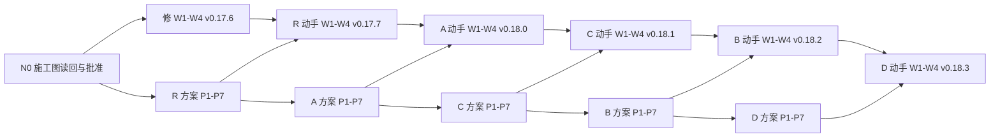

# 改写施工图：从 v0.17.6 到 v0.18.3 的节点、席位与判据

> 状态：待读回与批准 · 所有者 2026-09-12 同意五项后由 Fable 编成；批准前先读回（读回席位见 §三），所有者批准即合入<br>
> 基线：main @ `4736316`（草案 v0.17.5）<br>
> 去向：改写期间的施工图；所有者以控制面加工作流引擎的身份按节点推进，每个节点做完在 §四 的表里打勾；规矩本身在 [`05-rewrite-process.md`](./05-rewrite-process.md) v2

## 一、上下文

**目标。** 把设计文档按单元模型改写到 v0.18，同时把 #216 审出的欠账清掉。所有者只做两件事：按判据机械推进节点（合入、贴提示词、把各家评论从自己的账号贴出、逐条拍板），以及在拍板节点上做人的选择。作者与评审是各个 harness。

**边界。** 只改 `docs/design/**`、`.memo/design/case-study-20260907/**`、决策史与台账、验证器一级检查；不动代码、不动 P2 工作包；P2.1 底座何时开工由所有者在 C 批合入后另定。

**为什么这样切。** 修正批先行，因为错句就在 main 上，每多一轮评审就多一次被带偏；R 小批紧跟，因为三处行为取舍自包含、评审各家的上下文正热；A 批是承重墙——#210/#211 已经把"Agency 是独立单元、控制面只持策略"写进 Participant 正文，架构正文却还没有「单元与连接」；C 提到 B 前，因为 B 被 09-11/09-12 消掉一半，而 P2.1 底座依赖 C 的控制面存储两半与 Repo 现场规则；D 最后。

**关键取舍。** 一次一批：上一批动手 PR 合入前，下一批只做方案讨论。方案阶段重审（独立一轮、交叉一轮、读回一步），动手 PR 轻审一轮加合并后核对。分歧由作者按论证质量先合成作者说明，合不拢的列成待裁项给所有者。

**已知风险。** C 批最重，方案里可切两个 PR；同一批 harness 连审五批会疲劳，所以每批只挑一个陪审、读回换人；所有者的裁决随时会来，来了就在同一个 PR 里改 05 §二 的表与本图。

## 二、三张清单（施工图的来料）

**已决**（能写成"交出什么、凭什么算交出"的，进图）：

| 编号 | 条目 | 出处 |
| --- | --- | --- |
| D1 | 一致性修正批先行，只有动手、不出方案，Grok 与 GLM 轻审 | 所有者 2026-09-12 同意五项之一；内容按 #216 §六家复核后的修订 |
| D2 | R 小批：F1、R1、R3 三处先定行为再改约束、配 CT；R2 归 B | 同上；05 §二 R 行 |
| D3 | A 架构批：内容按 05 §二 A 行；升 v0.18.0、立决策史 §37；验证器一级检查随本批 | 05 §二、§八；04 §四 |
| D4 | C 在 B 之前；C 由 Codex 写、Fable 主审 | 所有者 2026-09-12 同意 |
| D5 | B、D 按 05 §二 重切后的内容 | 05 §二 v2 |
| D6 | 人手：Codex 主审架构与愿景稿、Grok 每批副审、K3/GLM 按批挑一个陪审；Muse 在 A 批试陪审；Gemini 只做读回与范围明确的核对 | 05 §三 v2 |
| D7 | 方案六样东西；七问；评审产出形状固定（先七问表态，再逐条维持/修正/推翻，撤回要写明）；第一轮独立不读他家、第二轮交叉 | 05 §四、§五 |
| D8 | 方案拍板前先读回，读回者不在本批席位上，不投票 | 05 §六 v2 |
| D9 | 动手 PR 轻审只查三样：忠于方案、层对不对、约束改了配没配 CT | 05 §六 |
| D10 | 合入纪律：换词批之后并入旧分支按判别顺序重判；"已修回"先核再写；每批合入后由非作者做四种情况核对 | 05 §六 v2 |
| D11 | 所有者逐条拍板方案里的每处改法，不是整份一个"同意"；已拍板不重开，重开要有新证据 | 05 §七 |
| D12 | 合入方式：merge commit，主题为 PR 标题加编号，正文为 PR 描述；每家评论经所有者账号发出并在标题写明哪家哪轮 | 所有者 2026-09-06 裁定；05 §三 |
| D13 | 版本：修正批 v0.17.6、R 批 v0.17.7、A v0.18.0、C v0.18.1、B v0.18.2、D v0.18.3；每批改了约束就进台账一行 | 05 §八 v2 |

**尚未定形**（在对应批次的方案里定，不进图）：F1 的具体结算规则（等组稳定还是关闸时比较）；R1 清单快照的冻结来源；R3 无产出调用时回避策略的适用；C 批要不要切两个 PR；B 批待命与会话复用写不写进设计正文；A 批决策史 §37 的行文；P2.1 何时开工。

**出界**（不在本图）：P2 实现工作包与署名关卡的实现；Repo 身份长聊（冻结）；验证器二级、三级（随 P2.1）；把七问整理成技能（05 §十 待办）。

## 三、席位

| 批 | 作者 | 主审 | 副审 | 陪审 | 方案读回 | 合并后核对 |
| --- | --- | --- | --- | --- | --- | --- |
| 修 一致性修正 | Fable | —（轻审：Grok、GLM） | — | — | — | Codex（他写的清单） |
| R 计票与读回口径 | Fable | Codex | Grok | K3 | Gemini | GLM |
| A 架构 | Fable | Codex | Grok | GLM，另加 Muse 试一次逐行勾稽 | Gemini | K3 |
| C Repo 与治理正文 | Codex | Fable | Grok | K3 | Gemini | GLM |
| B 系统边界与 Participant | Fable | Codex | Grok | K3 | Gemini | GLM |
| D 看板、Run 交接与交付 | Fable | Codex | Grok | GLM | Gemini | K3 |
| 本施工图 | Fable | — | — | — | Muse（不在讨论里） | — |

轻审席位的产出只答三样（D9）；陪审按批的性质选（05 §三）；读回者不能是本批任何席位。

## 四、节点与边

节点分两种子图。**方案子图**（P）七个节点，**动手子图**（W）四个节点；修正批只有 W。边都是产物依赖：下游的开工条件引用上游交出的东西（PR 编号、合入提交、评论标题）。批与批之间两条边：`P(k).1 ← P(k-1).7`（方案讨论按批顺序，避免同一批 harness 同时审两份方案），`W(k).1 ← P(k).7 与 W(k-1).4`（动手一次只有一个在飞）。

### 方案子图 P（每批一套）

| 节点 | 交出什么 | 凭什么算交出（判据） | 依赖 | 席位 |
| --- | --- | --- | --- | --- |
| P.1 方案 v1 | 方案文件 `.memo/design/case-study-20260907/<批>-plan.md` v1，按 05 §四 六样东西写，走一遍 S1；开 PR，不自合 | PR 打开，描述三节齐、CI 绿 | 上一批 P.7 | 作者 |
| P.2 独立审阅 | 主审、副审、陪审各一条评论，标题「<家> · <批> 方案 · 独立审阅」，先七问表态再逐条维持/修正/推翻 | 三条评论都在（A 批四条） | P.1 | 主审、副审、陪审（并行） |
| P.3 作者说明与 v2 | 评论「作者说明 · 第一轮汇总与 v2」：逐条采纳/拒绝并说理由；推送 v2 | 评论在、v2 提交在 PR 上 | P.2 全部 | 作者 |
| P.4 交叉审阅 | 各席一条评论「<家> · <批> 方案 · 交叉审阅」，读他家意见，撤回自己说错的要写明 | 评论齐 | P.3 | 同 P.2（并行） |
| P.5 作者说明与 v3 | 评论「作者说明 · 第二轮汇总与 v3」，末尾列待裁项；推送 v3 | 评论在、v3 在 | P.4 全部 | 作者 |
| P.6 读回 | 评论「<家> · <批> 方案 · 读回」：只拿 v3 与 S1，逐处改法复述成人话、走 S1 每步与失败路径、单列不确定处；不投票 | 评论在；作者看过，走样处已改（改了就再读回一次） | P.5 | 读回席位 |
| P.7 拍板与合入 | 所有者评论「拍板 · <批> 方案」：逐条同意/改/待，待裁项逐条选；作者按拍板改 v4（若有）；所有者合入方案 PR | PR 合入（merge commit） | P.6 | 所有者 |

### 动手子图 W（每批一套）

| 节点 | 交出什么 | 凭什么算交出（判据） | 依赖 | 席位 |
| --- | --- | --- | --- | --- |
| W.1 动手 PR | 按拍板的方案改文档；约束改动配 CT 用例；版本戳全库一致；台账一行；05 §二 表与本图打勾；描述"已修回"先用 `git log -S` 核 | PR 打开、CI 绿（含 `buck2 test root//build/docs/...` 13 项） | 本批 P.7、上一批 W.4 | 作者 |
| W.2 轻审 | 主审与副审各一条评论「<家> · <批> 动手 · 轻审」，只答三样：忠于方案、层、CT | 评论齐 | W.1 | 主审、副审（修正批：Grok、GLM） |
| W.3 修正 | 作者按轻审改，评论「作者说明 · 轻审处理」 | 评论在；两家都写"可合"或"修正后可合"且修正已落 | W.2 | 作者 |
| W.4 合入与合并后核对 | 所有者合入；一个非作者一条评论「<家> · <批> 合并后核对」，按四种情况清单核本批改动的文件与 05 §二 表 | PR 合入；核对评论在；若核出回退，开一个修正 PR 走 W 子图 | W.3 | 所有者；核对席位 |

### 全图



N0 的判据：Muse 的读回评论在本图的 PR 上，作者按走样处改过，所有者合入本图的 PR。

### 进度（做完打勾，改在同一个 PR 里）

| 节点 | 状态 | 产物 |
| --- | --- | --- |
| N0 | 进行中 | 本 PR |
| 修 W.1–W.4 | 未开始 | |
| R P.1–P.7 | 未开始 | |
| R W.1–W.4 | 未开始 | |
| A P.1–P.7 | 未开始 | |
| A W.1–W.4 | 未开始 | |
| C P.1–P.7 | 未开始 | |
| C W.1–W.4 | 未开始 | |
| B P.1–P.7 | 未开始 | |
| B W.1–W.4 | 未开始 | |
| D P.1–P.7 | 未开始 | |
| D W.1–W.4 | 未开始 | |

## 五、运行手册（给控制面与引擎）

每个节点三步：查上游判据是否满足；点火（开 PR 的节点通知作者，评审节点把 §六 的提示词填好贴给对应 harness，把它们的回复以「<家> · <批> · <轮>」为标题从所有者账号贴到 PR）；等本节点判据满足再看下一个。具体：

1. **点火作者节点（P.1、P.3、P.5、W.1、W.3）**：给作者一句话就够——"<批> 进入 P.1，按 08 施工图"。作者的产物是 PR 或评论。
2. **点火评审节点（P.2、P.4、W.2、P.6、W.4 的核对席）**：贴提示词，等评论齐；不齐不进下一节点。独立审阅那一轮的 harness 不读他家评论，靠提示词里的一句话约束。
3. **拍板节点（P.7）**：读作者说明与读回，逐条写「同意 / 改成… / 待」，待裁项逐条选；然后合入方案 PR。
4. **合入节点（P.7、W.4）**：`gh pr merge <n> --merge --subject "<标题> (#<n>)" --body "<PR 描述>"`；合入前分支若落后于 main 先并入 main；合入后再看核对评论。
5. **任何节点发现上游产物不对**（例如 CI 红、版本戳不齐）：退回作者，不跳。
6. **裁决随时来**：所有者任何时候可以在 PR 上直接裁；作者在同一个 PR 里改 05 §二 表和本图。

## 六、提示词（填 `<>` 里的字）

**P.2 独立审阅**

```
你在 yesme/hctl2 审 PR #<n>：<批> 的方案 v1（文件 <路径>）。席位：<主审 / 副审 / 陪审>。
先 git fetch origin，读 AGENTS.md、CONSTRAINTS.md、.memo/design/case-study-20260907/05-rewrite-process.md（§四 方案六样东西、§五 七问、§七 拍板），再读方案文件、它引用的 memo 与设计正文。
第一轮不读本 PR 上其他评审者的评论。
产出一条评论，标题「<家> · <批> 方案 · 独立审阅」。形状固定：先按七问（对、全、分、借、衡、层、验）对整批各表一句态；再逐条给维持 / 修正 / 推翻，每条写位置（文件 §节名）、依据、理由，修正与推翻要给替代写法。
方案里标为"已拍板不重开"的条目，只核它引用的裁决是否真有、范围是否被扩大，不重开。作者标"推论"的条目可以驳。
检查方案有没有为消一句歧义引入不必要的机制、对象或新规则；有没有把评审共识当成所有者裁决。
不改文件，不开 PR，不 push。讲人话，引用写路径和节名，历史证据附 PR 或提交。
<专门方向：一句话>
```

**P.4 交叉审阅**

```
同一个 PR #<n>，方案已按第一轮意见改到 v2（见「作者说明 · 第一轮汇总与 v2」）。
读其他评审者的评论与作者说明，再核 v2。
产出一条评论，标题「<家> · <批> 方案 · 交叉审阅」：对作者说明里拒绝你的每一条，接受或反驳，反驳要有新证据；对他家意见，同意的说同意、不同意的说理由；撤回自己第一轮说错的要写明是哪条、为什么。
仍是维持 / 修正 / 推翻的形状；不引入新议题，除非是 v2 新改出来的问题。
不改文件，不开 PR，不 push。
```

**P.6 读回**

```
你在 yesme/hctl2 做读回，对象是 PR #<n> 的方案 v3（文件 <路径>）。
只读这份方案文件与参考用例 .memo/notes/HCTL_case_study.md（S1）；不读本 PR 上的任何评论，不读讨论历史。
产出一条评论，标题「<家> · <批> 方案 · 读回」，分三段：
一、复述：按方案里每处改法逐条用自己的话写——改哪句、改成什么意思、为什么、代价谁付；不许引用方案原话。
二、走用例：拿 S1 的每一步和五条失败路径，在改后的规则下走一遍，每步写"走得通 / 走不通 / 看不出"。
三、单列你不确定、猜了、或读了两遍还不明白的地方。
你不投票不裁决；复述走样是给作者看的，不用改成"建议"。不改文件。
```

**W.2 轻审**

```
你在 yesme/hctl2 轻审 PR #<n>：<批> 的动手 PR，拍板的方案是 <方案文件路径> 与所有者的「拍板 · <批> 方案」评论。
先 git fetch origin，读 AGENTS.md、CONSTRAINTS.md。
只查三样：一、改出来的文字是否忠于拍板的方案——逐处对，多改的、漏改的、改走样的各列一张小表；二、每句话的层对不对（愿景 / 架构 / 约束 / 交付 / 实现），实现名与约束用语有没有漏进上一层；三、约束改了的地方配没配契约测试用例，用例能不能失败。
再跑一遍 cd src && ./buck2 test root//build/docs/...，写结果。
产出一条评论，标题「<家> · <批> 动手 · 轻审」，第一句写"可合 / 修正后可合 / 不可合"。不审方案本身的对错，那在方案阶段已经审过。
不改文件，不开 PR，不 push，不合并。
```

**W.4 合并后核对**

```
你在 yesme/hctl2 做合并后核对。对象：PR #<n>（<批>）合入后的 main @ <sha>；对照上一批的基线 main @ <上一 sha>、拍板的方案 <路径>、05-rewrite-process.md §二 的批次表。
先 git fetch origin，读 AGENTS.md、CONSTRAINTS.md。按指定提交读文件，不以本地工作树为准。
只用四种情况的清单，对本批改动过的文件逐个核：一、已经改对、后来又改坏（尤其合并冲突处置把全库换词批改回去）；二、新规则与保留的旧规则不一致；三、已明确安排后续批次、尚未实施（这一类不算问题，只登记）；四、所有者有意改变了原来的决定（不能报作回退）。
另核 05 §二 表与 08 施工图是否随本批更新。
产出一条评论，标题「<家> · <批> 合并后核对」，第一句写"无回退 / 有回退（n 处）"；每处写位置、证据（提交）、属于四种里的哪一种、建议。纸面反例不等于运行故障；CI 通过不等于自然语言一致。
不改文件，不开 PR，不 push。
```

**N0 施工图读回（本图）**

```
你在 yesme/hctl2 做读回，对象是 PR #<n> 里的 .memo/design/case-study-20260907/08-rewrite-dag.md。
只读这份文件、它引用的 05-rewrite-process.md，和 .memo/notes/HCTL_case_study.md；不读本 PR 上的评论，不读其他讨论。
产出一条评论，标题「Muse · 改写施工图 · 读回」，分三段：
一、按节点逐个用自己的话写：交出什么、凭什么算交出、依赖谁、我理解它是为了什么；不许引用原话。
二、对照：施工图 §二「已决」的每一条，对应到哪些节点；有节点却对不上任何已决条目的，单列；已决里有却没有节点承接的，单列；§一 上下文里提到、没有节点承接的，单列。
三、单列你不确定、猜了、或读两遍还不明白的地方，尤其是"所有者作为引擎按这张图推进，哪一步会不知道该做什么"。
你不投票不裁决。不改文件。
```

## 七、版本与台账

修正批 v0.17.6、R 批 v0.17.7 各进台账一行指回 #216 报告；A 批升 v0.18.0 并立决策史 §37；C、B、D 各进一个补丁号，台账指回 §37。版本戳全库 23 处随每批一起改，动手 PR 的 CI 版本检查会拦。
