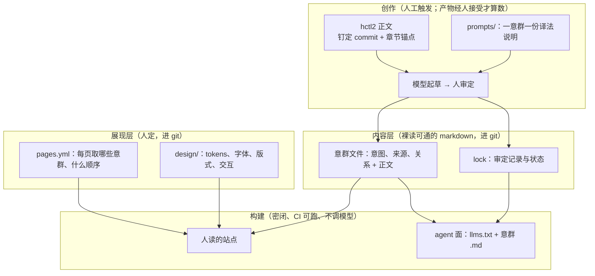

# ③ neo 建站：译者加审校

> 状态：讨论中 · 待拍板（站点范围、仓库形态与工具链、语言、衬线浓度见上一级 README §待拍板） 
> 基线：main @ `60f3726`（草案 v0.19.3） 
> 去向：`hctl2-site` 仓库的生成协议与构建说明（仓库未建）

所有者给的四条约束（2026-10-07，原话见 [`log`](../../log/2026-10-08-官网与neo建站.md) 第 5 条）：不纠缠现有文档与代码；内容不是机械编译，而是"给 prompt、由 LLM 基于仓库正文的一次 generation"，逐单元进行；生成结果可缓存，输入不变就不重生成；内容与展现分层。

2026-10-08 Claude 席与所有者续了一轮，改了比喻、分层与失效规则，新增两个读者面（原话见 [`log`](../../log/2026-10-08-neo建站续.md)）。初版（DeepSeek 席，「生成式构建系统」）留在 git 历史 `3ec6698`。

## 一句话

**这是一条本地化流水线，不是编译器。** 仓库正文是原文，prompt 是译法说明，模型是译者，人是审校，lock 是翻译记忆；站点构建本身是机械的。

编译器的输出由输入决定：源码一变就必须重编，不重编就是错。生成的文字不同：它站得住，是因为人接受了它，而不是因为缓存键对得上。因此文字在人接受时冻结，不在生成时冻结；来源变了，单元是「过期待审」，不是「必须重生成」。

下表是比喻的逐项对应：

| 本地化流水线 | 这套系统 |
| --- | --- |
| 原文 | hctl2 仓库正文，按钉定 commit 与章节锚点引用 |
| 译法说明 | `prompts/`：一个意群一份 prompt |
| 译者 | 模型；起草的执行者可以是任意 harness |
| 审校 | 人 |
| 翻译记忆 | lock：每个意群的审定记录 |
| 排版 | 展现层：页面、导航、取舍、顺序、样式 |

## 形状

## 三层与两个读者面

本节回答：什么归内容层，什么归展现层，人和 agent 各读什么。

### 内容层：意群与关系

- 单元是一个**意群**：页面上讲的一件事。内容层只有意群和意群之间的关系，没有页面。
- 每个意群一个 markdown 文件，不经渲染也读得通。frontmatter 由人写：意图（一句话）、来源章节、关系、对应的 prompt。正文由模型起草、人审定。
- 关系用链接表达，起步四种：支撑、展开、对照、前置。词表在 P0 定。
- 内容里不许带样式：内联 HTML、class、颜色、字号由检查一律拒绝。

语义约定写成 markdown 的写法，不另造块语法。自定义标记一多，裸读的 agent 反而读不顺。

| 约定 | 含义 | 写法 |
| --- | --- | --- |
| `claim` | 一个主张 | 段首一句 |
| `evidence` | 主张的出处 | 链接到 `文件#锚点`，带钉定 commit |
| `flow` | 用户流程或步骤序列 | 有序列表 |
| `diagram` | 图意 | mermaid 代码块 |
| `table` | 结构化对照 | markdown 表格 |
| `boundary` | 明确不做什么 | 「不做」小节 |

### 展现层：页面属于这里

- 页面是给人安排的阅读路径，因此归展现层。`pages.yml` 只管三件事：每页取哪些意群（取舍）、按什么顺序、导航怎么走。
- `design/` 放 tokens、三声部字体、版式与交互，见 [`01-site.md` §审美](./01-site.md#审美三声部排印)。
- 展现可以生成，但只在设计期：模型出几套 tokens 或版式候选，人挑一套，冻结进 `design/`。构建时不调模型。

### 两个读者面

用 hctl2 的人带着 agent 干活，他们的 agent 也会来读站，因此站点有两种读者：

| 读者 | 读什么 | 经过展现层吗 |
| --- | --- | --- |
| 人 | 排印过的页面：展现层从意群里取舍、排序、加样式 | 经过 |
| agent | 站点根的 `llms.txt` 索引，加每个意群的 markdown 原样导出（带意图、来源、关系与审定状态） | 不经过 |

- agent 面不是渲染出来的，它就是内容层本身。因此它几乎不花额外成本，从 P0 起算进范围。
- 人和 agent 读的差别只在展现层：取舍、顺序、样式。agent 拿到全集，自己挑着读。
- 同一段文字两边通用，前提是不写营销腔、每个主张带出处。营销腔会误导 agent，那样就得另写一份事实版，内容层也就分裂成两份。
- `boundary` 对 agent 尤其要紧：它防止 agent 替我们编造能力。
- 待议（产品层，先不展开）：「安装 hctl2」可以是一段交给 harness 执行的指令，不一定是一页给人读的教程。

## 审定状态与 lock

本节回答：什么时候要重写一个意群，谁说了算，lock 记什么。

### 四个状态

| 状态 | 含义 | 上线吗 |
| --- | --- | --- |
| 待译 | 新意群，还没有正文 | 不上 |
| 待审 | 模型起草了，人还没接受 | 新稿不上；该意群已有已定文字的，旧文字照常上线 |
| 已定 | 人接受了 | 上 |
| 过期 | 已定之后，引用的来源章节或 prompt 变了 | 继续上，colophon 标「过期」 |

过期意群继续上线（所有者 2026-10-08）。理由有两条：每个主张的出处钉在当时的 commit 上，过期的文字说的仍是「截至那个版本为真」，不会变成错的；而撤下的话，正文改一个错字，首页就空出一块。

### 失效：机械 → sysone → 人

- 触发失效的只有两样：来源章节的内容变了，或 prompt 变了。站点钉定的 hctl2 commit 一升级，就逐个重算来源章节的哈希。
- 模型 id 不参与失效判断，只作为出处记在 lock 里。换了译者，已经审定的文字不会因此变错；想用新模型重写某个意群，由人主动发起重译。
- 来源引用用章节锚点，不用 `文件:行`：行号会随编辑漂移，标题锚点稳定。哈希按章节算（从该标题到下一个同级或更高级标题之前），不按整个文件算，因此改一处只让引用那一节的意群过期。
- 锚点的 slug 规则直接复用 hctl2 链接检查的那一套（`src/build/docs/check_links.pl`：重复标题依次加 `-1`、`-2`，显式 `<a id>` 与 `<a name>` 也算），不另写，否则章节哈希会和链接检查对不上。
- 锚点在钉定 commit 里解析不到（标题改名或删除）时，引用它的意群必须标为过期，不许跳过校验；否则失败是静默的。

过期之后要不要重写，按[判断点的三段论](../room-judgment-20261002.md#二所有者定的)走：

1. 机械：哈希变了，意群标为过期，列入过期清单。这一步就是缺省行为——过期意群继续上线，不强制要人看。
2. sysone：判断这处改动对这个意群有没有实质影响，输出概率，不写字；过期清单按概率排序。sysone 未就位或拿不准时，退回机械缺省，清单不排序。
3. 人：按顺序过目，决定重译（进入待审），或确认原文字照用（回到已定，lock 更新审定时的哈希）。

### lock 记什么

每个意群一条审定记录：

| 字段 | 含义 |
| --- | --- |
| 来源 | 引用的章节锚点，及审定时各章节的哈希 |
| prompt | 审定时 prompt 的哈希 |
| 模型 | 起草所用的模型 id；只是出处，不参与失效判断 |
| 审校 | 接受的人与日期 |
| 状态 | 待译、待审、已定、过期 |

- 来源与 prompt 都不变时，生成步骤零输出、零 token。
- 意群文件与 lock 一并进 git。CI 只校验自洽：lock 里的哈希与当前来源、prompt 对得上；对不上或锚点解析不到的意群必须标为过期。CI 永不调模型。
- 站点级只记一项：钉定的 hctl2 commit。colophon 页首写一行「站点基于 hctl2 @ `<commit>`，构建于 `<日期>`」，`llms.txt` 开头写同一行，人和 agent 都能一眼看到整份公开面钉在哪个版本上。

## 谁来生成，谁来接受

所有者 2026-10-08 定：

- 谁触发生成都行：任意 harness 按协议都能起草，把稿件提交为待审。
- 接受权只在人手里。待审变已定、过期确认照用，都必须能回指人的动作；凭证的具体形式（例如人批准的 PR）在 P1 定。

起草与构建是两件事：

- 起草属于创作，可以在任何地方跑，包括 CI。它归「谁触发生成都行」，产出走 PR，由人接受。
- 构建只组合已定的意群与展现层，永远不调模型。

因此 CI 里出现模型调用，只能是一次起草任务，不能是构建的一步。边界不在模型在哪跑，而在模型的产出不经人接受就不能上站。同理，LLM 只参与创作，不参与构建：内容在创作时起草与审定，展现在设计期出候选。

## 业界先例

本节回答：每个机制从哪儿借来，借什么、不借什么。

| 先例 | 借什么 | 不借什么 |
| --- | --- | --- |
| gettext 的 `fuzzy` 标记 | 原文变化时标记待审，不丢弃旧译文 | 编译时默认不收录 `fuzzy` 条目：我们的过期意群继续上线 |
| Crowdin 的 `updateOption` | 原文变化后，译文与审定分开处理，由项目选：清掉两者、只留译文、两者都留 | 平台本身 |
| lingo.dev 的 `i18n.lock` | 对源内容算 SHA-256，只重译改过的部分；lock 进 git | 自动重译：我们要人审 |
| `cargo insta` | 生成结果先挂起，逐条 review 接受后才入库 | — |
| DITA 的 topic 与 map | 内容单元与组织方式分开，同一批 topic 配不同的 map | XML 工具链 |
| llms.txt 提案 | 站点根放 `llms.txt` 索引；给 agent 读的页面在同一路径另给一份 `.md` | — |
| GitHub Agentic Workflows（GitHub Next 的研究项目，不是正式发布的能力） | 起草可以在 CI 里跑，产出走 PR 由人审；这一步属于创作，不属于构建 | 把它当现成机制依赖 |
| Buck2 与 reindeer | 内容寻址的键、零工作重跑、生成物入库且 CI 只校验新鲜度 | 把模型调用做成构建 action |

出处：[gettext msgfmt 的 `--use-fuzzy`](https://www.gnu.org/software/gettext/manual/html_node/msgfmt-Invocation.html)、[Crowdin 官方 JS 客户端的 `UpdateOption`](https://github.com/crowdin/crowdin-api-client-js/blob/master/src/sourceFiles/index.ts)、[lingo.dev i18n.lock](https://lingo.dev/en/cli/fundamentals/i18n-lock-lockfile)、[llms.txt 提案](https://llmstxt.org/)、[GitHub Next：Agentic Workflows](https://githubnext.com/projects/agentic-workflows)。站点仓库建起来后，这些进它自己的调研目录。

## 仓库形态

独立仓库 `hctl2-site`（所有者同意，见上一级 README），**依赖单向**：它按钉定的 hctl2 commit 与章节哈希读取正文，hctl2 永不引用它。这样"不纠缠"是结构性的，不是承诺——hctl2 的 Buck2 图、PR 契约与文档 lint 都管不到站点，也不该管。

生成器不是新服务：一份协议加 lock，执行者可以是任意 harness。执行可替换，事实留在带来源、带审定记录的产物里。hctl2 自己的调研纪律不管这个仓库，站点仓库自带调研目录。

## 拿官网给自己的产品练手

**用 hctl2 的方法做 hctl2 的官网**：过期清单就是一个 Task 队列——意群是 Task，harness 是执行它的 Participant，人接受就是验收，lock 里的审定记录就是凭证。等产品可用时，这件事可以正式开成一个 hctl2 Project；那时「Workbench 正在构建 hctl2 官网」这一屏可以作为 01 要的第一张真实产品快照，自带 commit 与日期。现在先用轻量协议跑，不等产品。

## 阶段

| 阶段 | 交付 | 验收 |
| --- | --- | --- |
| P0 协议 | 意群文件格式（frontmatter 字段、markdown 约定、关系词表）、prompt 规范、lock 字段与四个状态、`pages.yml`；首页三个意群跑通，agent 面同步导出 | 改一处来源章节只让引用它的意群过期；锚点解析不到的意群标为过期；全不改时零输出；agent 面不经展现层即可读 |
| P1 工具 | `gen` 命令（算哈希、列出待译与过期清单、起草进待审）、接受凭证的形式、CI 自洽校验（不联网） | 清单可复现；CI 不调模型；每条已定记录都能回指人的接受 |
| P2 展现层 | tokens、三声部字体、渲染器、排版测试页 | 内容里出现样式即报错；测试页逐条过清单 |
| P3 全站意群 | 逐页逐意群起草与审定 | 每个意群可回指来源；colophon 列出每个意群的状态 |
| P4 快照页 | Workbench 的可复现截图管线 | 每张图带 commit 与日期 |
| P5 上线 | 托管、域名、CI 门禁 | 线上可访问 |

## 纪律与风险

- 生成器**不许发明事实**：版本号、许可证、数字只从来源正文抄。每个主张必须带出处，按三段核：
  1. 机械：出处存在，锚点在钉定 commit 里能解析。
  2. sysone：出处撑不撑得住这句话。
  3. 人：审定。

  缺出处的意群不能进入已定。
- 内容评审走文档纪律（`WRITING-GUIDE.md` 与 `CONSTRAINTS.md` 的词表，如禁用「张力」、禁用「账本」），不写营销腔。这条同时是两个读者面共用一份文字的前提。
- 主要风险不是烧 token，而是**过期堆积**与**审校瓶颈**。成本的大头从第一次全量生成的 token，转到了人的审校时间：
  - 过期堆积会让站点越来越落后于仓库。colophon 列出每个意群的状态与过期天数，让堆积看得见。
  - 人的注意力是稀缺资源（[02 §4](./02-principles.md#4-注意力是稀缺资源)）。sysone 排序的用处，就是把人的注意力花在真正受影响的意群上。
