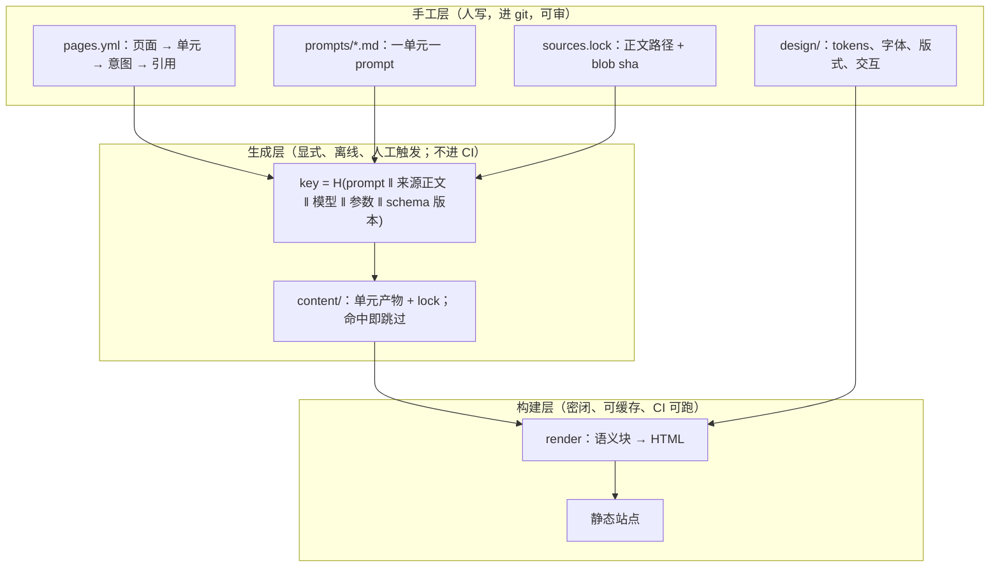

# ③ neo 建站：逐单元生成 + 缓存

> 状态：讨论中 · 待拍板（执行者与信任模型见上一级 README §待拍板） 
> 基线：main @ `543a8b5`（草案 v0.19.3） 
> 去向：`hctl2-site` 仓库的生成协议与构建说明（仓库未建）

所有者给的四条约束（2026-10-07，原话见 [`log`](../../log/2026-10-08-官网与neo建站.md) 第 5 条）：不纠缠现有文档与代码；内容不是机械编译，而是"给 prompt、由 LLM 基于仓库正文的一次 generation"，逐单元进行；生成结果可缓存，输入不变就不重生成；内容与展现分层。本文是据此的设计。

一句话：**这本质上是一个生成式构建系统**——prompt 是 build rule，正文是 source，模型是 compiler，单元产物是 object file，站点是 linked binary，作者点头是冻结。

## 形状

## 单元与缓存

- 单元 = 页面上"讲的一件事"，粒度按**意群**而不是按页；一个页面若干单元，一个单元一个 prompt。导航、页面清单、顺序、艺术效果全部手工（`pages.yml` 与 `design/`）。
- `key = H(prompt 文本 ‖ 每个来源文件的 blob sha ‖ model id ‖ 生成参数 ‖ schema 版本)`。改一行正文只失效引用它的单元；改 prompt 只失效那一个单元；全都不改时 `gen all` 零输出、零 token。
- **prompt 是源码**：改 prompt 等同于改 build rule，prompt 的 diff 与内容的 diff 同等重要。
- **model id 必须进 key**，否则"缓存命中"会掩盖换模型带来的漂移；温度 0 不保证可复现，缓存才是唯一保证。
- 生成物与 lock 一并进 git，和 reindeer 生成第三方 BUCK 的先例同一姿态：**生成物入库，CI 只校验新鲜度，不重新生成**。

## 内容与展现的契约

内容层产出**语义块**，不产出布局；每块带来源：

| 块 | 含义 |
| --- | --- |
| `claim` | 一个主张（一句话） |
| `evidence` | 出处：`文件:行` + commit |
| `flow` | 用户流程或步骤序列 |
| `diagram` | 图意，交给渲染器生成 mermaid |
| `table` | 结构化对照 |
| `boundary` | 明确不做什么 |

展现层（`design/`）只认这些块：风格、字体、字号、位置、交互、颜色全在手写 tokens 里；渲染器遇到不认识的块**必须报错**，不允许内容偷带样式。生成式只用于**可审的产物**——mermaid 源码、示例资产；排版与设计系统手工定死（生成式配色与间距会漂移，无障碍无法保证，评审无从下手）。

## 借 Buck2 什么、不借什么

| Buck2 的东西 | 这套系统里的对应 |
| --- | --- |
| 内容寻址的 action key | 上面的 `key` 公式 |
| action 粒度 | 一个单元一个 key，失效范围最小 |
| 产物入库 + 新鲜度校验 | `content/` 与 lock 进 git；CI 校验自洽，永不调模型 |
| 零工作构建 | 输入不变则零输出、零 token |

**不借的一件**：不把模型调用做成构建 action，也不放进 CI。理由：生成要联网、要花钱、非确定，塞进构建会把"可重放构建"变成"每次跑都在烧 token 的构建"。生成是一个显式的离线步骤，人工触发，产物入库。

## 仓库形态

独立仓库 `hctl2-site`（所有者同意，见上一级 README），**依赖单向**：它按 `sources.lock` 记录的 hctl2 commit 与 blob sha 读取正文，hctl2 永不引用它。这样"不纠缠"是结构性的，不是承诺——hctl2 的 Buck2 图、PR 契约与文档 lint 都管不到站点，也不该管。

生成器不是新服务：**一份协议加缓存，执行者可以是任意 harness**（哪个席位在场都行）——执行可替换，事实留在带来源的产物里。hctl2 自己的调研纪律不管这个仓库，站点仓库自带调研目录。

一个白送的叙事：**用 hctl2 的方法做 hctl2 的官网**——单元像 Task，prompt 像施工图，作者接受像验收，lock 像凭证。等产品可用时，这件事可以正式开成一个 hctl2 Project；现在先用轻量协议跑，不等产品。

## 阶段

| 阶段 | 交付 | 验收 |
| --- | --- | --- |
| P0 协议 | `pages.yml`、prompt 规范、语义块 schema、key 公式、`content/` 与 lock 格式；首页三个单元跑通 | 改一行正文只失效引用它的单元；全不改时零输出 |
| P1 生成器 | `gen` 命令（命中跳过、输出待生成清单）、lock 写入、CI 新鲜度校验（不联网） | 待生成清单可复现；CI 不联网 |
| P2 展现层 | tokens、三声部字体、渲染器、排版测试页 | 未知块报错；测试页逐条过清单 |
| P3 全站单元 | 逐页逐单元生成，逐单元 review | 每个单元可回指来源 |
| P4 快照页 | Workbench 的可复现截图管线 | 每张图带 commit 与日期 |
| P5 上线 | 托管、域名、CI 门禁 | 线上可访问 |

## 纪律与风险

- 生成器**不许发明事实**：版本号、许可证、数字只从来源正文抄；每个 `claim` 必须带 `evidence`，否则该单元校验失败。
- 内容评审走文档纪律（`WRITING-GUIDE.md` 与 `CONSTRAINTS.md` 的词表，如禁用「张力」、禁用「账本」），不写营销腔；首页文案尤其如此。
- 缓存的一次性代价在**第一次全量生成**；之后成本随改动比例走。真正的风险不是烧 token，是**缓存掩盖漂移**——所以 model id 进 key、lock 可读、prompt 可审。
