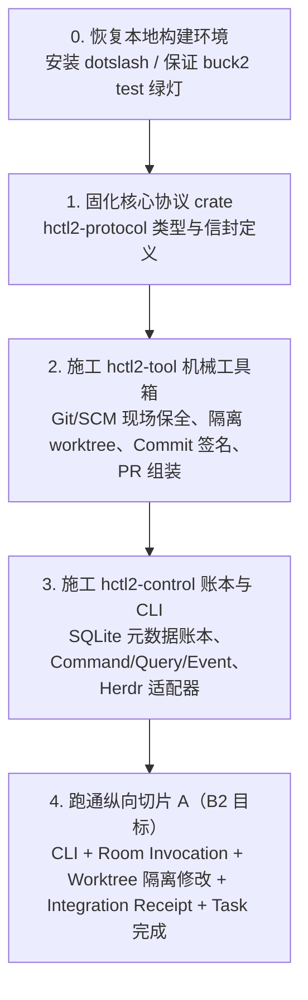

# HCTL2 演进评估与项目评述（0.7.0 至 v0.15.0）

> 状态：讨论中 
> 基线：main @ e94f144（草案 v0.15.0） 
> 去向：无（评审备忘） 
> 日期：2026-08-30 
> 对象：HCTL2 仓库 @ `main`（草案 v0.15.0）；git 历史 v0.7.0 → v0.15.0；全量设计正文 + 合同层 + delivery + decision-history + 实现证据 
> 说明：Informative · 独立综合评述，评估当前设计文档正确性、潜在瑕疵及下一步工程落地路径。

---

## 一、 定位与设计文档正确性裁决

### 1. 宏观裁决
> **裁决**：现在的 Design Doc（权威基线为 **草案 v0.15.0**）在**愿景层、架构层与合同层上是高度正确且自洽的**。

经历从 v0.7.0 到 v0.15.0 的多轮大转向与根因缺口审计，系统彻底摆脱了早期的“概念爆炸（75+ 具名概念平铺）”与“补丁摞补丁”，完成了以下关键维度的体系化收敛：
- **语义分责（四阶段与四模块）**：意图（Project）→ 承诺（Task）→ 治理（Run）→ 运行（Agent），模块对应场景，短路调用为显式设计；
- **部署分层（三面架构）**：展示面（客户端无特权等级）、控制面（用户级控制账本）、执行面（受控端口与物理执行）；
- **数据分类（三分法）**：Metadata（治理元数据）、Content（场景内容）、Artifact（工件结晶），确立“平台可拥有 content，不可拥有治理”；
- **安全与信任（三条不可关底线）**：工具不是人、合入钥匙不进工具、隔离工作树；
- **执行与供给（Agency 解耦）**：由 Herdr 直接承担第一阶段 Agency，不造第一方冗余终端服务；
- **客户端平等（动作合同化）**：Workbench、CLI 与原生客户端地位平等，动作由端点与信封决定语义。

---

## 二、 0.7.0 至今的关键演进脉络梳理

从 v0.7.0 到 v0.15.0，repo 经历了七个决定性的演进节点：

| 版本阶段 | 核心转向与演进动作 | 架构收益与定调 |
| :--- | :--- | :--- |
| **v0.8.0 – v0.9.1** | 1. 恢复愿景层与四阶段心智模型，确立“权威去重只针对合同，不针对解释”； 2. 设计层与合同层分家（`docs/design/spec/`）； 3. 概念六族归并（41 归并至 28 个复合名），场景概念对齐外部标准。 | 规范工程方法论成型，消除概念爆炸。 |
| **v0.10.0 – v0.10.3** | 1. 确立展示面、控制面、执行面**三面架构**； 2. 确立 **Metadata / Content / Artifact** 数据三分法； 3. 控制面上移为用户级（`~/.hctl2/control.sqlite`）； 4. Board 上移为 Repo 级；废除 per-clone 物理账本，收敛为**“一本账 + Git”**。 | 根除“协作记录锁在单 clone”的硬伤，确立多场景对称性。 |
| **v0.11.0 – v0.12.0** | 1. 确立 P0–P6 施工序与 B0–B6 自举阶梯； 2. 核心依赖选型（Tuwunel, Vikunja, Dagu, tmux）； 3. 自建聊天桥接退役，复用 Matrix 桥接生态； 4. P2 确立 CLI + 原生 UI 的“双手模式”。 | 明确工程交付节奏与外部组件边界。 |
| **v0.12.0 – v0.12.3** | 1. 缺口审计：引入 Run 正常完成谓词、账本备份集合同； 2. 适配器诚实合同：终局结果契约、观测截断标记、派生谱系保留； 3. Context 全本地萃取（不耗大模型 token）、投喂三档与 Run 内横向接力。 | 填补物理层空洞，确立可解释上下文与 Token 纪律。 |
| **v0.13.0 – v0.13.5** | 1. 信任模型收窄：撤销 OS 沙箱入场券与在场证明，确立**三条底线不可关**，外层加固为可选； 2. 代次不在 Dagu（Dagu 仅作路标）；Room 明文可读（不开 E2EE）； 3. Provider 体系化：Provider 定义为“执行者派出方”（Agency），与 Participant 正交；mux 降为物理原语。 | 消除桌面部署矛盾，剥离引擎与运行时的伪治理权。 |
| **v0.14.0 – v0.14.2** | 1. 放弃自建 `hctl2-agency`，由 **Herdr** 直接担任第一阶段 Agency； 2. 固定各模块 Provider 替换边界（薄 adapter，不造跨模块通用 shim）； 3. Workbench 桌面壳实测后改选 **Tauri 2 + React**（GPUI 备选，Electron 安全网）。 | 极简执行面架构，避免重复造轮子。 |
| **v0.15.0（最新）** | 1. **客户端没有特权等级**：Workbench、CLI 与原生客户端地位平等； 2. 动作语义由端点与信封（来源/目标/版本/幂等键）决定； 3. 逐一裁决 Matrix 消息、Vikunja Done 映射、Dagu 诊断与 Herdr 原生输入。 | 彻底理顺界面与治理权威的关系。 |

---

## 三、 现有设计文档的瑕疵与工程接缝风险

当前瑕疵不在顶层概念或逻辑架构，而是集中在**“合同规范”向“工程代码”过渡的物理接缝处**：

### 1. Herdr v0.8.2 的物理能力落差与长任务风险
- **问题**：Herdr v0.8.2 无统一 writer gate、无输入租约、内存事件环仅 512 条且无 sequence 通知。
- **风险**：虽然合同层已声明降级为“允许原生交互的低保证”，但在长时高频输出编码任务中，512 条内存事件环极易溢出，可能导致 UI 观测丢帧或断流时状态判断失真。
- **应对**：在 `hctl2-control` 的 Herdr 适配层中，必须将实时流式日志独立落盘/代理，不能完全依赖 Herdr 内存环。

### 2. Vikunja Done 映射的“双重状态（Dual-State）”交互反馈
- **问题**：v0.15.0 允许 Vikunja 原生 Done 触发 Task 完成请求；若未通过 Integration Receipt 校验，HCTL 保持开放，形成“Vikunja 标记 Done，HCTL 维持开放”。
- **风险**：在 P2（纯 CLI + 原生 Webhook/轮询）阶段，用户容易对“卡片拖到 Done 却未被 HCTL 确认”感到困惑。
- **应对**：需在 P2 CLI/Webhook 消费逻辑中，增加对拒绝事件的显式反馈（如自动向 Vikunja 卡片追加拒绝原因评论或生成 Project Request）。

### 3. Context 本地萃取的工程数据结构尚处概念层
- **问题**：[context.md](../../docs/design/context.md) 规定了全本地全文检索、相关性门、投喂三档与 small-brain 滚动纪要，但尚未落到具体数据模型与索引技术方案。
- **应对**：在进入 P2 开发前，需在 `crates/` 中定义好 Context Bundle 的 Rust 结构与本地检索/缓存实现。

### 4. 代码与构建工具链的开工前断层
- **问题**：`src/` 处于极早期骨架状态，且由于 dotslash 尚未在本地 PATH 安装，执行 `./buck2 test root//...` 会报 `dotslash: No such file or directory`。
- **应对**：立即安装 dotslash，打通本地及 CI 构建闭环。

---

## 四、 下一步行动路线图（从推演走向施工）

> **结论**：**停止设计文档的纯文本空转，全面进入 P1（备装）与 P2（接钥匙）代码施工期，推进 B0 → B2 自举。**

### 具象行动清单：

1. **第 0 步：环境与构建打通（Day 0）**
   - 运行 `src/build/tools/install-dotslash` 安装 dotslash 至本地环境；
   - 验证 `cd src && ./buck2 test root//...` 与 `cargo check --workspace` 绿灯，确保 Rust 1.98.0 统一工具链就绪。

2. **第 1 步：建立强类型公共协议库（`crates/hctl2-protocol`）**
   - 将 `docs/design/spec/` 中已冻结的核心对象强类型化：
     - **实体与标识**：`RepoId`, `ProjectId`, `TaskId`, `TaskRevision`, `ChangeSetRevision`, `ExecutionSpec`, `Receipt`；
     - **命令信封与事件**：`CommandDraft`, `Provenance`, `ExpectedVersion`, `IdempotencyKey`, `DomainEvent`；
     - **状态与裁决**：`Verdict`, `ReviewSubjectRef`, `LossState`（丢失）。

3. **第 2 步：实现 `hctl2-tool` 机械工具箱（P1 核心）**
   - 编写“不交给模型”的机械逻辑：
     - Git linked worktree 独立创建、写租约管理与失权现场隔离；
     - Commit 签名注入、PR 正文拼装与变化侦测；
     - 本地 Git 集成执行与 readback（为写唯一 `Integration Receipt` 提供事实证明）。

4. **第 3 步：实现 `hctl2-control` 用户级账本与公共 CLI（P2 / B0 晋级）**
   - 建立单用户 SQLite 账本（单写者、CAS、代次管理）；
   - 实现公共 `hctl2` CLI 命令集（`repo`, `project`, `task`, `invocation`, `terminal` 等）；
   - 实现 Herdr Agency 适配层。

5. **第 4 步：跑通“纵向切片 A”，达成 B2 第一次真正自举**
   - 走通完整真实闭环：CLI 注册 Repo → 创建 Task → 发起有界 Room Invocation → Herdr 启动 Harness 在独立 worktree 修改代码 → `hctl2-tool` 本地集成并写出 `Integration Receipt` → 完成 Task 验收。
