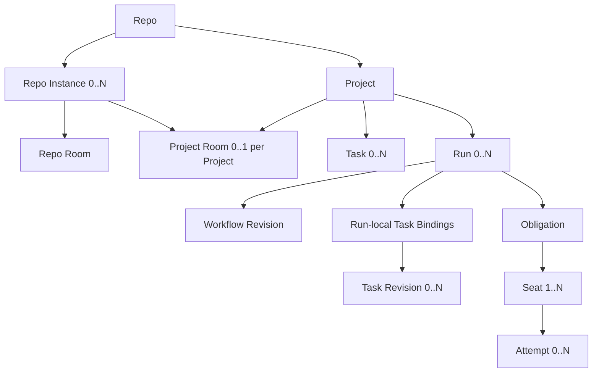
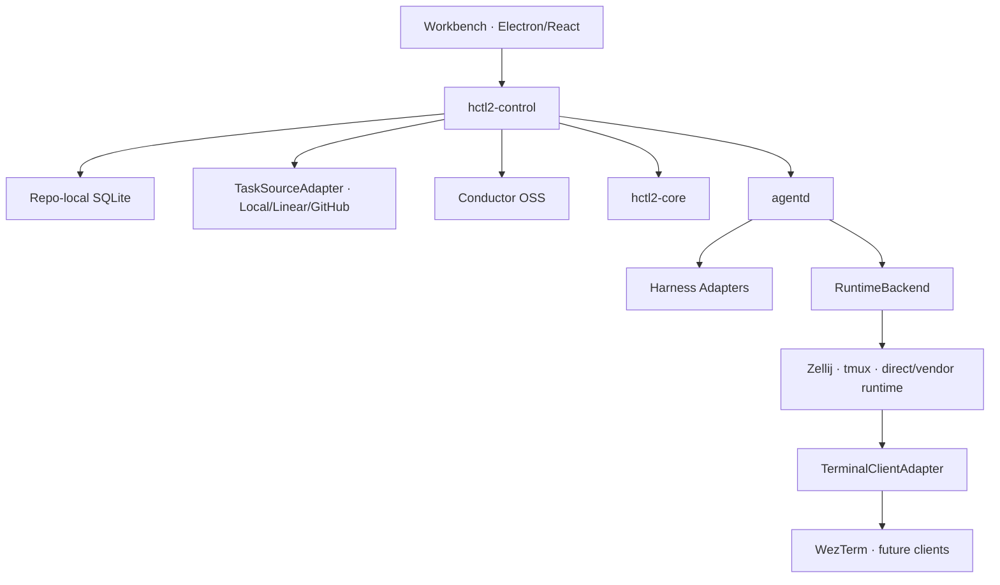

# HCTL2：产品与系统设计规范

> 状态：Draft v0.6  
> 日期：2026-08-13  
> 范围：产品愿景、领域模型、用户流程、Room、Task Kanban、Workflow、运行时、持久化、UI 技术栈、产品 Radar 与实现选型  
> Phase 1：单用户；macOS 与 Linux；架构上保留 Windows 原生移植路径

本文档是 HCTL2 的当前权威设计基线。它记录的不只是最终方案，也记录关键取舍、事实边界和实现验证条件。外部系统只作为参考；它们的 Workspace、Project、Issue、Task、Conversation、Agent 等名词不得反向定义 HCTL2。

本文按“用户需求 → 目标体验 → 领域与事实边界 → 用户流程 → 组件与实现”的正向顺序书写。正文先规定 HCTL2 应该是什么，再给出组件 contract、实现分配与验证门槛；外部产品事实集中在信息性 Evidence Radar。实现选择一旦由需求与源码证据闭合，就直接写成架构决策；只有跨进程、跨平台和故障恢复等无法由静态审阅证明的事实才进入运行验收。

---

## 0. 执行摘要

HCTL2 是一个以 Git Repo 为边界、以 Project 组织目标、以 Task 追踪工作、以 Room 承载协作、以 Run 执行自动化的软件开发协作系统。

用户不再围绕终端标签页管理多个 Coding Harness。用户首先进入一个稳定的 Repo 或 Project 协作上下文：

- Room（协作房间）：Project 的默认推进界面；人与多个逻辑参与者进行研究、设计和商议；
- Projects Overview（项目总览）：目标、健康度、Task、Run、请求和交付物的跨项目投影；
- Task Kanban（任务看板）：可排程、可验收的 HCTL2 Task；其运营字段可直接由 Linear、GitHub 或本地 Task Source 提供；
- Run View（执行视图）：冻结 Workflow 的只读图、进度与证据；
- TUI Attach（终端接入）：需要诊断或接管时，才进入原生 Harness 终端。

HCTL2 的核心分工是：

| 层 | 职责 |
| --- | --- |
| Workbench | UI、投影、命令入口；不成为事实源 |
| hctl2-control | Room 路由、Context、Task/Run 绑定、Obligation、候选 Harness、投票与副作用协调 |
| Conductor OSS | 被动维护 Workflow token、task、timer、retry 与 history 的 ground truth |
| agentd | Harness 自发现、结构化协议/PTY binding、Attempt、进程、RuntimeBackend（运行时后端）与终端映射 |
| hctl2-core | Git/SCM、PR、Revision、Receipt、Verdict、fencing 与 merge policy |
| Repo-local SQLite | Room、HCTL Task identity/contract/verification、local 运营字段、外部 snapshot/mirror、请求、Context、Run 映射与 control journal |
| Git | 共享配置、Project/Workflow 产物、Memo、代码与正式交付物 |

### 0.1 当前定案与 Phase 1 验收门槛

1. 公共领域模型使用 Repo、Project、Task、Room、Run；不再使用公共 Workspace，也不引入 Work Item。
2. HCTL2 的产品姿态是 **Project-scoped、Room-mediated shaping、Task-tracked、Run-executed**：稳定协作身份不依附任何 Harness session、tab、worktree 或 terminal。
3. Project Room 是进入 Project 后的默认推进界面；Project Overview、Task Kanban 与 Run View 是相邻投影，而不是取代 Room 的第二套项目身份。
4. Room-mediated 不等于所有工作都必须聊天。Run happy path 默认 headless，只投影进度；只有需要人的论述、授权或商议时才回到 Project Room 或创建 Scoped Room。
5. Project 是具名目标和协作边界；Task 是最小可排程、可验收工作单元；Run 是冻结 Workflow 的一次自动执行。
6. Plan/Build 保留为两种控制制度，而不是两类必须存在的 Room，也不是强制的对象树。
7. Repo Room 是开放研究大厅；Project Room 是有主题的长期协作空间；Scoped Room 是由具体问题派生、持久记录但临时生命周期的商议室。
8. Project 不预配常驻“包工头”。用户通过结构化引用直接邀请参与者；只有 Scoped Room 需要推进讨论时，才显式分配 facilitator（主持者）。
9. 简单 Room 调用不创建 Run domain object，也不进入 Conductor，只记录 RoomInvocationRecord。
10. 结构化 `@` 指参与者；`/` 指动作或协作 Recipe；`$` 指显式 Expertise/Skill；`#` 指文件、消息、Artifact、Commit 等输入引用。`/compare`、cross-review 与 panel 是 Recipe，不是假想 Participant。
11. Harness 接入采用 capability-first binding：ACP、provider JSON-RPC/app-server、Vendor SDK、native CLI + PTY、hooks/transcript 均是一等 adapter 形态；有足够 fidelity 时优先结构化协议，但不得牺牲原生 TUI 与精确 attach。
12. Room 不映射任何 runtime container。Run 的 RuntimeShard 与无 Run 调用的 InvocationRuntime 才映射具体 RuntimeBackend；Attempt 或 InvocationRuntime 的 TerminalBundle 才拥有终端 channel。RuntimeBackend 必须可替换；Phase 1 默认 backend 为 Zellij，并通过统一 contract 隔离未来替换。该决定记录为 Architecture Decision Record（ADR，架构决策记录），不把 Zellij 提升为领域不变量。
13. Workflow 使用 Conductor JSON 受控子集。JSON 必须由程序根据结构化模型生成，并通过 Schema 与 HCTL Profile 校验，禁止让模型直接写未经验证的 JSON 文本。
14. Conductor 被动保存 Workflow 状态；只有 hctl2-control 可以 poll/complete/fail/signal HCTL external task，并发起领域副作用。
15. Gater 的 primary→backup 是同一 Seat 内新增候选 Attempt，不是 Engine HA，也通常不改变 Workflow 图。业务 reject 是成功返回的语义 Verdict，不触发候选 failover；timeout、429、quota、runtime lost 等技术失败才有资格切换候选。
16. Task Kanban 只投影 HCTL2 Task；Project 使用 Overview；Run、Request、Artifact 和 Workflow Node 都不冒充看板卡片。
17. 架构支持 Local、GitHub 与 Linear Task Source；Phase 1 交付 Local 与 GitHub production external-authoritative adapter，Linear 完成 provider-neutral identity/mapping/snapshot fixtures 后作为下一 adapter。外部 provider 对 binding 中配置的 source workflow/contract/operational 字段拥有 source authority；HCTL2 始终拥有稳定 `task_id`、已采用的 TaskRevision、HCTL lifecycle、acceptance、Run binding、Receipt 与 semantic completion。
18. 外部 Done/Closed 是 provider lifecycle fact，不等于 HCTL 验收完成或 Done lane；UI 必须分别显示 provider 状态与 HCTL verification。
19. Room、HCTL Task state、外部 Task snapshot/mirror 与 control journal 使用每个 Repo 独立的 SQLite；Memo 是显式固化动作，只有提炼后的稳定知识写入 Git。
20. Phase 1 交付 HCTL-native、Project/Room-first Workbench。GUI 基线为 Rust + TypeScript + React 19 + Tailwind CSS 4 + Electron；Codeg、Orca 等只作为选择性组件供体和行为参考。WezTerm 通过 TerminalClientAdapter 接入，不成为领域不变量。
21. Task Kanban 使用 React Aria Components；Run 图使用 React Flow + Dagre；Base UI/shadcn 统一 Shell overlay；Room timeline 由 HCTL 自己持有，可选择性复用 assistant-ui 的 headless renderer primitives；Semantic Composer 采用 Codeg-derived Tiptap/ProseMirror，并通过 ComposerPort 与 HCTL wire schema 隔离。
22. `attach` 不是布尔能力。至少区分 exact native PTY、native-agent handoff、structured live inspect 与 semantic resume/replay；UI 必须准确标示当前能力。
23. 实现选择从上述体验与事实边界反推。Codeg、Orca、Termio、Linear、GitHub 等只提供可复用模块、协议或交互证据；它们的产品对象、导航和数据模型不进入 HCTL2 公共 schema。
24. HCTL 不复刻通用 Agent IDE，也不把现成产品整仓 fork 成第二套事实源。Phase 1 直接实现窄而完整的 HCTL Workbench，并从 Codeg、Orca、Termio 等项目选择性移植边界清楚、许可证允许的组件或测试方法。

---

## 1. Overview 与 Vision

### 1.1 Vision

软件开发正在从“一个人操作一个 IDE/终端”转向“一个人同时管理多个不同能力、不同上下文和不同权限的 Coding Harness”。现有工具大多优化其中一个局部：终端并发、worktree、issue queue、agent conversation 或 workflow engine。HCTL2 的目标是把这些局部组合成一套可理解、可验证、可恢复的项目协作方式。

HCTL2 希望实现以下体验：

- 在 Repo Room 中随时研究和讨论，不必先创建正式项目；
- 当目标成型时，把相关上下文提升为具名 Project；
- 在 Project Room 中由人主导目标、设计、Task 和交付物；
- 需要自动施工时，把冻结的 Workflow 交给独立引擎维护状态；
- 多个 Harness 默认 headless 工作，只把真正需要人的事项带回前台；
- 用户始终能回答：现在要交付什么、哪项工作在进行、为什么停、谁或什么证据可以解锁下一步；
- Workbench、Workflow Engine、agentd、RuntimeBackend 或 Harness 任意重启后，逻辑项目仍可恢复。

### 1.2 一句话定位

> HCTL2 是把人主导的目标塑形与机器驱动的可验证施工连接起来的 Repo-local、多 Harness 项目协作系统。

### 1.3 Project/Room-first 的精确定义

HCTL2 在协作与导航层是 Project/Room-first，在执行层是 Run/Attempt-addressed。Project/Room-first 不意味着“Project 是所有 UI 的卡片”，也不意味着“一个 Project 对应一个长驻 Agent”。它表示：

- 用户打开 Project 时首先回到 Project Room，并能从同一上下文进入 Task、Artifact 与 Run；
- 导航、上下文、权限、Task、交付物和 Run 都能回到 Project；
- Harness、session、worktree、tab、pane 都是可替换执行资源；
- 用户不需要巡视终端来理解 Project；
- Project 可以没有 Run，也可以在一个 Run 执行旧 Revision 时继续讨论下一版目标。

日常追踪的粒度则是 Task。因此产品原则可概括为：

> Project-scoped, Room-mediated shaping, Task-tracked, Run-executed。

这里的 **Room-mediated shaping（由 Room 承载目标塑形）** 不等于 chat-UI-first。自动 Run 不需要 Room；Task Board、Run View 与 Inspector 都有自己的交互。Room 的特殊地位在于：Project 的意图、论证、参与者关系和来源连续性在所有 Harness session 都消失后仍然成立。

这一差异是语义身份和默认旅程的差异，不是对 UI 外观的简单分类。Session/worktree-oriented 产品也可能提供 Project、Chat、Task 或编排视图；HCTL 的判断标准是：关闭/替换所有 Harness session 后，Project shaping context 是否仍是默认可恢复入口，以及系统是否允许 session/worktree/terminal ID 反向定义 Project、Task 或 Run。HCTL 的答案分别是“是”和“否”。

### 1.4 从用户体验反推系统

理想主流程是：

1. 用户进入 Repo Room，引用代码、Artifact 与多个 Participant 做探索；
2. 话题成型后提升为 Project，默认落到 Project Room，相关上下文与 provenance 一并带入；
3. 用户在 Room 中塑形目标，并在同一 Project 的 Task Kanban 中追踪承诺；Task 的运营字段可来自 Linear、GitHub 或本地源；
4. 需要自动施工时，用户确认 TaskRevision、WorkflowRevision 与 Run Manifest；之后 Run headless 推进；
5. 需要论述、澄清或授权时，系统把 Request 投影回 Project Room；复杂问题才派生 Scoped Room；
6. 需要诊断或接管时，用户从精确 Attempt 进入 Execution Chat Projection 或 terminal attach。

因此，任何外部 shell、Conversation、worktree 或 terminal runtime 都只能实现其中一段体验；它不能反向成为 Project identity、Room history、Task verification 或 Workflow truth。

---

## 2. Problem Definition

### 2.1 当前痛点

#### 多 Harness 被压缩成多个终端

终端 multiplexer 能保存进程，却无法回答 Participant 的角色、当前 Task、Revision、审批证据和下一步动作。Tab 名与 pane 布局也无法承担稳定身份。

#### 人成为机械消息总线

在 author、reviewer、tester、security reviewer 之间复制上下文、等待完成、再转发 feedback，是低价值但高出错的劳动。Planning 需要人的判断，不代表人应承担机械 fan-out、join、重试和消息搬运。

#### Agent 的“完成”与项目完成不是同一事实

Harness 结束一轮、进程退出、代码提交、review accept、CI 通过和 merge eligible 是不同事件。若把任何一个自述或 UI 状态当作完成，系统会在 revision 变化、迟到结果和重试时失去正确性。

#### Context 无来源、无版本、不可复现

把整段聊天或一个 lead agent 的总结塞给 worker，无法解释 worker 当时看到了什么、遗漏了什么，也无法在 failover 后复现同一 obligation。

#### Issue/Task/Run/Attempt 名词混乱

不同产品把 Task 用作长期工作、一次 agent run、workflow node 或 terminal process。HCTL2 必须在自己的领域内固定含义，不继承外部系统命名。

#### UI 与运行时强耦合

如果 Room、Participant 或 Task 直接等同于 multiplexer session/tab，纯讨论、多个 Run、多 host、权限隔离、retry 和 crash recovery 都会破坏映射。

### 2.2 HCTL2 要解决什么

1. Repo 级 Harness catalog、自发现、能力探测和偏好排序；
2. Repo/Project Room 中的多参与者结构化协作；
3. 可追踪、可排序、可验收的 HCTL2 Task；
4. 冻结 Workflow 的持久 Run；
5. 候选 Harness、retry、fallback、quorum、regate 与 revision fencing；
6. Git/worktree/PR/Receipt 的确定性约束；
7. 低噪声 Attention 与按需商议；
8. Harness 结构化事件与 PTY/TUI 逃生通道；
9. 进程、GUI、引擎重启后的对账恢复。

### 2.3 HCTL2 不解决什么

- 不重新实现 LLM 或 Coding Harness；
- 不重新实现通用 workflow engine；
- 不重新实现 terminal emulator；
- 不以自然语言 prompt 替代 branch protection、Receipt 或 policy；
- 不在 Phase 1 建立多人组织、云队列、Kubernetes 或高可用 Conductor 集群；
- 不把所有 Harness 的能力伪装成完全相同。

---

## 3. 设计原则

1. **领域对象少而稳定。** Repo、Project、Task、Room、Run 是用户需要理解的核心对象；Obligation、Attempt 等仅在诊断时渐进披露。
2. **协作拓扑与控制拓扑正交。** Room 解决“在哪里交流”；Workflow/Run 解决“谁有权自动推进”。
3. **人的角色是意图与授权中心。** Planning 中系统可并行研究和汇总，但不能替用户决定目标；Run 中系统只在已批准 envelope 内自动推进。
4. **机械动作必须确定性。** structured mention、spawn、ready、retry、fallback、gate、merge 不依赖 LLM 是否记得调用工具。
5. **Chat 不是数据库。** 消息可以产生 Proposal；正式状态必须通过 typed command、revision check 和 Receipt 改变。
6. **Context 必须可解释。** 每次调用保存 ContextManifest、来源、digest、Skill 和权限快照。
7. **执行默认 at-least-once。** 所有外部副作用需要 idempotency、outbox/inbox、fencing 和 reconciliation。
8. **Runtime identity 可替换。** Harness conversation、RuntimeBackend container、terminal handle、client connection 与 host generation 都不是 Project/Task/Room identity。
9. **Progress 是提示，evidence 才是完成。** Harness progress、自述 verdict、屏幕状态均不得越过 core/control 的验证。
10. **Headless by default。** 高层状态、diff、trace 和 Request 优先；PTY attach 是诊断和接管路径。
11. **复用标准与实现，不继承外部领域模型。** ACP、MCP、Agent Skills、React Aria 等标准可直接采用；Codeg、Orca、Termio、Paseo、Multica、Superset、Herdr 等实现可移植或适配，但其对象模型只作参考。
12. **渐进披露。** 新用户先理解 Project、Task、Room、Run；只有在需要时才看到 Revision、Obligation、Seat、Attempt、RuntimeShard。
13. **稳定协作身份高于执行会话。** 替换 Harness、关闭 tab、回收 worktree 或重建 runtime 都不能改变 Project/Room/Task 的身份和来源链。
14. **外部事实按字段授权。** Linear/GitHub 可以成为看板字段的权威来源，但不可因此接管 TaskRevision、acceptance、Run binding、Receipt 或 semantic completion。

---

## 4. 权威领域模型

### 4.1 对象关系

Room 与 Run 可以互相引用，但不是包含关系：Project Room 可展示多个 Run；Scoped Room 可由某个 Run 的 Request 派生；Room 本身不拥有 Workflow token 或 terminal runtime。

### 4.2 Repo

Repo 是一个已注册 Git repository 的逻辑身份。RepoInstance 是该 Repo 的一个本地 clone，也是 repo-local HCTL2 运行状态的隔离边界。

Repo 拥有：

- 稳定 `repo_id`；
- 0..N RepoInstance；Phase 1 同一 Workbench 当前打开一个；
- Project 集合；
- repo-scoped policy、Skill refs、Harness overrides；
- 可进入 Git 的 `.hctl2/` 配置、Workflow 与 Memo。

每个 RepoInstance：

- 由一个 Git common dir 唯一标识，并拥有稳定 `repo_instance_id`；
- 恰有一个 Repo Room；
- 拥有 `<git-common-dir>/hctl2/state.sqlite`；
- 可以包含多个 linked worktree/checkout；它们使用 `checkout_id` 或 ChangeSet identity，不创建新的 RepoInstance；
- 与同一 Repo 的其他 clone 不同步原始 Room history。Phase 1 中，Project Room 也是每个 RepoInstance 的本地协作记录；Git-tracked Project/Artifact/Workflow 仍可在 clone 间共享。

Repo 不是外部系统所称的 organization/workspace，也不映射终端 session。

### 4.3 Project

Project 是围绕一个具名目标形成的长期协作与交付容器。

Project 至少包含：

- `project_id`、name/slug、goal、scope；
- 每个已 materialize 的 RepoInstance 中 0..1 个 Project Room；当前 RepoInstance 打开该 Project 后恰有一个；
- Artifact 与正式决策；
- 0..N Task；
- 0..N Run；
- ProjectRoleBinding 与默认 policy；
- health/attention 的聚合投影。

Project 不要求预先有 DAG，不要求强制产生 Plan 文件，也不会自动创建一个同名 Task。Project 可用于 spec、ADR、研究或文档交付，且完全没有 Run。

### 4.4 Task

HCTL2 Task 是 Project 内一项可独立排序、指派、阻塞、验收和完成的用户工作。

Task 的最小 contract：

- `task_id`；
- title；
- desired outcome；
- acceptance；
- source refs；
- required role/capability；
- immutable TaskRevision digest。

Task 的高频运营状态独立保存为 TaskOperationalState：

- source_workflow_state、非终态 stage、rank、priority；
- owner 与显式 blocker refs；
- 本地权威字段使用单调递增的 `state_version`；外部权威字段记录 provider source revision/digest 与 sync state。

health/attention 不是另一份可写 Task 状态；它们由 Request、Run、CI、blocker refs 等事实计算为 projection/cache。

Task 可以：

- 由人完成而没有 Run；
- 由一次或多次 Run 支持；
- 与其他 Task 一同被一个 Run 覆盖；
- 在 Run 完成后仍因 acceptance 未满足而保持未完成。

Phase 1 中，同一 Task 最多属于一个 active Run。Active 指 Created、Starting、Running、Waiting 或 Paused；Terminal 指 Completed、Failed、Cancelled 或 Superseded。一个 active Run 冻结其 TaskRevision 后，禁止修改或取消该 Task contract；必须先停止/结束该 Run，再创建新 Revision。

UI 中裸写 Task 一律指 HCTL2 Task。Conductor 的任务必须写成 Conductor Task Execution；图上的步骤写成 Workflow Node。

Task 的看板数据来源由 Project 的 `TaskSourcePolicy（任务来源策略）` 决定：

| Mode | 行为 |
| --- | --- |
| `local` | SQLite/control 对 Task contract 与运营字段均为权威；适合纯本地、spec 或尚未连接外部 tracker 的 Project |
| `linked_readonly` | Linear/GitHub 提供可观察数据；外部变化只形成 snapshot、proposal 或 attention，不自动改写 HCTL Task；运营字段仍由 HCTL 本地写入 |
| `external_authoritative` | Linear/GitHub 对 binding 中明确配置的 contract-source 或 operational-source 字段拥有 source authority；HCTL 通过 adapter 采用 contract proposal、写回运营字段并持久镜像 |

Project policy 只是新 Binding 的默认值；最终 writer authority 由每个版本化 `TaskSourceBinding.field_authority` 决定。这些是实现策略，不增加新卡片类型。外部 Issue 被绑定后，Board 上仍然是 HCTL2 Task；Linear Project、GitHub Project/Issue 也不等于 HCTL2 Project/Task。

### 4.5 TaskRevision 与 TaskOperationalState

TaskRevision 是某次 Task contract 的不可变、已采用快照，包含 title、desired outcome、acceptance、source refs 与必要的 role/capability requirements。若 Task 连接外部源，还记录 `taskSourceBindingRevisionId + adoptedContractSourceSnapshotId + contractProjectionDigest + contractAuthorityPolicyDigest`，且这些值必须来自同一 Binding revision。TaskOperationalState 保存 source workflow state、非终态 stage、rank、priority、owner、blocker refs 与 sync state；`hctl_lifecycle_state = Open | Completed | Cancelled` 只由 HCTL command/Receipt 写入。`board_lane`、health/attention 与 completion evidence state 均为派生投影，不是新的 writer authority。

Linear/GitHub 的 contract projection 变化先追加为 `TaskSourceSnapshot（任务来源快照）`，并标记 `SourceChanged/PendingAdoption`；只有经 policy 或用户采用后才产生新 TaskRevision。普通 source_workflow_state/非终态 stage、rank、priority、assignee 更新只改变运营镜像，不制造 contract divergence。Active Run 继续使用已冻结 Revision，外部变化不得原地改写它。provider 删除/归档只形成 tombstone，不删除被 Run、Receipt 或历史引用的 Task。

字段 authority 由每个 TaskSourceBinding revision 明确规定，而非由客户端或字段名称猜测：

| 字段类别 | Provider 角色 | HCTL admission |
| --- | --- | --- |
| title/body/source refs | 原始来源权威 | 形成 contract proposal；采用后才进入新 TaskRevision；body 不是 acceptance 的隐式同义词 |
| source workflow state、non-terminal stage/rank/priority/assignee | 可配置为运营权威 | read-back confirmed 后更新规范化运营镜像；多 assignee 需显式 primary-owner mapping |
| Done/Closed/Reopen/Cancelled/Deleted | 外部 lifecycle 事实 | 不自动完成、重开、取消 HCTL Task 或停止 Run；进入 policy/attention |
| desired outcome/acceptance/required capability | 无 | 始终由 HCTL control/core 拥有 |

每个字段同时最多一个 writer authority；provider 当前值与已采用 TaskRevision 可以暂时不同，并以 PendingAdoption/SourceChanged 显式呈现。

外部 `Done/Closed` 是 provider lifecycle fact，不等于 HCTL semantic completion。若外部先关闭而 acceptance/Receipt 尚未满足，卡片显示 `Closed externally · HCTL unverified`；若 HCTL 已验证但外部写回尚未确认，显示 `Done · Verified · external sync pending`。Project Overview 必须分别统计 provider Done 与 HCTL verified。

内部支持对象如下，不增加一级导航：

- `TaskSourceAdapter（任务来源适配器）`：Local、Linear、GitHub 的 query/mutation/reconcile 实现；
- `TaskSourceBinding（任务来源绑定）`：稳定 `task_id` 与 immutable external entity 的绑定，以及可选 authoritative board scope/item、字段映射和 authority policy；
- `TaskSourceSnapshot`：provider 某一版本的 append-only 原始/规范化观测快照，记录 `adapter_schema_version`、`normalizer_version`、raw/normalized digest、provider updated time 与 fetched time；HCTL correlation marker 等内部元数据在版本化 normalizer 中排除，不得制造 contract change。

Phase 1 中 HCTL `task_id`、TaskSourceBinding revision、已采用 TaskRevision、Run binding 与 verification state 保存在 repo-local SQLite；共享 Workflow JSON 不直接嵌入本地 `task_id`。Workflow 使用 portable `taskBindingSlot`；Start Run 时由 Run-local Manifest 将 slot 绑定到 `task_id + taskRevisionDigest + taskSourceBindingRevisionId + adoptedContractSourceSnapshotId + contractProjectionDigest + contractAuthorityPolicyDigest`。最新运营 source digest 不进入 Run freeze。

### 4.6 Room

Room 是多人、多逻辑 Participant 的持久协作空间。它保存消息、结构化引用、Invocation、Request、来源关系和正式动作的投影。

Room 不是：

- 一个 Harness session；
- 一个永久 Agent persona；
- 一个 runtime/multiplexer session；
- Workflow 的事实源；
- Git 中的原始 transcript 文件。

Room 的三种公开类型：

| 类型 | 用途 | 生命周期 |
| --- | --- | --- |
| Repo Room | 无固定主题的研究、发现与公共记忆入口 | 与 Repo Instance 同寿命 |
| Project Room | 有目标的长期协作、Task/Artifact/Run 投影 | 复合身份 `(repo_instance_id, project_id)`；同时受 Project 归档与 RepoInstance local store 生命周期约束 |
| Scoped Room | 由 Request、复杂决策或 incident 派生的商议空间 | 记录持久，活跃期临时；结论后归档 |

### 4.7 Run

Run 是在明确授权下执行一份冻结 WorkflowRevision 的一次自动化实例。

Run 保存：

- `run_id`、`project_id`；
- WorkflowRevision digest 与 Conductor execution ID；
- 0..N TaskRevision bindings；
- repo/base revision；
- logical roles、required expertise、authorized candidate sets、fallback/capability/permission/budget 与 placement policy；
- active/terminal lifecycle；
- Request、Receipt 与 Runtime 映射。

Run 不需要独立 Room。Happy path 只投影进度到 Project Room、Task 卡和 Run View。复杂商议才创建 Scoped Room。

### 4.8 WorkflowRevision 与 Workflow Node

WorkflowRevision 是可执行控制图的不可变版本。Phase 1 canonical executable view 是受约束 Conductor JSON；每个 Run 固定一个具体 definition version/digest。

Workflow Node 是图中的机械步骤。它可以表达 author、review、test、join、wait、switch 等，但不等于 HCTL2 Task。

### 4.9 Obligation、Seat 与 Attempt

这些是内部支持对象，不增加一级导航。

- **Obligation（履约义务）**：某个 Conductor external task execution 要求 HCTL2 产出的一个逻辑结果。
- **Seat（执行席位）**：Obligation 内一个稳定的逻辑执行者或投票者位置；它冻结角色、capability envelope、候选集合与 lease。
- **Attempt（执行尝试）**：某个候选 Harness/WorkerProfile 对一个 Seat 的一次具体执行。

固定基数为：每个被 hctl2-control poll 的 HCTL external task execution 恰对应一个 Obligation；Conductor 的 JOIN、SWITCH、WAIT、NOOP 等 control/system task 不创建 Obligation。一个 Obligation 拥有 1..N Seat；每个 Seat 拥有 0..N Attempt——Seat 可先处于待调度/已取消状态，真正派工后才产生 Attempt。普通 author/test 节点通常只有一个 Seat；2-of-3 gate 有三个 voter Seat。某个 Seat 因 429、timeout 或 runtime lost 切换候选时，只在该 Seat 下新增 Attempt，不改变它的逻辑投票者身份。业务 reject 完成当前 Seat 的语义裁决；它不会自动换一个裁判重判同一 subject revision。

### 4.10 Participant、Harness 与 Expertise

必须区分：

| 概念 | 含义 |
| --- | --- |
| HarnessDefinition | 某种 Harness/ACP agent 是什么、如何安装和探测 |
| HarnessInstallation | 当前 host 上的路径、版本、认证/健康状态 |
| HarnessCapability | ACP、MCP、resume、skills、PTY、streaming 等实测能力 |
| HarnessAdapterBinding（Harness 接入绑定） | 一次调用实际选定的 ACP、provider protocol、SDK、PTY/hook 等接入方式、版本、session identity 与降级能力 |
| WorkerProfile | 用户可复用的 model、mode、permission、environment 配置 |
| ParticipantProfile | Room 中可被 `@` 的稳定逻辑身份 |
| ProjectRoleBinding | 某 Project 的 architect/reviewer/author 等角色如何绑定逻辑 Participant/role 与候选 WorkerProfile |
| ExpertiseProfile | 一组 Skill、instructions、tool policy 与 context policy |
| InvocationBinding | 一次实际调用冻结后的 participant/harness/profile/skills/context/capability 快照 |

解析链必须固定：`@participant → ParticipantProfile → candidate WorkerProfiles`；`@role → ProjectRoleBinding → logical Participant/role + candidate WorkerProfiles`。InvocationBinding 冻结逻辑身份、实际选中的 WorkerProfile、HarnessInstallation、HarnessAdapterBinding、Expertise、Context 与 Capability。Participant 不是进程；同一个 Harness 可在不同 Invocation 中承担不同 expertise；fallback 可以换 WorkerProfile/Harness，但不得改变 Seat 的逻辑 Participant/role。

### 4.11 Request、Receipt、Verdict、Memo

- **Request（输入请求）**：系统需要用户或指定角色提供信息、授权或决定的结构化对象。
- **Receipt（回执）**：core/control 在校验 actor、revision、policy 和 evidence 后签发的正式证据。
- **Verdict（裁决）**：对具体 immutable subject revision 的 accept/reject/changes-requested 语义结果。
- **Memo（备忘）**：用户显式要求提炼并发布到 Git 的稳定知识，不等于原始 Room history。

---

## 5. Planning、Build 与授权边界

### 5.1 不是两个必须存在的聊天室

有了 Repo Room 与 Project Room 后，Plan/Build 不再强制表现为 Plan Room/Build Room。它们是两种控制制度：

| 制度 | 谁有推进权 | 主要产物 |
| --- | --- | --- |
| Planning / Shaping | 人是意图与授权中心；系统可建议、研究、汇总 | spec、ADR、Task、Artifact、候选 Workflow，或普通 Git 文件 |
| Run / Automated Build | control 在冻结 Workflow 和 policy 内自动推进；人处理例外 | code/doc、Receipt、Verdict、PR、Run history |

Plan 不强制物化成阶段、对象或文件。一个 spec 项目可以在 Project Room 完成讨论、写文件、review 后结束，从未创建 DAG 或 Run。

### 5.2 正式授权点

Run 前至少经过：

1. 冻结 WorkflowRevision；
2. 生成并预览 Run Manifest；
3. 绑定 TaskRevision、repo base、logical role、required expertise、authorized candidate set、fallback policy、capability envelope、budget 与 permissions；
4. 程序化生成并 validate Conductor JSON；
5. 用户执行 Start Run，授予 bounded autonomy。

Approve Workflow 与 Start Run 是两个动作：前者确认施工图，后者允许系统实际消耗资源和产生副作用。

### 5.3 Planning 与 Run 可以并存

Run r1 执行冻结的 Task/Workflow Revision 时，Project Room 可以讨论 Task r2 或新的 Project Artifact。新讨论不得自动改变 r1。

若运行中发现：

- 只有 Run Manifest 明确标记为 runtime-mutable 的 placement 参数，才可通过带 Receipt 的 policy revision 原地调整；
- authorized candidate set、timeout、budget、permissions、quorum 或其他执行契约变化，必须启动 replacement Run；
- 改变 scope、acceptance、架构或安全边界，则先产生 Task/Project Amendment，经人确认后再启动新 Run 或显式替换旧 Run。

---

## 6. Room 模型

### 6.1 Repo Room：公共研究大厅

RepoInstance 注册/初始化后自动拥有一个 Repo Room。它适合：

- 探索想法；
- `@` 一个或多个 Participant 做 bounded research；
- 比较工具和架构；
- 引用文件、Commit、旧 Session 或 Memo；
- 将稳定结论显式写成 Memo；
- 把成型话题提升为 Project。

“所有 Harness 都在房间里”是 UI presence：它们是可寻址 Participant/Profile，不是常驻进程。每次 `@` 才创建有边界的 invocation。

Repo Room 默认只读源代码。允许写入 `.hctl2/memory/` 的动作必须是显式 Memo 发布；普通聊天不会自动进入 Git。

### 6.2 Project Room：有主题的协作空间

Project Room 的主要职责是：

- 形成目标、scope、Task 与 Artifact；
- 展示 Task/Run/Request 的低噪声投影；
- 让用户 `@` 不同参与者做研究、review 或写作；
- 保存决策来源和正式动作链接；
- 回答“Project 现在怎么样”。

Project Room 不需要常驻 Project Assistant。用户知道最终 goal，可以直接主导讨论、创建 Task、请求 review、生成 Workflow。

只有以下动作需要额外 Agent 角色：

- 用户显式 `@facilitator` 要求帮助澄清目标；
- Scoped Room 需要主持多轮讨论；
- 用户请求总结、冲突分析或 Workflow proposal。

这些都是 InvocationBinding，不是 Project 创建时永久占用的 Harness。

### 6.3 Scoped Room：商议室

Request 的默认处理界面是一张卡和详情面板。满足以下任一条件时才升级为 Scoped Room：

- 不是一次性回答，而需要多轮论述来提炼偏好；
- 需要多个 Participant/Stakeholder 共同讨论；
- 横跨多个 Workflow Node、Task 或 Artifact；
- 需要共同编辑正式产物；
- ACL、secret 或 incident 生命周期与 Project Room 不同。

Scoped Room 是真正持久化的 Room，但活动生命周期临时。创建时必须记录：

- parent Project/Run/Request；
- goal 与 completion condition；
- participant 与 facilitator binding；
- input ContextBundle；
- authority 与可修改的 Artifact；
- 结论应回填的 typed action。

Facilitator 负责保持讨论聚焦、复述分歧、形成 proposal 和提醒缺失信息，但不能自行替用户签发 DecisionReceipt。

### 6.4 Room message 类型

Room 时间线可包含：

| 类型 | 是否直接改变系统状态 |
| --- | --- |
| Comment | 否 |
| Participant Response | 否 |
| Invocation Card / Result | 否；只记录调用与结果 |
| Proposal | 否；等待 typed action |
| Request Card | 否；回答后由 control 校验并执行 |
| Artifact Diff | 否；需 accept/publish/merge |
| Receipt / Verdict Projection | 已由权威源产生，只作展示 |
| System Milestone | 只投影已发生事实 |

普通聊天永远不能暗中修改 Task、Workflow、Run、权限或 Git。

### 6.5 Room 生命周期与导航

- Repo Room：创建 Repo Instance 时创建，不因 Project 归档而删除；
- Project Room：按 `(repo_instance_id, project_id)` 创建；当前 RepoInstance 首次打开/创建 Project 时建立，归档 Project 后只读；Phase 1 不跨 clone 同步 Room history；
- Scoped Room：从 Request/Incident 显式创建，结论后归档；
- 所有 derived room 保存 source message、ContextBundle 和 parent object 的双向链接；
- 删除或归档 Room 不终止其引用的 Run/Attempt；停止执行必须走 controller command。

---

## 7. Structured Composer、`@`、Context 与 Skills

### 7.1 Semantic Composer（语义输入框）

Composer 不是单纯 textarea。它维护可读文本和 atomic typed reference，并在发送前生成独立 wire envelope：

~~~text
Composer document
  → ComposerEnvelope {
      text,
      references[],
      attachments[],
      commands[]
    }
  → control authorize + resolve
  → RoomMessage + InvocationSpec / ActionProposal
~~~

Reference 至少包含：

- `kind`；
- `stable_id`；
- `display_label`；
- 可选 revision/digest；
- `repo_scope`；
- 可选 URI 与 metadata。

Label 只用于显示，永远不能用于 routing。Draft 保存 editor JSON + schema version；wire envelope 使用独立版本化 schema。

### 7.2 输入语法的职责分离

| 形式 | 含义 | 示例 |
| --- | --- | --- |
| `@` | 参与者或角色 | `@codex`、`@role:security-reviewer` |
| `/` | typed action / collaboration recipe | `/compare`、`/cross-review`、`/memo` |
| `$` | 显式 expertise/skill overlay | `$architecture-review` |
| `#` | 输入资源引用 | `#file:src/auth.rs`、`#commit:abc123` |

UI 可以在同一个 picker 中跨类别搜索，但 persistence 必须保存结构化 kind，不能只存一段 Markdown 或 prompt token。

### 7.3 `@` 的确定性路由

发送消息时，control 执行：

1. `@participant` 解析为 ParticipantProfile，`@role` 解析为 ProjectRoleBinding 及其 logical Participant/role；
2. 读取该逻辑身份允许的候选 WorkerProfile 与 HarnessInstallation；
3. 检查 enabled、installed、authenticated、healthy、capacity 与 capability；
4. 应用显式 ExpertiseProfile/Recipe/Project defaults；
5. 生成 ContextBundle；
6. 预览实际将唤醒的 participant、harness、skills、权限、预算；
7. 用户发送后冻结 InvocationBinding；
8. 由 agentd 直接启动/恢复目标，不把 mention 交给 lead LLM 猜测。

`@role:*` 可以有多个候选，但执行时必须先确定 logical Participant/role，再选择具体 WorkerProfile/HarnessInstallation，并保存选择依据。找不到匹配项时明确失败或要求用户选择，不得静默换人。

### 7.4 `/compare` 与 Cross-review

`/compare` 是 Recipe，不是 Participant：

~~~text
/compare @codex @claude
  --lens architecture
  --lens security
  #artifact:design-v3
~~~

所有 reviewer 共享同一 subject revision、BaseContextManifest 与 ContextCandidateSet（相同来源选择）；它不是 WorkerProfile 候选集合。由于 lens、Expertise、Harness capability 和 renderer 不同，每个 reviewer 获得独立的 derived ContextBundle，并记录各自的 skill/render/context digest；每个 Participant/Seat 的 worker candidate set 仍独立解析。

`/compare` 有两种明确模式：

- **Quick Compare**：一次用户动作触发固定 participant 集合；best-effort、at-most-once fan-out；结果按统一 finding schema 并排展示。它不自动 retry、fallback、发起第二轮或调用 LLM synthesizer；进程崩溃后未完成项标记 Interrupted，由用户决定是否重试。该模式只产生相关联的 RoomInvocationRecord，不创建 Run。
- **Durable Compare**：需要第二轮交叉检查、自动 synthesis、durable join、候选 fallback、gate/regate、revision invalidation 或自动后继时，Recipe 编译为 Workflow proposal，用户 Start Run 后执行。

两种模式都必须保留 severity、evidence、recommendation 与少数意见。一个显式、单次、无自动后继的写入型 RoomInvocation 也可以不建 Run；只有 durable orchestration、自动恢复/重试、自动分支/后继、gate 或后台多步施工才必须进入 Run。

### 7.5 Expertise 与 Skill 自动绑定

HCTL2 采用开放 Agent Skills `SKILL.md` 格式，不创造新的 Skill DSL。

选择优先级：

1. 用户显式 `$skill` 或 UI 选择；
2. Recipe 的 required skills；
3. Workflow Node / ProjectRoleBinding；
4. Project defaults；
5. 根据 Skill description 建议的 optional skills。

前四层是确定性的。模型可以建议 optional skill，但不能替换 required skill，也不能悄悄扩大工具或权限。

必须区分：

- SkillAvailability：Harness 能否看到/加载；
- ProjectRoleBinding：在 Project 中承担什么职责；
- ExpertiseProfile：该职责默认使用什么知识和约束；
- InvocationExpertise：本次实际冻结的 skill digests。

### 7.6 ContextAssembler

不存在能直接理解 HCTL2 Repo/Project/Task/Run/Receipt 的通用 Context product，因此需要一层很薄的 domain policy，而不是再引入一个 RAG framework。

接口分为：

- ContextProvider → ContextCandidate；
- ContextPolicy → 选择、排序、预算、去重、权限过滤；
- ContextManifest → provenance、digest、为什么选择；
- ContextRenderer → 根据 ACP/harness capability 生成 ContextBundle。

Phase 1 的确定性顺序：

1. 用户显式 `#` 引用；
2. 当前消息与相关 Room window；
3. Project goal、TaskRevision、当前 Run/Request；
4. Git diff、Artifact、Commit、Receipt；
5. required Skill；
6. repo-local FTS5 检索到的相关消息/Memo；
7. Participant 的可用 session summary；
8. 超预算时压缩较老内容，并在 Manifest 记录压缩。

Worker 不直接读取 Room SQLite。它只能通过 control 生成的 ContextBundle 或受权 MCP Resource 读取允许的内容。

### 7.7 RoomInvocation 的执行与崩溃语义

RoomInvocation 是用户显式触发的一次 bounded 调用，不是隐藏 Run。它可以只读，也可以在明确 CapabilityBundle 下执行一次有边界的写入：

1. control 先持久化 invocation intent、InvocationBinding、ContextManifest 与 idempotency key；
2. 写入型 invocation 在启动 Harness 前创建/绑定 ChangeSet、worktree 与 writer lease；
3. agentd 以同一 invocation ID 幂等 start/reattach，不得因控制面重试而悄悄启动第二份；
4. invocation 不自动 retry/fallback，不自动触发下一步骤；完成后展示 diff/result，由用户 accept、继续追问或显式提升为 Run；
5. control 重启时只 reattach 已知且身份/lease 匹配的现存 session/process；无法证明仍在运行时标记 Interrupted；
6. 用户 Retry 必须创建新的 RoomInvocationRecord，并清楚展示是否复用 ChangeSet。旧 invocation 的迟到结果仍受 lease/revision fence 约束。

### 7.8 Memo

Memo 是显式动作，例如：

~~~text
/memo @codex 总结这次关于 gater fallback 的结论，附来源和适用范围
~~~

流程为：proposal → diff preview → 去敏/校验 → publish。原始聊天保存在 SQLite；只有提炼后的 Memo 写入 `.hctl2/memory/` 并可提交 Git。

Memo 至少记录：scope、source message IDs、author、confidence、created_at、supersedes/expiry 和 repo revision。

---

## 8. Harness Catalog、自发现与 Adapter

### 8.1 自发现不是猜任意二进制

HCTL2 初始化支持 Harness 自发现，但遵循 definition-first：

1. 内置 HarnessDefinition 或 ACP Registry distribution manifest 说明如何探测；
2. 在 PATH、标准配置目录和 package manager 中检查 installation；
3. 执行 version probe 与安全 preflight；
4. 单独检测 authentication/config；
5. 建立 HarnessCapability 快照；
6. 用户确认后创建 WorkerProfile，并按 favorites/recent/capability 排序。

“命令存在”不等于“可用”。installed、authenticated、healthy、enabled、capacity 必须分开。

### 8.2 ACP Registry 与可验证发现

Harness Catalog 需要复用 ACP 生态中已经成立的分发模式：public registry、手工 distribution JSON、npx/uvx/binary、OS/arch 匹配、checksum、version probe、install/upgrade/uninstall、preflight 与 live capability probe。Codeg 的 ACP registry 是这一契约的可执行参考；HCTL2 使用自己的 schema、稳定身份和 authority，不复制其产品对象。

Phase 1 支持：

- built-in definitions：Codex、Claude Code、OpenCode 等；
- ACP Registry definition import；
- 本地已有命令的 presence/version probe；
- 手工注册 adapter；
- favorite 与 recent 排序；
- capability/why-this-worker 详情。

自动安装属于显式用户动作；发现流程不得擅自联网安装或修改 Harness 配置。

### 8.3 Capability-first Harness binding

Harness 接入不能被压缩成“ACP 或退回 raw PTY”两档。实际生态同时存在 ACP、provider app-server、Vendor SDK、native PTY、hooks 与 transcript projection，它们各自可能提供不可替代的 fidelity；实现证据登记在附录 D。

agentd 支持以下并列 binding；adapter 根据实测 capability 选择满足本次 Invocation/Attempt 需求的最高 fidelity 路径：

| Binding | 适用情况 | 典型能力 |
| --- | --- | --- |
| ACP | Harness 原生或 adapter 提供标准结构化 session | prompt/stream/tool/permission/file/MCP/session |
| Provider JSON-RPC / app-server | Provider 有更完整、稳定的本地服务接口 | structured event、resume、approval、usage |
| Vendor SDK | 必须保留 provider 专有能力或 remote execution | typed tool/session/control |
| Native CLI + PTY | 需要原生 TUI、精确键盘接管或无结构化协议 | exact terminal、raw output/input |
| Hooks + transcript | 在原生进程不变的前提下获取状态或 Chat Projection | lifecycle、attention、tool/result projection |
| OSC/title/screen classifier | 没有权威事件时的最低置信度提示 | advisory working/attention/idle |

选择不是一个全局固定顺序。例如结构化 ACP 最适合 RoomInvocation trace，但若本次要求 `native_pty_exact`，具有 app-server 能力的 Harness 仍可能选择 PTY binding。每个 InvocationBinding/Attempt 必须冻结所选 binding、capability snapshot 与降级原因。

任何 provider session 都不是 Room。ACP/app-server transcript 是 Invocation trace；从原生 PTY transcript生成的 Chat Projection 也不是 Room history。

### 8.4 Harness event normalization

agentd 将各 Harness 事件归一为：

- MessageDelta；
- ToolCall/ToolResult；
- Plan；
- PermissionRequest；
- Question/Answer；
- Progress；
- FileDiff；
- Delegation；
- Usage；
- Process/Terminal state；
- FinalResult/Error。

Workbench 用语义卡片投影这些事件。未知或无法结构化的内容仍保留 raw trace；UI 卡片不成为领域事实。

状态 authority 必须按维度判断，而不是把所有观测源排成一条总序：

| 状态维度 | Authority |
| --- | --- |
| Liveness | RuntimeBackend/process/lease > provider lifecycle/hook > OSC/title/screen |
| Semantic/action state | adapter 声明的 provider protocol 或 native hook > transcript-derived state > OSC/title/screen |

每条派生状态携带 `source / confidence / evidence / observed_at`。任一观测源都不能单独完成 Task、Seat、Obligation 或签发 Receipt；低置信度的 screen/title 只能驱动 attention hint。

### 8.5 Execution Chat Projection

同一个原生 TUI/Attempt 可以在不创建第二个 Agent 的情况下投影成结构化聊天面：读取 provider transcript/hook/tool event，以 message/card 形式展示，并把受支持的输入写回同一运行实例；不支持的动作退回 terminal。现有实现已验证这一交互，具体证据见附录 D。

HCTL2 必须将它与 Room 分开：

- **Room** 是多人、多 Harness 的持久协作事实与 Context 来源；
- **Execution Chat Projection（执行聊天投影）** 必须绑定且只绑定一个 execution owner：`attempt_id` 或 `invocation_runtime_id`；它是该 owner 的结构化观察与控制视图，不是 Room，也不拥有独立 conversation identity；
- 从 Projection 发送的输入记录为针对精确 runtime owner 的 control action，不自动成为 Room message；
- 重要结果可通过显式 `Share to Room` 发布，并保存 source event、Attempt 与 transcript provenance；
- Projection 消失、adapter 降级或 runtime 重建，都不改变 Room identity。

### 8.6 Skills 分发

借鉴 Codeg：中央 Skill store、Harness×Skill compatibility matrix、symlink、Windows junction、copy fallback、冲突状态与 global/repo scope。

建议目录：

- `~/.hctl2/skills/`：用户全局 Skill store；
- `.hctl2/skills/`：Repo shared refs/overrides；
- Harness 自己的 skill directory：由 adapter 链接或复制。

每次 Invocation 仍冻结实际 skill digest；目录里“可见”不代表该次调用已授权使用。

### 8.7 原生 Session import

Codeg 的 Claude/Codex/OpenCode session parser 与 custom ACP append-only JSONL transcript 很有参考价值。HCTL2 将其作为后续 optional adapter：

- 显式导入，不后台偷读；
- 保留 native session ID 与路径 provenance；
- 只把用户选中的摘要/引用进入 ContextBundle；
- 原生 transcript 不复制成 Room message truth；
- parser 变更有 fixture/compatibility tests。

Phase 1 不以维护大量 vendor history parser 为成功条件。

---

## 9. 完整用户流程

### 9.1 初始化 Repo

1. 用户选择已有 Git repo，或让 Workbench 创建/clone repo。
2. hctl2-core 确认 git common dir、current checkout、remote、HEAD 与脏状态。
3. 创建/读取 `.hctl2/repo.toml` 和 `<git-common-dir>/hctl2/state.sqlite`。
4. 为当前 Git common dir/clone 建立 `repo_instance_id`；linked worktree 另分配 `checkout_id`/ChangeSet identity，避免多个 clone 的 Room/runtime 串联。
5. 扫描内置 HarnessDefinition、ACP Registry definitions 与已配置 adapters。
6. 运行 presence/version/auth/preflight/capability probes。
7. UI 展示可用、部分可用、未认证、未安装、不可用的 Harness；favorites/recent 在前。
8. 创建 Repo Room；此时不启动 Harness、不创建 Project、不创建 RuntimeBackend container。

初始化失败必须局部降级。例如 Codex 可用、Claude 未认证时，Repo 仍可进入，只在 picker 中解释 Claude 的缺口。

### 9.2 Repo Room 中探索

用户可以直接输入：

~~~text
@codex #file:src/auth.rs 分析认证边界
@claude 独立检查这份分析，不要改代码
~~~

这两个调用：

- 创建两个 RoomInvocationRecord；
- 各自有 budget、timeout、read-only permission 和 ContextBundle；
- 默认不建 Run、不经过 Conductor；
- 结果作为独立 Participant Response 回到 Repo Room；
- 失败不会自动 retry/failover；由用户决定下一步。

若用户想比较，可执行 `/compare`。需要长期保存的结论，再显式 `/memo`。

### 9.3 从讨论提升为 Project

当话题足够深入，用户可执行 Create Project；系统也可以显示非阻塞建议。

Promotion（提升）流程：

1. 建议 name/slug、goal 和 scope；
2. 从当前讨论生成 Context Capsule 预览；
3. Capsule 只选择相关 message IDs、Memo、文件、Commit、证据、假设和未决问题；
4. 用户可以删减、补充、去敏；
5. 创建 `project_id`，并在当前 RepoInstance 建立复合身份为 `(repo_instance_id, project_id)` 的 Project Room；
6. 新 Room 顶部展示引入摘要和回到来源讨论的链接；
7. 不复制全部 Repo Room transcript；
8. 不自动创建同名 Task、Workflow 或 Run。

### 9.4 Project 中 shaping

用户在 Project Room 中：

- 讨论目标与边界；
- 创建/修改 Git 中的 spec、ADR、原型或普通文件；
- 将讨论 distill 成一个或多个 HCTL2 Task；
- 邀请 architecture/security/testing reviewer；
- 形成 acceptance；
- 对 Artifact diff 执行 accept/publish/merge。

系统减少机械劳动：并行 research、结构化 finding、冲突汇总、引用去重和 proposal diff。人仍决定目标、取舍和何时把 proposal 变成正式 artifact。

### 9.5 连接 Linear/GitHub Task Source

架构允许 Project 保持 local mode，也允许连接 Linear 或 GitHub；Phase 1 的完整读写路径固定为 GitHub Repository + ProjectV2 ID + Status field/options + explicit filter，Linear 先实现相同 contract 的 identity/mapping/snapshot fixtures。通用连接流程为：

1. 用户选择 provider account、scope、filter 与目标 Project；HCTL 不按名称自动匹配外部 Project；
2. Workbench 预览 stable IDs、lane/priority/owner mapping、读写权限、同步方向和不支持的字段；
3. 外部 item 被幂等映射到稳定 HCTL `task_id`，并写入首个 TaskSourceSnapshot；
4. 用户采用 contract 字段、补齐 provider 不具备的 desired outcome/acceptance/required capability，生成首个 TaskRevision；Board 只显示已经绑定的 HCTL Task；
5. 后续 source_workflow_state/非终态 stage、rank、priority、assignee 按 TaskSourcePolicy 从 provider 投影；contract 变化只生成 PendingAdoption；
6. active Run 期间外部 contract projection 变化只产生 divergence/attention，不改变冻结 Manifest；普通运营字段继续按 source policy 同步；
7. 外部评论不自动成为 Room message；它只可作为 Context source，或经显式 Share to Room 带 provenance 发布。

创建 external-authoritative Task 时，control 在同一 SQLite transaction 写 local Task/binding intent 与 durable create outbox；获得并确认 external stable ID 后，才允许 Start Run。外部删除形成 tombstone；重新绑定需要显式 migration。

### 9.6 无 Run 的 Task

例如“完成 API spec”：

1. 创建 Task，定义 desired outcome 与 acceptance；
2. 用户显式触发一次 bounded 写入型 RoomInvocation，control 先创建 ChangeSet/worktree 与 writer lease；也可以由人直接编辑；
3. invocation 没有自动后继、retry 或 fallback，完成后只提交 result/diff proposal；
4. Artifact diff 被 review；
5. core 校验文件、revision 和所需 review Receipt；
6. 用户执行 Complete Task；同一 SQLite transaction 写入 TaskCompletionReceipt/lifecycle event、派生 Done 与 provider transition outbox；
7. 卡片立即显示 `Done · Verified · external sync pending`，provider read-back 只清除 sync badge，不决定 HCTL lane；若写回失败，HCTL completion 仍保留并进入 attention。整个过程从未创建 Workflow/DAG/Run。

这条路径必须比直接使用单个 Harness 更轻。

### 9.7 准备 Workflow

需要机器自动推进时：

1. 用户选择要覆盖的 0..N TaskRevision；
2. 某个 Participant 或模板提出 structured Workflow proposal；
3. Workbench 展示节点、依赖、gate、candidate、timeout、budget 和 worktree policy；
4. 用户可在结构化表单/图 Inspector 中修改 proposal；
5. Rust builder 根据模型生成 Conductor JSON；
6. JSON Schema + HCTL Conductor Profile + semantic validator 校验；
7. WorkflowRevision 写入 Git并获得 digest；
8. 用户批准 WorkflowRevision；
9. 此时仍未开工。

### 9.8 Start Run

若绑定的 external Task Source 存在尚未采用的 contract 变化、uncertain write 或失效的 lane mapping，Start Run 必须先显示 divergence，并要求采用新 TaskRevision、明确继续使用旧 snapshot，或解决冲突；不得静默选取最新外部文本。

Start Run 时 control：

1. 冻结 repo base SHA；
2. 生成 task binding manifest；
3. 冻结 logical role、required expertise、authorized candidate set、fallback policy、capability/permission/budget envelope；具体 WorkerProfile、HarnessInstallation 与 skill rendering 在每个 Attempt 创建时冻结；
4. 在一个本地事务中创建 `Run(status=Starting)`、冻结 Manifest 与 `StartWorkflow` outbox，correlation key 使用 `run_id`；
5. dispatcher 消费 outbox，幂等注册/确认 Conductor definition version；
6. dispatcher 使用 `run_id` correlation 启动或查找已有 Conductor execution；遇到超时/未知结果时先 reconcile，不盲目再启动；
7. 回写 Conductor execution ID，并将 Run 转为 Running；
8. 只有出现 READY external task 后，才懒创建 Obligation、Seat、Attempt、worktree 和 runtime。

仅查看/讨论 Workflow 不创建 worktree、runtime container 或 Harness process。

### 9.9 Run happy path

1. Conductor 计算 READY node。
2. hctl2-control poll external task，并按 `(run_id, conductor_task_id)` 幂等 find-or-create Obligation。
3. control 根据 node/gate policy 创建 1..N Seat；每个 Seat 冻结 logical role、capability envelope、候选集合与 lease。
4. control 为每个 ready Seat 选择具体 WorkerProfile/HarnessInstallation，并创建 Attempt；gater Seat 可以并行，primary→backup 只发生在同一 Seat 内。
5. hctl2-core/agentd 按需创建 ChangeSet/worktree、RuntimeShard 或只读 checkout。
6. agentd 按冻结的 HarnessAdapterBinding，通过 ACP、provider protocol、SDK、PTY/hook 等已选路径启动 Attempt。
7. Harness 产生结构化 event、diff 与 result proposal。
8. core/control 验证 Artifact、subject revision、Receipt/Verdict；quorum gate 由 control 汇总各 Seat 结果。
9. 只有 Obligation 的结果验证通过，control 才完成 Conductor task。
10. Workbench 原位更新 Task/Run 卡和图 overlay；不为每条日志刷 Room。

用户在 happy path 不需要进入任何新 Room，也不需要看终端。

### 9.10 Review、Reject、Rework

1. 每个 Reviewer Seat 读取同一个不可变 subject revision。
2. `accepted/rejected/changes_requested` 作为 Seat 的正常结构化 Verdict 返回；reject 不标记 worker failure。
3. control reducer 按 review policy 汇总 Seat Verdict，生成 aggregate GateOutcome。单个 Seat reject 只是一个有效 vote；只有 policy 明确该 Seat 有 veto，或 aggregate outcome 达到 rejected/changes_requested 条件时，才进入 author rework。
4. Aggregate reject/changes_requested 生成合并后的 Feedback/Verdict。
5. Author rework 产生新 SHA、ChangeSetRevision 和/或 ArtifactRevision；TaskRevision 保持不变。
6. 旧 Verdict 保留历史，但因 revision 不匹配而 stale。
7. 新一轮所有 required gater obligation/Seat 重新创建。
8. 只有 scope/acceptance 等 Task contract 改变时才创建新 TaskRevision；这要求先结束/替换冻结旧 TaskRevision 的 active Run。若 Workflow 本身需要重编，同样结束/替换旧 Run；不偷偷改运行中图。

### 9.11 Timeout、429 与候选切换

1. 当前 Attempt 返回 typed technical outcome，或 lease/heartbeat 超时。
2. control fence 当前 Attempt；迟到结果只能进入历史。
3. 若 policy 允许且 Obligation 剩余期限足够，在同一 Seat 中选择 backup profile 创建新的 Attempt。
4. Seat、Obligation 与 Conductor task 保持 IN_PROGRESS；Workflow 图通常不变。
5. 候选耗尽、budget 超限或失败类型不允许 fallback 时，创建 Request 或向 Conductor 报告最终 technical failure。
6. semantic reject 不进入此流程。

### 9.12 用户介入

Run 需要输入时：

1. control 创建一个 Request，并标记 blocking scope；无关子图继续运行；
2. 同一 `request_id` 投影到 Task 卡、Project Room、Run Node 和全局 Needs Attention；
3. 简单字段/选择/短说明在 Request 详情中直接回答；
4. 开放式偏好澄清可在 Project Room继续；
5. 多人多轮论述升级为 Scoped Room，并显式绑定 facilitator；
6. secret/OAuth 使用 secure prompt；交互 shell 使用 TUI attach；
7. 回答先生成 preview，显示将修改的 object/revision/Run scope；
8. authorized actor 确认后，control/core 签发 Receipt 或 applied action；
9. Request 原地 resolved，Conductor 收到 signal/complete。

### 9.13 完成、Merge 与归档

Run 完成不自动产生 HCTL semantic completion。结束流程：

1. core 校验当前 Task acceptance、required Receipt/Verdict、CI/PR/merge eligibility；
2. 若存在未解决的 contract SourceChanged/PendingAdoption，默认阻止 Complete；用户必须采用新 Revision，或显式确认按当前冻结 Revision 完成并签发 divergence-resolution Receipt；
3. 用户或显式 policy 执行 merge/complete；
4. 同一 SQLite transaction 写入 TaskCompletionReceipt、append-only lifecycle event、`hctl_lifecycle_state=Completed` 投影，以及需要的 provider Done/Closed outbox；CompletionReceipt 同时记录 provider head digest；
5. Project Overview 分别更新 provider lifecycle 与 HCTL verified 聚合；Project 是否完成仍是显式决定；
6. RuntimeShard、backend container、worktree 按保留策略回收；
7. Run history、trace、Receipt、PR 与决策保留；
8. 系统生成 Project learning proposal，用户确认后才发布 Memo。

---

## 10. Projects Overview 与 Task Kanban

### 10.1 Project 不进入 Kanban

Project 是长期目标/聚合容器，状态往往同时包含 shaping、运行、review 和下一版讨论，无法被一个线性 lane 准确表达。因此 Project 使用 Overview/List/Grid，不与 Task 混在一个看板。

Project Overview 每项显示：

- goal/health；
- Task 各状态计数；
- active Runs；
- open Requests；
- 关键 Artifact/PR/CI；
- 最近活动、成本和风险。

### 10.2 Task 是看板唯一卡片

公共 Workspace 概念已删除；Workbench 可提供当前 Repo 的全局 Task Board，以及 Project 页面自动过滤的 Task Board。

Board 使用以下规范化 lane；local Task 直接使用它们，Linear/GitHub Task 通过 versioned mapping 提供 source lifecycle，但 `board_lane` 仍由 HCTL lifecycle/verification policy 计算：

- Backlog；
- Ready；
- In Progress；
- Review；
- Done；
- Cancelled 作为可过滤 terminal state。

`board_lane` 是派生投影，规则固定为：`hctl_lifecycle_state=Completed → Done`；`Cancelled → Cancelled`；否则从 provider/local 的非终态 stage 映射。provider 已关闭/取消但 HCTL 仍 Open 时保留最后一个有效非终态 lane（无历史时默认 Review），并显示 `Closed externally · HCTL unverified` 与 Needs Attention；HCTL 已验证但 provider 尚未确认时显示 `Done · Verified · external sync pending`。provider reopen 不撤销既有 verification，只产生 drift/proposal，真正 Reopen 需要显式 HCTL command 或新 TaskRevision。

Blocked/Needs Attention 是正交 health，而不是独立 lane。这样一个正在 In Progress 但等待用户回答的 Task 仍保持语义阶段，只在 Needs Attention 视图中被聚合。

混合来源的 Board 可以统一查看，但每张卡必须显示 source。跨 provider 拖动不是普通 reorder；若未来支持，必须是显式 move/copy workflow。

### 10.3 卡片字段

Task 卡显示：

- title；
- Project badge（跨 Project Board）；
- source badge、external key/link 与 last confirmed sync；
- priority、rank、owner（TaskOperationalState）；
- required_role/capability（TaskRevision）；
- current TaskRevision；
- 派生 health/blocked/attention；
- active Run 与 progress；
- open Request；
- Artifact/PR/CI/revision；
- 最近活动；
- `PendingSync / SourceChanged / Conflict / Tombstoned` 等同步状态；
- provider lifecycle 与 HCTL verification 的双状态，例如 `Closed externally · HCTL unverified`。

external-authoritative title/body 发生 divergence 时，Board `display_title` 显示 provider current value，但必须同时显示 SourceChanged，并在 Inspector 并排展示“Provider current”与“Adopted contract”。Run、ContextBundle、Gate 与 Receipt 始终使用 adopted TaskRevision 的 title/contract；stable reference 始终使用 `task_id`，不使用任一 title。

Run、Workflow Node、Request 和 Artifact 只作为卡片 badge/secondary view，不成为另一种 card type。

### 10.4 Drag-and-drop 不是事实源

拖拽产生：

~~~text
MoveTaskIntent {
  task_id,
  target_nonterminal_lane,
  before_task_id,
  expected_authority_policy_digest,
  expected_local_state_version?,
  expected_source_revision?,
  expected_source_binding_revision_id?,
  idempotency_key
}
~~~

`MoveTaskIntent` 只处理非终态 stage/lane。进入 Done、离开 Done 与取消分别使用 `CompleteTaskIntent`、`ReopenTaskIntent`、`CancelTaskIntent`，并通过 acceptance/authority/Receipt policy；普通拖拽不能生成这些 intent。

control 从当前 Binding 推导 authority，并校验客户端携带的 policy digest、transition、active Run、acceptance、WIP policy 和对应 source version。local-owned 字段可在一个 SQLite transaction 中提交 intent/projection；external-owned 字段必须在同一事务写 PendingSync intent + durable outbox，UI 只显示 `Pending Sync`，经 remote pre-read、mutation 与 read-back 后才 confirmed。冲突时 fetch/reconcile/rollback，不做静默 last-write-wins。看板移动不得创建 TaskRevision。

约束：

- 拖入 In Progress 不隐式 Start Run；
- 普通拖拽不得进入 Done；CompleteTask 不能绕过 acceptance/Receipt；外部直接关闭则保留 provider lifecycle fact，但标记 HCTL unverified；
- 必须保留非拖拽“移动到…”菜单和键盘操作；
- Board position 是 provider/local operational fact 的投影，不是 Workflow token；
- provider terminal state 与 HCTL lifecycle divergence 时，卡片禁止普通 reorder；control 拒绝跨 provider/ordering scope 的 `before_task_id`；
- Cancelled lane 只表示显式 HCTL cancellation，不由 provider Cancelled 直接写入；
- 离线时 external-owned 字段默认只读；若显式允许排队，也只能显示 Pending Sync，不能假装 provider 已改变。

### 10.5 卡片的推进与介入语义

Task 卡需要把复杂的运行细节压缩成用户可行动的信息：

- 聚合 Needs Attention，而不为每种阻塞制造新 lane；
- 保留 card timeline 和 provenance；
- 将 setup/working/review 等内部状态压缩成少数稳定用户阶段；
- 将 preflight 与真正执行分开；
- 提供 Rework、Keep going、Ask、Double-check 等明确 follow-up intent；
- 将 Agent progress 标为 advisory；
- merge 或外部状态改变后重新核验 Git truth 与 acceptance。

Codeg To-dos 证明了这些交互可以在真实多 Agent 产品中成立，但 HCTL 不继承它的对象绑定：Task 不永久等于一个 worktree/branch/session，固定 pipeline 不替代 Workflow，Agent 的 `task_complete` 不完成 HCTL Task，Board 也不成为 execution truth。

### 10.6 看板实现

HCTL-native Workbench 的 Phase 1 采用 React Aria Components 的 GridList + useDragAndDrop，并以其官方 Kanban recipe 为基线：

- stable key = `task_id`；
- 每个 lane 一个 GridList；
- 显式 drag handle；
- mouse/touch/keyboard/screen reader 等价；
- 前端 collection 只作 projection/cache；
- MVP 不虚拟化；实测需要时再接 React Aria Virtualizer。

Atlassian Pragmatic Drag and Drop 是高度定制/超大列表的备选，但需要额外补无障碍和焦点语义。react-beautiful-dnd 已归档，不采用；各类带 lanes/cards 领域模型的 Kanban wrapper 不采用。

### 10.7 Linear/GitHub 直连

Task Kanban UI 始终属于 HCTL；在 `external_authoritative` mode 下，binding 中配置字段的数据权威属于外部 provider，SQLite 只保存 binding、append-only snapshot、sync journal 与 materialized mirror。

| Provider | Canonical identity | Lane/rank | HCTL binding |
| --- | --- | --- | --- |
| Linear | provider account/organization + immutable `Issue.id`；human identifier 只展示；Team/Project 是 versioned scope | WorkflowState ID/category + provider order；不按状态名称绑定 | 保存 current team/project 与 state/priority/assignee mapping revision |
| GitHub | provider account + immutable Issue node ID；Repository/ProjectV2 是 versioned placement；ProjectV2Item 有独立 item ID | 明确的 ProjectV2 SingleSelect field/option IDs + item position | 选择一个 authoritative ProjectV2 item；Phase 1 不把 DraftIssue/PR/REDACTED item当 Task |

GitHub 的 Issue 状态与 Projects v2 Status/position 是多资源写入；adapter 必须把它们作为 outbox saga，部分成功时进入 reconcile。Linear/GitHub 均不假定具有 mutation CAS 或 exactly-once 写入；`clientMutationId`、delivery ID 或本地 idempotency key只用于 correlation/dedup，不能替代 read-back。

GitHub saved view 的 filter/grouping/sorting 只用于查询/展示，不作为 rank truth；binding 明确保存 ProjectV2、Status field/options 与 HCTL filter，排序只使用 API 可确认的 item position 或 HCTL-local view order。

同步采用：

1. provider snapshot 是 observational/source truth；webhook 只作 invalidation hint；
2. 每个外部写先 durable outbox，再 pre-read、mutation、read-back；outbox 绑定 binding revision、base remote digest、desired patch 与分步 receipt；timeout 进入 `uncertain`，先查询再重试；
3. 同一 ordering scope 的外部写串行；rank/position 基于最新邻居 rebase，未发送的连续移动才可合并；provider event 与 pending outbox 以 base snapshot 做同字段冲突判断；
4. Linear/GitHub webhook 都需要公网 receiver，而 Phase 1 不做 relay，因此本地版先使用显式 refresh 与带 overlap window 的周期 reconcile；
5. provider account、field/state/option ID 和 mapping revision 使用稳定 ID；名称只展示；
6. external assignee 不自动成为 ParticipantProfile；必须通过显式 principal binding。

Create recovery 采用 provider-specific 策略：Linear 尽可能预分配 immutable Issue ID并按 ID 查询；GitHub create 使用 correlation marker + recent query。结果仍不确定时创建 Request，绝不盲目重复创建。周期 full inventory 负责发现漏事件、删除与 tombstone。

一个 Task 同时最多有一个可写 external binding；其他 issue/link 只能作为 source ref 或 read-only binding。改变 provider、scope 或 authoritative item 是 migration，不是普通编辑。

---

## 11. Workflow 与 Conductor 集成

### 11.1 为什么选择独立、被动的 Workflow Engine

Workflow Engine 的职责是持久维护：

- definition/version；
- token 与 READY state；
- fork/join/switch/loop；
- timer、wait、retry；
- task execution history；
- crash/restart 后的 workflow truth。

它不应：

- 选择具体 Harness；
- 直接创建 worktree/runtime container；
- 判断 429 与 semantic reject；
- 决定 candidate gater；
- 计算 HCTL quorum evidence；
- 直接调用 Git/GitHub/LLM/agentd 副作用。

这种被动 external-work-item seam 比 runner-centric engine 更符合 HCTL2。Conductor 的 external worker poll/complete 模型因此优于把 command/harness execution 内置到 Workflow Engine 的方案。

### 11.2 Conductor JSON 生成

HCTL2 不自创通用 Workflow YAML。流程是：

1. UI/Participant 形成 typed WorkflowModel；
2. Rust compiler 使用 JSON library 构造 Conductor definition；
3. canonical serialization；
4. JSON Schema validation；
5. HCTL Profile validation；
6. semantic validation：unique refs、依赖、join、loop、taskBindingSlot、禁止副作用；
7. 写入 Git并计算 digest；
8. 注册到 Conductor。

模型输出只能成为 Workflow proposal；不得把 LLM 生成的一段 JSON TXT 直接部署。

### 11.3 HCTL Conductor Profile

允许的控制原语包括：

- SIMPLE external task；
- FORK_JOIN / JOIN；
- SWITCH；
- DO_WHILE；
- DYNAMIC_FORK；
- SUB_WORKFLOW；
- HUMAN / WAIT；
- NOOP；
- 经审计的纯数据变换。

禁止在 canonical workflow 中绕过 control 的：

- HTTP/JDBC/Kafka 等直接领域副作用；
- Script/Inline arbitrary code；
- Conductor native LLM/MCP task；
- 直接 Git/GitHub；
- 直接启动 agentd/Harness；
- 直接发送外部通知或写 secret。

Conductor 可具有这些系统任务，但 HCTL2 profile 禁止使用，以保持“只有 control 产生副作用”的不变量。

### 11.4 Workflow Source of Truth

- Git 中 canonical JSON + digest 是共享 definition truth；
- Conductor metadata registry 是已部署副本；
- Run 固定 definition version/digest；
- Run-local Manifest 绑定本地 TaskRevision、repo SHA、logical roles、authorized candidate sets 与 policy；具体 WorkerProfile/HarnessInstallation/skill render digest 绑定在每个 Attempt；
- 正在运行的 Conductor execution 继续使用启动时的 version；
- 新 definition 不改变旧 Run。

### 11.5 Poll 到 Obligation

control poll 得到：

- workflowExecutionId；
- conductorTaskId；
- taskReferenceName/node_ref；
- run/project inputs。

然后按 `(run_id, conductor_task_id)` 幂等 find-or-create Obligation。Workflow input 不预先信任或携带运行期 `obligation_id`，因为 loop/dynamic fork 会在运行时创建 task execution。

### 11.6 Engine retry、候选 fallback 与 rework

| 机制 | 由谁拥有 | 是否新 Attempt | 是否改变 DAG |
| --- | --- | --- | --- |
| 短暂 transport retry | adapter/agentd | 可不新建 | 否 |
| primary→backup candidate | control | 是 | 通常否 |
| Conductor task retry | Conductor | 新 Conductor task attempt/执行语义 | 否 |
| semantic reject→author rework | domain Workflow + control/core | 新 obligation/seat/attempt 与 subject revision | 走显式业务路径；Task contract 通常不变 |
| replan | 用户 + compiler | 新 WorkflowRevision/Run | 是 |

Reject 不换裁判；429/timeout 不应伪装成 reject。

### 11.7 Voting 与 quorum

Conductor 只负责 Workflow 层显式建模的 fan-out/fan-in。一个 gate node 内部的 voter fan-out 属于 hctl2-control：

- gate 的一个 HCTL external task execution 对应一个 Obligation；Conductor control/system task 不进入此映射；
- control 为 N 个逻辑 voter 创建 N 个 Seat，并可以并行调度；
- 每个 Seat 绑定 subject revision、review policy、logical role/actor、skill/context digest 与候选集合；
- duplicate/stale/unauthorized vote 不计数；同一 Seat 的 backup Attempt 不能形成额外一票；
- reducer 判断 accepted/rejected/quorum impossible；
- 达到阈值后 control 完成这一个 external gate task；
- 未完成的 Seat/Attempt 被取消或 fence；迟到结果留历史但不计数。

Workflow Engine 不需要原生理解“2-of-3 gater”；它只等待 HCTL external task 的最终结果。

### 11.8 Engine task lease 与 Obligation deadline

Candidate fallback 期间，Conductor external task 仍保持 IN_PROGRESS。WorkflowEngineAdapter 与 control 必须共同维护以下契约：

- Obligation 记录 engine task lease/deadline、control lease 与安全余量；
- 每次 Attempt timeout 必须小于 Obligation 剩余期限，不能在已经来不及完成时启动 backup；
- adapter 按 Conductor 能力续约、heartbeat 或延后可见性，并持久记录最近一次确认；
- 如果 Engine 已 timeout/retry 并产生新的 Conductor task execution，旧 Obligation 立即 Superseded，所有 Seat/Attempt 被 fence；
- 旧结果不得完成新的 task，也不得把旧 external task 从终态拉回；
- engine task retry 创建新的 Obligation identity；候选 fallback 只在原 Obligation/Seat 内新增 Attempt。

### 11.9 Cross-service 正确性

所有 schedule/poll/complete/fail/signal 必须：

- idempotency key；
- durable inbox/outbox；
- expected revision；
- fencing token；
- retry-safe result journal；
- startup reconciliation。

### 11.10 WorkflowEngineAdapter

HCTL Domain 不引用 Conductor-specific task ID 作为公共对象。Adapter 提供：validate/register definition、start/cancel/pause execution、poll external work、complete/fail/signal、query snapshot/history 与 health/version/migration。WorkflowRevision 的 portable domain model 和 HCTL semantic tests 保持 backend-neutral；Conductor JSON 是 Phase 1 executable backend。

Conductor task 完成前，control 必须先持久提交 HCTL domain result/outbox；崩溃重启后可重放 complete，而不重做 Harness 副作用。启动 Run 同样遵守该顺序：本地 `Run(Starting) + Manifest + StartWorkflow outbox` 必须先于外部 execution；`run_id` 是 correlation/idempotency key，未知启动结果必须先查询和 reconcile。

---

## 12. Request、Attention 与商议

### 12.1 一个对象，多处投影

同一 Request 可同时显示在：

- Project Room 的 Request 卡；
- Task card badge；
- Run Graph node；
- Global Needs Attention/Inbox；
- 外部通知。

所有 surface 引用同一个 `request_id`，不复制状态。

### 12.2 Request 最小 schema

- type/reason；
- question/problem statement；
- free-form or structured input schema；
- evidence/context links；
- recommendation（可选）；
- affected Project/Task/Run/Node/Revision；
- blocking scope；
- required actor/authority；
- deadline/default policy；
- status/claim/resolution；
- dedupe root cause。

### 12.3 论述题而不是假选择题

大多数设计问题不是 yes/no。Request 可以先进入 context-building 模式：

1. 用户自由论述；
2. facilitator 复述已知偏好与未决矛盾；
3. 多轮追问、proposal/diff；
4. 用户修正；
5. 系统 distill 成一个具体 typed proposal；
6. 最终确认的是“把这份 proposal 应用到精确 revision”，而不是确认一句模糊聊天。

如果只是 clarification，产物可以是 Context/Decision record，而不是新 DAG。只有影响 Workflow topology/policy 时才生成新 Workflow proposal；影响 Task acceptance 时生成 TaskRevision；影响实现细节时可能只产生新的 ContextBundle 或 instruction。

### 12.4 谁可以回答，谁可以确认

必须分开：

- Contributor：可以提供信息、论证和建议；
- Facilitator：可以主持、总结和形成 proposal；
- Required Actor：Request schema 指定可满足输入要求的角色；
- Authority Holder：可以将 proposal 应用为正式 command/Receipt 的人或 policy；
- Executor：应用已确认动作的 control/core。

任何 Participant/Harness 都可参与讨论，但 Room membership 不等于 approve、merge、deploy、secret 或 terminal control 权限。

### 12.5 去重与通知

- dedupe key = run/node/revision/root-cause；
- retry 或 worker 文案更新同一 Request；
- 创建时通知一次，severity 升级或 deadline 到达才再次提醒；
- claim 后停止扩大广播；
- superseded revision 使 Request stale/cancelled；
- resolved 原地更新，重大决定才在 Room 追加摘要。

---

## 13. Git、Artifact、Worktree 与 SCM

### 13.1 Git 不是 Room 数据库

Git 保存共享、低频、可审查的项目事实；SQLite 保存高频、运营和会话状态。

GitHub Issues/Projects v2 属于 TaskSourceAdapter，不属于 hctl2-core 的 Git/SCM truth。Git commit、branch、worktree、PR、review 与 merge eligibility 仍由 core/SCM adapter 管理；Issue close、label、comment 或 Project field change 不能充当 Receipt，也不能自动进入 Room history。

写 Git 的内容：

- `.hctl2/` 共享配置、Workflow、Memo；
- Project spec/ADR/design；
- code/doc/test；
- Receipt/Verdict 的可验证引用或导出；
- PR/commit。

不写 Git 的内容：

- 每条 Room message；
- typing/draft/scroll；
- Task lane/rank 的每次拖动；
- heartbeat、lease、timer；
- raw provider/PTY trace；
- frontend view state。

### 13.2 Worktree 不是 Task/Participant 的身份

Worktree 按 ChangeSet/写入边界懒创建，而不是让每个 Task、Room 或 Participant 永久拥有一个。

原则：

- Planning/只读 research 不创建；
- 第一次 authorized write operation 才创建：可以是显式 bounded RoomInvocation，也可以是写入型 READY Obligation；
- 一个 writer lease 同时只有一个 authorized Attempt 或 RoomInvocation；
- reviewer 可用只读 checkout 或隔离 worktree；
- retry 可在 policy 允许时复用 ChangeSet；
- failover 必须 fence 旧 writer；
- Task 可无 worktree；一个 Run 可有多个 ChangeSet/worktree；
- worktree cleanup 不删除 Project/Task/Room history。

### 13.3 Git truth verification

借鉴 Codeg To-do merge：不能相信 agent 说“已合并”。core 必须检查：

- expected base/HEAD；
- commit ancestry；
- current branch/worktree cleanliness；
- PR head SHA；
- required checks/reviews；
- fencing token；
- merge result与 target head。

任何失败返回明确 typed error；不得以 UI 状态掩盖半完成 merge。

---

## 14. RuntimeBackend、Attach 与 TerminalClient

### 14.1 规范映射

| HCTL2 对象 | 运行时含义 | Backend 映射 |
| --- | --- | --- |
| Repo / Project / Task / Room | 领域与协作对象 | 无直接映射 |
| Participant | 逻辑 actor/role | 无直接映射 |
| Run | 自动执行边界 | 0..N RuntimeShard |
| RuntimeShard | host + isolation domain + generation | 1 个 backend container 或 remote execution scope |
| Obligation/Seat | 逻辑执行责任/lease | 无直接映射 |
| Attempt | 一次 Harness execution | 0..1 TerminalBundle |
| RoomInvocationRecord | 无 Run 的 bounded 调用 | 0..1 InvocationRuntime |
| InvocationRuntime | RoomInvocation 的 host + isolation + generation | 1 个 backend container/scope；非 TTY 也可仅有 structured session |
| TerminalBundle | 逻辑 owner + 物理 container 下的交互终端集合 | provider-specific terminal target |
| Terminal channel | 具体 Harness TUI、PTY、辅助 shell 或 log stream | Zellij/tmux pane、direct PTY、vendor terminal 等 |

Zellij/tmux 名称、tab/pane 序号、vendor session label 与 UI connection ID 只用于展示或物理解析，不能作为数据库主键或 Receipt 引用。

### 14.2 为什么 Room 不对应 session

- Room 可纯讨论，无进程；
- Project Room 可同时展示多个 Run；
- 一个 Run 可跨 host/credential domain；
- Participant 可并发、retry、failover；
- Room 归档不能误杀 Run；
- attach 整个 container 可能泄露其他 channel/secret。

Phase 1 可以使用“一台 host 上一个 active Run 通常一个 mux container、一个 TTY Attempt 通常一个 terminal target”的 layout preset。显式 TTY RoomInvocation 使用独立 InvocationRuntime，不借用 Room identity，也不混入无关 Run 的 container。API 从第一版保留 0..N、owner kind、backend kind 与 generation。

### 14.3 RuntimeBackend 与 agentd

agentd 负责：

- RuntimeRegistry；
- spawn/adopt/fence/stop；
- Harness adapter binding 与 capability probe；
- RuntimeBackend container/channel；
- process/cwd/pid/command/terminal state；
- capability/status events；
- terminal attach gateway。

RuntimeRegistry 分开保存 logical owner 与 physical container：Run 路径的 TerminalBundle 同时引用 `attempt_id + runtime_shard_id`，且该 RuntimeShard 必须属于同一 Run/host/generation；无 Run 路径引用 `invocation_runtime_id`，由它同时承担 owner 与 container。Room 本身永远不是 runtime owner。

agentd 暴露统一接口：

~~~text
RuntimeBackend
  create_container(spec)
  spawn_attempt(container, invocation)
  observe(attempt)
  signal(attempt, input)
  stop(attempt, reason)
  attach_target(attempt, mode)
  reconcile(observed, desired)
~~~

backend 至少预留 `zellij | tmux | direct_pty | vendor_supervisor | remote_provider`。Phase 1 默认实现 Zellij mux backend 与必要的 direct/structured binding，不同时交付 tmux 或 vendor runtime。统一接口保留未来替换能力，但 UI、数据库与 Receipt 不得依赖 Zellij 名称、session ID 或 pane 编号。

Zellij 的选择来自 Phase 1 的本地持久 session、attach/detach、Rust 生态与跨平台方向；未来 backend seam 保留 tmux、direct PTY、vendor supervisor 与 remote provider 等类别，Orca/Termio 只提供 ownership 与控制模式的实现证据。若 Zellij 无法通过 §25 的 Harness/Runtime 准入套件，再重开 RuntimeBackend ADR，而不是预先维护两套 backend。

可选择性移植 Herdr 的 status authority、Termio ATP/session-control、HAPI/Paseo 的 provider capability matrix，以及 Orca 的 terminal ownership/fencing。不得同时启用 HCTL Run 与外部 provider Run 作为双重 workflow truth。

### 14.4 Attach capability taxonomy

`attach` 不得建模为单一布尔值：

| Capability | 精确定义 | 典型参考 |
| --- | --- | --- |
| `native_pty_exact` | 接入同一个仍存活的 PTY/process，看到原生 TUI，并可按权限输入 | Herdr、Moshi、Remux、ServerCC、QuickTUI；Orca/Termio 自有 runtime |
| `native_agent_handoff` | 同一 provider conversation 在本地原生界面与远端结构化界面间交接；未必是同一 PTY | HAPI、Happy |
| `structured_live_inspect` | 接入实时结构化 event/transcript，可 follow-up/cancel，但不是原生 TUI | Codeg、Paseo、MindFS |
| `semantic_resume` | 原进程可已消失；用 provider session ID 恢复上下文 | Codeg 与各 Harness native resume |
| `replay_only` | 只读历史/trace，不能控制现存运行实例 | transcript/history viewer |

这些 capability 非互斥，并由 adapter/runtime probe 产生，不按 OS、产品名或 Harness 名硬编码。Orca/Termio 证明了 same-PTY ownership/control 的实现模式，但 Phase 1 不把它们接成第二个 runtime truth。UI 必须显示 “Attach Terminal”“Inspect Live Session”“Resume Conversation” 或 “View Replay” 等准确动作。

### 14.5 Attach UX 与权限

从 Attempt/Request/RoomInvocation 点击 Attach 时，必须解析到精确 target。Run 路径显示：

`Project / Run / Task / Role / Harness / Attempt / Host / Revision / Lease`

无 Run 路径显示：

`Room / Invocation / Participant / Harness / Host / ChangeSet / Lease`

权限分为：

- trace.read；
- terminal.observe；
- terminal.input/takeover；
- attempt.control；
- secure-input。

Detach 不停止 Attempt；关闭 Workbench/TerminalClient 不取消 Run。Room membership 不自动授予 terminal input。

agentd 为每次 attach 签发短期 `AttachDescriptor`（接入描述符），至少绑定 logical owner、backend target、host、generation/fence、capability、observe/input/takeover 权限与 expiry。TerminalClient 只消费 Descriptor；过期或 generation 不匹配时必须重新解析，不能缓存旧 pane/session 并继续输入。

另外必须区分以下 identity：

- `conversation_id`：Harness/provider 语义会话；
- `attempt_id`：HCTL 一次具体执行；
- `runtime_container_id`：Zellij/tmux/direct/vendor runtime；
- `terminal_target_id`：精确 channel/pane/PTY；
- `connection_id`：某个 UI/client 的一次 attach；
- `generation/fence`：当前有效执行代际。

adopt 外部创建的 runtime 必须验证 cwd/process/owner/capability/generation，并经显式用户动作；不能因名称相同自动收养。

### 14.6 TerminalClientAdapter 与 WezTerm

WezTerm 是 Phase 1 默认外部 TerminalClient，不进入 React dependency graph，也不是 runtime truth。Workbench 只依赖：

~~~text
TerminalClientAdapter
  open(attach_target)
  focus(attach_target)
  close(surface)
  capabilities()
~~~

Workbench 通过受信任的 Rust/Electron bridge：

- 让 selected RuntimeBackend 将 logical target 解析为安全 argv，再由 WezTerm 打开；
- 不向未知 shell prompt 使用 send-text 拼命令；
- 保存临时 presentation handle，但不作为 Room/Attempt identity；
- Wayland 等平台不能保证 raise/focus 时，返回 SelectedButNotRaised 等明确结果。

未来可增加外部 Moshi/Remux/移动客户端 deep link 或嵌入 terminal；都通过同一 adapter/capability 边界，不改变领域模型。Phase 1 不自研移动终端、relay 或 terminal emulator。

---

## 15. 持久化、事实源与恢复

### 15.1 存储拓扑

~~~text
~/.hctl2/
  config.toml
  harnesses/
  profiles/
  skills/
  runtimes/

<repo>/.hctl2/                  # Git tracked，低频共享
  repo.toml
  projects/
  workflows/
  memory/
  policies/
  schemas/

<git-common-dir>/hctl2/         # 不 tracked，linked worktree 共用
  state.sqlite
  traces/
  cache/
~~~

`.git` objects/refs 不是应用数据库；HCTL2 仅使用显式 namespaced 的 `<git-common-dir>/hctl2/` operational store，不写入 Git 自有内部命名空间。

### 15.2 SQLite 适用性

Phase 1 单用户、单机、repo-scoped Room、本地 Task identity/contract/verification、local-authoritative 运营字段、外部 Task snapshot/mirror 与 control journal 使用 SQLite 合适：

- 单文件；
- transactional；
- WAL；
- FTS5；
- 备份/迁移简单；
- linked worktree 共用 git common dir；
- 不需要额外本地服务。

语义检索后置；需要时可在 feature flag 下评估 sqlite-vec/本地 embedding。Phase 1 先使用 FTS5、source refs 与显式 Memo。

### 15.3 主要表

至少包含：

- repo_instances；
- projects；
- tasks / task_revisions / task_operational_states / task_lifecycle_events / task_completion_receipts；
- task_source_policies / task_source_bindings / task_source_binding_revisions / task_source_snapshots / task_source_sync_cursors / task_sync_conflicts；
- external_principal_bindings；
- rooms / room_messages / message_refs；
- room_invocations / invocation_bindings；
- context_manifests / context_items；
- workflow_revisions / runs / run_task_bindings；
- obligations / seats / attempts / runtime_shards / invocation_runtimes / terminal_bundles；
- requests / request_resolutions；
- review_rounds / verdicts / receipts_index；
- artifacts / change_sets；
- harness_installations / capability_snapshots / worker_profiles；
- inbox / outbox / idempotency_keys；
- events / projections；
- memo_proposals。

约束：

- `runs.project_id` 与 `runs.workflow_revision_id` 非空；
- run_task_bindings 固定 TaskRevision digest；
- Phase 1 同一 Task 最多一个 non-terminal active Run；
- `seats.obligation_id` 非空；`attempts.seat_id` 非空；普通 Obligation 至少一个 Seat；
- Run 路径的 TerminalBundle 必须引用 `attempt_id + runtime_shard_id`，且 Seat→Obligation→Run 与 RuntimeShard.run_id 一致；Room 路径必须且只能引用 `invocation_runtime_id`；
- TaskOperationalState 的 `state_version` 只作为 local-authoritative mutation token 并单调递增；external materialized mirror version不得充当 provider 写入 CAS；
- `(provider_account_id, external_entity_kind, immutable_external_entity_id)` 唯一；一个外部实体只映射一个 HCTL Task；
- GitHub binding 分开保存 Issue `external_object_id`、ProjectV2 `authoritative_board_scope_id` 与 ProjectV2Item `external_board_item_id`；一个 Task 同时最多一个可写 board binding；
- TaskSourceSnapshot append-only；provider deletion 只写 tombstone；`state_version` 与 `source_revision` 不得混用；
- TaskSourceBindingRevision append-only并有 head pointer；Run Manifest、TaskRevision adoption 与 outbox 必须引用具体 revision/digest；
- task_lifecycle_events append-only，至少包含 Complete/Reopen/Cancel；`hctl_lifecycle_state` 从事件投影；Reopen 保留旧 CompletionReceipt 历史；
- Attempt generation/fencing token 单调；
- stable reference 必须携带 repo scope；
- cross-service event ID 唯一。

Task source outbox entry 至少保存 `binding_revision + base_remote_digest + desired_patch + ordering_scope + per_step_receipts`，状态为 `queued/sending/uncertain/confirmed/conflict/failed`。同一 ordering scope 的 rank/position mutation 串行执行并在最新邻居上 rebase；inbox 应用、snapshot 追加和 cursor 推进位于同一个 SQLite transaction。Binding/policy migration 在 active Run 或未完成 provider outbox 存在时被拒绝或延期。

`TaskCompletionReceipt` 至少绑定 `task_id + taskRevisionDigest + acceptancePolicyDigest + adoptedContractSourceSnapshotId + providerHeadDigest + evidenceRefs + actor`。Complete/Reopen/Cancel event、当前 lifecycle projection 与相应 provider outbox 必须在同一个 SQLite transaction 中提交。

### 15.4 Source of Truth 矩阵

| 事实 | 权威来源 |
| --- | --- |
| Project shared goal/Artifact/Workflow Revision | Git + hctl2-core |
| HCTL `task_id`、TaskSourceBinding、已采用 TaskRevision | repo-local SQLite + hctl2-control |
| Linear/GitHub external item 及配置为 source-authoritative 的原始字段 | 对应外部 provider |
| external-authoritative 的 source_workflow_state/非终态 stage、rank、priority、assignee | 对应 provider；SQLite 仅保存 materialized mirror 与 sync state |
| TaskSourceSnapshot、sync journal、materialized mirror | repo-local SQLite；对外部字段不是第二 truth |
| local Task operational fields | repo-local SQLite + hctl2-control；独立 `state_version` |
| acceptance、Run binding、Task lifecycle events/CompletionReceipt、HCTL semantic completion | hctl2-control + hctl2-core；repo-local durable record |
| Task health/attention | hctl2-control 从 Request、Run、CI、blocker refs 等权威事实计算的 projection/cache |
| Room/message/Request/Context | repo-local SQLite + hctl2-control |
| Workflow token/task/timer/retry/history | Conductor |
| Obligation/Seat/candidate/Attempt/quorum | hctl2-control |
| process/Harness binding/PTY/RuntimeBackend observed state | agentd |
| Git SHA/PR/review/merge eligibility | hctl2-core + SCM |
| UI selection/layout/cache | Workbench，仅 view state |

### 15.5 重启与对账

启动顺序：

1. 打开 SQLite，验证 schema/migration；
2. 恢复 inbox/outbox 与 leases；
3. 恢复 Task source outbox，查询 provider current snapshots/cursors，并检测 divergence、mapping drift、conflict 与 tombstone；
4. 查询 Conductor executions/tasks；
5. 向 agentd 查询 host/runtime/attempt；
6. hctl2-core 查询 Git/PR/Receipt truth；
7. 关联 desired/observed state；
8. 分类 Running、Waiting、Lost、Superseded、Orphan、Terminal Valid/Invalid；
9. fence stale generation；
10. 重放幂等 complete/signal/outbox；外部写的 unknown outcome 必须先 remote read-back；
11. 对账完成前不授予任何新 writer lease，也不把 pending Task mirror 当成 provider 已提交事实。

RuntimeBackend container、native Harness session、provider transcript 与 screen state 都不能被先验视为 exactly-once checkpoint。

---

## 16. 组件架构

### 16.1 总体拓扑

### 16.2 hctl2-workbench

Workbench 负责：

- Project Room 作为默认 Project home，以及 Projects Overview、Task Kanban、Run Graph、Inspector、Attention；
- Semantic Composer 与 typed reference picker；
- query projection、optimistic UI、rollback；
- command preview 与 confirmation；
- 打开 trace/TerminalClient；
- 不持有领域 truth。

Workbench 不直接访问 Git、SQLite、Conductor、RuntimeBackend 或启动 Harness；所有操作走 typed API。

### 16.3 hctl2-control

control 是领域协调器，负责：

- Repo/Project/Task/Room/Run command；
- TaskSourceAdapter、TaskSyncCoordinator、source snapshot/adoption、provider outbox/inbox 与 conflict reconcile；
- mention/role/recipe resolution；
- ContextAssembler；
- Request 与 Scoped Room；
- Workflow compile/validate/register/start；
- Conductor external worker bridge；
- Obligation/Seat/candidate/Attempt policy；
- quorum/review round/revision invalidation；
- inbox/outbox/idempotency/reconciliation；
- 调用 core 与 agentd；
- 签发或请求 core 校验正式 action。

control 不模拟 Workflow token；它读取 Conductor truth，也不直接持有 PTY。

### 16.4 hctl2-core

core 是确定性的 SCM 与 policy 内核：

- repo/ref/branch/worktree；
- ChangeSet/commit/PR/comment；
- revision、subject、Receipt、Verdict；
- stale review、author/gater separation；
- fencing、CAS、quorum evidence validation；
- merge eligibility 与 merge；
- Memo/artifact publish validation。

即使首版调用 `git`/`gh`，仍应置于 SCM adapter 后。

### 16.5 agentd

agentd 是 host-local runtime agent：

- Harness catalog/probe/preflight；
- ACP、provider JSON-RPC/app-server、Vendor SDK 与 native PTY adapter；
- process/PTY/hooks/transcript；
- RuntimeBackend 与 attach capability negotiation；
- RuntimeRegistry 与 terminal gateway；
- Hook/manifest detector；
- Attempt lease/heartbeat/cancel；
- native session ID/resume；
- trace/usage/events。

agentd 不判断 Task acceptance，不计算 Workflow ready，也不签发 merge Receipt。

### 16.6 Conductor OSS

Conductor 作为独立 supervised process，固定版本、仅 loopback，Phase 1 使用其 SQLite backend。Workbench 安装包可以携带或首次下载已校验版本；hctl2-control 负责启动、health check、schema/version compatibility 与升级迁移。

Conductor 是独立组件而不是 Rust SDK：

- GUI 退出时 Run 仍可继续；
- crash isolation 更清晰；
- 可单独升级/替换；
- Engine API 与 HCTL Domain 之间有 WorkflowEngineAdapter。

### 16.7 Transport-neutral API

借鉴 Codeg “同一 core、两种传输”的经验，HCTL2 从第一版区分 service interface 与 transport：

- Electron desktop：restricted preload + typed local IPC；
- 未来 browser/remote client：authenticated HTTP/WebSocket；
- CLI：同一 command/query service；
- event stream：带 monotonic sequence 和 resync snapshot。

Phase 1 只实现本地 IPC，不必同时交付 server，但 domain API 不依赖 Electron object。

Happy、HAPI、Paseo、MindFS 与 Orca 证明同一 command/query/event model 可以服务 desktop、browser 与 mobile client；这只验证 transport-neutral seam，不把 remote client、relay 或 cloud sync 偷渡进 Phase 1。

---

## 17. UI 抽象与交互边界

### 17.1 一级 Surface

| Surface | 用户主要回答的问题 |
| --- | --- |
| Room | 这个 Project 正在形成什么、谁参与、下一步要澄清或授权什么？ |
| Projects Overview | 哪些目标在推进、健康度如何？ |
| Task Kanban | 下一项工作是什么、哪些卡住或待 review？ |
| Run View | 自动施工走到哪、哪个 node/obligation 在等待？ |
| Inspector / Request Detail | 当前对象的精确 revision、evidence、动作和权限是什么？ |
| TUI Attach | Harness/进程内部究竟发生了什么，是否需要接管？ |

Inspector 不是新的领域对象；它是对当前 Project/Task/Run/Node/Request/Artifact/Attempt 的详情视图。Request detail 可以表现为右侧 drawer（抽屉面板），但“drawer”只是 UI 形态，不进入领域术语。

从 Projects Overview 进入一个 Project 时，默认打开 Project Room，并保留 Task/Run/Artifact 的邻接导航。用户从 Task Kanban 或深链进入时可直接落到目标对象，但 breadcrumb 和返回路径仍回到同一个 Project；不得把一次 Conversation tab 或 terminal pane当作 Project home。

### 17.2 Room UI

Room 默认布局：

- 头部：Room 类型、Project/Repo、参与者、capability、budget；
- 时间线：Comment、Response、Invocation、Request、Artifact、Receipt 投影；
- Composer：`@ / $ #`；
- 可选右侧 Inspector；
- Run/Task 高频事件不刷屏，只原位更新卡片；
- 只有 blocked、decision-required、review-ready、failed、completed 等里程碑产生新提示。

### 17.3 Run Graph

Run Graph 由三层组成：

~~~text
WorkflowRevision（不可变 topology）
  + LayoutCache（纯 UI）
  + RunOverlay（动态状态）
  = Run View
~~~

规则：

- 状态变化只 patch overlay，不重算 layout；
- retry、candidate、votes 显示在同一 node/Inspector，不把每个 Attempt画成新节点；
- topology/revision 变化才重算；
- Phase 1 只读，node 可聚焦/选择；
- 编辑 Workflow 发生在 proposal/form/diff，不在运行图上直接拖边。

### 17.4 Semantic cards

Harness/tool/runtime event 统一投影为语义卡：

- Plan；
- Tool call/result；
- Permission；
- Question；
- Delegation；
- Progress；
- Diff；
- Result/Error；
- Usage。

卡片保存 source event ID 和 trace link；卡片本身不改变权威状态。

当这些卡片绑定到一个正在运行的 Attempt/InvocationRuntime 并允许把输入写回同一 execution owner 时，UI 名称为 Execution Chat Projection，而不是 Room。它仍位于 Inspector/trace/TUI 路径下，不增加一级 Surface。

### 17.5 Trigger Preview

发送 mention/recipe 前，Composer 显示：

- 实际 participant/profile/harness；
- required/optional skills；
- Context sources 与 token estimate；
- permissions、write scope、budget；
- 是否创建 RoomInvocation、Run 或 Request；
- 是否会唤醒多个 worker。

借鉴 Multica 的 trigger preview 和 Codeg 的 stable mention，但 HCTL2 由 control 给出确定性结果。

---

## 18. GUI 技术栈与兼容性

### 18.1 统一技术栈

HCTL-native Phase 1 使用：

- Rust backend/control/agentd；
- Electron + Vite + TypeScript + React 19；
- Tailwind CSS 4；
- shadcn/ui 使用 Base UI flavor；
- 一个 normalized WorkbenchProjectionStore；
- SQLite truth 经 typed IPC/event stream 进入 renderer。

为什么 Electron 而不是继续 terminal-centric UI：HCTL2 已转为 Project/Task/Room/Run-centric，包含看板、结构化消息、图、diff、request、rich inspector 和无障碍交互，GUI 灵活性比纯 ASCII/TUI 更重要。

### 18.2 组件边界

| UI 区域 | 选择 | 边界 |
| --- | --- | --- |
| Shell、Dialog、Popover、Menu、Drawer | shadcn + Base UI | 全局唯一 overlay/focus primitive family |
| Task Kanban | React Aria Components | 只负责 collection/DnD/a11y，不保存 Task truth |
| Room transcript | HCTL RoomProjection；选择性复用 assistant-ui headless renderer primitives | HCTL message/event schema 与 timeline 才是事实 |
| Semantic Composer | Codeg-derived Tiptap/ProseMirror，经 ComposerPort 隔离 | editor document、draft 与 HCTL wire envelope 分离 |
| Run graph | `@xyflow/react` / React Flow | 只读投影，不保存 Workflow truth |
| Layout | Dagre 默认；ELK 可选 | 通过 LayoutEngine adapter |
| Terminal | TerminalClientAdapter；Phase 1 默认外部 WezTerm | 不进入 React DOM，不成为 runtime truth |

### 18.3 单一 Semantic Composer 引擎

Semantic Composer 必须满足 atomic reference、IME、draft fidelity 与独立 wire schema。Codeg v0.24.0 的 Tiptap/ProseMirror 实现已经验证了：

- atomic typed references；
- stable id 与 label 分离；
- file/agent/session/commit/skill；
- debounce + AbortController search；
- keyboard/aria-activedescendant；
- focus 保留在 editor；
- CJK IME guard；
- draft JSON 与 wire serialization 分离；
- paste/restore/escaping tests。

这些行为必须吸收，但复用边界只到 editor behavior、atomic reference-node 模式与测试方法。HCTL2 的 `@ / $ #` trigger extensions、Reference schema、serializer 与 ComposerEnvelope 必须按自己的协议重写；不得复用 Codeg 的 prompt token/wire encoding。其核心 React/Tiptap composer 可从 Tauri/Next 抽取，但 Codeg 的 Radix/body portal、全局 store、LLM-mediated routing 不能照搬。

assistant-ui 只作为 headless Thread/Message renderer primitive 或经确认的 Base UI flavor 组件使用；它不拥有 Composer、Room runtime 或 wire schema。任何内部 tooltip/popover/dialog/composer popup 必须通过 HCTL overlay adapter 接入统一 Base UI/`#overlay-root`，不得私建第二套 portal/focus trap。

决策：Phase 1 采用 Codeg-derived Tiptap/ProseMirror。移植时必须：

- 把 Codeg 的 body portal 改为 HCTL `#overlay-root`；
- 为每个 Composer instance 生成独立 ARIA/listbox ID；
- 用 HCTL Reference schema、ComposerEnvelope 与 serializer 替换 donor wire encoding；
- 保留 CJK IME、atomic reference、draft round-trip、undo/redo、paste/drop 与异步取消行为测试；
- 不把 Codeg 的 Conversation、全局 store、Radix overlay 或 LLM-mediated routing 带入 HCTL。

### 18.4 React Flow

HCTL-native Phase 1 使用 React Flow core（MIT）+ Dagre：

- `nodesDraggable=false`；
- `nodesConnectable=false`；
- 允许 focus/select/open Inspector；
- custom nodes memoized；
- status event 批量 patch；
- 不在每次 event `fitView()`；
- 复杂 compound/subflow/ports 以后再启用 ELK worker。

ELK 为 EPL-2.0 OR GPL-3.0-or-later，启用前做分发许可复核；不依赖 React Flow Pro 代码。

### 18.5 Focus、keyboard 与 Portal

最大兼容风险不是 React peer dependency，而是输入事件：

优先级：

1. IME composition；
2. Modal/Popover/Composer；
3. 当前 Board 或 Graph surface；
4. Workbench global shortcuts。

全局 HotkeyRouter 必须检查 `defaultPrevented`、`isComposing`、editable target 与 local scope。Electron `before-input-event` 只处理极少原生命令。

统一 `#overlay-root` 与 z-index tokens。Base UI 负责所有 Shell overlay；assistant-ui 仅可使用 headless primitives 或兼容的 Base UI flavor，其他 overlay 必须经 HCTL adapter；不要混用 React Aria Modal、Radix Modal 和手工 body portal。每个 Composer popup 使用唯一 ID，支持分屏/Drawer/scroll container。

### 18.6 Full-window Integration Acceptance（全窗口集成验收）

同一 packaged Electron window 同时运行：

- React Aria Task Kanban；
- Project Room + HCTL RoomProjection（可选择性复用 assistant-ui renderer primitives）；
- Tiptap Semantic Composer；
- Base UI Request Drawer；
- React Flow read-only Run Graph；
- Open in TerminalClient typed IPC（Phase 1 为 WezTerm）。

验收：

- React/Tailwind/CSP/packaging 无重复 runtime；
- CJK IME Enter 不误提交/误选；
- `@ / $ #`、undo/redo、paste、draft reload、stable-id round trip；
- popup 在 Drawer/分屏中定位与 focus restore 正确；
- Board DnD、Composer drop、Graph pan/zoom 不抢事件；
- stale async search/stream 不写入新 Room；
- React Flow 状态更新不 relayout；
- TerminalClient 只接收逻辑/已解析 target，不接收 renderer 拼出的 shell string。

---

## 19. Room、Composer 与 Harness 协作的实现方案

### 19.1 从目标交互推导组件契约

用户的 Project 协作连续性由 Project Room 承载，而不是由某个 Harness session、tab、terminal 或 worktree 承载；Project identity、共享 goal、Artifact 与 WorkflowRevision 仍由 Project/Git 事实定义，Room history 是 RepoInstance-local。用户在 Room 中应能完成以下闭环：

1. 用自然语言和 typed reference 表达目标、约束和材料；
2. 用 `@` 明确指定 Participant/role，用 `/` 触发 collaboration recipe，用 `$` 选择 Expertise；
3. 在发送前看到目标 Harness、Context、Skill、权限和预算的确定性预览；
4. 多个 Harness 的结果回到同一 Room timeline，并保留各自 Invocation/Attempt provenance；
5. 将讨论提炼为 Task、Artifact、Memo、Workflow proposal 或 Request；
6. Harness 被替换、session 被回收或 runtime 重建后，Project/Room 的身份和历史不变。

因此协作实现必须满足稳定身份、确定性路由、可复现 Context、结构化事件和显式提升五项契约。一个 UI 看起来像聊天并不自动满足这些契约；一个 terminal/session 产品也可以作为执行层实现，但不能反向成为 Project identity。

### 19.2 实现分层

| 层 | 责任 | 不拥有的事实 |
| --- | --- | --- |
| ComposerPort | 编辑 typed references、附件、commands 与版本化 draft | Participant routing、权限、Room truth |
| MentionResolver | 将 stable reference 解析为 Participant/role 与允许的 candidate set | LLM 自由选择、Harness process identity |
| ContextAssembler | 生成 ContextManifest/ContextBundle 与 provenance | 原始 Room DB 的无限读取权 |
| InvocationCoordinator | 冻结 InvocationBinding、持久 intent、启动/取消/恢复投影 | Workflow token、Task completion |
| HarnessAdapter | ACP/app-server/SDK/PTY/hooks 的协议接入与事件归一 | Project/Room/Task identity |
| RoomProjection | 将 message、invocation event、Request、Artifact proposal 投影到 timeline | provider transcript 或 terminal scrollback 的直接复制 |

这些接口把已选依赖与选择性移植模块置于 HCTL contract 后，同时保持一个统一的 Project/Room 体验。

### 19.3 Stable reference、draft 与 wire envelope

编辑器文档、显示 label、stable identity 和发送协议必须分开。Composer 保存 atomic reference 与版本化 draft；发送时生成 `ComposerEnvelope`，由 control 再次 authorize/resolve。异步搜索必须可取消，CJK IME、undo/redo、paste/drop、draft restore 与 queued edit 必须有行为测试。

Codeg v0.24.0 的 typed Composer、ACP catalog 和 event cards 为这组契约提供了可执行证据与 Apache-2.0 代码参考；HCTL 只移植独立组件或行为测试，不采用其 Conversation、prompt token、Radix portal、全局 store 或 wire schema。

### 19.4 确定性发送与 cross-review

HCTL 的发送链固定为：

~~~text
ComposerEnvelope
  → control authorize + stable-reference resolve
  → InvocationBinding + ContextBundle
  → agentd/HarnessAdapter
  → normalized events + Room projection
~~~

`@participant` 必须机械地解析并启动指定 logical Participant；失败时明确返回 unavailable/unauthorized，不把字符串交给 lead LLM 猜测。`/compare`、`/cross-review` 等多方动作由 Recipe 展开为多个 Invocation 或 Workflow proposal，使每个 reviewer 获得同一 subject revision、独立 Expertise/Context digest 和可追溯结果。

部分现成产品采用“当前 lead LLM 决定是否 delegate”的路径，这证明 soft delegation 可改善 session-centric 工作流，但不满足 HCTL 的 hard routing contract；它只可作为 Harness 内部行为，不能替代 MentionResolver。

### 19.5 Phase 1 可复用的能力切片

1. ACP registry/distribution manifest、npx/uvx/binary、platform/checksum/version/preflight；
2. Composer typed reference AST、stable ID、draft/wire separation、IME/escaping tests；
3. ACP event → plan/tool/permission/question/progress/diff/result card；
4. central Skill store、symlink/junction/copy fallback、compatibility matrix；
5. To-do 的 Needs you、timeline、preflight、follow-up intent、Git truth verification；
6. optional native session importer 与 append-only custom ACP transcript；
7. Rust core 的 transport-neutral desktop/server interface 思路。

### 19.6 HCTL 保留的语义权威

- Project Room identity 与 timeline 由 HCTL Room store 持有；Conversation、session、native transcript 和全局 donor DB 只能作为来源/投影；
- MentionResolver 由 control 确定性执行；lead LLM delegation 只能作为某个 Harness 内部能力；
- ContextBundle 必须由 ContextAssembler 生成并记录 provenance，冷启动自由文本不能替代它；
- Workflow/Task/Gate 由 HCTL/Conductor/core 持有；固定 To-do pipeline、worktree/session/agent 绑定和 Agent `task_complete` 都只是 advisory；
- process、Harness binding、PTY 与 runtime observed state 由 agentd 持有；选定的 RuntimeBackend 负责承载和观测，不成为独立事实源；xterm、terminal tab 和 donor session model 不能充当领域 identity；
- Skill availability、ProjectRoleBinding 与本次 InvocationExpertise 分别持久；
- Phase 1 只保留一个 Composer editor engine。

### 19.7 外部代码复用纪律

若实际移植 Codeg、Orca、Termio、Remux、Happy 或其他外部实现：

- 固定已审阅 tag/commit；
- 核对每个目标文件与依赖的明确许可证；保留相应 license、copyright、attribution 与修改说明；
- 在 Architecture Decision Record（ADR，架构决策记录）中记录来源、修改边界与上游同步策略；
- 用 HCTL contract tests 锁住行为；
- 不直接依赖 donor 的 internal DB/schema/store 作为 HCTL truth；
- 默认优先移植独立算法/组件。Codeg 与 Orca 都不整仓 fork；外部 shell、orchestration 和数据库不得成为第二套 HCTL 事实源。若未来确需用 fork 替换某个已选组件，必须以独立 ADR 明确替换关系、迁移路径与长期上游维护责任。

AGPL 项目（MindFS、Paseo、HAPI）默认只作行为、协议与架构参考；任何源码集成必须先做独立许可决策。闭源产品（Redock、ServerCC、QuickTUI、Moshi）只作 UX/互操作参考。源码可见但许可证不明确时按不可复用处理，直到完成许可证核验。

---

## 20. 已冻结的实现分配与复用边界

### 20.1 从 HCTL contract 分配实现责任

实现选择不从“哪个产品功能最多”开始，而从前文已经定义的用户体验和事实边界开始。每个已选依赖或 donor 只为一个明确的 HCTL contract 提供实现、测试或协议证据：

| HCTL contract | 需要获得的成熟能力 | 采用方式 |
| --- | --- | --- |
| Project/Room continuity | 持久 timeline、typed Composer、结构化消息与低噪声 attention | 移植独立 UI/算法或采用 headless primitive；HCTL 保存 Room truth |
| Task Kanban | 无障碍 DnD、外部 Task Source、冲突与 Pending Sync | React Aria + TaskSourceAdapter；不引入第二套 card model |
| Harness access | ACP/app-server/SDK/PTY/hooks、能力探测与 session resume | 统一收敛到 HarnessAdapterBinding |
| Runtime/attach | process/PTY ownership、stable target、generation、remote client | 统一收敛到 RuntimeBackend/TerminalClientAdapter |
| Workflow | READY/wait/retry/history 与 external work item | Conductor Adapter；control 仍是唯一 effect authority |
| Governance | Seat、candidate fallback、quorum、regate、Revision/Receipt | HCTL semantic kernel；不得委托给 UI、Harness 或 donor pipeline |

Phase 1 采用稳定标准或库、选择性移植边界清楚的模块，并通过 adapter 接入独立进程或 CLI；HCTL 直接实现自己的 semantic kernel 与必要 glue。所有实现都必须通过相同 HCTL contract tests；外部对象名和数据库 schema 不进入公共领域模型。

### 20.2 Phase 1 组件方案

| 组件 | Phase 1 方案 | Phase 1 验收 |
| --- | --- | --- |
| Semantic Composer | Codeg-derived Tiptap/ProseMirror behind ComposerPort | typed reference、CJK IME、draft/wire round-trip、overlay/focus |
| Room transcript | HCTL-owned RoomProjection；可选择性复用 assistant-ui headless renderer primitives | HCTL event schema、virtualization、stream/cancel/resume |
| Task Kanban | React Aria GridList/useDragAndDrop | keyboard/screen reader、external Pending Sync/rollback |
| Run Graph | React Flow + Dagre | 只读 overlay、高频更新不 relayout |
| Harness Catalog | ACP registry/distribution pattern + HCTL schema | 三个首发 Harness 的 install/auth/capability/degradation |
| RuntimeBackend | Zellij behind RuntimeBackend；observed-state authority 仍属于 agentd | crash/reconcile、exact target、generation/fence、macOS/Linux |
| TerminalClient | WezTerm 起步；保留外部/mobile client adapter seam | typed target、observe/input 权限、focus/deep link |
| Workflow Engine | Conductor supervised service | SQLite/打包、poll/complete 幂等、restart/reconcile |
| Task Source | Local production adapter；GitHub 为首个 production external-authoritative adapter；Linear 完成 identity/mapping/snapshot fixture 后作为下一 adapter | stable identity、field mapping、outbox/read-back、rate limit/conflict |

详细产品事实、版本基线、许可证与可复用线索放在附录 D 的 Implementation Evidence Radar；它们不改变本节的 HCTL contract。

### 20.3 HCTL Workbench ownership 与选择性移植

Phase 1 由 HCTL 自主拥有 Workbench shell、Project/Room 导航、RoomProjection、Task/Run command surface 与 IPC。Codeg、Orca 等实现不能通过整仓 fork 或 donor database 接管这些语义。

Codeg 固定版本提供 Tiptap Composer、ACP catalog、event cards 与 Skills 分发的实现来源；Orca 固定版本提供 worktree、PTY ownership、generation/fencing 与恢复算法的实现证据。只移植许可证允许、依赖闭包清楚的组件、算法和测试，并重写 donor schema/store/wire 边界。Orca orchestration 不进入 Phase 1；其 mutation receipt 与 generation 模式也不得冒充 HCTL semantic Receipt 或 Git writer fence。详细证据只在附录 D 登记。

### 20.4 Harness Manifest 与 Session-Control Contract

Harness manifest/session-control 需要描述 Harness ID/launch、permission flag、hook 安装、事件映射、OSC title、screen classification、session ID/store 与 provider-native resume mapping。Termio 的 ATP 与 CLI 为下列合同提供了实现证据：

- stable session URI；
- project-scoped default；
- transcript-as-result-channel（只指 Termio 的 agent result 通道，不是 HCTL domain truth）；
- schema-versioned JSON 与明确 exit/error code；
- explicit wait outcome；
- watch snapshot、actionable state、evidence 与 heartbeat；
- supervision 发 signal，而不擅自替用户回答或直接 kill。

Phase 1 采用 ATP-inspired、带 schema version 的 HCTL Harness manifest/session-control contract，并实现 fixture-driven importer/converter。ATP 是 Termio 自有协议，不应被误称为行业标准；Termio 也不作为 Phase 1 RuntimeBackend。HCTL 的 ProjectRoleBinding、Expertise、Seat、candidate 与 fallback 位于更高层，不应污染 Harness manifest。

### 20.5 HCTL Semantic Kernel 的实现责任

复用把 HCTL 的自有建设范围收缩到跨组件语义权威。HCTL2 自主实现并测试：

- Repo/Project/Task/Room/Run 的 HCTL 边界与确定性 mention；
- 独立、被动的 Workflow ground truth；
- immutable Workflow/Task/Context revision 与 provenance；
- Obligation/Seat/ordered candidate 与 typed technical fallback；
- durable quorum/vote ledger；
- 新 SHA 使旧 verdict stale，并强制 regate；
- evidence-bound semantic Receipt 与 Git truth；
- 以上语义在 Project/Room/Kanban/Run 中的一致投影。

通用 UI、worktree、terminal、session transport、remote client 和 workflow storage按 §20.2 的已冻结方案直接实现、采用、移植或适配；所有模块都置于 HCTL contract 后。验收失败时先修正实现，只有出现新的架构证据时才通过新 ADR 修改实现分配。

### 20.6 验收边界

Conductor 的规范性职责只在 §11 定义，Runtime/Attach 只在 §14 定义，统一的纵向实现与准入套件只在 §25 定义。本章不复制第二份接口或测试规范。验收失败会阻止相应纵向切片发布，但不自动重开产品选型；不得为了保留 donor 或依赖而弱化 HCTL contract。

---

## 21. 权限、安全与信任边界

### 21.1 Room membership 不等于 capability

必须独立控制：

- read Room；
- invoke Participant；
- read files/Context；
- write ChangeSet；
- terminal observe/input；
- approve Workflow/Request；
- sign review/merge/deploy；
- access secret/network。

### 21.2 CapabilityBundle

每次 Invocation/Attempt 冻结：

- repo/path scope；
- read/write permissions；
- network allowlist；
- MCP tools/resources；
- secrets grant；
- terminal mode；
- time/token/cost budget；
- Git/GitHub authority；
- Skill digests。

Room mention 不会扩大权限；换 Harness 也不改变 obligation 的 capability envelope。

### 21.3 Secret 与 OAuth

- 不进入 Room message、ContextBundle、trace 或 Memo；
- 使用 secure prompt/OS keychain/agent proxy；
- Linear/GitHub OAuth/API token 只进入 OS keychain 或全局 credential profile；repo 中只保存非 secret account/scope/resource IDs 与 capability snapshot；
- TaskSourceAdapter 区分 read-only 与 write capability，并遵循 provider 最小权限；external assignee 到 ParticipantProfile 的映射必须使用稳定外部 user ID，经用户显式绑定；
- webhook ingress 必须验证原始 body signature、delivery ID 与 replay window；Phase 1 无公网 relay 时不得伪装为实时订阅；
- renderer 不获得 secret 原文；
- audit 记录 grant 的 actor、scope、expiry，不记录 secret；
- external link/deep link 不能携带命令、secret 或任意路径。

### 21.4 Electron

- renderer 禁用 Node integration；
- context isolation + sandbox；
- preload 只暴露具名 typed command；
- 不暴露 raw ipcRenderer；
- file/process/PTY/RuntimeBackend/TerminalClient 全在受信任侧；
- CSP 禁止任意远程脚本；
- repo content/Markdown/HTML preview 按不可信输入处理。

---

## 22. Failure、Recovery 与 Observability

### 22.1 Failure taxonomy

至少区分：

- validation/config；
- auth/permission；
- rate limit/quota；
- network/transport；
- process crash/runtime lost；
- lease timeout；
- context/iteration limit；
- semantic reject；
- blocked/user input；
- Git conflict/preflight/CI；
- Task provider auth revoked/rate-limited/unavailable；
- external write uncertain/conflict/partial saga；
- source deleted/relinked/lane mapping drift；
- stale revision/fence；
- engine/control/storage failure。

只有 typed technical categories 进入 candidate fallback policy。

### 22.2 Structured trace

默认 UI 展示 normalized timeline：

- Attempt start/stop；
- ACP messages；
- tool/file/diff；
- permission/question；
- retry/fallback/fence；
- Git/Receipt verification；
- usage/cost；
- source raw event link。

PTY transcript 是二级诊断材料；TUI attach 是最后一级。

### 22.3 Crash matrix

| 故障 | 预期 |
| --- | --- |
| Workbench 退出 | Room/Run继续；重开恢复 projection |
| control 重启 | inbox/outbox、Conductor、agentd、core 对账后继续 |
| 无 Run RoomInvocation 状态不明 | 只 reattach 身份/lease 匹配的现存 runtime；否则标 Interrupted，不自动重放；用户 Retry 创建新 invocation |
| Conductor 重启 | SQLite history 恢复；external task 可重新 poll/complete |
| agentd 重启 | 只 adopt manifest/generation/lease 全匹配的 runtime |
| TerminalClient/WezTerm 退出 | Attempt 继续；重新解析/签发 attach target 后可再次连接 |
| Attach target generation 过期 | 拒绝 observe 之外的 input/takeover；重新授权并解析当前 target |
| structured event stream 断开 | 按 sequence/snapshot 重连；不能据此判定进程死亡 |
| Harness adapter 与 backend 状态冲突 | liveness 服从 process/backend；semantic state 服从 structured adapter/hook；screen 仅 advisory |
| Task provider 不可用/限流 | Room、Run 与已冻结 TaskRevision 继续；external field 只读或 Pending Sync，按 provider headers/backoff reconcile |
| external mutation timeout | 标 uncertain；remote read-back 后才 retry，不能盲目重复 create/move/close |
| GitHub status 已改、position 失败 | 保留 saga 进度并 reconcile；UI 显示 partial sync，不回写假完成 |
| source contract 在 active Run 中改变 | 追加 Snapshot 与 SourceChanged；冻结 Run 不漂移，必要时创建 Request |
| source item 删除或 mapping 失效 | binding tombstoned/Needs Attention；保留 TaskRevision、Run、Receipt 与审计历史 |
| RuntimeBackend container 丢失 | Attempt LOST；control fence并按 candidate policy处理 |
| PTY 丢失但 provider session 可 resume | 原 Attempt 仍 LOST；resume 创建新 Attempt/Invocation，不伪装成 exact attach |
| host 失联 | lease timeout，旧 generation 失权 |
| Harness 迟到 | result journal 保存，但 fence/revision 不通过则无效 |
| Git merge 中断 | core reconcile HEAD/index/merge state，明确恢复或回滚 |

---

## 23. Phase 1 MVP

### 23.1 支持范围

以下是 Phase 1 必须交付的产品能力。HCTL-native Workbench、semantic kernel 与领域 store 由 HCTL 自己拥有；稳定 dependency、选择性移植模块和 sidecar 可实现内部 plumbing，但不得替代 Project/Room-first shell、制造第二事实源或降低验收标准。

- 单用户；
- macOS + Linux；
- 单 Repo Instance、多 Project；
- Repo Room、Project Room、Scoped Room；
- Project Overview；
- Task CRUD/revision/lifecycle/rank；
- Task Kanban；采用 React Aria，并通过统一 Task command/projection contract；
- TaskSourceAdapter contract、local production adapter 与 GitHub production external-authoritative adapter；Linear 完成 identity/mapping/snapshot fixture，作为下一 adapter；
- external Task source 先用 explicit refresh/周期 reconcile；不依赖公网 webhook relay；
- structured `@ / $ #` 与 deterministic dispatch；
- Harness discovery/profile/favorites；
- 至少 Codex/Claude/OpenCode 的 HarnessAdapterBinding 与 capability snapshot，覆盖结构化协议和 PTY/hook 降级路径；
- standard Agent Skills availability + invocation binding；
- SQLite/FTS5/Memo；
- Conductor JSON compile/validate/register/start；
- external task→Obligation→Seat→Attempt；
- candidate timeout/429 fallback；
- 2-of-3 review reducer；
- reject→revision→all required re-review；
- Zellij RuntimeBackend + WezTerm TerminalClientAdapter；至少一个 PTY-backed Harness 支持精确 Attempt attach；
- Attempt/InvocationRuntime Inspector 的 normalized Execution Chat Projection，并准确标示 exact PTY、structured live、handoff、resume/replay 能力；
- read-only Run Graph；HCTL-native 实现采用 React Flow；
- Request card + Scoped Room；
- Git/worktree/Receipt/merge validation；
- crash/restart reconciliation。

### 23.2 明确不做

- 多用户/organization/RBAC 完整产品；
- Windows release，但需保持 cross-platform API/path/process design；
- remote multi-host placement；
- browser/mobile client；
- remote relay/E2EE sync；
- arbitrary user-defined Task lifecycle；
- Project Kanban；
- 跨 provider move/copy、外部评论自动同步为 Room、复杂双向 contract merge；
- Linear full-bidirectional adapter；
- Task Room/thread；
- Board virtualization；
- semantic vector search；
- 自动导入所有 Harness 历史；
- 内嵌 terminal；
- tmux RuntimeBackend；
- 自研 terminal emulator 或 multiplexer；
- 复刻任一 donor 的完整 IDE、remote 或 mobile feature surface；
- generic Workflow visual editor；
- LLM 自主修改运行中 Workflow；
- Conductor HA。

### 23.3 首个纵向切片

目标：一个 author、三个逻辑 gater Seat（B/C/D）、B Seat 的一个 backup candidate、2-of-3 gate、一次 aggregate reject/rework。

验收：

1. Repo 初始化自动发现至少两个 Harness；
2. Project Room structured mention 可直达指定 profile；
3. ContextBundle digest/provenance 可查看；
4. Workflow JSON 由程序生成并校验；
5. READY node 经 external task 创建 Obligation；gate policy 在其下创建 voter Seats；
6. author Seat 创建 Attempt 时冻结 HarnessAdapterBinding、capability snapshot、RuntimeBackend target 与 generation；author 产生 ChangeSetRevision 1；
7. gater B/C/D 的三个独立 Seats 并行 review；
8. B 需要开放式澄清，创建 Request并升级 Scoped Room；
9. facilitator 形成 proposal，用户确认后继续；
10. B reject、C accept、D changes_requested，reducer 产生 aggregate changes_requested；
11. author 产生 ChangeSetRevision 2，TaskRevision 不变，旧 B/C/D verdict 全 stale；
12. 新一轮 regate；
13. 新一轮 B Seat 的 primary 因 429/timeout 切 backup，Conductor task 和 B 的投票席位不变；
14. 旧 Attempt 迟到结果被 fence；
15. B backup 与 C 各给一票 accept，2-of-3 quorum 达成；D 的未完成 Attempt 被 fence，backup 不产生额外票；core Receipt 解锁 merge；
16. 任意两个步骤间重启 Workbench/control/Conductor/agentd，结果可恢复且无重复副作用；
17. 用户不 attach TUI 也能完成 happy path；attach 时解析到精确 Attempt 并显示 capability。不能 exact attach 时必须准确显示 Inspect/Resume/Replay，不得伪装成终端接管。

### 23.4 External Task Source 纵向切片

此切片独立于 §23.3 的治理切片，避免外部 tracker 集成阻塞 Seat/quorum/regate 验证。验收为：

1. 连接 GitHub Repository 与 ProjectV2 scope，预览 stable identity、lane mapping 与权限；
2. import/bind external item，创建 TaskSourceSnapshot，补齐 desired outcome/acceptance/required capability 并采用为 TaskRevision；
3. HCTL Kanban 拖动卡片，durable outbox→provider mutation→read-back→confirmed；
4. 模拟 timeout/重复 delivery/rate limit；ambiguous create 不自动重复，先按 provider 策略查询，仍不确定则创建 Request；
5. active Run 中外部修改 contract，Run digest 不漂移，卡片显示 SourceChanged/PendingAdoption；
6. 外部先 Done/Closed，HCTL 保留非终态 lane 并显示 unverified；evidence 满足后仍需显式 Complete Task 或已授权 policy，才进入 HCTL Done/verified；
7. provider item 删除或 lane mapping 变化时保留历史并进入 Needs Attention；
8. 重启 Workbench/control 后 outbox、cursor、snapshot 与 conflict 可对账恢复。

---

## 24. Repository 目录建议

~~~text
README.md
.hctl2/
  repo.toml
  projects/
    <project-slug>/
      project.toml
      roles.toml
  workflows/
    <workflow-name>/
      v<N>.json
      metadata.toml
  memory/
    <memo>.md
  policies/
  skills/
  schemas/

docs/
  foundation.md
  concepts/
    repo-project-task-room-run.md
    revisions-obligations-attempts.md
    participants-profiles-expertise.md
  architecture/
    authority-boundaries.md
    persistence.md
    control-conductor.md
    agentd-harness-runtime.md
    ui-integration.md
    task-sources.md
  rooms/
    structured-composer.md
    context-bundles.md
    requests-and-deliberation.md
  workflows/
    compiler-profile.md
    candidate-fallback.md
    review-quorum-regate.md
  adr/
  references/
    implementation-evidence.md
    task-source-providers.md

schemas/
examples/
crates/
apps/
~~~

`<git-common-dir>/hctl2/` 不出现在 repo tree，也不提交 Git。

---

## 25. 架构决策、Phase 1 纵向实现与准入测试

本节将 Architecture Decision Record（ADR，架构决策记录）、正式实现和验收测试分开。源码与协议足以判断的事项直接定案；Phase 1 随后实现最终路径，而不是先写一次性 prototype。只有 OS、进程、PTY、外部 API 和崩溃交错等运行事实由实机与故障注入关闭。

标准推进方式是：

> 源码审计 → ADR 定案 → 薄而完整的最终路径 → contract/故障测试 → 只有出现新架构证据才重开 ADR。

### 25.1 已接受的首批 ADR

| ADR | 决策包 | Phase 1 已冻结结论 |
| --- | --- | --- |
| ADR-01 | 领域与控制边界 | Repo/Project/Task/Room/Run；Plan/Build 是 control regimes；Room 与 Run 正交 |
| ADR-02 | Semantic Workbench | HCTL-native Project/Room-first shell；Tiptap Composer；React Aria Kanban；React Flow + Dagre；HCTL-owned RoomProjection |
| ADR-03 | Harness 与 Context | capability-first Harness Registry/Adapter；deterministic mention；Skill availability、role 与 invocation expertise 分离 |
| ADR-04 | Workflow、SCM 与治理 | Conductor passive engine；programmatic JSON compiler；Seat/fallback/quorum/regate/Receipt 由 HCTL 持有 |
| ADR-05 | Runtime 与 Terminal | Zellij 是 Phase 1 RuntimeBackend；WezTerm 是默认 TerminalClient；attach capability 精确分级 |
| ADR-06 | TaskSource 与 Kanban | Local + GitHub production adapter；Linear 走同一 adapter contract、Phase 1 完成 fixtures；external Closed 不等于 HCTL Done |
| ADR-07 | 持久化与恢复 | repo-local SQLite + Git 分层；所有跨服务副作用使用 inbox/outbox、idempotency、fence 与 reconcile |
| ADR-08 | 外部实现复用 | Codeg/Orca/Termio 等只作 dependency、选择性组件供体、协议或行为证据；Phase 1 不整仓 fork、不引入 donor truth |

ADR 不是不可更改的永久结论。只有实现在相同 HCTL contract 下无法通过强制验收，或出现改变事实基础的新证据时，才新建 ADR 修订；不得静默切换实现。

### 25.2 Phase 1 四条纵向实现

#### V1：Project Room 到一次可追踪调用

交付 Repo/Project/Room/Local Task、Tiptap Composer、`@ / $ #`、ContextBundle、Harness Catalog、Codex/Claude/OpenCode adapter、Room timeline 与 Execution Chat Projection。用户可以从 Project Room 发起、观察、取消和恢复一次 bounded invocation，并把结果提炼为 Task、Artifact 或 Memo。

#### V2：Task 到受治理 Run

交付 Conductor、Workflow compiler/Profile、Obligation/Seat/Attempt、Zellij RuntimeBackend、WezTerm handoff、technical fallback、2-of-3 quorum、revision invalidation、regate、Receipt 与 Git merge reconciliation。正常路径无需 attach；需要诊断时精确解析到当前 Attempt。

#### V3：GitHub Task Source 到 HCTL 验收

交付 GitHub Repository/Issue/ProjectV2 identity mapping、TaskSourceSnapshot/adoption、字段级 authority、Kanban command、durable outbox/read-back、unknown outcome/conflict/tombstone 与双生命周期投影。Linear 完成 provider-neutral identity/mapping/snapshot fixtures，但不作为 Phase 1 full-write 发布门槛。

#### V4：安装、重启与跨平台硬化

在 V1–V3 上完成 macOS/Linux 安装、升级、恢复和卸载；分别终止 Workbench、control、Conductor、agentd、Harness、Zellij 与 WezTerm 并对账；Windows 只做 path/process/IPC compile-only CI，防止形成结构性不可移植依赖。

### 25.3 强制准入套件

| 套件 | 覆盖内容 | 通过条件 |
| --- | --- | --- |
| UI/Room | Tiptap 移植；RoomProjection；Execution Chat；CJK IME；keyboard/screen-reader DnD；Pending Sync rollback；virtualization；overlay/focus；全窗口打包 | 通过 §18.6 全部条目；typed reference/draft/wire round-trip；stream/cancel/resume；异步结果不串 Room；Board/Composer/Graph 不抢事件；Run overlay 高频更新不 relayout；无第二 Room/conversation truth |
| Harness/Runtime | ATP-inspired fixtures；ACP Registry/preflight；三个 Harness adapter；Zellij；attach taxonomy；WezTerm | 通过 §14 与 §22.3 crash matrix；capability 来自真实 probe；exact target/generation/fence 正确；未证明的能力准确降级为 Inspect/Resume/Replay |
| Workflow/Governance/SCM | Conductor SQLite/打包/restart；poll/heartbeat/complete 幂等；engine lease/deadline/retry；429/timeout fallback；late result；quorum/regate；Git 中断 | 通过 §11.8–§11.10；backup budget 不越过 Obligation deadline；engine retry 创建新 Obligation并 fence 旧 Obligation；不重复 Harness/Git 副作用；业务 reject 不换候选；旧 verdict/result 不能越过 revision/fence；Receipt 才解锁 merge |
| TaskSource | GitHub identity/scope；create/update/reorder/close saga；read-back；unknown outcome；source drift；Closed-before-acceptance；delete/relink；outage/re-auth/429 | 通过 §10.7、§15.3/§15.5 与不变量 43–56；Complete/Reopen/Cancel、projection 与 outbox 原子提交；active Run/pending outbox 时拒绝 binding migration；terminal-divergent/跨 ordering scope reorder 被拒绝；assignee 仅经 principal binding 成为 Participant；重启可恢复且不显示假成功或假 Done |
| Release/Portability | macOS/Linux packaging、WezTerm handoff、Windows compile smoke | 固定版本和依赖可安装/升级/恢复；argv/path/IPC 安全；不承诺未经验证的平台能力 |

Termio 的 ATP/session-control、Codeg 的 Composer/ACP、Orca 的 PTY ownership/fencing 都以固定版本形成 fixture、移植来源或测试方法；不再作为整套产品候选。所有实际复制代码必须记录来源 commit、许可证、修改边界和上游同步策略。

### 25.4 跨组件故障注入

组件套件通过后，再执行 §23.3 与 §23.4，并至少在以下切点终止进程或制造响应未知：

1. Run Manifest 已提交，Conductor start 尚未确认；
2. Conductor task 已 poll，Obligation 尚未完成创建；
3. Attempt 已启动，agentd 或 Zellij 退出；
4. Harness result 已写 journal，Conductor complete 尚未确认；
5. Conductor engine task timeout/retry 已产生新 execution，旧 Obligation/Attempt 仍可能迟到；
6. GitHub mutation 已发送，read-back 尚未完成；
7. Git merge 已开始，但尚未形成可验证终态。

最终必须做到：无重复 Harness/provider/Git 副作用；无 stale generation 获得 writer/input 权限；无 UI optimistic state、external Closed 或 Harness complete 冒充 HCTL semantic completion；Room、Task、Run 与 Workflow 始终只有各自规定的事实源。

---

## 26. 验收指标

用户应能在十秒内回答：

1. Project 要交付什么？
2. 哪些 Task 正在进行/待 review？
3. 哪个 Run/Node 在等待，为什么？
4. 当前需要我提供什么？
5. 谁/哪个 Harness/哪些 Skill 正在执行？
6. 结论绑定哪个 revision 和 evidence？

产品指标：

- 进入 Project 默认落在 Project Room，并可在不寻找 Harness tab/session 的情况下塑形目标、创建 Task 和处理 Request；
- 一次正常 Run 的新通知数量受控；
- green 事件默认静默，action-needed 才提醒；
- Task 无 Run 的路径足够轻；
- invalid drag/command 有清晰 rollback；
- Harness failover 后用户仍感到是在同一个 Project/Task 中；
- Room 不因 runtime crash 丢失；
- terminal attach 不成为正常状态查询方式；
- keyboard/screen reader 完成 Task 移列、打开 Request、浏览 Run node；
- ContextBundle 可回答“这个 worker 当时看到了什么”；
- mixed-source Kanban 能清楚区分 provider lifecycle、HCTL verification、Pending Sync、SourceChanged 与 Conflict；
- provider Closed 未验证时不会进入 HCTL Done lane；provider 写入 unknown 时不会显示假成功；

---

## 27. 尚未闭合的问题

1. Task/ChangeSet/PR 的默认基数与多 Task Run 的 integration branch 策略；
2. Conductor 的固定版本号以及安装、升级、备份的最终分发机制；
3. Repo-local Room 导出、跨 clone 迁移和隐私/保留策略；
4. Project split/merge、Task dependency 的产品表达；
5. Scoped Room 的最大生命周期和自动归档 policy；
6. ACP native session import 的首批 provider 与维护预算；
7. multi-host/remote agentd 的 A2A/transport 选择；
8. Windows Phase 2 的 TerminalClient/RuntimeBackend/ConPTY/IME 验证；
9. ELK 是否进入默认分发；
10. 多人协作的 claim、authority chain 与 notification；
11. budget/cost hard limit 的 UI 与中途不足策略；
12. Phase 2 是否采用 Happy/Paseo 等现成 remote/multi-device 层，而不是自研 relay/client；
13. Linear 在 Phase 2 是 read/link/import，还是升级为 external-authoritative full-write adapter；
14. 本地 desktop 何时需要 webhook relay；在此之前 explicit refresh/周期 reconcile 的 freshness 与 rate budget；
15. external title/body 中哪些字段可自动形成 revision proposal，哪些必须显式 adoption；
16. 多人环境下 provider ACL、HCTL authority 与外部直接编辑冲突如何共同呈现。

---

## 28. 思考与选型的演进路线

1. 从 HCTL1 的 Git/GitHub 约束出发，确认 hctl2-core 应保留确定性 SCM 事实。
2. 初期把产品理解为多 Harness terminal/worktree manager，考虑 Zellij、WezTerm、cmux、Herdr。
3. 发现 Project 才是用户逻辑单位；终端应退到 runtime/debug 层。
4. 引入 Conductor，把 Build 的机械推进移出 LLM 和终端。
5. 借 Multica/Linear/Jira，明确 persistent Task、Attempt 与 Attention/Board。
6. 借 Claude Tag，认识到用户面对的应是共享 Room，而不是常驻“包工头进程”。
7. 将 Repo Room、Project Room 与按需 Scoped Room分开；Room topology 与 Plan/Build control topology 正交。
8. 明确 Plan 可以只产生 Git 文件；只有自动施工才需要 Run/Workflow。
9. 重访 Board，固定 Project Overview + HCTL2 Task Kanban，删除 Work Item 与外部产品术语映射。
10. 研究 BPMN/Dagu/Duroxide 后，确认引擎应独立、被动；HCTL2 自己负责 domain control，继续采用 Conductor external worker seam。
11. 研究 Agent Skills practice packs，明确 Skill 是 guidance/expertise，Receipt/core 才是 gate。
12. 研究 Codeg，验证结构化协议接入、Composer、Skills 分发、语义 event card 和异步 task UX 的工程可行性；同时拒绝 lead-agent routing、Conversation=Room 和 To-do=Workflow。
13. 扩大协议与相邻产品扫描，发现 MindFS/Paseo/HAPI/Happy 已覆盖大量 provider daemon、session sync 与 remote control；Redock/Remux/ServerCC/QuickTUI/Moshi 已覆盖移动真实终端和 attention UX。
14. 明确过去统称的 attach 实际至少包括 exact PTY、native-agent handoff、structured live inspect、semantic resume 与 replay；它们必须作为 capability 而不是一个布尔开关。
15. 研究 Termio，确认 Harness manifest、status authority 与 session-control API 已有成熟参考；Phase 1 因而采用 ATP-inspired、版本化的 HCTL contract 与 importer fixtures，而不把 Termio 作为 RuntimeBackend。
16. 深入 Stably Orca 后发现，它已有 experimental Run/Task/Dispatch/Decision、SQLite、fencing、幂等 mutation 与精确 terminal ownership；对照其 session/worktree-first 产品姿态后，最终确定 HCTL 自建 Project/Room-first shell，只选择性吸收边界清楚的实现和测试方法。
17. 对照 Codeg/Orca 的实际交互后，进一步确认差异不在“有没有聊天或 tab”，而在谁拥有长期语义连续性：外部实现多以 Harness session/worktree/terminal 为主导航，HCTL 则由 Project Room 承担 shaping 与协作连续性，Run/Attempt 只承担执行。
18. 重访 Task Kanban 后，决定 UI 留在 HCTL，但允许 Linear/GitHub 对配置字段提供 source authority；通过 field-level binding、snapshot/adoption、双完成状态与 outbox/read-back 保持外部 tracker 和 HCTL verification 各自真实。Phase 1 由 GitHub 先完成 production adapter，Linear 复用同一 contract 后续接入。
19. AI 与可读源码显著降低了移植、胶水和 UI 实现成本，因此不再把静态可判定事项留作待研究项；流程改为源码审计后直接定案、实现最终纵向路径，再用实机和故障注入验证无法静态证明的运行事实。
20. 最终收敛为：Repo-local Project/Task/Room + passive Workflow + deterministic control + capability-first HarnessAdapter + 可替换 RuntimeBackend/TerminalClient。HCTL 的独立价值集中在 Seat fallback、quorum、regate、Revision/Receipt 与这些语义的产品化，而不是复刻通用 Agent IDE、terminal 或 mobile client。

---

## 附录 A：术语表

| 术语 | 定义 |
| --- | --- |
| Repo | Git repository 的逻辑身份与可共享配置/Artifact 边界 |
| Repo Instance | 一个本地 clone/git-common-dir；linked worktree 只拥有 checkout_id/ChangeSet identity |
| Project | 具名目标、Room、Task、Artifact、Run 的聚合边界 |
| Task | 可独立排序、验收和完成的用户工作 |
| TaskRevision | 不可变 Task contract |
| TaskOperationalState | source_workflow_state/非终态 stage、rank、priority、owner、blocker refs 与独立 hctl_lifecycle_state；每个字段携带 authority，local 字段用 state_version，external 字段用 source revision/digest 与 sync state；board_lane/health/attention 为派生投影 |
| TaskSourcePolicy | Project 对 local、linked-readonly 或 external-authoritative Task 来源的默认策略；最终字段权威由 Binding revision 决定 |
| TaskSourceAdapter | Local、Linear、GitHub 等来源的 query/mutation/reconcile 实现接口；内部技术概念 |
| TaskSourceBinding | HCTL task_id 与不可变外部实体、可写 board item、字段映射和 authority policy 的版本化绑定 |
| TaskSourceSnapshot | Provider 原始及规范化观测的 append-only 快照；contract projection 需 adoption 才进入 TaskRevision |
| Source Divergence | Provider 最新 contract projection 与已采用 TaskRevision 不一致的状态；不自动改写 active Run |
| Semantic Completion | HCTL 在 acceptance、evidence、Receipt/policy 验证后记录的完成事实；不等于 provider Done/Closed |
| TaskCompletionReceipt | 绑定 TaskRevision、acceptance policy、adopted source、provider head、evidence 与 actor 的 typed 完成证明；Reopen 不删除历史 Receipt |
| Room | 多参与者持久协作空间 |
| RoomInvocationRecord | 无 Run 的 bounded Harness 调用记录 |
| Scoped Room | 由 Request/Incident 派生的临时活跃、持久记录商议室 |
| Run | 冻结 Workflow 的一次自动执行 |
| WorkflowRevision | 版本化可执行控制图 |
| Workflow Node | 图上的机械步骤，不是 HCTL Task |
| Conductor Task Execution | 引擎中某 Node 的运行实例 |
| Obligation | control 对一个 Conductor external task 欠下的逻辑结果 |
| Seat | Obligation 内一个稳定逻辑执行者/投票者位置及其 lease/candidate set |
| Attempt | 某候选 Harness/WorkerProfile 对一个 Seat 的一次具体执行 |
| RuntimeShard | Run 在 host/isolation/generation 上的物理分片 |
| InvocationRuntime | 无 Run RoomInvocation 的 host/isolation/generation 运行边界 |
| TerminalBundle | Attempt 或 InvocationRuntime 的一组交互终端 |
| ParticipantProfile | Room 中可被引用的逻辑身份 |
| WorkerProfile | 可复用 Harness/model/mode/permission 配置 |
| ProjectRoleBinding | Project 角色到候选 profile/expertise 的绑定 |
| ExpertiseProfile | Skill/instruction/tool/context policy 集合 |
| InvocationBinding | 一次调用冻结的 participant/harness/skill/context 快照 |
| HarnessAdapterBinding | 一次 Invocation/Attempt 冻结的 ACP、provider protocol、SDK、PTY/hook 等接入方式及 capability snapshot；内部技术概念 |
| ContextBundle | 发给 worker 的可复现上下文 |
| RuntimeBackend | 承载/观察/控制 process、PTY 或 vendor runtime 的可替换实现接口；不是用户领域对象 |
| TerminalClientAdapter | 打开/聚焦某个授权 attach target 的客户端接口；Phase 1 默认实现为 WezTerm |
| AttachCapability | exact PTY、native handoff、structured live、semantic resume/replay 等非互斥能力集合 |
| AttachDescriptor | agentd 签发的短期接入描述符，绑定 runtime target、generation、能力、权限与 expiry |
| Execution Chat Projection | 绑定单一 `attempt_id` 或 `invocation_runtime_id` 的 transcript/event/control 聊天式投影；不是 Room，也没有独立 conversation identity |
| Request | 对人或角色输入/授权/决定的结构化请求 |
| Receipt | 校验 actor/revision/policy/evidence 后的正式证明 |
| Verdict | 对不可变 subject revision 的语义裁决 |
| Memo | 显式发布到 Git 的提炼知识 |

---

## 附录 B：规范性不变量

1. Repo、Project、Task、Room 不拥有 RuntimeBackend、multiplexer、PTY 或 terminal identity。
2. Run → 0..N RuntimeShard；RuntimeShard → 1 个 backend container 或 remote execution scope。
3. Run → RuntimeShard；显式 RoomInvocationRecord → 0..1 InvocationRuntime；Attempt/InvocationRuntime → 0..1 TerminalBundle；backend 映射可替换。
4. Participant 不等于 Harness process、tab 或 pane。
5. HCTL2 Task ≠ Workflow Node ≠ Conductor Task Execution ≠ Obligation ≠ Attempt。
6. Board 只投影 HCTL2 Task；Project、Run、Request 不冒充 Task 卡。
7. Run 完成不自动产生 HCTL semantic completion，也不自动改变 provider lifecycle。
8. HCTL semantic completion 必须满足当前 TaskRevision acceptance 与 required evidence；provider Done/Closed 不能替代它。
9. Active Run 冻结的 TaskRevision 不得原地修改/取消。
10. TaskOperationalState 与 TaskRevision 分离；local-authoritative 字段使用 `state_version`，external-authoritative 字段使用 provider revision/digest、outbox 与 read-back；两种并发 token 不得混用。
11. Run 固定 WorkflowRevision；运行中不静默漂移。
12. Workflow canonical JSON 由程序生成并 validate，不能部署自由文本 JSON。
13. 只有 hctl2-control 可领取/完成 Conductor HCTL external task。
14. 每个被 control poll 的 HCTL external task execution 恰对应一个 Obligation；Conductor control/system task不对应 Obligation；Obligation → 1..N Seat；Seat → 0..N Attempt；candidate fallback 只在同一 Seat 新增 Attempt。
15. 业务 reject 不换候选裁判；技术失败才可能 fallback。
16. 每个 Verdict/Receipt 绑定 subject revision 与 policy digest。
17. 新 subject revision 使旧 required verdict stale；默认全部 regate；实现返工通常不创建 TaskRevision。
18. Harness progress/complete/self-report 只是 proposal/advisory。
19. 只有 core/control 验证后才签发正式 Receipt 或完成 Node。
20. `@participant` 在 prompt 前解析为稳定 ID；不可用时明确失败。
21. `@role` 必须通过 ProjectRoleBinding 先解析 logical Participant/role，再从 authorized candidate policy 选择具体 WorkerProfile/Harness。
22. `/compare` 是 Recipe，不是 Participant。
23. mention label 可变，stable reference 不变。
24. Skill availability、role binding、expertise profile、invocation selection 是四种事实。
25. ContextBundle 由 control 生成并带 digest/provenance；worker 不直接读 Room DB。
26. ACP/provider/native transcript 与 Execution Chat Projection 是 trace/control projection，不是 Room source of truth。
27. Raw Room message 不自动进入 Git；Memo 必须显式 publish。
28. Workbench、React store、Board、Graph、ACP card 都是 projection。
29. TerminalClientAdapter 是 presenter/control client，不是 runtime truth；WezTerm 只是 Phase 1 实现。
30. Room membership 不等于 approve/merge/terminal/secret 权限。
31. 所有 cross-service command 使用 idempotency、inbox/outbox 与 fence；Start Run 的本地 durable intent 必须先于 Conductor execution。
32. candidate fallback 创建新 Attempt；engine-level retry 创建新 Obligation，后续执行使用新 Attempt；短暂 transport retry 可留在当前 Attempt；旧 generation 失权。
33. 无 Run RoomInvocation 不自动重放或恢复成新 invocation；未知状态标 Interrupted，由用户显式 Retry。
34. 原生 session resume、structured reattach 与 exact PTY attach 都不能替代 Git/checkpoint/Receipt。
35. 一个产品版本只使用一种 Composer editor engine。
36. HarnessAdapterBinding 必须冻结并显式暴露能力；exact PTY、native handoff、structured live、semantic resume 与 replay 不得混称 attach。
37. Codeg 的 Conversation、To-do、Agent、Workspace 名称不得进入 HCTL2 公共 schema。
38. 任何外部产品的 Project、Task、Run、Session、Conversation 名称不得反向进入 HCTL2 公共 schema。
39. 从外部项目移植代码必须固定来源、核验并保留许可、记录修改边界并有契约测试。
40. 外部 runtime/orchestration 只能作为 HCTL effect provider 或被选为唯一实现；不得与 HCTL/Conductor 并行维护第二份可写 Workflow/Run truth。
41. Runtime/hook/screen 状态都是 observed/advisory；Task、Workflow、Gate 与 Receipt 仍服从 control/core/Conductor 的事实边界。
42. Mobile/remote client 与 Execution Chat Projection 永远是 projection/command surface，不成为事实源。
43. 每个 Task 字段在一个 Binding revision 中同时最多一个 writer authority；客户端不能授予或覆盖 authority。
44. Provider contract change 只追加 TaskSourceSnapshot/Proposal，不得原地改写已采用 TaskRevision。
45. Active Run 只冻结已采用 contract projection、TaskRevision 与 authority policy digest；source_workflow_state/非终态 stage、rank、priority、assignee 等运营更新不得制造 Run drift。
46. Provider Done/Closed/Reopen/Cancelled/Deleted 不等于 HCTL Complete/Reopen/Cancel，也不自动停止 active Run。
47. HCTL Done lane 只表示 semantic completion；provider Closed 未验证时保持非终态 lane并显示 divergence/attention。
48. Provider assignee 不自动成为 ParticipantProfile；外部 comment 不自动成为 Room message。
49. Provider 删除只形成 tombstone，不删除 Task、Run、Revision、Receipt 或历史。
50. 外部字段的 SQLite snapshot/mirror 不是第二份 provider truth；uncertain write 在 read-back 前不得宣称 committed 或盲目重试。
51. Immutable external entity identity 与 board placement identity 分离；GitHub Issue 与 ProjectV2Item 不得混作一个 ID。
52. Pending source snapshot 不自动进入 worker Context；只有被采用为 TaskRevision或被用户显式引用时才可进入，并在 ContextManifest 标注来源与 adoption state。
53. `source_workflow_state`、`hctl_lifecycle_state` 与派生 `board_lane` 是三种不同事实；Done/Reopen/Cancel 只能通过 typed HCTL intent。
54. Run 必须冻结具体 TaskSourceBindingRevision；binding migration 不得改变历史 Run 的 scope、mapping 或 authority。
55. Complete/Reopen/Cancel lifecycle event、当前投影与相应 provider outbox 必须原子提交；provider read-back 只确认同步，不决定 HCTL lane。
56. provider lifecycle 已终态、但 `hctl_lifecycle_state` 仍为 Open 的 external Task 不参与普通 rank/reorder；跨 provider/ordering scope 的 `before_task_id` 必须被拒绝。

---

## 附录 C：主要官方参考

### Codeg

- [Repository](https://github.com/xintaofei/codeg)
- [Releases](https://github.com/xintaofei/codeg/releases)
- [Architecture](https://docs.codeg.app/reference/architecture)
- [Multi-Agent Collaboration](https://docs.codeg.app/guide/multi-agent)
- [Custom ACP Agents](https://docs.codeg.app/guide/custom-agents)
- [Conversation Aggregation](https://docs.codeg.app/guide/aggregation)
- [Skills](https://docs.codeg.app/guide/skills)
- [To-dos](https://docs.codeg.app/guide/tasks)
- [Workspace](https://docs.codeg.app/guide/workspace)
- [Deployment](https://docs.codeg.app/getting-started/deployment)
- [v0.24.0 Composer](https://github.com/xintaofei/codeg/blob/v0.24.0/src/components/chat/composer/rich-composer.tsx)
- [v0.24.0 Custom ACP Registry](https://github.com/xintaofei/codeg/blob/v0.24.0/src-tauri/src/acp/custom_registry.rs)
- [v0.24.0 Work Task Engine](https://github.com/xintaofei/codeg/blob/v0.24.0/src-tauri/src/work_task/engine.rs)
- [v0.24.0 Delegation Contract](https://github.com/xintaofei/codeg/blob/v0.24.0/src-tauri/src/acp/delegation/tool_schema.json)

### Product 与实现 Radar

- [Stably Orca Repository](https://github.com/stablyai/orca)
- [Stably Orca Research Baseline 09ec516](https://github.com/stablyai/orca/tree/09ec516ae50b7b83fa65343d9ad96159e3fe71fc)
- [Stably Orca Orchestration](https://www.onorca.dev/docs/cli/orchestration)
- [Stably Orca Terminal](https://www.onorca.dev/docs/terminal)
- [Stably Orca Agents & Sessions](https://www.onorca.dev/docs/model/agents-sessions)
- [Stably Orca Worktrees](https://www.onorca.dev/docs/model/worktrees)
- [Stably Orca Native Chat](https://www.onorca.dev/docs/agents/native-chat)
- [VirtusLab Orca](https://github.com/VirtusLab/orca)
- [Termio Repository](https://github.com/termio-sh/termio)
- [Termio Research Baseline d1fdac8](https://github.com/termio-sh/termio/tree/d1fdac84046805d4056e082f982e6beb6072b61c)
- [Termio Agent Terminal Protocol](https://www.termio.sh/docs/atp)
- [Termio Session Control](https://www.termio.sh/docs/session-control)
- [MindFS](https://github.com/a9gent/mindfs)
- [Paseo Repository](https://github.com/getpaseo/paseo)
- [Paseo Documentation](https://paseo.sh/docs)
- [HAPI Repository](https://github.com/tiann/hapi)
- [HAPI How It Works](https://github.com/tiann/hapi/blob/main/docs/guide/how-it-works.md)
- [Happy Repository](https://github.com/slopus/happy)
- [Happy Server](https://github.com/slopus/happy/tree/main/packages/happy-server)
- [Moshi Introduction](https://getmoshi.app/docs/introduction)
- [Moshi Chat View](https://getmoshi.app/docs/chat-view)
- [Moshi Hooks](https://getmoshi.app/docs/hooks)
- [Remux](https://github.com/h3nock/remux)
- [ServerCC Sessions](https://servercc.app/docs/sessions)
- [ServerCC Persistent Sessions](https://servercc.app/docs/persistent-sessions)
- [QuickTUI](https://quicktui.ai/)
- [QuickTUI Distribution Repository](https://github.com/dualface/quicktui)
- [Redock](https://redock.dev/)

### UI

- [React Aria Kanban example](https://react-aria.adobe.com/examples/kanban)
- [React Aria Drag and Drop](https://react-aria.adobe.com/dnd)
- [React Flow](https://reactflow.dev/)
- [Dagre](https://github.com/dagrejs/dagre)
- [assistant-ui Mentions](https://www.assistant-ui.com/docs/guides/mentions)
- [assistant-ui External Store](https://www.assistant-ui.com/docs/runtimes/custom/external-store)
- [Electron Security](https://www.electronjs.org/docs/latest/tutorial/security)
- [WezTerm CLI](https://wezterm.org/cli/cli/index.html)

### Runtime 与 Workflow

- [Agent Client Protocol](https://agentclientprotocol.com/protocol/v1/overview)
- [ACP Rust SDK](https://github.com/agentclientprotocol/rust-sdk)
- [Agent Skills Specification](https://agentskills.io/specification)
- [MCP Resources](https://modelcontextprotocol.io/specification/2026-07-28/server/resources)
- [MCP Prompts](https://modelcontextprotocol.io/specification/2026-07-28/server/prompts)
- [Conductor OSS](https://github.com/conductor-oss/conductor)
- [Conductor Concepts](https://docs.conductor-oss.org/devguide/concepts/index.html)
- [Conductor Deployment](https://docs.conductor-oss.org/devguide/running/deploy.html)
- [Zellij Programmatic Control](https://zellij.dev/documentation/programmatic-control.html)

### Task Source Provider

- [Linear GraphQL API](https://linear.app/developers/graphql)
- [Linear Webhooks](https://linear.app/developers/webhooks)
- [Linear Rate Limiting](https://linear.app/developers/rate-limiting)
- [Linear Pagination](https://linear.app/developers/pagination)
- [GitHub Projects GraphQL API Guide](https://docs.github.com/en/issues/planning-and-tracking-with-projects/automating-your-project/using-the-api-to-manage-projects)
- [GitHub Projects GraphQL Reference](https://docs.github.com/en/graphql/reference/projects)
- [GitHub Webhook Events and Payloads](https://docs.github.com/en/webhooks/webhook-events-and-payloads)
- [GitHub REST API Best Practices](https://docs.github.com/en/rest/using-the-rest-api/best-practices-for-using-the-rest-api)

### 产品参考

- [Superset Model](https://docs.superset.sh/superset-model)
- [Superset Orchestration](https://docs.superset.sh/orchestration)
- [Multica Concepts](https://multica.ai/docs/concepts)
- [Multica Squads](https://multica.ai/docs/squads)
- [Herdr Concepts](https://herdr.dev/docs/concepts/)
- [Herdr Agents](https://herdr.dev/docs/agents/)
- [Claude Tag Good Habits](https://claude.com/docs/claude-tag/users/good-habits)
- [Claude Tag How It Works](https://claude.com/docs/claude-tag/concepts/how-it-works)

---

## 附录 D：Implementation Evidence Radar（信息性）

本附录只登记“哪些现有实现证明了哪些能力、可通过何种接缝复用”。它不定义 HCTL 的对象模型、导航、事实源或产品路线。研究快照为 2026-08-12 至 2026-08-13；快速演进项目在实际复用时必须固定 tag/commit 并重新运行 contract tests。

### D.1 Semantic collaboration、Workbench 与 Task surface

| 实现证据 | 已验证的能力切片 | HCTL 计划用途 | 复用等级/边界 |
| --- | --- | --- | --- |
| Codeg v0.24.0 | ACP catalog、typed Composer、Skills、event cards、worktree、固定 task/review pipeline | Phase 1 ComposerPort 的固定版本供体；Harness Catalog、event renderer 与 review UX 参考 | Apache-2.0；选择性移植；Conversation/To-do/store/wire schema 不进入 HCTL |
| Stably Orca | worktree/terminal/diff/remote、精确 PTY ownership、实验性 Run/Task/Dispatch | terminal/worktree/fencing 的选择性实现证据 | MIT；固定研究 commit `09ec516…`；不采用 whole shell 或 orchestration truth |
| Superset | 多 worktree、persistent terminal、Changes/PR/CI | worktree/diff/attention UX 证据 | 行为参考；其 Project/Workspace 名词不映射 HCTL |
| Multica | Issue Board、Inbox、Agent/Runtime 分离、timeline | Task/Attention/trigger preview 交互证据 | 行为参考；不采用 LLM coordinator 作 control truth |
| Claude Tag | 共享 channel/thread、持久对话与临时 runtime 分离 | Project Room 与低噪声通知习惯 | 产品/UX 证据 |
| MindFS | repo-local session、Task Board、外部 session import/sync | repo-local linking、session reconcile 与轻量部署参考 | AGPL；默认不复制源码 |
| Paseo | daemon/client、provider adapters、公开 SDK、multi-device | HarnessAdapter、daemon API 与 Phase 2 remote seam | AGPL；协议/架构参考 |

### D.2 Runtime、session control 与 remote attach

| 实现证据 | 已验证的能力切片 | HCTL 计划用途 | 复用等级/边界 |
| --- | --- | --- | --- |
| Termio | manifest、stable session URI、watch/heartbeat、signal、native terminal fleet | ATP-inspired manifest/import fixtures 与 session-control 行为证据 | MIT；固定研究 commit `d1fdac8…`；ATP 是其自有协议；不是 Phase 1 backend |
| Herdr | server-owned PTY、agent-aware status、semantic/raw control | status authority 与 exact attach contract | Apache-2.0；选择性参考/适配 |
| HAPI | 本地 native agent 与远端 structured handoff | provider-specific HarnessAdapter/handoff 模式 | AGPL；不作为 Task/Workflow backend |
| Happy | daemon、E2EE conversation sync、remote spawn、多端 client | Phase 2 multi-device/E2EE 实现证据 | MIT；不进入 Phase 1 truth |
| Moshi | SSH/Mosh/ET、tmux/Zellij/Herdr terminal、hooks/attention、TUI chat projection | 外部 mobile TerminalClient 与 Execution Chat Projection UX | 闭源；互操作/产品证据 |
| Remux | SSH + tmux control mode 的真实 session/window/pane | iOS/tmux exact attach 代码参考 | MIT；不引入第二套 domain state |
| ServerCC | tmux/external takeover、vendor session resume、mobile control | session identity 与 native handoff 分层 | 闭源；产品/互操作证据 |
| QuickTUI | self-hosted tmux 与 iOS/iPad/browser terminal | remote terminal/pane UX | 应用闭源；公开仓库仅分发证据 |
| Redock | SSH/Mosh/tmux、Action/Activity、移动输入 | staged input、CJK/voice、Activity deep link | 闭源；产品/UX 证据 |

### D.3 Workflow 与治理

| 实现证据 | 支持的 HCTL 主张 | 采用方式 |
| --- | --- | --- |
| Conductor OSS | external worker、workflow state/history/retry 可与 effect execution 分离 | Phase 1 selected dependency，置于 WorkflowEngineAdapter 后 |
| Dagu | data-first graph、runner/action/human approval 已有成熟实现 | 历史选型与边界证据；runner ownership 与 HCTL control contract 不同，不作 Phase 1 backend |
| VirtusLab Orca | typed workflow stages、Git checkpoint/review loop | Workflow/Role DSL 与 checkpoint 行为参考，不是 Workbench/runtime |
| Linear / GitHub Projects | 外部 tracker 可以拥有 Task operational fields，HCTL UI 可作 projection/command surface | TaskSourceAdapter；按字段 authority、snapshot/outbox/read-back 集成 |

Radar 结论只作用于组件 sourcing：`Adopt dependency / Port component / Adapt protocol / Validate selected integration / Behavior reference / Defer`。不得给整个产品一个“取代 HCTL”的总分，也不得把 donor 的 Session、Conversation、Project、Task 或 Run 名称带入 HCTL 公共 schema。

---

## 结语

HCTL2 的产品主语是 Repo 中的 Project、Task 与 Room。用户从稳定的 Project Room 开始形成目标和上下文，在 Task Kanban 中追踪承诺；只有需要自动施工时才启动 Run。Harness、session、tab、worktree、PTY 和 terminal 都是可替换的执行资源，不能成为 Project 的身份。

目标开发体验可以归结为：

- 用户不用担任多个 Harness 之间的人工消息总线；
- `@`、Context 与 Expertise 的选择可解释、可预览、可重现；
- Linear/GitHub 与 HCTL Kanban 各自保有被授权字段的真实状态；
- 正常 Run 无需进入新 Room 或 attach terminal；需要介入时，Request 回到稳定 Project 上下文；
- retry、候选切换、投票、regate 和 crash recovery 不破坏 revision、evidence 与 authority。

实现上，HCTL 将成熟的 Composer、ACP、worktree、runtime、terminal、remote client、Kanban primitive 和 workflow storage 放进稳定 contract 后，只自主拥有跨组件的语义权威：

> Room 用于形成上下文，Task 用于追踪承诺，Run 用于自动施工，Conductor 保存流程状态，control 选择和驱动 Harness，core 用 Revision 与 Receipt 保证结果有效；RuntimeBackend、TerminalClient 与选择性移植的外部 UI/runtime 组件是可替换实现层，Project/Room-first Workbench shell 由 HCTL 自己拥有，但不成为领域事实源。

§20 已冻结 Phase 1 的采用、移植与适配边界；§25 的验证用于证明已选实现满足 HCTL contract，而不是重新比较整套产品。最终发布门槛取决于 HCTL2 能否以较小的新增表面积证明：Project/Room-first 的推进体验，以及 Seat fallback、quorum、regate、revision-bound Receipt，确实降低人工总线与故障恢复成本。
