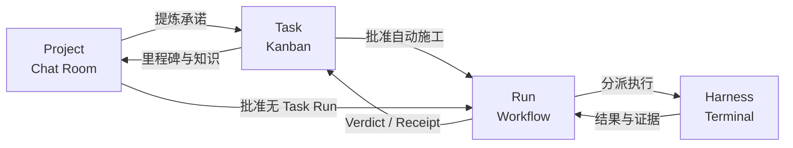
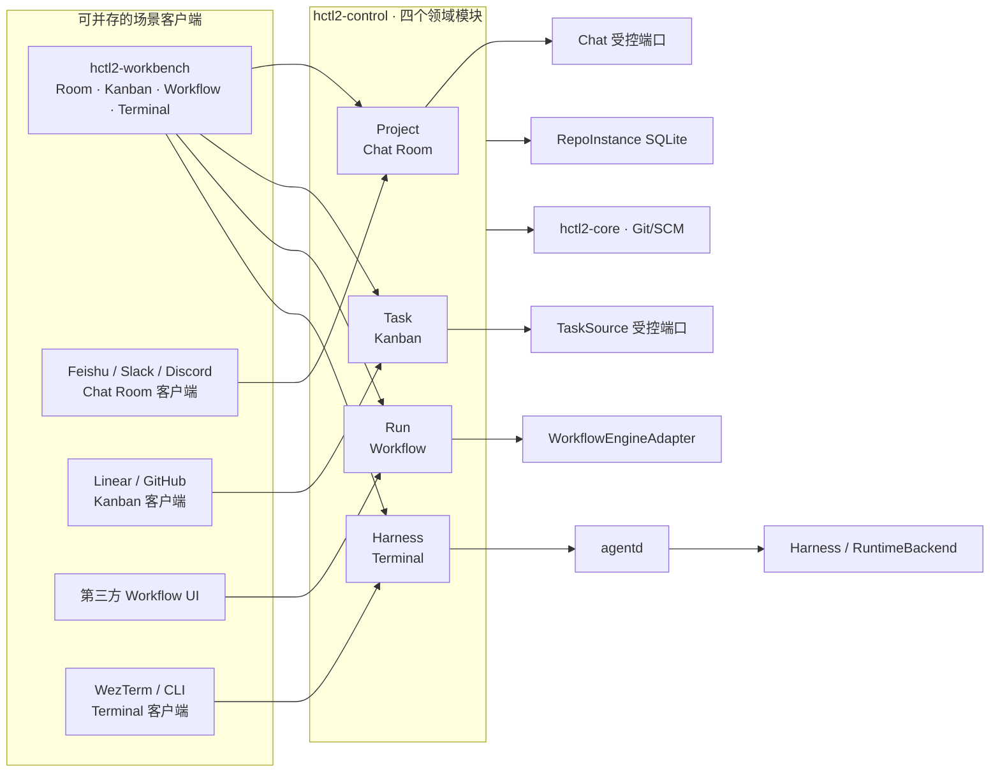

# HCTL2

HCTL2 是一个以 Git 仓库为边界、面向多种 Coding Harness 的本地项目协作系统。它把长期事实收敛为四个领域模块，并为每个模块提供一个主要操作场景：

| 领域模块 | 操作场景 | 回答的问题 |
| --- | --- | --- |
| Project | Chat Room | 我们要解决什么，依据是什么？ |
| Task | Kanban | 已承诺交付什么，现在进行到哪里？ |
| Run | Workflow | 哪些自动施工已获授权，凭什么继续或通过？ |
| Harness | Terminal | 哪个执行实例在哪里，怎样观察、恢复或接管？ |

> [!IMPORTANT]
> HCTL2 当前处于设计阶段。权威基线是 **草案 v0.8.0**；仓库里还没有可安装应用、CLI、构建脚本或测试套件。

## 为什么需要它

同时使用 Codex、Claude Code、OpenCode 等 Harness 时，终端标签页只能保存进程，不能稳定表达 Project 目标、Task 契约、Run 授权、评审证据和下一步动作。人会退化成多个 Agent 之间的消息总线，并被迫猜测“Agent 已完成”是否真的等于“Task 已完成”。

HCTL2 的基本判断是：

- Project、Task、Run 和 Harness 都有稳定身份，不能由聊天串、外部 Issue、工作流任务、worktree 或 pane 反向定义；
- Chat Room、Kanban、Workflow 和 Terminal 是操作场景，不是第二份领域事实；
- Workbench 是四个场景的集成客户端；适配后的第三方平台可以按场景替代或补充其中一个面板，也可以提供受控端口，但不会整体替代 Workbench 或领域模块；
- 所有适配器都使用同一命令、查询、事件和能力边界，没有隐藏写权限；
- Revision、Verdict、Receipt 和可核验证据高于进度、自述、屏幕状态和外部 Closed。

## 核心流程

简单 Task 可以不创建 Run；Project 也可以发起一次边界明确的 Harness 调用。它们是显式短路，不改变四个模块的事实所有权。

## 目标架构

Workbench 是组合式场景客户端；第三方客户端只替代或补充对应场景，例如 Feishu/Slack/Discord 操作 Chat Room，WezTerm 操作 Terminal/Harness。它们都使用相应模块的 Query/Preview/Submit/Subscribe，不获得跨模块捷径。

图右侧的受控端口提供底层能力，不等于场景客户端。同一平台可以兼任两者，但 client binding 与 authority binding 必须分开。`hctl2-control` 拥有领域命令与本地账本，`hctl2-core` 校验 Git/SCM 事实，agentd 拥有物理运行时观测，外部 Workflow Engine 只维护机械执行位置。

## 设计文档

权威设计由四个模块及三份支持文档组成；决策沿革与参考实现证据另行保留：

- [设计地图与文档纪律](./docs/design/README.md)
- [Project 与 Chat Room](./docs/design/project.md)
- [Task 与 Kanban](./docs/design/task.md)
- [Run 与 Workflow](./docs/design/run.md)
- [Harness 与 Terminal](./docs/design/harness.md)
- [四模块连接与端到端闭环](./docs/design/connections.md)
- [系统边界与适配器合同](./docs/design/system.md)
- [第一阶段、验证与自举](./docs/design/delivery.md)
- [从 HCTL 到 HCTL2 的来时路](./docs/design/references/decision-history.md)
- [非规范实现证据](./docs/design/references/implementation-evidence.md)

第一阶段面向单用户和 macOS/Linux。具体范围、技术栈、CLI、验证切片和未决问题统一记录在[交付文档](./docs/design/delivery.md)，不在各模块重复。

## 许可证

HCTL2 使用 [Apache License 2.0](./LICENSE) 发布。
