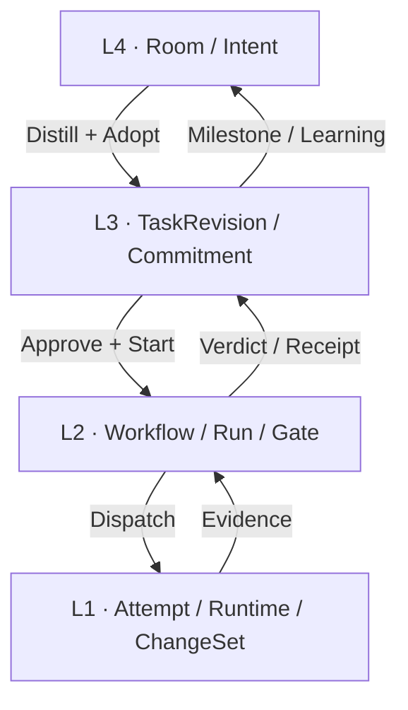
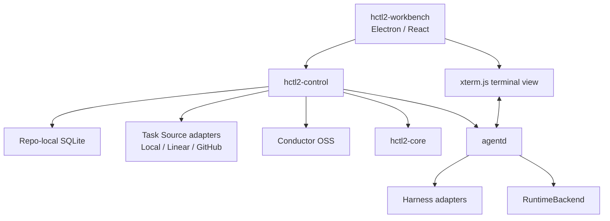

# HCTL2

HCTL2 是一个以 Git Repo 为边界、面向多 Coding Harness 的本地项目协作系统。它以 Project 组织目标、以 Task 追踪承诺、以 Room 承载协作，并以 Run 执行经过授权的自动化工作流。

> [!IMPORTANT]
> HCTL2 当前处于产品与系统设计阶段。仓库中的权威基线是 **Draft v0.7.0（2026-08-14）**；目前没有可安装的应用、可执行 CLI、构建脚本或测试套件。本文描述的是目标产品和计划中的架构，不代表这些能力已经实现。

## 为什么是 HCTL2

同时使用 Codex、Claude Code、OpenCode 等 Harness 时，多个终端标签页只能保存进程，无法稳定表达项目目标、任务版本、权限、评审证据和下一步动作。人往往还要在多个 Harness 之间复制上下文、转发结果并判断“Agent 已完成”是否真的等于“项目已完成”。

HCTL2 希望把这种工作方式变成一套可理解、可验证、可恢复的协作流程：

- 用户围绕稳定的 Repo 和 Project 工作，而不是围绕临时 session、tab、worktree 或 terminal 工作；
- 多个 Harness 默认在后台执行，只把需要论述、授权或接管的事项带回前台；
- 每次调用都能解释使用了哪些 Context、Skill、权限和版本；
- 进度只作提示，Revision、Verdict、Receipt 和可核验 evidence 才能推进正式状态；
- Workbench、工作流引擎、运行时或 Harness 重启后，项目仍然可以对账和恢复。

一句话概括：

> HCTL2 是把人主导的目标塑形与机器驱动的可验证施工连接起来的 Repo-local、多 Harness 项目协作系统。

## 核心模型

HCTL2 的精髓是四层项目开发生命周期：

| 层 | 产品面 | 主要参考 | 交给下一层的内容 |
| --- | --- | --- | --- |
| L4 · Intent & Collaboration | Project Room | First Tree | 目标、范围、acceptance proposal |
| L3 · Commitment & Tracking | Task / Kanban | Codeg；Linear/GitHub 外部状态 | frozen TaskRevision 与自动施工授权 |
| L2 · Governance & Orchestration | Workflow / Run / Gate | HCTL1 谱系；HCTL2 原生扩展；Conductor 机械后端 | Obligation / Seat / Attempt |
| L1 · Execution & Runtime | Worktree / Harness / Terminal / Diff | Stably Orca | result proposal、diff 与 evidence |



这不是把产品强行一一对应到四格。每个外部 effort 只在它探索最深、信息增益最高的层被引用：Codeg 虽有 terminal，但最强项是独立 Task/review lifecycle；Stably Orca 虽有 board/orchestration 实验，但最强项是 worktree、PTY、terminal restore 与 runtime ownership。完整对象含义仍是 **Project-scoped、Room-mediated shaping、Task-tracked、Run-executed**；worktree、session、PTY 和 terminal 都只是可替换执行资源。

## 目标使用流程

1. 用户进入 Repo Room，引用代码、Artifact、Commit 或 Memo，邀请一个或多个 Participant 做探索。
2. 话题成型后，将相关上下文和来源提升为一个具名 Project。
3. 用户在 Project Room 中塑形目标、范围和验收标准，并在 Task Kanban 中追踪工作。
4. 简单工作可以由人完成，或通过一次有边界的 Room Invocation 完成，无需创建 Run。
5. 需要持久编排时，用户确认 Task Revision、Workflow Revision 和 Run Manifest，再显式启动 Run。
6. Run 默认 headless 推进；需要澄清、决定或授权时，统一创建 Request 并投影回 Project。
7. 只有诊断或接管精确 Attempt 时，用户才进入结构化执行投影或 terminal attach。

Semantic Composer 计划使用结构化引用，而不是把路由埋在自由文本中：

| 语法 | 作用 | 示例 |
| --- | --- | --- |
| `@` | Participant 或 Project Role | `@codex`、`@role:security-reviewer` |
| `/` | Typed action 或协作 Recipe | `/compare`、`/cross-review`、`/memo` |
| `$` | Expertise 或 Skill overlay | `$architecture-review` |
| `#` | 文件、消息、Artifact、Commit 等输入引用 | `#file:src/auth.rs` |

## 目标架构



| 组件 | 计划职责 |
| --- | --- |
| `hctl2-workbench` | Project Room、Overview、Task Kanban、Run View、Inspector 和终端 UI；只负责命令入口与投影 |
| `hctl2-control` | 领域协调、确定性路由、Context、Task/Run 绑定、候选选择、投票、副作用和对账 |
| `hctl2-core` | Git/SCM、Revision、Receipt、Verdict、fencing 和 merge policy |
| `agentd` | Harness 发现与接入、进程、PTY、Attempt、RuntimeBackend 和 terminal gateway |
| Conductor OSS | 被动维护 Workflow token、task、timer、retry 和 history |
| Repo-local SQLite | Room、Task、Request、Context、Run 映射、外部快照和 control journal |
| Git | 共享配置、Project/Workflow 产物、Memo、代码和正式交付物 |

Workbench 不是事实源。只有 `hctl2-control` 可以领取、完成、失败或 signal HCTL 的 Conductor external task；任何内外部 Workflow View 都是只读投影。

## 关键设计原则

- **Project/Room-first**：稳定的协作身份高于 Harness session 和 terminal identity。
- **Chat 不是数据库**：消息可以产生 Proposal，正式状态只能由带权限、版本和证据校验的 typed command 改变。
- **Headless by default**：正常执行看状态、diff、trace 和 Request；terminal 是诊断与接管路径。
- **Evidence over progress**：Harness 的自述和进度不能替代 acceptance、Receipt 或 Git/SCM 验证。
- **确定性路由**：`@participant` 和 `@role` 在调用前解析为稳定身份与授权候选，不交给另一个模型猜测。
- **可复现 Context**：每次调用冻结 Context Manifest、Skill digest、Capability Bundle 和来源。
- **At-least-once correctness**：跨组件副作用使用 idempotency、inbox/outbox、fencing 和 reconciliation。
- **外部事实按字段授权**：Linear/GitHub 可以拥有配置字段的权威状态，但不能接管 HCTL 的 Task identity、acceptance、Run binding 或 semantic completion。

## Phase 1 目标

Phase 1 面向单用户和 macOS/Linux，架构上保留 Windows 原生移植路径。计划交付的关键能力包括：

- Repo Room、Project Room、Scoped Room、Project Overview 和 Task Kanban；
- Tiptap Semantic Composer，以及可独立 stream、cancel、retry 的多 Harness Room Invocation；
- Codex、Claude Code、OpenCode 的发现、能力快照和结构化协议/PTY 降级接入；
- Local Task Source，以及至少一个通过完整读写验收的 Linear 或 GitHub external-authoritative adapter；
- Conductor Workflow 的程序化生成、校验、注册和执行；
- Obligation、Seat、Attempt、候选 fallback、2-of-3 review、reject/rework/regate；
- Git/worktree/Receipt/merge 验证和 crash/restart reconciliation；
- 一个经 contract 验证后选定的 RuntimeBackend、内嵌 xterm.js，以及可选的 WezTerm 外部打开路径。

Phase 1 明确不包含多人组织/RBAC、Windows release、多 host、浏览器/移动客户端、云 relay、通用 Workflow 可视化编辑器、Conductor HA，或同时交付 Linear/GitHub 两套完整双向适配器。

## 计划中的技术栈

| 层 | 选择 |
| --- | --- |
| Backend / control / agentd | Rust |
| Desktop | Electron + Vite + TypeScript + React 19 |
| Styling / shell | Tailwind CSS 4 + shadcn/ui（Base UI flavor） |
| Room timeline | HCTL Room Projector + `virtua`；assistant-ui 仅渲染 scoped message parts |
| Composer | Tiptap / ProseMirror |
| Task Kanban | React Aria Components |
| Run graph | React Flow + Dagre |
| Embedded terminal | `@xterm/xterm` |
| Persistence | SQLite + FTS5、Git |
| Workflow engine | Conductor OSS（经 adapter 接入） |
| Runtime backend | Zellij 与 tmux 通过同一 contract 验证后择一；当前设计基线倾向 Zellij |

技术选型仍受 contract test 约束；若实现不能维持 HCTL 的 identity、authority、revision、evidence 和 recovery 边界，应更换实现，而不是削弱这些边界。

## 当前仓库

```text
.
├── README.md                   # 项目入口与设计概览
├── DESIGN_DOC.md               # 兼容入口与旧章节迁移表
├── docs/design/                # Draft v0.7.0 权威模块化设计规范
│   ├── README.md               # 四层模型与阅读地图
│   ├── layers/                 # L4 / L3 / L2 / L1 主轴
│   ├── cross-layer/            # 生命周期、架构、Workbench
│   ├── delivery/               # Phase 1、自举、验证
│   └── references/             # 术语、不变量、精选 evidence
└── LICENSE                     # Apache License 2.0
```

当前没有安装、构建、运行或测试命令。开始了解项目时，请先阅读：

- [产品与系统设计规范](./docs/design/README.md)
- [四层跨层生命周期](./docs/design/cross-layer/lifecycle.md)
- [Phase 1 与分级 Dogfooding](./docs/design/delivery/phase-1-and-dogfooding.md)
- [ADR 与验证清单](./docs/design/delivery/validation.md)
- [规范性不变量](./docs/design/references/invariants.md)
- [实现证据与精选参考组合](./docs/design/references/implementation-evidence.md)

## 实现路线

项目计划按自举能力逐级推进：

| 阶段 | 目标 |
| --- | --- |
| B0 | 建立 domain ID、SQLite migration、command/query/event seam 和最小 supervisor |
| B1 | 用最薄 Workbench、Project Room 和 Local Task 进行 shadow dogfood |
| B2 | 从 Project Room 发起单 Harness Invocation，在隔离 worktree 中完成真实代码和测试；这是第一次真正自举 |
| B3 | 接管自身 backlog、并发 Invocation、Request、Receipt、merge 与冷启动恢复 |
| B4 | 引入 Conductor、正式 Run、Seat、独立 gate、reject/rework/regate |
| B5 | 加入候选 fallback、2-of-3 quorum、late-result fence 和完整恢复；这是 Phase 1 的自举成熟度目标 |
| B6 | 由稳定版本构建、验证、升级和回滚隔离环境中的下一版本 |

开工前仍有三项限时验证：Conductor 的本地分发形态、Zellij/tmux 的 RuntimeBackend 选择，以及首个完整 external-authoritative Task Source 选择。

## 参与设计与实现

当前贡献应以设计规范中的领域含义和事实边界为准。尤其需要遵守：

- 不使用外部产品的 Session、Conversation、Project、Task 或 Run 反向定义 HCTL2 的公共模型；
- 不让 UI、terminal、Task provider、Harness 或 donor 数据库成为第二份可写事实源；
- 外部源码复用必须固定来源版本，核验并保留许可证、版权、归属和修改记录；
- 新组件先通过相应 contract、集成和故障注入测试，再进入主实现；
- 尚未定案的问题应通过 ADR 收口，记录适用边界和替换条件。

详细的未决事项见[验证、ADR 与未决事项](./docs/design/delivery/validation.md#未闭合问题)。

## License

HCTL2 使用 [Apache License 2.0](./LICENSE) 发布。
