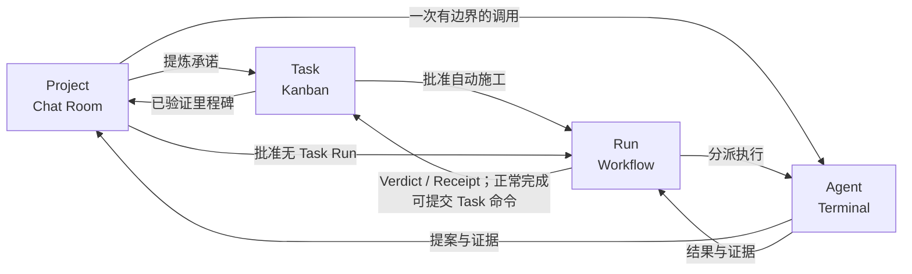
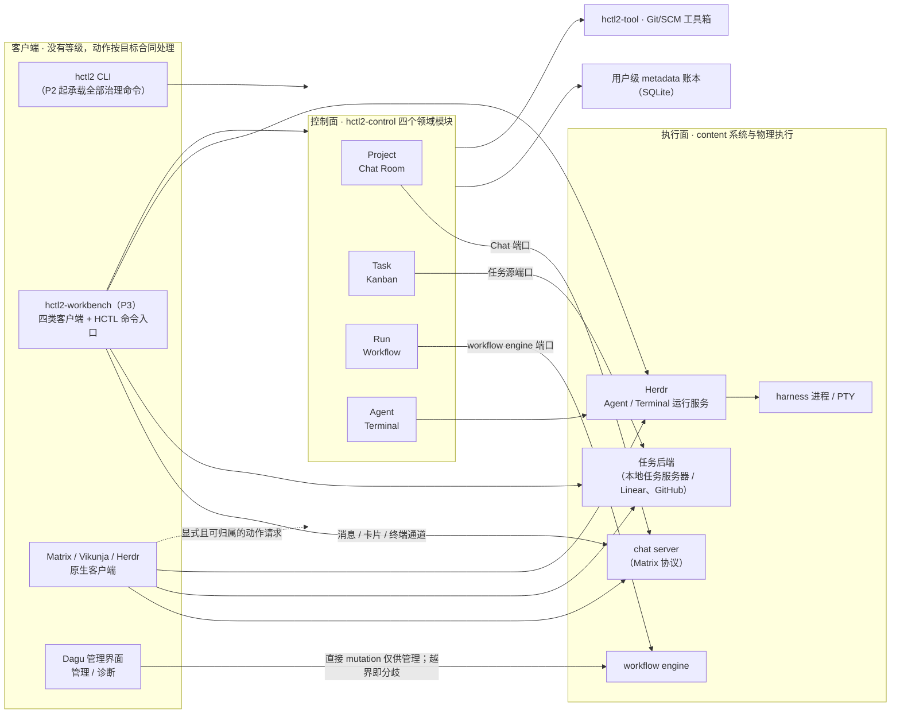

# HCTL2

HCTL2 是把**人主导的目标塑形**与**机器驱动的可验证施工**连接起来的项目协作系统。它的交付物与承诺以 Git 仓库为边界，协作与治理随用户走，默认部署在本地；面向同时使用多个 Coding Harness（Codex、Claude Code、OpenCode 这类编码代理工具，下称 Harness）的开发者。

产品姿态一句话：

> 目标以 **Project** 为界，塑形在 **Room** 中发生，承诺由 **Task** 追踪，施工交给 **Run** 治理。<br>
> （Project-scoped · Room-mediated shaping · Task-tracked · Run-executed）

> [!IMPORTANT]
> HCTL2 已进入早期实现，权威设计基线是 **草案 v0.15.0**。`src/` 现有 Rust 工作区与
> Linux x86_64、macOS arm64/x86_64 分目标依赖打包代码；macOS arm64 已通过原生整包生命周期验证，
> 但还没有可用的公共 CLI 或完整应用。

当前已有命令、离线安装包和四个依赖的具体操作方法见[HCTL2 使用说明](./docs/usage.md)。

## 为什么需要它

软件开发正在从“一个人操作一个 IDE 或终端”转向“一个人同时管理多个能力、上下文和权限各不相同的 Harness”。现有工具往往把某个局部做得很好——聊天与上下文、异步任务、worktree（Git 工作树）与终端、通用工作流引擎——但它们没有共同回答项目生命周期里的四个问题：

1. 我们真正要解决什么，讨论依据是什么？
2. 哪些内容已经成为可排期、可验收的承诺？
3. 哪些自动施工已获授权，凭什么可以继续或通过评审？
4. 哪个执行实例正在哪里运行，如何观察、恢复或接管？

缺了这组回答，就会反复出现五种失败：

- **多 Harness 被压缩成多个终端。** 终端复用器能保住进程，却说不清参与者的角色、任务契约、审批证据和下一步动作；标签页和 worktree 的名字扛不起长期的项目身份。
- **人退化成消息总线。** 在作者、评审者、测试者之间复制上下文，盯着一个完成再转发给下一个——这是高出错的机械劳动，不是人的意图与判断优势。
- **“Harness 说完成了”被当成“项目完成了”。** Harness 跑完一轮、进程退出、代码提交、评审通过、CI 绿了、外部 Issue 关了、任务验收通过，是七件不同的事实；混为一谈，就会在版本变化、重试、迟到结果和外部同步失败时丢掉正确性。
- **上下文无来源、无版本、不可复现。** 把整段聊天或某个模型的自由总结丢给下一个执行者，事后无法回答它当时看到了什么、漏了什么，也无法在故障切换后重现同一份交付义务。
- **界面、领域与运行时互相污染。** 如果 Room（协作聊天室）、Project、Task 直接等同于会话、进程或 worktree，那么纯讨论、多次施工、权限隔离、重试和崩溃恢复都会破坏这层映射。

## 四个阶段与四个模块

HCTL2 的心智模型是一条从意图到运行的链，四个领域模块各自拥有其中一段的事实：

```text
意图 Intent      ──提炼──▶  承诺 Commitment  ──授权──▶  治理 Governance  ──分派──▶  运行 Runtime
Project · Chat Room        Task · Kanban              Run · Workflow             Agent · Terminal
```

结果沿相反方向回流：运行层交出提案与证据；治理层校验后形成 Verdict（裁决）与 Receipt（凭证）；承诺层据此独立验收；意图层沉淀里程碑与长期经验。

这条链是心智模型，不是流水线：**一件事不必完整经历四个阶段。** 简单 Task 可以不创建 Run；Project 可以通过 Agent 模块发起一次边界明确的 Harness 调用；纯研究或文档的 Project 可以从未施工。四个模块是语义分责，不是界面菜单；部署由正交的[三面架构](./docs/design/architecture.md)回答。从 Project 到 Agent，越靠前越接近人的意图，越靠后越是可替换的执行资源。

| 领域模块 | 操作场景 | 回答的问题 |
| --- | --- | --- |
| Project | Chat Room | 我们要解决什么，依据是什么？哪些讨论已经足够稳定，可以成为承诺？ |
| Task | Kanban | 已承诺交付什么，现在进行到哪里？ |
| Run | Workflow | 哪些自动施工已获授权，凭什么继续或通过？ |
| Agent | Terminal | 哪个执行实例在哪里，怎样观察、恢复或接管？ |



图中的短路边（Project 直达 Run 或 Agent）是显式设计，不是例外；它们不改变四个模块的事实所有权。

## 目标体验

理想的完整旅程是：

1. 用户进入 Repo Room，引用代码、Artifact（登记过的交付物）、Commit 或 Memo（沉淀的备忘），邀请多个 Participant（参与者）做有边界的研究。
2. 话题成型后，把相关来源和上下文提升为一个具名 Project。
3. 在 Project Room 中塑形目标、范围和验收标准，把承诺提炼成 Task Revision（任务契约版本）。
4. 简单工作由人完成，或通过一次有边界的 Room Invocation（从聊天室发起的单次调用）完成；它不需要 Run。
5. 需要持久自动施工时，先批准 Workflow（施工图），再显式启动 Run，授予有边界的自主权。
6. Run 默认在后台无界面推进；需要澄清、决定或授权时，系统创建 Request（请求卡）并投影回 Project。
7. 只有需要观察或接管某次精确执行时，用户才打开结构化执行投影或终端。
8. 执行结果与证据逐层回流；只有通过版本、规则、验收和 Receipt 校验，Task 才算语义完成。

无论走到哪一步，用户都应该随时能回答六个问题：

- Project 要交付什么；
- 哪些 Task 正在进行、待评审或被阻塞；
- 哪个 Run 在等待，为什么；
- 当前需要谁提供什么；
- 哪个 Harness 带着哪份上下文和权限在执行；
- 结论绑定哪个版本与哪些证据。

## 设计基线

- Project、Task、Run 和 Agent 模块的对象都有稳定身份，不能由聊天串、外部 Issue、工作流任务、worktree 或终端面板反向定义；
- Chat Room、Kanban、Workflow 和 Terminal 是操作场景，不是第二份领域事实；
- Workbench 是把四个场景客户端和 HCTL 命令入口组合在一起的产品外壳，不是特殊内核；Workbench、CLI 与第三方原生客户端没有等级或隐藏权限，同一动作无论从哪里发起都走同一份合同；
- 客户端名称不决定动作含义：消息和卡片操作写入对应 content 系统，类型化命令请求进入 control，终端输入进入精确运行时，无法满足先记账再执行顺序的 provider 管理动作只作管理/诊断并在越界时标记分歧；
- 所有适配器都使用同一命令、查询、事件和能力边界，没有隐藏写权限；
- Revision、Verdict、Receipt 和可核验证据高于进度、自述、屏幕状态和外部已关闭；
- 模型只能建议结果与下一位协作者。Task 完成只接受有权人类命令，或绑定该 Task 的 Run 正常完成后的确定性归约命令；Task 已取消只接受有权人类命令。普通 Room 的临场执行边只由人类创建，Workflow 的归约器只能实例化冻结图中的边。

## 目标架构



部署视角上，系统分三个面：展示面（Workbench、CLI 与 provider 原生客户端；客户端没有等级）、控制面（`hctl2-control`/`hctl2-tool` 与治理账本）、执行面（各场景的 content 系统，Agent / Terminal 由 Herdr 负责运行），详见[三面架构](./docs/design/architecture.md)。

Workbench 可以理解为把四类场景客户端和 HCTL 命令入口装进同一个桌面的组合客户端；它不会因为“集成”就获得更高权限。发送 Matrix 消息时，它与任意 Matrix 客户端一样写聊天 content；整理任务卡时，它与 Vikunja 原生界面一样写看板 content；向精确 Herdr 终端输入时，它与 Herdr TUI 一样是在推动运行时；预览或提交 HCTL 命令时，它与 CLI 使用同一套 Query/Preview/Submit/Subscribe。Workbench 关闭或没有安装，都不妨碍 control、CLI 和原生客户端继续工作。

动作是否可用取决于模块合同和 provider 的实际能力，而不是客户端名称。Vikunja 中明确把已绑定卡片移入 Done 可以在保留操作者、版本和幂等依据时转成同一个「完成 Task」请求，但仍由 Task 独立验收；普通 Matrix 消息仍只是消息，只有显式且已配置的结构化动作才可转成命令请求；Herdr 原生输入是有效的运行时输入，但 v0.8.2 不能证明它经过 HCTL 输入租约；Dagu 的 Start/Stop/Retry 等界面动作会先改变引擎，无法满足 HCTL 先持久化、撤权再执行的顺序，因此只用于管理/诊断，直接改动已绑定执行时标记分歧。详细分类见[系统边界](./docs/design/spec/system.md#客户端动作与-provider-事件)。HCTL2 自建 Workbench，是为了提供跨 Repo/Project/Room/Task/Run 的统一导航、联合投影和公共命令入口，不是重写 provider，也不是另造一套权限体系。

受控端口（图中控制面到执行面的连线）提供底层能力，不等于场景客户端。同一平台可以兼任两者，但 client binding 与 authority binding 必须分开。`hctl2-control` 拥有领域命令与用户级 metadata 账本，`hctl2-tool` 校验 Git/SCM 事实与现场保全，Herdr 直接持有 Harness 进程、PTY 和终端会话，外部 Workflow Engine 只维护机械执行位置。HCTL 通过 Herdr 适配代码传入已获准参数并记录结果，不另外实现一套终端会话服务。即使把全部界面、聊天平台、Task 来源、工作流引擎和终端客户端都换掉，这套身份、权限、版本证据与恢复规则也必须原样保留——项目不随工具更换而丢失。

第一阶段的 Tuwunel、Vikunja、Dagu、Herdr 都通过各模块自己的受控端口接入，Workbench 不依赖它们的私有对象模型。未来 GitHub/Linear 通过 task backend adapter 接入，官方远程 Agent 通过 Agency adapter 接入；飞书、Slack、Discord 的聊天互通则由 Matrix homeserver/bridge 生态负责，不由 HCTL 逐个平台适配。具体替换边界见[三面架构](./docs/design/architecture.md#避免供应商锁定)。

## 设计文档

设计文档分两层：设计层用产品语言回答为什么与怎么用；合同层（`docs/design/spec/`）承载精确的对象、状态机与写入合同，两层冲突时以合同层为准。建议先看愿景，再看设计地图和四个模块的设计正文，需要精确定义时下钻合同层。

- [愿景与设计原则](./docs/design/vision.md)
- [设计地图与文档纪律](./docs/design/README.md)
- [三面架构](./docs/design/architecture.md)
- [Project 与 Chat Room](./docs/design/project.md)
- [Task 与 Kanban](./docs/design/task.md)
- [Run 与 Workflow](./docs/design/run.md)
- [Agent 与 Terminal](./docs/design/agent.md)
- [Participant 与数字参与者](./docs/design/participant.md)（横切设计正文）
- [Context 与可解释上下文](./docs/design/context.md)（横切设计正文）
- [第一阶段、验证与自举](./docs/design/delivery.md)
- [合同层总则](./docs/design/spec/README.md)（词汇分类、六族规则、归并对照）
- [四模块的端到端连接](./docs/design/spec/connections.md)
- [系统边界与适配器合同](./docs/design/spec/system.md)
- [术语对照表](./docs/design/references/glossary.md)
- [从 HCTL 到 HCTL2 的来时路](./docs/design/references/decision-history.md)
- [非规范实现证据](./docs/research/README.md)

第一阶段面向单用户和 macOS/Linux。具体范围、技术栈、CLI、验证切片和未决问题统一记录在[交付文档](./docs/design/delivery.md)，不在各模块重复。

## 许可证

HCTL2 使用 [Apache License 2.0](./LICENSE) 发布。
