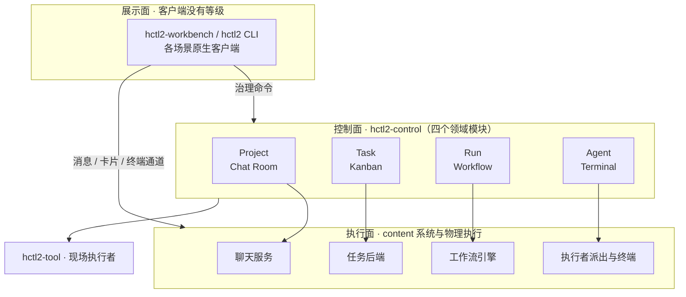

# HCTL2

HCTL2 是把**人主导的目标塑形**与**机器驱动的可验证施工**连接起来的项目协作系统。它的交付物与承诺以 Git 仓库为边界，协作与治理随用户走，默认部署在本地；面向同时使用多个 Coding Harness（Codex、Claude Code、OpenCode 这类编码代理工具，下称 Harness）的开发者。

产品姿态一句话：

> 目标以 **Project** 为界，塑形在 **Room** 中发生，承诺由 **Task** 追踪，施工交给 **Run** 治理。 
> （Project-scoped · Room-mediated shaping · Task-tracked · Run-executed）

> [!IMPORTANT]
> HCTL2 已进入早期实现，权威设计基线是 **草案 v0.15.6**。`src/` 现有 Rust 工作区与
> Linux x86_64、macOS arm64/x86_64 分目标依赖打包代码；三个目标均已通过原生整包生命周期验证，
> 但还没有可用的公共 CLI 或完整应用。

当前已有命令、离线安装包和四类打包依赖的具体操作方法见[HCTL2 使用说明](./docs/usage.md)。

## 为什么需要它

聊天、任务、工作流和终端工具各自解决了项目协作的一部分，却没有共同覆盖从目标塑形到运行观察的完整过程。完整的问题与失败模式见[为什么需要 HCTL2](./docs/design/vision.md#为什么需要-hctl2)；四个模块的分工、六个持续可回答的问题、目标体验与取舍原则分别见[四个阶段的心智模型](./docs/design/vision.md#四个阶段的心智模型)、[目标体验](./docs/design/vision.md#目标体验)和[设计原则](./docs/design/vision.md#设计原则)。

## 目标架构

图中的 Chat Room、Kanban、Workflow 和 Terminal 是四个模块对应的场景。Workbench、CLI 与 provider（供应端）原生客户端没有等级；动作按它落在哪个模块、带什么信封处理，分类规则见[系统约束](./docs/design/spec/system.md#客户端动作与-provider-事件)。

图里带 `hctl2-` 前缀的是本仓库交付的第一方组件；执行面的四类系统由外部供应端承担，第一阶段选了谁、到什么阶段见[交付文档](./docs/design/delivery.md#实现阶段)。三面职责、场景与系统、供应商替换边界见[三面架构](./docs/design/architecture.md)；组件职责与账本的精确划分见[系统边界的组件表](./docs/design/spec/system.md#组件)。

## 阅读入口

- **新读者**：本页 → [愿景](./docs/design/vision.md) → [设计地图](./docs/design/README.md) → [三面架构](./docs/design/architecture.md)。
  - 四份模块正文：[Project](./docs/design/project.md)、[Task](./docs/design/task.md)、[Run](./docs/design/run.md)、[Agent](./docs/design/agent.md)。
  - 两份横切正文：[Participant](./docs/design/participant.md)、[Context](./docs/design/context.md)。
  - 最后看交付文档的[第一阶段范围](./docs/design/delivery.md#第一阶段范围)与[实现阶段](./docs/design/delivery.md#实现阶段)。
- **实现者**：从[约束层总则](./docs/design/spec/README.md)进入[系统边界](./docs/design/spec/system.md)、[连接约束](./docs/design/spec/connections.md)和对应的四份[模块约束](./docs/design/spec/README.md#文件)，再看[契约测试矩阵](./docs/design/contract-tests.md)。
  - 实现顺序与验收切片见交付文档的[实现阶段](./docs/design/delivery.md#实现阶段)、[纵向切片 A](./docs/design/delivery.md#纵向切片-a无-run-自举)、[纵向切片 B](./docs/design/delivery.md#纵向切片-b完整治理)、[Kanban content 后端切片](./docs/design/delivery.md#kanban-content-后端切片)和[自举阶段](./docs/design/delivery.md#自举阶段)。
  - 依赖版本与资源占用见[调研索引](./docs/research/README.md)。
- **provider adapter（供应端适配器）开发者**：先看三面架构的[场景与系统](./docs/design/architecture.md#场景与系统)和[避免供应商锁定](./docs/design/architecture.md#避免供应商锁定)。
  - 再看系统边界的[固定内核与受控端口](./docs/design/spec/system.md#固定内核与受控端口)、[客户端动作与 provider 事件](./docs/design/spec/system.md#客户端动作与-provider-事件)和[外部权威副作用](./docs/design/spec/system.md#外部权威副作用)。
  - 随后进入对应的[模块约束](./docs/design/spec/README.md#文件)，用[契约测试矩阵](./docs/design/contract-tests.md)、交付文档的[选型判据](./docs/design/delivery.md#选型判据)与[开工前限时验证](./docs/design/delivery.md#开工前限时验证)核对行为，最后查对应的[调研证据](./docs/research/README.md)。

## 许可证

HCTL2 使用 [Apache License 2.0](./LICENSE) 发布。
