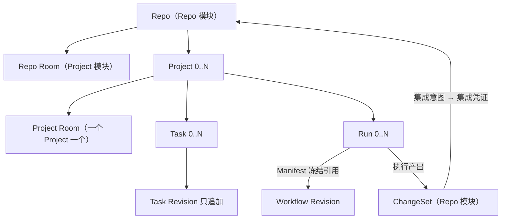

# HCTL2 设计地图

> 状态：规范性索引 · 草案 v0.18.4 
> 日期：2026-08-31

HCTL2 只有五个领域模块：Project、Task、Run、Participant（参与者）与 Repo（仓库）。每个模块拥有稳定身份、状态、命令和不变量；与它对应的场景只提供查询、预览、操作和事件投影。

| 权威模块 | 对应场景 | content 系统 | 模块拥有 | 场景客户端 / 受控端口示例 |
| --- | --- | --- | --- | --- |
| [Project](./project.md) | Room（聊天室） | chat server（聊天服务器） | 目标与范围、协作现场的身份与升格记录、参与者、上下文、请求、备忘与工件 | Workbench Room / 外部 Chat 端口 |
| [Task](./task.md) | Kanban（看板） | 任务源（平台自带的 issues、本地任务服务器或远端平台，零到多个） | 承诺与验收契约、来源映射与字段权威、操作态投影、完成证明 | Workbench Board / 平台 issues、Linear 任务源端口 |
| [Run](./run.md) | Workflow（施工图） | workflow engine（工作流引擎） | 施工图与批准、授权执行、交付义务与席位、评审关卡、裁决与凭证 | Workbench Run 图 / workflow engine 端口 |
| [Participant](./participant.md) | Terminal | Agency（派出方）；默认为本地参考实现 | 参与者身份与人设、Skill（技能包）申报、执行者配置、经 Agency 的派工与观测、终端票据、结果与证据 | Workbench Terminal、CLI（经 Agency 端口）；harness 与运行时在 Agency 门后 |
| [Repo](./repo.md) | Change（变更） | SCM platform（代码协作平台，按仓库绑定：外部平台，或随包的本地平台）；`hctl2-tool` 是每个仓库都有的本地执行者 | 仓库身份与注册、变更集与不可变快照、写入租约、集成意图与凭证、变更与平台的映射 | 平台原生页面与命令行 / HCTL 平台端口、`hctl2-tool` |

每场景三类数据的完整归属、系统角色与丢失恢复见[三面架构](./architecture.md)；什么能独立装、互相怎么连见它的[单元与连接](./architecture.md#单元与连接)。场景与模块是一一对应的主视角，不是强制的调用链。Task 可以没有 Run；Project 可以发起一次 Harness 调用；Kanban 可以显示 Run 和 Artifact（工件）投影。跨模块引用不转移事实所有权。

前四个模块对应[愿景文档](./vision.md)中“意图 → 承诺 → 治理 → 运行”的四个阶段，Repo 模块拥有这条链落地的地方——仓库、变更与合入；这是语义分责，不是界面菜单；职责分层由[三面架构](./architecture.md)回答（展示面、控制面、执行面），什么能独立装、互相怎么连由它的[单元与连接](./architecture.md#单元与连接)一节回答。从 Project 到 Participant，越靠前越接近人的意图，越靠后它的执行面越是可替换的资源。第一次阅读建议先看[愿景与设计原则](./vision.md)，再回到本页和五个模块的设计正文。文档分两层：设计层（本目录）用产品语言回答为什么与怎么用；[约束层](./spec/README.md)承载精确的对象、状态机、写入约束与外部概念对齐，两层冲突时以约束层为准。

五个模块各替协作固定了一套规矩，把不需要智能的工作从模型的推理循环里移出去。这张表也是审新功能的尺子：一个新功能要说清它把哪一行的哪项劳动移出去了，或者它多叫的那一轮模型带来了什么新信息。

| 模块 | 系统承载的协作制度 | 省掉的模型劳动 | 仍值得叫模型的部分 |
| --- | --- | --- | --- |
| Project | 目标、已决事项、来源，正式承诺与讨论的区别，上下文装配规则 | 每次重读整段聊天、复述共识、猜哪些话算决定 | 澄清目标、比较方案、发现没解决的矛盾 |
| Task | 契约、状态投影、阻塞条件、完成证据 | 反复问进度、读聊天猜完成、重复整理机械状态 | 判断新需求的影响、提出优先级与范围建议 |
| Run | 获准的施工图、前置、派工、超时、返工、计票与停止规则 | 不断决定轮到谁、还等不等、要不要催 | 解决执行中的新问题、理解失败原因、建议改计划 |
| Participant | 工种与执行配置记录、席位职责、权限、精确派工与输入通道 | 每次协商谁负责什么、重复介绍角色、靠对话转发输入和结果 | 专业求解、独立核验、用不同方法取新证据 |
| Repo | Git 事实、写入租约、版本、检查状态、发布与集成回读 | 盯评审请求状态、口头报告是否合并、凭散文判断检查对应哪个版本 | 理解改动、修代码、分析复杂冲突与设计问题 |

## 对象关系

Run 内部如何把工作分成交付义务、席位与尝试（引擎重试创建新义务且不增加票数、换执行配置不换裁判、掉线不丢身份），见 [Run 设计正文](./run.md)；这属于一次施工内部的防线，不属于管辖骨架。

Room 与 Run 可以互相引用，但不存在包含关系：Project Room 可以展示多个 Run；Scoped Room 可以由某个 Run 的 Request 派生；Room 不拥有 Workflow token 或运行时，Run 也不需要自己的 Room。

## 场景客户端与受控端口

Workbench、CLI 与适配后的第三方 UI 调用 HCTL 时使用四类公共操作：

1. 查询当前投影；
2. 预览类型化命令及前置条件；
3. 提交类型化命令；
4. 订阅带序号的领域事件或重同步快照。

Workbench 把五个场景客户端和 HCTL 命令入口组合成一个产品桌面，但没有额外权限：操作 content 或精确运行时时与原生客户端同路，提交 HCTL 命令时与 CLI 同路。动作的目标和信封决定语义；分类与接纳规则只在[系统约束](./spec/system.md#客户端动作与-provider-事件)定义。

五个场景选定的外部实现都经各模块自己的受控端口和版本化绑定接入；具体选型见[交付文档](./delivery.md#选型判据)，替换边界与聊天桥接职责见[三面架构](./architecture.md#避免供应商锁定)。Workbench 就位前，公共 `hctl2` CLI 承载 HCTL 命令，各 provider（供应端）原生界面处理消息、卡片和终端输入；具体阶段见[交付文档](./delivery.md#实现阶段)。

## 共同规则

- 稳定对象使用稳定 ID；内容变化产生不可变的新版本，界面只读取当前指针或操作投影。
- 治理事实只由类型化命令或模块确定性归约产生；命令携带提交者来源、目标、预期版本、权限范围和幂等键。
- 供应端事件按各模块定义的分类规则处理，权限来自目标、操作者映射、版本和幂等依据，而非界面名称。
- Task 的完成请求只来自有权的人，或绑定契约的 Run 正常完成后由归约器提交；所有来源经过同一验收，精确定义见 [Task 约束](./spec/task.md#写入约束)。
- 普通 Room 的临场执行边由人提交；模型 Participant 只建议下一位协作者，预授权自动边由确定性规则按冻结施工图创建。
- 运行中的绑定被冻结；能力、权限、候选或验收条件变化时创建新版本或替代执行。
- Workbench 的存活不改变领域事实；缺少等价适配能力时安全暂停。
- 本控制面的集成凭证只经持久意图、执行与回读产生；源版本由持凭据单元按授权交付，不因此取得合入目标权限，精确规则见 [Repo 约束](./spec/repo.md#集成目标两个头与两种授权形态)。
- 控制面存储保持一个逻辑写入者，工作副本按冲突范围隔离写入；Agency 为每个配对的控制面提供隔离租户，精确规则见[系统边界](./spec/system.md#单写者)。

以上是概括；精确措辞以[连接约束](./spec/connections.md)与[系统边界](./spec/system.md)为准。

五模块之间“交什么、谁准入、怎样恢复”只在[连接约束](./spec/connections.md)定义一次；CAS、outbox、单写者和适配器恢复等通用机制只在[系统边界](./spec/system.md)定义一次。模块文档不再各写一套副本。

## 支持文档

- [愿景与设计原则](./vision.md)：一句话定位、失败模式、四阶段心智模型、目标体验与设计原则。
- [三面架构](./architecture.md)：展示/控制/执行三面、场景与系统、5×3 归属矩阵、模块交接、数据丢失与恢复。
- [可解释的 Context（上下文）](./context.md)：唯一的横切设计正文——每次执行看到了什么、冻结与传承、成本纪律；对象归属不变。
- [约束层总则](./spec/README.md)：词汇分类法、六族规则、命名门槛、词汇索引与外部对齐原则。
- [系统边界与适配器约束](./spec/system.md)：组件、事实源、命令、单写者与恢复。
- [五模块的端到端连接](./spec/connections.md)：类型化交接、事务边界、版本链和跨模块恢复。
- [交付、验证与自举](./delivery.md)：交付范围、CLI、纵向切片、自举、选型验证和未决项。
- [契约测试矩阵](./contract-tests.md)：CT 各族与产品验收用例。
- [参考用例 S1](./scenarios/S1-multi-unit.md)：多单元用例的正式落点——拓扑、步骤、必然情形、不变量与变体，引用既有 CT 用例，不新增族。
- [文档纪律](./doc-discipline.md)：谁定义什么、去重、引入门槛、修订与审计规则——面向写文档的人的协议；文风与结构见根目录[写作指南](../../WRITING-GUIDE.md)。
- [术语对照表](./references/glossary.md)：中英对照与一句话含义；语义以模块文档为准。
- [从 HCTL 到 HCTL2 的来时路](./references/decision-history.md)：关键决策转折的非规范说明；它不形成第二套约束。

发生冲突时的裁决顺序见[文档纪律](./doc-discipline.md)。
