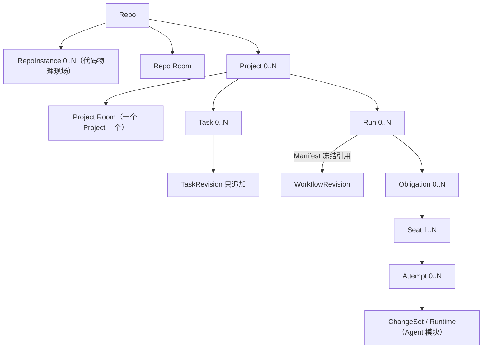

# HCTL2 设计地图

> 状态：规范性索引 · 草案 v0.10.1 
> 日期：2026-08-21

HCTL2 只有四个领域模块。每个模块拥有稳定身份、状态、命令和不变量；与它对应的场景只提供查询、预览、操作和事件投影。

| 权威模块 | 对应场景 | content 系统 | 模块拥有 | 场景客户端 / 受控端口示例 |
| --- | --- | --- | --- | --- |
| [Project](./project.md) | Chat Room | chat server（聊天服务器） | 目标与范围、协作现场的身份与升格记录、参与者、上下文、请求、备忘与工件 | Workbench Room / 外部 Chat 端口 |
| [Task](./task.md) | Kanban | 任务后端（本地任务服务器或远端平台） | 承诺与验收契约、后端映射与字段权威、操作态投影、完成证明 | Workbench Board / Linear、GitHub TaskSource |
| [Run](./run.md) | Workflow | workflow engine（工作流引擎） | 施工图与批准、授权执行、交付义务与席位、评审关卡、裁决与凭证 | Workbench Run 图 / WorkflowEngine 端口 |
| [Agent](./agent.md) | Terminal | harness 与运行时后端 | 执行者配置与目录、写入边界与快照、物理运行时、终端、结果与证据 | Workbench xterm、CLI / ACP、Harness、RuntimeBackend |

每场景三类数据的完整归属、系统角色与丢失恢复见[三面架构](./architecture.md)。场景与模块是一一对应的主视角，不是强制的调用链。Task 可以没有 Run；Project 可以发起一次 Harness 调用；Kanban 可以显示 Run 和 Artifact 投影。跨模块引用不转移事实所有权。

四个模块对应[愿景文档](./vision.md)中“意图 → 承诺 → 治理 → 运行”的四个阶段，是语义分责，不是界面菜单；部署分层是与之正交的另一刀，由[三面架构](./architecture.md)回答（展示面、控制面、执行面）。从 Project 到 Agent，越靠前越接近人的意图，越靠后越是可替换的执行资源。第一次阅读建议先看[愿景与设计原则](./vision.md)，再回到本页和四个模块的设计正文。文档分两层：设计层（本目录）用产品语言回答为什么与怎么用；[合同层](./spec/README.md)承载精确的对象、状态机、写入合同与外部概念对齐，两层冲突时以合同层为准。

## 对象关系

Room 与 Run 可以互相引用，但不存在包含关系：Project Room 可以展示多个 Run；Scoped Room 可以由某个 Run 的 Request 派生；Room 不拥有 Workflow token 或运行时，Run 也不需要自己的 Room。

## 场景客户端与受控端口

Workbench、CLI 与第三方原生 UI 作为场景客户端，只使用四类操作：

1. 查询当前投影；
2. 预览类型化命令及前置条件；
3. 提交类型化命令；
4. 订阅带序号的领域事件或重同步快照。

Workbench 把四个场景集成在一个客户端中，但没有额外权限。第三方平台可以实现部分场景客户端，也可以通过 Chat/TaskSource/WorkflowEngine/Harness/RuntimeBackend 受控端口提供底层能力；受控端口只报告读写能力和降级方式，字段权威由对应模块的权威绑定（authority binding）授予。同一产品兼任两者时，客户端绑定与权威绑定仍须分开。未实现或无权执行的动作必须隐藏或安全拒绝。平台可以拥有本场景 content（场景内容）的 ground truth（事实源头），但不能拥有治理：它自己的 Session、Issue、Workflow Task、pane 或数据库不能成为 HCTL 身份、授权或判决的来源。

## 共同规则

- 稳定对象使用稳定 ID；内容变化产生不可变的新版本，界面只读取当前指针或操作投影。
- 正式变化只由类型化命令产生；命令携带提交者、目标、预期版本、权限范围和幂等键。
- 外部事件先成为观测或提案；获准命令与持久的外发记录原子提交，结果未知时先回读。
- Task 只有两个获准的终结来源：有权的人从看板提交完成命令，或绑定契约的 Run 正常完成后由归约器机械提交同一个命令；Harness、模型、拖卡、进程退出、Git 提交、CI 或外部 Closed 都不能冒充，失败类 Run 也不能取消 Task。
- 普通 Room 的临场执行边只由人提交；模型 Participant 可以建议下一位协作者，但不能自行点名执行者、扩大群发范围或递归委派。预授权的自动边只由确定性规则按冻结的施工图创建。
- 运行中的绑定被冻结；能力、权限、候选或验收条件变化时创建新版本或替代执行。
- Workbench 关闭不改变领域事实；缺少等价适配能力时安全暂停，而不是绕过命令服务。
- 用户级治理账本只有一个写入者（可搬迁，身份不变），同一仓库实例只有一个 control 写入者，同一运行时后端范围只有一个 agentd 持有者；旧代次一律失权。

以上是概括；精确措辞以[连接合同](./spec/connections.md)与[系统边界](./spec/system.md)为准。

四模块之间“交什么、谁准入、怎样恢复”只在[连接合同](./spec/connections.md)定义一次；CAS、outbox、单写者和适配器恢复等通用机制只在[系统边界](./spec/system.md)定义一次。模块文档不再各写一套副本。

## 文档纪律

为避免再次形成补丁链，后续修改遵守以下硬边界：

- 分层写作：设计正文只用[核心产品词](./spec/README.md#核心产品词)加日常语言；合同词汇（复合对象名、状态机、字段）只出现在合同层；实现名（字段名、锁路径）不进设计文档。`delivery.md` 是验证文档，可引用合同层词汇以指认被测合同，但不得重定义。
- 只有合同层的四个模块合同可以定义模块特有的领域名词、状态、写入者和不变量；设计正文与场景不得重定义它们。
- 具名概念的引入门槛与族规则见[合同层总则](./spec/README.md)：没有独立生命周期、恢复边界或权限边界的不得命名；场景概念优先对齐外部标准，不重复造轮子。
- 说人话：自然中文；中文语境不常用的音译行话必须翻译；专有名词保留英文，但每个文档首次出现时给中文对照。
- `vision.md` 只回答“为什么、什么体验、按什么原则取舍”，不定义对象、状态或命令；与合同冲突时以合同为准。愿景、论证与体验叙事不因篇幅或“与合同重复”被删除——权威去重针对合同，不针对解释。
- `spec/connections.md` 只定义模块交接，`spec/system.md` 只定义共享机制，`delivery.md` 只定义范围与验证，evidence 只记录来源。
- 一个概念只在拥有它的模块完整定义一次；其他文件用链接和可观察结果引用。
- 新持久对象必须对应第一阶段中的稳定引用、命令目标或恢复边界；否则先作为实现细节。
- 精简只针对重复权威、无第一阶段用途的对象和补丁衍生对象；能够回答独立实现选择、交接、故障或权限边界的设计不得因篇幅被删除。
- 新持久对象必须说明现有命令、引用或事件为什么无法承载该边界；若同一规则需要在多个权威位置同步修改，先选定唯一 owner，再把其他位置改为引用。
- 审计只针对稳定快照，最多两轮；第二轮若主要发现第一轮新增概念造成的问题，则回滚而不是继续打补丁。

## 支持文档

- [愿景与设计原则](./vision.md)：一句话定位、失败模式、四阶段心智模型、目标体验与设计原则。
- [三面架构](./architecture.md)：展示/控制/执行三面、场景与系统、4×3 归属矩阵、模块咬合点、数据丢失与恢复。
- [合同层总则](./spec/README.md)：词汇分类法、六族规则、命名门槛、归并对照与外部对齐原则。
- [系统边界与适配器合同](./spec/system.md)：组件、事实源、命令、单写者与恢复。
- [四模块连接与端到端闭环](./spec/connections.md)：类型化交接、事务边界、版本链和跨切恢复。
- [第一阶段、验证与自举](./delivery.md)：交付范围、CLI、纵向切片、契约测试和未决项。
- [术语对照表](./references/glossary.md)：中英对照与一句话含义；语义以模块文档为准。
- [从 HCTL 到 HCTL2 的来时路](./references/decision-history.md)：关键决策转折的非规范说明；它不形成第二套合同。
- [实现证据](./references/implementation-evidence.md)：固定版本、许可证和采用边界；它不定义 HCTL 语义。

发生冲突时，四个模块合同解释连接端点，`spec/connections.md` 解释交接，`spec/system.md` 解释共享执行机制；`delivery.md` 不得改变领域含义，实现证据不得反向定义产品。
