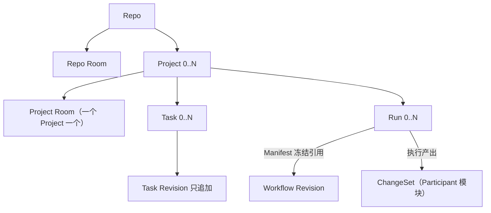

# HCTL2 设计地图

> 状态：规范性索引 · 草案 v0.16.5 
> 日期：2026-08-31

HCTL2 只有四个领域模块：Project、Task、Run 与 Participant（参与者）。每个模块拥有稳定身份、状态、命令和不变量；与它对应的场景只提供查询、预览、操作和事件投影。

| 权威模块 | 对应场景 | content 系统 | 模块拥有 | 场景客户端 / 受控端口示例 |
| --- | --- | --- | --- | --- |
| [Project](./project.md) | Room（聊天室） | chat server（聊天服务器） | 目标与范围、协作现场的身份与升格记录、参与者、上下文、请求、备忘与工件 | Workbench Room / 外部 Chat 端口 |
| [Task](./task.md) | Kanban（看板） | 任务后端（本地任务服务器或远端平台） | 承诺与验收契约、后端映射与字段权威、操作态投影、完成证明 | Workbench Board / Linear、GitHub 任务源端口 |
| [Run](./run.md) | Workflow（施工图） | workflow engine（工作流引擎） | 施工图与批准、授权执行、交付义务与席位、评审关卡、裁决与凭证 | Workbench Run 图 / workflow engine 端口 |
| [Participant](./participant.md) | Terminal | Agency（派出方）供给的执行体；默认为本地参考实现 | 参与者身份与人设、Skill（技能包）申报、执行者配置与目录、写入边界与快照、物理运行时、终端、结果与证据 | Workbench Terminal（participant.tui）、CLI / ACP、harness、运行时 API / TUI |

每场景三类数据的完整归属、系统角色与丢失恢复见[三面架构](./architecture.md)。场景与模块是一一对应的主视角，不是强制的调用链。Task 可以没有 Run；Project 可以发起一次 Harness 调用；Kanban 可以显示 Run 和 Artifact（工件）投影。跨模块引用不转移事实所有权。

四个模块对应[愿景文档](./vision.md)中“意图 → 承诺 → 治理 → 运行”的四个阶段，是语义分责，不是界面菜单；部署分层是另一个维度，由[三面架构](./architecture.md)回答（展示面、控制面、执行面）。从 Project 到 Participant，越靠前越接近人的意图，越靠后它的执行面越是可替换的资源。第一次阅读建议先看[愿景与设计原则](./vision.md)，再回到本页和四个模块的设计正文。文档分两层：设计层（本目录）用产品语言回答为什么与怎么用；[约束层](./spec/README.md)承载精确的对象、状态机、写入约束与外部概念对齐，两层冲突时以约束层为准。

## 对象关系

Run 内部如何把工作分成交付义务、席位与尝试（引擎重试创建新义务且不增加票数、换人不换裁判、掉线不丢身份），见 [Run 设计正文](./run.md)；这属于一次施工内部的防线，不属于管辖骨架。

Room 与 Run 可以互相引用，但不存在包含关系：Project Room 可以展示多个 Run；Scoped Room 可以由某个 Run 的 Request 派生；Room 不拥有 Workflow token 或运行时，Run 也不需要自己的 Room。

## 场景客户端与受控端口

Workbench、CLI 与适配后的第三方 UI 调用 HCTL 时使用四类公共操作：

1. 查询当前投影；
2. 预览类型化命令及前置条件；
3. 提交类型化命令；
4. 订阅带序号的领域事件或重同步快照。

Workbench 把四个场景客户端和 HCTL 命令入口组合成一个产品桌面，但没有额外权限：操作 content 或精确运行时时与原生客户端同路，提交 HCTL 命令时与 CLI 同路。动作的目标和信封决定语义；分类与接纳规则只在[系统约束](./spec/system.md#客户端动作与-provider-事件)定义。

四个场景选定的外部实现都经各模块自己的受控端口和版本化绑定接入；具体选型见[交付文档](./delivery.md#选型判据)，替换边界与聊天桥接职责见[三面架构](./architecture.md#避免供应商锁定)。Workbench 就位前，公共 `hctl2` CLI 承载 HCTL 命令，各 provider（供应端）原生界面处理消息、卡片和终端输入；具体阶段见[交付文档](./delivery.md#实现阶段)。

## 共同规则

- 稳定对象使用稳定 ID；内容变化产生不可变的新版本，界面只读取当前指针或操作投影。
- 治理事实只由类型化命令或模块确定性归约产生；命令携带提交者来源、目标、预期版本、权限范围和幂等键。
- 供应端事件按各模块定义的分类规则处理，权限来自目标、操作者映射、版本和幂等依据，而非界面名称。
- Task 的完成请求只来自有权的人，或绑定契约的 Run 正常完成后由归约器提交；所有来源经过同一验收，精确定义见 [Task 约束](./spec/task.md#写入约束)。
- 普通 Room 的临场执行边由人提交；模型 Participant 只建议下一位协作者，预授权自动边由确定性规则按冻结施工图创建。
- 运行中的绑定被冻结；能力、权限、候选或验收条件变化时创建新版本或替代执行。
- Workbench 的存活不改变领域事实；缺少等价适配能力时安全暂停。
- control、Repo（仓库）执行现场和 Agency 绑定范围各自保持一个带代次的当前写入者，精确范围见[系统边界](./spec/system.md#单写者)。

以上是概括；精确措辞以[连接约束](./spec/connections.md)与[系统边界](./spec/system.md)为准。

四模块之间“交什么、谁准入、怎样恢复”只在[连接约束](./spec/connections.md)定义一次；CAS、outbox、单写者和适配器恢复等通用机制只在[系统边界](./spec/system.md)定义一次。模块文档不再各写一套副本。

## 支持文档

- [愿景与设计原则](./vision.md)：一句话定位、失败模式、四阶段心智模型、目标体验与设计原则。
- [三面架构](./architecture.md)：展示/控制/执行三面、场景与系统、4×3 归属矩阵、模块交接、数据丢失与恢复。
- [可解释的 Context（上下文）](./context.md)：唯一的横切设计正文——每次执行看到了什么、冻结与传承、成本纪律；对象归属不变。
- [约束层总则](./spec/README.md)：词汇分类法、六族规则、命名门槛、词汇索引与外部对齐原则。
- [系统边界与适配器约束](./spec/system.md)：组件、事实源、命令、单写者与恢复。
- [四模块的端到端连接](./spec/connections.md)：类型化交接、事务边界、版本链和跨模块恢复。
- [交付、验证与自举](./delivery.md)：交付范围、CLI、纵向切片、自举、选型验证和未决项。
- [契约测试矩阵](./contract-tests.md)：CT 各族与产品验收用例。
- [文档纪律](./doc-discipline.md)：谁定义什么、去重、引入门槛、修订与审计规则——面向写文档的人的协议；文风与结构见根目录[写作指南](../../WRITING-GUIDE.md)。
- [术语对照表](./references/glossary.md)：中英对照与一句话含义；语义以模块文档为准。
- [从 HCTL 到 HCTL2 的来时路](./references/decision-history.md)：关键决策转折的非规范说明；它不形成第二套约束。

发生冲突时的裁决顺序见[文档纪律](./doc-discipline.md)。
