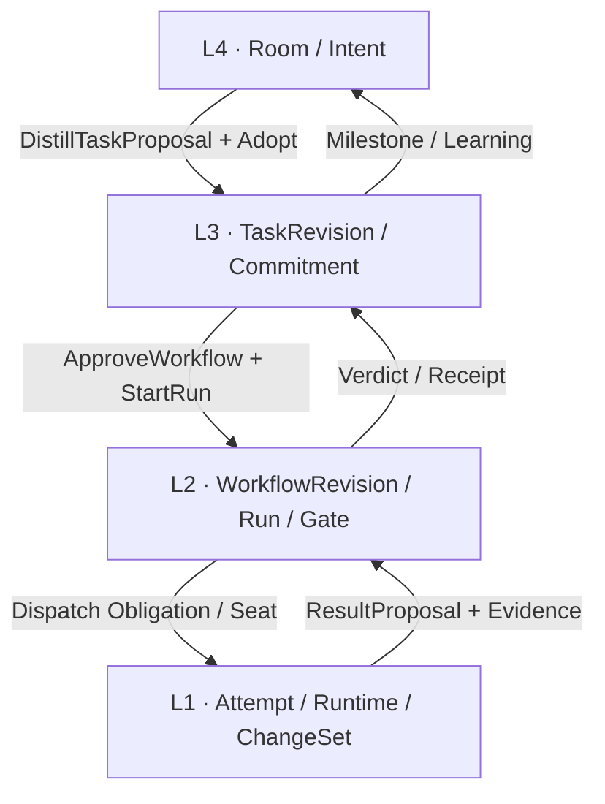

# HCTL2 设计规范

> 状态：Normative index · Draft v0.7.0<br>
> 日期：2026-08-14<br>
> Phase 1：单用户；macOS 与 Linux；架构保留 Windows 原生移植路径

本目录是 HCTL2 的权威设计基线。HCTL2 不是聊天室、看板、流程引擎和终端的并列拼装；它把项目开发生命周期分成四层，每层回答一个不同的问题，并只通过 typed seam 向下一层交付。

## 四层模型

```text
L4  Intent & Collaboration
    Project Room
    主要参考：First Tree

            ↓ 提炼目标、范围、acceptance

L3  Commitment & Tracking
    Task / Kanban
    主要参考：Codeg；外部状态参考 Linear/GitHub

            ↓ 冻结 TaskRevision、批准自动施工

L2  Governance & Orchestration
    Workflow / Run / Gate
    外部主参考：缺失；内在谱系：HCTL1 / yesme/hctl
    完整治理：由 HCTL2 原生建设
    机械状态后端：Conductor

            ↓ Obligation / Seat / Attempt

L1  Execution & Runtime
    Worktree / Harness / Terminal / Diff
    主要参考：Stably Orca
```

结果沿相反方向回流：L1 提交 result proposal、diff 与执行 evidence；L2 校验并形成 Verdict/Receipt；L3 决定 Task 是否满足 acceptance；L4 展示里程碑、解释结果并把稳定知识发布为 Memo。

这四层不是部署层，也不是 UI 菜单层。它们是语义责任层：越往上越接近人的意图，越往下越接近可替换的执行资源。

| 层 | 用户问题 | 权威对象 | 绝不能偷做的事 |
| --- | --- | --- | --- |
| [L4 · Project Room](./layers/l4-project-room.md) | 我们要解决什么，为什么？ | Room、Message、Context、Request、Memo proposal | 聊天文本直接修改 Task、Workflow 或 Git |
| [L3 · Task / Kanban](./layers/l3-task-kanban.md) | 我们承诺交付什么，当前处于什么状态？ | Task、TaskRevision、TaskOperationalState、source binding | 拖进 In Progress 就启动 Run；外部 Closed 就算验收完成 |
| [L2 · Workflow / Run / Gate](./layers/l2-workflow-governance.md) | 哪些工作获准自动推进，凭什么过 Gate？ | WorkflowRevision、Run、Obligation、Seat、Verdict、Receipt | 让 Engine、Harness 或 UI 成为 effect authority |
| [L1 · Execution / Runtime](./layers/l1-execution-runtime.md) | 哪个执行实例在何处运行，如何观察或接管？ | Attempt execution binding、ChangeSet、RuntimeShard、Harness binding、PTY/terminal target | 用 session、worktree 或 terminal identity 反向定义 Project/Task |

Attempt 是 L2/L1 的 seam object：L2 的 control 拥有它与 Seat 的 identity、candidate 和 admission；L1 的 agentd/RuntimeBackend 实现其 concrete process、Harness binding、runtime generation 与 observed state。两边不能各建一个“Attempt truth”。

## Typed seams



以下跨层约束是整个设计的骨架：

1. Room 只能提出 Proposal；正式变化必须成为带 actor、authority、expected revision 和 idempotency key 的 typed command。
2. TaskRevision 冻结的是承诺，不是执行步骤；Task 可以没有 Run，一个 Run 也可以覆盖多个 TaskRevision。
3. L2 只向 L1 派发有边界的 Obligation/Seat；L1 的自述、进程退出或 Git commit 都不能自行完成 Gate 或 Task。
4. Conductor 保存机械 Workflow 位置，但 hctl2-control 是唯一 effect authority；Workbench 与 Conductor UI 都不能直接 complete/fail/signal HCTL node。
5. Workbench 是四层的原生统一客户端，不是任一层的事实源。没有 Workbench 时，各层按自己的安全降级合同继续或暂停，而不是直接操作数据库或 donor runtime。

## 参考实现的准入规则

外部项目不是竞争产品评分表，也不按“是否覆盖四层”逐项打勾。一个 effort 只有在某层形成了明显高于其他样本的产品洞见、协议合同或经过验证的实现切片时，才进入该层正文；顺带存在但平庸的能力不引用。

- 每个 effort 默认只有一个主层；极少数真正提供两种独特证据的项目可以有两个落点。
- “Primary” 表示该层的主要思考伙伴，不表示继承其领域模型或整仓采用。
- “Focused reference” 只借一个明确切片；它不因此获得该层的产品定义权。
- “Radar only” 表示研究过，但当前没有足够独特的增量，不进入四层正文。
- 通用库、协议和 provider 与产品 effort 分开记录，避免把实现依赖误写成产品参考。

精选归类与版本、许可证、采用边界见[实现证据与参考组合](./references/implementation-evidence.md)。其中最重要的判断是：

- First Tree 的最深探索在 L4 的 persistent Chat、Context、Human Request 与跨 surface Room；它没有 first-class Task，也不是 Workflow/terminal donor。
- Codeg 的最深探索在 L3 的 To-do/WorkTask、并行 worktree、review、follow-up 与 Git truth；其 Composer/ACP 是可移植组件证据，不构成第二主层。
- Stably Orca 的最深探索在 L1 的 worktree、daemon-owned PTY、terminal lifecycle、remote attach、diff 与 session recovery；其实验 Run/Task 不足以定义 HCTL L2。
- HCTL1 / yesme/hctl 已验证 Git-native Seat/claim/fence、exact Verdict/quorum、Receipt 与 fail-closed corpus；完整的 Project/Task/Run/Attempt governance 仍是市场 missing piece，由 HCTL2 原生扩展，Conductor 只提供被动机械状态。

## Workbench 与降级

每个层文档都必须明确回答：

1. Workbench 在场时的原生交互是什么；
2. Workbench 退出后哪些事实和后台工作继续；
3. 已交付的替代表面可以做什么；
4. 会损失哪些体验，何时应安全暂停；
5. Workbench 恢复后如何从 canonical state 重建。

降级是 graceful degradation，不承诺界面或能力完全等价。Phase 1 不交付 browser/mobile/remote relay，也不把外部 Chat bridge 当成已完成能力；具体范围见[Phase 1 与自举](./delivery/phase-1-and-dogfooding.md)。

## 文档地图

建议按以下顺序阅读：

1. [基础、目标与原则](./foundation.md)
2. [权威领域模型](./domain-model.md)
3. 本页的四层模型
4. [L4 · Project Room](./layers/l4-project-room.md)
5. [L3 · Task / Kanban](./layers/l3-task-kanban.md)
6. [L2 · Workflow / Run / Gate](./layers/l2-workflow-governance.md)
7. [L1 · Execution / Runtime](./layers/l1-execution-runtime.md)
8. [跨层生命周期](./cross-layer/lifecycle.md)
9. [系统架构与事实边界](./cross-layer/system-architecture.md)
10. [Workbench 与交互集成](./cross-layer/workbench.md)
11. [Phase 1 与分级自举](./delivery/phase-1-and-dogfooding.md)
12. [验证、ADR 与未决事项](./delivery/validation.md)

辅助索引：

- [术语表](./references/glossary.md)
- [规范性不变量](./references/invariants.md)
- [实现证据与参考组合](./references/implementation-evidence.md)
- [设计演进记录](./references/decision-history.md)

## 规范优先级

发生冲突时按以下顺序解释：

1. `references/invariants.md` 与 `domain-model.md`；
2. 四个 layer contract；
3. `system-architecture.md` 与 `workbench.md`；
4. Phase 1 范围和 validation catalog；
5. implementation evidence 与 decision history。

Evidence 和历史文档是信息性的，不能反向改变 HCTL 公共对象、事实源或产品路线。外部项目中的 Workspace、Project、Task、Run、Conversation、Session、Agent 等同名概念也不能自动映射为 HCTL 对象。
