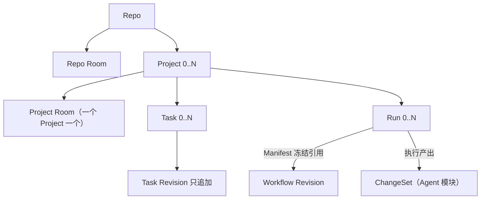

# HCTL2 设计地图

> 状态：规范性索引 · 草案 v0.15.0 
> 日期：2026-08-30

HCTL2 只有四个领域模块。每个模块拥有稳定身份、状态、命令和不变量；与它对应的场景只提供查询、预览、操作和事件投影。

| 权威模块 | 对应场景 | content 系统 | 模块拥有 | 场景客户端 / 受控端口示例 |
| --- | --- | --- | --- | --- |
| [Project](./project.md) | Chat Room | chat server（聊天服务器） | 目标与范围、协作现场的身份与升格记录、参与者、上下文、请求、备忘与工件 | Workbench Room / 外部 Chat 端口 |
| [Task](./task.md) | Kanban | 任务后端（本地任务服务器或远端平台） | 承诺与验收契约、后端映射与字段权威、操作态投影、完成证明 | Workbench Board / Linear、GitHub 任务源端口 |
| [Run](./run.md) | Workflow | workflow engine（工作流引擎） | 施工图与批准、授权执行、交付义务与席位、评审关卡、裁决与凭证 | Workbench Run 图 / workflow engine 端口 |
| [Agent](./agent.md) | Terminal | harness 与 Agency（第一阶段为 Herdr） | 执行者配置与目录、写入边界与快照、物理运行时、终端、结果与证据 | Workbench xterm、CLI / ACP、harness、Herdr API / TUI |

每场景三类数据的完整归属、系统角色与丢失恢复见[三面架构](./architecture.md)。场景与模块是一一对应的主视角，不是强制的调用链。Task 可以没有 Run；Project 可以发起一次 Harness 调用；Kanban 可以显示 Run 和 Artifact 投影。跨模块引用不转移事实所有权。

四个模块对应[愿景文档](./vision.md)中“意图 → 承诺 → 治理 → 运行”的四个阶段，是语义分责，不是界面菜单；部署分层是另一个维度，由[三面架构](./architecture.md)回答（展示面、控制面、执行面）。从 Project 到 Agent，越靠前越接近人的意图，越靠后越是可替换的执行资源。第一次阅读建议先看[愿景与设计原则](./vision.md)，再回到本页和四个模块的设计正文。文档分两层：设计层（本目录）用产品语言回答为什么与怎么用；[合同层](./spec/README.md)承载精确的对象、状态机、写入合同与外部概念对齐，两层冲突时以合同层为准。

## 对象关系

Run 内部如何把工作分成交付义务、席位与尝试（重试不灌票、换人不换裁判、掉线不丢身份），见 [Run 设计正文](./run.md)；这属于一次施工内部的防线，不属于管辖骨架。

Room 与 Run 可以互相引用，但不存在包含关系：Project Room 可以展示多个 Run；Scoped Room 可以由某个 Run 的 Request 派生；Room 不拥有 Workflow token 或运行时，Run 也不需要自己的 Room。

## 场景客户端与受控端口

Workbench、CLI 与适配后的第三方 UI 在调用 HCTL 时只使用四类公共操作：

1. 查询当前投影；
2. 预览类型化命令及前置条件；
3. 提交类型化命令；
4. 订阅带序号的领域事件或重同步快照。

Workbench 把四个场景客户端和 HCTL 命令入口组合成一个产品桌面，但没有额外权限。它可以像 Matrix/Vikunja/Herdr 原生客户端一样操作消息、卡片或精确运行时，也可以像 CLI 一样调用 HCTL；动作的目标和信封决定语义，客户端品牌不决定语义。Workbench 关闭或没有安装时，control、CLI、provider 和原生客户端仍照常工作；Workbench 只增加统一导航、联合投影、通知和公共命令 UI，不增加一条隐藏 API。

第三方平台可以提供场景客户端，也可以通过 Chat、任务源、workflow engine、harness、Agency 这五类受控端口提供底层能力；受控端口只报告读写能力和降级方式，字段权威由对应模块的权威绑定（authority binding）授予。同一产品兼任两者时，客户端连接与 provider binding 仍须分开。外部动作按[系统合同](./spec/system.md#客户端动作与-provider-事件)分成 content 变化、human 命令请求、运行时输入/结果和不支持的 provider mutation；模块只接纳自己明确列出的路径，不建立一套通用 CRUD 或跨模块 shim。平台可以拥有本场景 content（场景内容）的 ground truth（事实源头），但不能拥有治理：它自己的 Session、Issue、Workflow Task、pane 或数据库不能成为 HCTL 身份、授权或判决的来源。

第一阶段采用 Tuwunel、Vikunja、Dagu、Herdr，并不把四个模块绑定到它们的私有对象模型。替换边界是各模块自己的受控端口和版本化 binding，不是一套跨模块的通用 shim 服务；Workbench 的 HCTL 部分只依赖场景合同，provider 客户端部分只使用 provider 公共协议，私有 UI 对象都不能变成 HCTL 身份或权限。四类边界、替换范围和聊天桥接的职责划分见[三面架构的“避免供应商锁定”](./architecture.md#避免供应商锁定)。

施工顺序决定了第一阶段有两种并存的操作形态（见[交付文档](./delivery.md#实现阶段)）。Workbench 就位（P3）之前，公共 `hctl2` CLI 提供 HCTL 预览、提交与订阅，各 provider 原生界面处理消息、卡片和终端输入。第一阶段没有 Matrix 命令动作适配，因此从讨论走向一次调用仍由 CLI 引用消息事件完成预览与提交；Vikunja Done 是否可转成完成请求、Herdr 原生输入能提供多强保证，则按各自 binding 的实测能力声明，不因“原生客户端”三个字统一禁用。

## 共同规则

- 稳定对象使用稳定 ID；内容变化产生不可变的新版本，界面只读取当前指针或操作投影。
- 治理事实只由类型化命令或模块确定性归约产生；命令携带提交者来源、目标、预期版本、权限范围和幂等键。
- provider 事件先按模块合同分类；它可以只是 content 观测，也可以在保留操作者映射、目标、版本和幂等依据后成为 human 命令请求或运行时输入，不能从某个 UI 的名称直接推断权限。
- Task 只有两个获准的终结来源：有权 human 的完成请求，或绑定契约的 Run 正常完成后由归约器机械提交同一个命令；请求可以来自 Workbench、CLI，或 binding 明确支持并能归属到 human 的 provider 动作，但都要经过同一 Task 验收。Harness、模型、来源终态、进程退出、Git 提交或 CI 不能自行完成 Task。
- 普通 Room 的临场执行边只由人提交；模型 Participant 可以建议下一位协作者，但不能自行点名执行者、扩大群发范围或递归委派。预授权的自动边只由确定性规则按冻结的施工图创建。
- 运行中的绑定被冻结；能力、权限、候选或验收条件变化时创建新版本或替代执行。
- Workbench 关闭不改变领域事实；缺少等价适配能力时安全暂停，而不是绕过命令服务。
- 用户级治理账本只有一个 control 写入者（可搬迁，账本身份不变）；每个 Repo 执行现场只有一个持有当前 site fence 的工具箱 mutation owner；每个 Herdr 运行范围只有一个由 control 账本记录的当前 Agency owner generation，旧代次的输入和结果一律拒绝。Herdr 自带的 controller takeover 只用于执行，不代替 HCTL 账本。

以上是概括；精确措辞以[连接合同](./spec/connections.md)与[系统边界](./spec/system.md)为准。

四模块之间“交什么、谁准入、怎样恢复”只在[连接合同](./spec/connections.md)定义一次；CAS、outbox、单写者和适配器恢复等通用机制只在[系统边界](./spec/system.md)定义一次。模块文档不再各写一套副本。

## 文档纪律

为避免再次形成补丁链，后续修改遵守以下硬边界：

- 分层写作：设计正文只用[核心产品词](./spec/README.md#核心产品词)加日常语言；合同词汇（复合对象名、状态机、字段）只出现在合同层；实现名（字段名、锁路径）不进设计文档。`delivery.md` 是验证文档，可引用合同层词汇以指认被测合同，但不得重定义。
- 只有合同层的四个模块合同可以定义模块特有的领域名词、状态、写入者和不变量；设计正文与场景不得重定义它们。
- 具名概念的引入门槛与族规则见[合同层总则](./spec/README.md)：没有独立生命周期、恢复边界或权限边界的不得命名；场景概念优先对齐外部标准，不重复造轮子。
- 说人话：自然中文；中文语境不常用的音译行话必须翻译；专有名词保留英文，但每个文档首次出现时给中文对照。
- `vision.md` 只回答“为什么、什么体验、按什么原则取舍”，不定义对象、状态或命令；与合同冲突时以合同为准。愿景、论证与体验叙事不因篇幅或“与合同重复”被删除——权威去重针对合同，不针对解释。
- spec/connections.md 只定义模块交接，spec/system.md 只定义共享机制，delivery.md 只定义范围与验证，evidence 只记录来源。
- 一个概念只在拥有它的模块完整定义一次；其他文件用链接和可观察结果引用。
- 新持久对象必须对应第一阶段中的稳定引用、命令目标或恢复边界；否则先作为实现细节。
- 精简只针对重复权威、无第一阶段用途的对象和补丁衍生对象；能够回答独立实现选择、交接、故障或权限边界的设计不得因篇幅被删除。
- 新持久对象必须说明现有命令、引用或事件为什么无法承载该边界；若同一规则需要在多个权威位置同步修改，先选定唯一 owner，再把其他位置改为引用。
- 审计只针对稳定快照，最多两轮；第二轮若主要发现第一轮新增概念造成的问题，则回滚而不是继续打补丁。
- 来时路只记录转向：核心边界移动、实现选型更换、权威归属变化各自成章；词汇、词形与概念清扫类修订进[小修订台账](./references/decision-history.md#32-小修订台账)一行，细节在合同层清扫表或 memo。每记录一条改变合同的转向，基线版本至少推进一个补丁号。

## 支持文档

- [愿景与设计原则](./vision.md)：一句话定位、失败模式、四阶段心智模型、目标体验与设计原则。
- [三面架构](./architecture.md)：展示/控制/执行三面、场景与系统、4×3 归属矩阵、模块交接、数据丢失与恢复。
- [Participant 与数字参与者](./participant.md)：横切设计正文——谁在参与、七层拆分、专业化 Participant 与评审方法论；对象归属不变。
- [Context 与可解释上下文](./context.md)：横切设计正文——每次执行看到了什么、冻结与传承、成本纪律；对象归属不变。
- [合同层总则](./spec/README.md)：词汇分类法、六族规则、命名门槛、归并对照与外部对齐原则。
- [系统边界与适配器合同](./spec/system.md)：组件、事实源、命令、单写者与恢复。
- [四模块的端到端连接](./spec/connections.md)：类型化交接、事务边界、版本链和跨模块恢复。
- [第一阶段、验证与自举](./delivery.md)：交付范围、CLI、纵向切片、契约测试和未决项。
- [术语对照表](./references/glossary.md)：中英对照与一句话含义；语义以模块文档为准。
- [从 HCTL 到 HCTL2 的来时路](./references/decision-history.md)：关键决策转折的非规范说明；它不形成第二套合同。
- [实现证据](../research/README.md)：固定版本、许可证和采用边界；它不定义 HCTL 语义。

发生冲突时，四个模块合同解释连接端点，spec/connections.md 解释交接，spec/system.md 解释共享执行机制；delivery.md 不得改变领域含义，实现证据不得反向定义产品。
