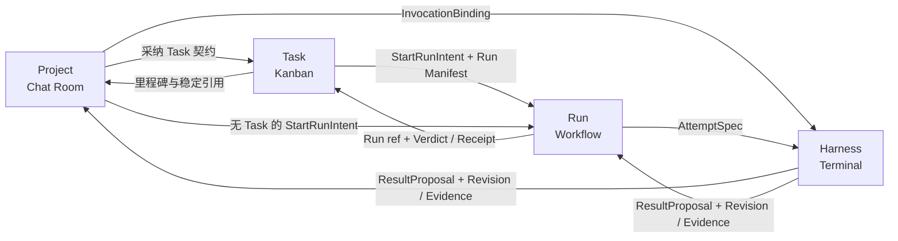

# 四模块连接与端到端闭环

> 本文是 Project、Task、Run、Harness 之间连接合同的唯一权威。它不是第五个领域模块：连接的两端仍由对应[模块文档](./README.md)定义，共享命令、适配器与恢复机制见[系统边界](./system.md)。

## 连接模型

连接不是一份可独立漂移的共享状态，也不需要 `Handoff` 聚合。每条连接都由“目标模块的类型化命令 + 来源模块的不可变引用”组成：

1. 来源模块只能提供稳定 ID、Revision digest、状态版本、来源和已获授权的范围；不能直接写目标模块。
2. 目标模块在自己的命令准入中校验来源引用、当前版本、actor、权限和幂等键，并拥有新产生的状态。
3. 同一 RepoInstance 内的目标状态、来源关联、幂等结果和必要 outbox 由 control 在一个事务中提交。
4. 目标只以稳定引用和有序事件返回结果；来源和场景可以投影它们，但不能复制一套状态机。
5. 涉及 Engine、agentd、Git/SCM 或第三方平台时，提交本地意图先于外部动作；ACK 不确定时按稳定关联键回读。

连接中的引用至少包含 `kind + stable_id + revision_digest 或 state_version`，并携带所属 Repo/Project、producer 和适用的绑定版本。`current`、显示名、外部 ID、文件路径或界面选择不能替代精确引用。这是字段约束，不是新的持久领域对象。

## 连接图



Project → Harness 是无 Run 的显式短路；Harness → Task 不存在原始状态通道，只有经过校验的 Revision、Evidence、Verdict 或 Receipt 才能进入 Task 验收。

## 连接合同总表

| 方向 | 耐久输入 | 目标准入与提交 | 恢复依据 |
| --- | --- | --- | --- |
| Project → Task | Project/version、来源 Message/Artifact/Memo/Request refs、拟议 Task 契约及 digest | Task 的 CreateTaskIntent/AdoptTaskRevisionIntent 创建 TaskRevision 并记录来源 | command id / idempotency key → 同一 TaskRevision ref |
| Project / Task → Run | Project/version、可选精确 TaskRevision、Workflow/Deployment refs、repo baseline、候选、权限、预算和 Gate | Run 命令原子写 Run Manifest、Run 账本和 Engine start outbox | run id + manifest digest → EngineExecutionBinding/readback |
| Project → Harness | RoomInvocation + InvocationBinding | Project 先持久化调用授权，Harness 再预留、绑定和激活运行时 | invocation id + generation + binding digest |
| Run → Harness | Attempt + AttemptSpec | Run 先持久化派发授权，Harness 再预留、绑定和激活运行时 | attempt id + generation + spec digest |
| Harness → Project/Run | ResultProposal、精确 execution generation、Revision/Evidence refs | owner 模块去重并校验身份、代次、权限、写租约和输出 schema 后准入 | proposal id + owner/spec digest；迟到结果只留历史 |
| Run/Harness → Task | Run ref、被冻结的 TaskRevision ref、Revision/Evidence/Verdict/Receipt refs | Task 的 Complete 命令按当前验收合同独立校验 | CompleteTaskIntent id → TaskCompletionReceipt |
| Task/Run/Harness → Project | source ref、event id/sequence、版本、敏感级别 | Project 只建低噪声投影；Memo/Artifact 仍需 Project 命令发布 | source event cursor，可从源账本重建 |

## Project → Task：从讨论到承诺

Chat Room 可以生成 `DistillTaskProposal` 预览，但它不是第二个 Task。确认时，`CreateTaskIntent` 或 `AdoptTaskRevisionIntent` 必须冻结：

- `project_id` 与预期 Project version；
- 来源 Message、Artifact、Memo、Request 的精确引用；
- 标题、预期结果、验收合同、角色/能力和可选外部来源绑定；
- 规范化 proposal digest、actor/permission 与 idempotency key。

Task 模块以 CAS 校验 Project 和可选当前 TaskRevision，成功后创建不可变 TaskRevision 并返回精确引用。Room 中继续编辑或删除显示内容不会改写已采纳 Revision；普通消息、总结和拖放都不能创建 Task。

## Project / Task → Run：授权自动施工

批准 Workflow 只确认施工图；`StartRunIntent` 才建立自动施工连接。Project 是必需授权来源，TaskRevision 是第一阶段 0..1 个可选绑定。不可变 Run Manifest 固定 Project/version、可选 TaskRevision ID+digest、WorkflowRevision、EngineDeploymentRevision、repo/base、角色与 Seat、候选及切换规则、端口绑定、能力、权限、网络/secret 范围、预算、Gate 和截止时间。

control 在一个事务中写 Run、Manifest、幂等结果和 Engine start outbox。外部执行实例用 `run_id + manifest_digest` 作为关联键；commit 后崩溃或 ACK 丢失时先回读，不能再启动第二个 execution。若 Project/Task/Workflow 在提交前已不匹配预期版本，命令拒绝；提交后发生的上游更新不改写活动 Run，只能影响新 Run 或触发显式替代。

## Project / Run → Harness：从授权到物理执行

两条入口共用同一个派发协议，但保留不同 owner：

- Project 入口先持久化 [Project 模块定义的](./project.md#roominvocation-与-request) RoomInvocation 与 InvocationBinding；`repo_scope` 永远只读。它没有自动候选切换或 Gate。
- Run 入口先持久化 [Run 模块定义的](./run.md#从节点到结果) Attempt 与 AttemptSpec；候选、Seat 和语义归约仍由 Run 拥有。

外部运行时的启动顺序固定为：

1. owner 模块提交 InvocationBinding/AttemptSpec 与 dispatch outbox；
2. agentd 进行无副作用预留并返回实际能力、物理目标和 backend generation；
3. control 在同一事务记录 owner 到 InvocationRuntime/RuntimeShard 的精确映射、适用的 ChangeSetWriteLease 和 activate outbox；
4. outbox 携带当前 control/backend generation 激活，并按 owner + generation 回读；旧 generation、旧租约和重复激活被拒绝。

如果冻结的端口明确是纯进程内同步调用，可以没有 Runtime/Terminal；它仍走相同的结果准入。dispatch/activate ACK 只证明执行已被接受，不证明产生了语义结果。

## Harness → Project / Run：结果准入

ResultProposal 使用 [Harness 模块定义的字段合同](./harness.md#运行时与观测)，并精确引用本次连接的 InvocationBinding 或 AttemptSpec；连接本身不再维护一份可变结果状态。

control inbox 先按 proposal/owner 去重，再逐项校验：owner 仍接受结果、代次与绑定一致、写入来自获准 ChangeSet、输出属于声明范围、证据可回读、权限没有扩大。通过后：

- RoomInvocation 的结果由 Project 记录并投影到 Chat Room；
- Attempt 的结果由 Run 归约为 Seat 结果、Verdict 或 Receipt；
- Task 不消费 Harness 的进程状态、自述、终端屏幕或未经准入的 Proposal。

旧 generation、被取消/替代 owner 或不匹配 spec 的结果只保留审计记录，不能推进 Project、Run 或 Task。

## Run / Harness → Task → Project：验收与回流

无 Run 路径中，CompleteTaskIntent 直接引用精确 ChangeSetRevision/ArtifactRevision、ReviewSubjectRef、测试/SCM 证据和必需 Receipt。有 Run 路径中，还引用 Run ID、该 Run 冻结的 TaskRevision、终止原因及 Verdict/Receipt/subject refs。两条路径最终都由 Task 模块按当前 TaskRevision、来源 head、Artifact/SCM/CI 和权限独立验收；Run 终态永远不是 Task 完成命令。

Task、Run 和 Harness 以有序领域事件向 Project 返回里程碑。事件携带 source module、稳定引用、event ID/sequence、版本和敏感级别；Project Room 只显示 Request、失败、已验证 Task、Artifact 就绪等低噪声投影。发布 Memo/Artifact 或归档 Project 仍需 Project 自己的类型化命令，不能由投影反向触发。

## 跨模块 Request 回路

Request 由 Project 模块保存，但可以阻塞 Task、Run 或 Harness owner。创建时固定 `owner_ref + affected_revision_ref + blocked_scope + owner generation/state_version + input_schema + required actor/role + permission + deadline/default policy + dedupe root`；被阻塞模块只保存 `request_id` 和自己的阻塞状态，不复制 Request lifecycle。

`ResolveRequestIntent` 固定 request/expected version、resolution digest、actor/delegation 和 idempotency key。对需要恢复执行的 Request，control 以一个跨模块事务 CAS Project Request 与来源 blocker 的精确版本，并提交解决结果及唯一 signal/delivery outbox；Project 或来源模块都不能在事务外再次 signal。接收方只接受匹配 owner、state version、binding 和 generation 的投递，ACK/观测后才由来源模块推进 blocker。普通 Room 回复不能解决 Request，也不能直接完成 Engine 节点。目标已失效时安全拒绝或保留为过期历史，不能把答案投给替代执行。

## 版本、权限与替代

端到端可追溯链固定为：

```text
Project sources → TaskRevision → Run Manifest → AttemptSpec → ResultProposal
Project sources → Run Manifest（0 Task）→ AttemptSpec → ResultProposal
Project sources → project_scope InvocationBinding → ResultProposal
Repo sources    → repo_scope InvocationBinding（只读）→ ResultProposal

获准 ResultProposal → Revision / Evidence → ReviewSubjectRef / Verdict / Receipt
Task 路径的验收证据 → TaskCompletionReceipt
```

每一步保存上一步的 ID + digest/version；current pointer 只用于预览，不能替代历史引用。上游版本变化不改写已接受的下游连接：提交前漂移则 CAS 拒绝，提交后由冻结合同继续收口，新的顶层授权使用新版本；范围、权限、候选或验收含义变化需要显式替代，而不是原地修补。

权限只能逐级缩小：actor/Project role → Run Manifest 或 InvocationBinding → AttemptSpec → agentd/adapter envelope。任何下游都不能扩展网络、secret、Git、TaskSource、Engine 或终端输入范围；需要扩权时回到拥有该权限的上游重新预览和授权。

## 失败与恢复

命令幂等、outbox/inbox、ACK 回读、writer/backend generation 和租约恢复算法只由[系统边界](./system.md#命令与跨服务正确性)定义。本节只规定连接恢复后四模块可观察到的结果：

| 失败点 | 连接语义 |
| --- | --- |
| 目标事务提交前来源已变化 | CAS 拒绝，不创建下游事实 |
| 目标已提交、调用方未收到结果 | 恢复后返回同一目标引用，不出现第二个下游对象 |
| 外部结果仍未知 | 连接保持 Pending/Needs Attention，来源不会被伪装成已交接 |
| owner 取消或被替代 | 停止新派发，撤销写入/输入权并等待物理执行静默；迟到结果只留历史 |
| 外部适配器不可用 | 已冻结的本地事实继续存在；连接显示 Pending/Needs Attention 或安全暂停 |
| 场景投影丢失 | 从四模块账本和 source event cursor 重建，不从外部界面反推事实 |

系统对账完成前，各模块都不得表现为已完成交接。连接需要的新尝试或替代执行必须拥有新的 generation/spec；不能复活旧 owner。

## 场景与第三方适配器

Workbench 可以在一个界面编排上述连接，第三方 Chat/Kanban/Workflow/Terminal 平台也可以按能力提交同一目标命令、查询同一投影并订阅同一事件。适配器没有跨模块捷径：外部 Issue 不能直接提交 StartRunIntent，Engine task 不能直接启动 Harness，终端或外部 thread 也不能直接 Complete Task。能力不足时隐藏动作或安全暂停，而不是建立平台专属的平行连接。

Workbench 的跨场景卡片和 deep link 只携带 stable ref 与可重建 projection；选择、焦点、展开状态和窗口布局都是客户端状态。用户从 Chat Room 跳到 Task、从 Kanban 打开 Run、从 Workflow 连接 Terminal 时，动作仍路由到目标模块的 Query/Preview/Submit；第三方客户端遵守同一规则。
