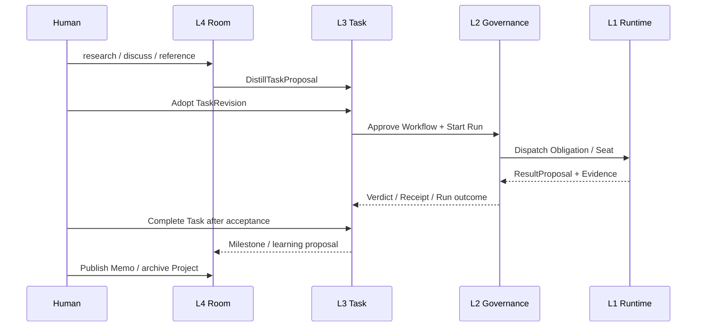

# 跨层生命周期

> Status: Normative · Draft v0.7.0<br>
> Parent: [HCTL2 设计规范](../README.md)

本文只描述四层如何交接，不重新定义各层对象或 mechanics。对象含义见[权威领域模型](../domain-model.md)，每层的 admission 规则见对应 layer contract。

## 完整闭环



每个箭头都是 typed seam，而不是自然语言暗示或共享数据库写入。

## 1. 初始化 Repo

1. 用户选择已有 Git repo，或创建/clone repo。
2. core 确认 git common dir、checkout、remote、HEAD 和 dirty state。
3. 创建/读取 `.hctl2/repo.toml` 和 `<git-common-dir>/hctl2/state.sqlite`。
4. 为 clone 建立 `repo_instance_id`；linked worktree 只获得 checkout/ChangeSet identity。
5. agentd 扫描 Harness definitions、ACP registry 与 configured adapters，运行 version/auth/preflight/capability probes。
6. Workbench 展示 available/degraded/unauthed/uninstalled Harness。
7. 创建 Repo Room；此时不启动 Harness、不创建 Project、Run 或 runtime container。

某个 Harness 不可用必须局部降级，不能阻止 Repo 进入。

## 2. L4：从探索到 Project

用户在 Repo Room 中发起 bounded research：

```text
@codex #file:src/auth.rs 分析认证边界
@claude 独立检查，不要改代码
```

每个调用拥有独立 InvocationBinding、ContextBundle、budget、timeout 和 permission；默认不创建 Run，也不自动 retry/fallback。

话题成型后，Create Project promotion：

1. 建议 name/slug、goal 与 scope；
2. 生成 Context Capsule preview；
3. 只选择相关 message IDs、Memo、file、Commit、evidence、assumption 和 open question；
4. 用户删减、补充、去敏；
5. 创建 `project_id` 和当前 RepoInstance 的 Project Room；
6. 新 Room 显示 source link，不复制整个 Repo Room transcript；
7. 不自动创建 Task、Workflow 或 Run。

## 3. L4 → L3：把讨论变成承诺

用户在 Project Room 中讨论 goal/boundary、编辑 spec/ADR/Artifact、邀请 independent reviewers，并形成 desired outcome 与 acceptance。

`DistillTaskProposal` 只能提出 Task contract。用户 adopt 后才创建 TaskRevision。必须保留 source message/Artifact/Memo provenance；删除或编辑 Room 表现不能改变已经 adopted 的 Revision。

此后：

- Room 可以继续讨论新想法；
- Task Board 追踪已经 adopted 的 commitment；
- 两者通过 stable references 相互链接，但不双写状态。

## 4. L3：绑定外部 Task Source

Project 可以保持 Local，也可以显式连接 Linear team/project 或 GitHub repository + ProjectV2 scope：

1. 选择 provider account/scope/filter，不按名称自动匹配；
2. Preview stable IDs、field/lane/priority/owner mapping、authority 和 unsupported fields；
3. 幂等绑定 external item 到 HCTL `task_id` 并写首个 snapshot；
4. 用户采用 contract source、补齐 desired outcome/acceptance/capability，生成 TaskRevision；
5. operational fields 按 authority 从 provider projection；contract change 只生成 PendingAdoption；
6. external comment 不自动成为 Room message。

外部 source 不可用时，已冻结 TaskRevision/Run 仍可继续；只有 provider-owned field 进入 read-only/Pending Sync。

## 5A. 无 Run 的轻量完成路径

```text
TaskRevision
  → human edit 或 bounded write RoomInvocation
  → ChangeSet + diff/test evidence
  → review
  → CompleteTask admission
  → TaskCompletionReceipt
```

这条路径没有 Workflow、Conductor、Obligation 或 Run。若简单工作必须先画 DAG，产品设计失败。

## 5B. L3 → L2：授权自动施工

需要 durable orchestration 时：

1. 选择精确 TaskRevision bindings；
2. Participant/template 形成 typed Workflow proposal；
3. Workbench 展示 nodes、dependency、gate、candidate、timeout、budget 与 worktree policy；
4. compiler 生成并 validate canonical JSON；
5. WorkflowRevision 写入 Git并获得 digest；
6. 用户 Approve Workflow；此时仍未开工；
7. 用户 review frozen Run Manifest，再 Start Run；
8. durable local intent 先提交，dispatcher 再幂等启动 Conductor execution。

外部 source 有 PendingAdoption/uncertain write/mapping drift 时，Start Run 必须要求明确选择，不能静默采用 provider 最新文本。

## 6. L2 → L1：READY 到实际执行

1. Conductor 计算 READY external node。
2. Control poll，并以 `(run_id, conductor_task_id)` 创建/查找 Obligation。
3. 根据 node/gate policy 创建 Seats，冻结 logical role、capability、candidate set 与 lease。
4. 为 ready Seat 选择 concrete WorkerProfile/HarnessInstallation，创建 Attempt。
5. Core/agentd 按需创建 ChangeSet/worktree、RuntimeShard 或 read-only checkout。
6. Agentd 通过 frozen HarnessAdapterBinding 启动 process/session。
7. Runtime events、diff 与 result 被归一为 proposal/evidence。

用户在 happy path 只看 status、diff 和 milestone；不需要 attach terminal。

## 7. L1 → L2：结果、失败与接管

L1 的 output 包括 observed outcome、normalized events、Artifact/diff/test/SCM evidence 和 trace refs。它不返回“Task 已完成”这一权威事实。

Technical failure：

1. L2 按 typed category 判断是否可 fallback；
2. fence current generation；
3. 在同 Seat 创建 backup Attempt；
4. old result 留 history 但不可计票或提交；
5. candidate exhausted 才创建 Request 或终止 technical outcome。

需要用户时：

- structured question/permission → Request；
- open deliberation → Project/Scoped Room；
- secure input → secure prompt；
- native UI diagnosis/takeover → exact L1 attach。

这些入口都绑定同一 Obligation/Seat/Attempt，不创建 parallel truth。

## 8. L2：review、reject 与 regate

1. 每个 reviewer Seat 读取同一 subject revision。
2. Accept/reject/changes-requested 都是成功返回的 semantic Verdict。
3. Reducer 按 policy 汇总；只有 veto 或 aggregate changes requested 才进入 rework。
4. Author 产生新 ChangeSet/Artifact revision；TaskRevision 通常不变。
5. 旧 required Verdict stale，重新创建所有 required gater Seats。
6. Quorum 达成后 fence outstanding Attempts，签发 Receipt，再 complete Engine task。

技术 fallback 与业务 rework 在 identity、history 和 UI 上必须清楚分开。

## 9. L2 → L3：Run outcome 不是 Task completion

Run 到达 terminal state 后，L3 仍检查 current acceptance、Receipt/Verdict、Git/PR/CI、merge eligibility、source divergence 与 actor authority。

只有显式 CompleteTask 或预先批准的 narrow policy 才能写 TaskCompletionReceipt。Provider Close outbox 与 HCTL lifecycle event 同事务产生；provider read-back 失败显示 sync pending，不伪造 provider success，也不撤销 HCTL verified fact。

## 10. L3 → L4：解释结果与长期记忆

Project Room 只接收重要 milestone：Task verified、Run failed、Request opened/resolved、Artifact ready、Project risk 或 completion。Raw token、terminal output 和每个 green node 不刷屏。

Run/Task 结束后，系统可以提出 Project learning/Memo proposal，用户 review 来源、适用范围和 expiry 后再 publish。Project 是否完成或归档仍是显式决定。

## Revision 并存

Run r1 执行 frozen Task/WorkflowRevision 时，L4 可以讨论 r2，L3 可以收到 provider SourceChanged。新讨论和 observation 都不能改变 r1：

- implementation rework 通常只产生新 ChangeSet/Artifact revision；
- acceptance/scope change 产生新 TaskRevision，要求结束/替换 active Run；
- topology/policy envelope change 产生新 WorkflowRevision/Run；
- runtime-mutable placement 也必须是 Manifest 明确允许且带 Receipt 的 narrow update。

## 端到端故障原则

任一 component crash 后，恢复顺序为：SQLite migration/ledger → inbox/outbox/leases → Task provider read-back → Conductor snapshot → agentd runtime observation → core Git/SCM truth → desired/observed reconcile → fence stale generation → replay idempotent effects。

对账完成前不发新 ChangeSetWriteLease 或 TerminalInputLease，不把 pending provider mirror 当 committed fact，也不根据 terminal/session 名称自动 adopt runtime。
