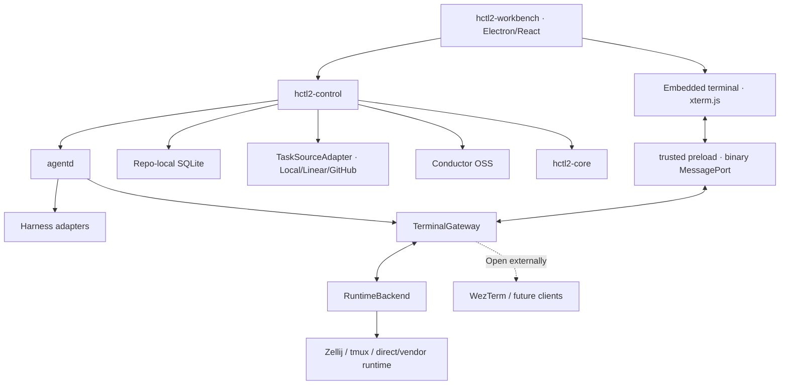

# 系统架构与事实边界

> Status: Normative · Draft v0.7.0<br>
> Parent: [HCTL2 设计规范](../README.md)

## 总体拓扑



四层是语义责任；上述组件是实现分配。不能把二者机械一一对应。例如 hctl2-control 同时实现四层的 command admission 与跨层协调，Repo-local SQLite 同时保存多层 durable state。

## 组件职责

### hctl2-workbench

- Project Room、Project Overview、Task Kanban、Run View、Inspector、Attention 与 terminal UI；
- RoomProjectionStore、virtualized timeline、Tiptap Composer；
- query projection、optimistic pending/rollback、command preview/confirmation；
- 不直接访问 SQLite、Git、Conductor、RuntimeBackend 或 Harness；
- 不拥有 domain truth，也没有 CLI/外部 client 不具备的 hidden authority。

### hctl2-control

- Repo/Project/Task/Room/Run typed command 与 admission；
- external Chat/Task source binding、inbox/outbox、snapshot/adoption 与 reconcile；
- mention/role/Recipe resolution、ContextAssembler、Request/Scoped Room；
- Workflow compile/validate/register/start 与 Conductor external worker bridge；
- Obligation/Seat/Attempt policy、candidate fallback、quorum/regate；
- 调用 core/agentd，持久化 domain result，再驱动 external effect。

Control 不模拟 Conductor token，不直接持有 PTY。

### hctl2-core

- Repo/ref/branch/worktree 与 ChangeSet；
- Commit/PR/review/merge eligibility；
- revision、subject、Verdict、Receipt；
- writer fence、author/gater separation、quorum evidence validation；
- Memo/Artifact publish validation。

即使首版使用 `git`/`gh` CLI，也必须置于 SCM adapter 后。

### agentd

- Harness catalog/probe/preflight；
- ACP、provider app-server/JSON-RPC、Vendor SDK、PTY/hook adapters；
- process/PTY/hooks/transcript、Attempt lease/heartbeat/cancel；
- RuntimeBackend/RuntimeRegistry、TerminalGateway、AttachDescriptor 与 TerminalInputLease；
- native session ID/resume、trace/usage/events。

Agentd 不判断 Task acceptance、Workflow ready 或 merge Receipt。

### Conductor OSS

Conductor 是独立、loopback-only、固定版本的 supervised process，Phase 1 计划使用 SQLite backend。它保存 Workflow mechanical execution truth；hctl2-control 负责 lifecycle、health/version compatibility、backup/migration 和所有 effect workers。

GUI 退出不影响 Run。Conductor 与 domain 之间只通过 WorkflowEngineAdapter 连接。

## Transport-neutral service boundary

Domain service 与 transport 从第一版分离：

- Electron desktop：restricted preload + typed local IPC；
- CLI：同一 command/query service；
- future browser/remote：authenticated HTTP/WebSocket；
- event stream：monotonic sequence + resync snapshot；
- terminal bytes：独立 TerminalGateway/Transport，仍受 capability/lease 控制。

Phase 1 只需交付 local IPC/CLI required subset，不偷渡 server、relay 或 mobile scope。任何 client 只提交 stable object refs 与 typed intent，不能提交 arbitrary SQL、shell string、provider mirror update 或 Conductor mutation。

## 存储拓扑

```text
~/.hctl2/
  config.toml
  harnesses/
  profiles/
  skills/
  runtimes/

<repo>/.hctl2/                  # Git tracked · low frequency/shared
  repo.toml
  projects/
  workflows/
  memory/
  policies/
  schemas/

<git-common-dir>/hctl2/         # untracked · linked worktrees shared
  state.sqlite
  traces/
  cache/
```

HCTL 只使用显式 namespaced operational store，不写 Git 自有 internal namespace。

Phase 1 的 single-user/repo-local workload 适合 SQLite：transaction、WAL、FTS5、simple backup/migration，以及 linked worktree 共用 git common dir。Semantic vector search 后置；优先显式 refs、FTS5 与 Memo。

## 主要表组

| 领域 | 表组 |
| --- | --- |
| Repo/Project | `repo_instances`, `projects` |
| L4 Room | `rooms`, `room_messages`, `room_message_parts`, `message_refs`, `room_timeline_items`, `room_projection_checkpoints`, `room_invocations`, `invocation_bindings`, `room_drafts`, `context_manifests`, `context_items`, `requests`, `request_resolutions`, `memo_proposals` |
| L3 Task | `tasks`, `task_revisions`, `task_operational_states`, `task_lifecycle_events`, `task_completion_receipts`, `task_source_*`, `external_principal_bindings` |
| L2 Governance | `workflow_revisions`, `runs`, `run_task_bindings`, `obligations`, `seats`, `attempts`, `review_rounds`, `verdicts`, `receipts_index` |
| L1 Runtime/SCM | `runtime_shards`, `invocation_runtimes`, `terminal_bundles`, `artifacts`, `change_sets`, `harness_installations`, `capability_snapshots`, `worker_profiles` |
| Reliability | `inbox`, `outbox`, `idempotency_keys`, `events`, `projections` |

关键约束：

- Run 固定 Project、WorkflowRevision 与 TaskRevision bindings；同一 Task Phase 1 最多一个 active Run；
- Seat 必须属于 Obligation，Attempt 必须属于 Seat；Run terminal bundle 的 Attempt/RuntimeShard 必须属于同一 Run/generation；
- external entity identity 唯一映射 HCTL Task；GitHub Issue 与 ProjectV2Item 分 ID；
- TaskSourceSnapshot、BindingRevision、lifecycle event append-only；delete 只 tombstone；
- local `state_version` 与 provider source revision/digest 不能混用；
- Attempt generation/fence 单调；stable ref 带 repo scope；cross-service event ID 唯一；
- Room source event append 与 `room_sequence` assignment 同事务并有 uniqueness；timeline projection 可重建；
- Complete/Reopen/Cancel event、projection 与 provider outbox 原子提交；
- Task source outbox 保存 binding revision、base remote digest、desired patch、ordering scope 与 per-step receipts。

## Source of Truth matrix

| Fact | Authority |
| --- | --- |
| Project shared goal、Artifact、WorkflowRevision | Git + hctl2-core |
| HCTL `task_id`、binding、adopted TaskRevision | Repo-local SQLite + hctl2-control |
| Provider entity 与 configured source-authoritative fields | Linear/GitHub |
| Provider snapshot/mirror/sync journal | SQLite observation/cache，不是 provider 第二 truth |
| Local operational fields | SQLite + control |
| Acceptance、Task lifecycle/CompletionReceipt、semantic completion | control + core durable record |
| Health/attention | control 从 Request/Run/CI/blocker 等事实计算的 projection |
| Room/message/Request/Context/canonical external Chat ingress | SQLite + control |
| Workflow token/task/timer/retry/history | Conductor |
| Obligation/Seat/candidate/Attempt/quorum | hctl2-control |
| Process/Harness binding/PTY/Backend observed state | agentd |
| Git SHA/PR/review/merge eligibility | hctl2-core + SCM |
| UI selection/layout/cache | Workbench only |

“Provider 是 source authority”和“SQLite 保存 mirror”不冲突：mirror 是可丢弃/read-back-verified observation，不能独立接受 mutation 或宣称 remote committed。

## Command admission

每个 mutation envelope 至少包含：

```text
actor
target stable identity
scope / capability
expected revision or provider base digest
authority policy digest
idempotency key
typed payload
optional evidence refs
```

Admission 顺序：authenticate actor → authorize scope/capability → resolve stable target → compare expected revision/authority → validate domain invariants → persist event/outbox atomically → execute/reconcile external effect。

Message renderer、Board drag、Run graph、terminal panel 和 external bridge 都只能构造这类 intent；它们不能跳过 control reducer。

## Cross-service correctness

HCTL 默认按 at-least-once 设计：

- caller idempotency + durable inbox/outbox；
- effect-specific correlation key；
- expected revision/base remote digest；
- generation/fencing token；
- result journal；
- remote read-back for unknown outcome；
- periodic full reconcile；
- projection rebuild from source events。

Exactly-once 只能是 domain reducer 在唯一 durable boundary 上观察到的效果，不能依赖 provider delivery、process/session checkpoint 或 UI cache。

## Startup 与 reconciliation

1. 打开 SQLite，验证 migration/schema；
2. 恢复 inbox/outbox、leases 与 pending projections；
3. 读取 provider snapshot/cursor，检测 divergence、uncertain effect、mapping drift 与 tombstone；
4. 查询 Conductor executions/tasks；
5. 查询 agentd host/runtime/Attempt observation；
6. 查询 core Git/PR/Receipt truth；
7. 对齐 desired/observed state，分类 Running、Waiting、Lost、Superseded、Orphan、Terminal Valid/Invalid；
8. fence stale generation；
9. 重放 idempotent complete/signal/outbox；external unknown effect 先 read-back；
10. Reconcile 完成前不授予新 write/input lease。

## Failure taxonomy 与 trace

至少区分 validation/config、auth/permission、rate limit/quota、network/transport、process crash/runtime lost、lease timeout、context/iteration limit、semantic reject、blocked/user input、Git/CI conflict、provider unavailable、external uncertain/partial saga、source mapping drift/delete、stale revision/fence、engine/control/storage failure。

只有明确 technical categories 进入 candidate fallback。

Structured trace 默认展示 Attempt start/stop、adapter messages、tool/file/diff、permission/question、retry/fallback/fence、Git/Receipt verification、usage/cost 和 source raw link。PTY transcript 是二级诊断，terminal attach 是最后一级。

## Crash matrix

| Failure | Expected behavior |
| --- | --- |
| Workbench exit/reload | Room/Run/process 继续；重开恢复 projection/descriptor |
| control restart | ledger、provider、Conductor、agentd、core 对账后继续 |
| unknown RoomInvocation | 只 reattach exact identity/lease runtime；否则 Interrupted，不自动 replay |
| Conductor restart | 从 engine DB/history 恢复，可重新 poll/complete |
| agentd restart | 只 adopt manifest/generation/lease 全匹配 runtime |
| terminal client exit | Attempt 继续；重新签发 descriptor/connect |
| terminal stream break | sequence/snapshot resync；旧 connection 不保留 input lease |
| structured event break | sequence/snapshot reconnect；不据此判 process dead |
| provider unavailable/rate-limit | Frozen TaskRevision/Run 继续；provider field pending/read-only |
| external mutation timeout | uncertain + read-back，不 blind retry |
| source contract changes in Run | append snapshot + attention；Run digest 不漂移 |
| runtime container lost | Attempt LOST，fence then candidate policy |
| PTY lost but semantic resume exists | old Attempt LOST；new Attempt/Invocation for resume |
| late Harness result | journal only unless current fence/revision valid |
| merge interrupted | core reconcile HEAD/index/merge state and return typed recovery |

## Security 与 trust boundary

Room membership 与 invoke/read/write/approve/merge/terminal/secret capability 分开。每次 Invocation/Attempt 冻结 repo/path scope、read/write、network allowlist、MCP tools/resources、secret grant、terminal mode、budget、SCM authority 与 Skill digests。

Secret/OAuth：

- 不进入 Room、ContextBundle、trace 或 Memo；
- 使用 OS keychain、secure prompt 或 agent proxy；
- Repo 只保存 non-secret account/scope/resource IDs 和 capability snapshot；
- webhook 验证 raw-body signature、delivery ID 与 replay window；无 relay 时不伪装 realtime；
- external principal 按 stable user ID 显式绑定；
- audit 记录 grant scope/actor/expiry，不记录 secret。

Electron：

- renderer 禁用 Node integration，启用 context isolation、sandbox 与 strict CSP；
- preload 只暴露 named typed commands，不暴露 raw ipcRenderer；
- file/process/PTY/descriptor/secret 位于 trusted side；
- xterm renderer 只得到 opaque connection + binary port；
- remote repo content/Markdown/HTML 按 untrusted input；
- terminal output/input 不进入 React global store、Room、Memo 或默认 telemetry。

## External code reuse

任何选择性移植必须 pin tag/commit、核验目标文件与依赖 license、保留 copyright/attribution/change notice、在 ADR 记录 boundary/upstream strategy，并用 HCTL contract tests 隔离 donor schema。

优先顺序：stable standard/library → bounded component port → adapter to independent process/CLI → controlled fork → self-build generic plumbing。AGPL 项目默认只作 behavior/protocol/architecture reference；closed-source project 只作 UX/interoperability evidence；license 不明确时视为不可复制。
