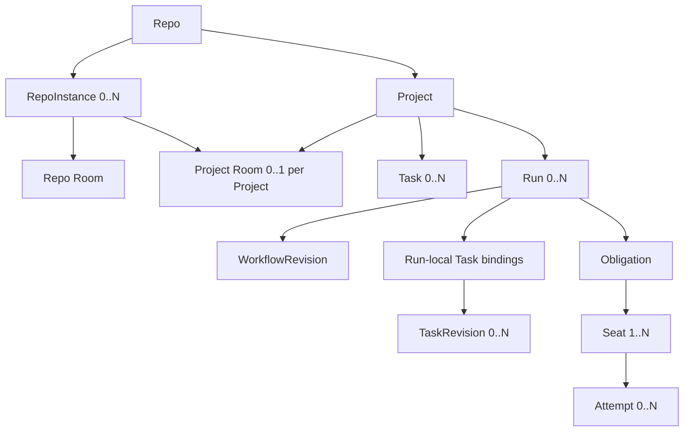

# 权威领域模型

> Status: Normative · Draft v0.7.0<br>
> Parent: [HCTL2 设计规范](./README.md)<br>
> Rule: 本文是对象含义与 identity 的唯一完整定义；layer 文档只定义行为。

## 对象关系



Room 与 Run 可以互相引用但不存在包含关系：Project Room 可展示多个 Run；Scoped Room 可由某个 Run 的 Request 派生；Room 不拥有 Workflow token 或 runtime。

## L4 对象：Intent & Collaboration

### Repo 与 RepoInstance

Repo 是一个已注册 Git repository 的逻辑身份与共享 Artifact 边界，拥有稳定 `repo_id`、Project 集合，以及 repo-scoped policy、Skill refs、Harness overrides 和可进入 Git 的 `.hctl2/` 配置。

RepoInstance 是该 Repo 的一个本地 clone/git-common-dir，也是 repo-local HCTL operational state 的隔离边界：

- 拥有稳定 `repo_instance_id` 与恰好一个 Repo Room；
- 拥有 `<git-common-dir>/hctl2/state.sqlite`；
- linked worktree 只获得 `checkout_id` 或 ChangeSet identity，不创建新 RepoInstance；
- Phase 1 不在不同 clone 间同步原始 Room history；Git-tracked Project、Workflow、Artifact 与 Memo 可以共享。

Repo 不等于外部 organization/workspace，也不映射 session 或 terminal。

### Project

Project 是围绕具名目标形成的长期协作与交付容器，至少拥有：

- `project_id`、name/slug、goal、scope；
- 当前 RepoInstance 中 0..1 个 Project Room；
- Artifact、正式 decision、Task、Run；
- ProjectRoleBinding 与默认 policy；
- health/attention 聚合投影。

Project 不要求预先存在 DAG、Plan 文件、常驻 Project Assistant 或同名 Task。研究、spec、ADR 和文档 Project 可以从未创建 Run。

### Room

Room 是多人、多逻辑 Participant 的持久协作空间。它保存 message、typed reference、Invocation、Request、source relation 和正式动作的投影。

| 类型 | 用途 | 生命周期 |
| --- | --- | --- |
| Repo Room | 无固定主题的研究、发现与公共记忆入口 | 与 RepoInstance 同寿命 |
| Project Room | 有目标的长期协作、Task/Artifact/Run 投影 | 复合身份 `(repo_instance_id, project_id)`；Project 归档后只读 |
| Scoped Room | 由 Request、复杂 decision 或 incident 派生的商议空间 | 记录持久、活跃期临时；结论后归档 |

Room 不是 Harness session、Agent persona、runtime container、Workflow truth 或 Git transcript。

### RoomInvocationRecord 与 Request

RoomInvocationRecord 是从 Room 显式发起的一次 bounded Harness 调用。它可以只读或在受权 ChangeSet 上完成一次写入，但不具有自动 retry/fallback、durable join、gate 或自动后继；需要这些能力时必须提升为 Workflow proposal。

Request 是系统向一个人或角色索取信息、授权或决定的结构化对象。一个 `request_id` 可以投影到 Room、Task card、Run node、Attention inbox 和外部通知；投影不复制其状态。

### Memo

Memo 是用户显式提炼、预览、去敏并发布到 Git 的稳定知识，记录 source message IDs、scope、author、confidence、repo revision 和 supersedes/expiry。原始 Room history 不自动变成 Memo。

## L3 对象：Commitment & Tracking

### Task

Task 是 Project 内一项可独立排序、指派、阻塞、验收和完成的用户承诺。最小 contract 包含：

- `task_id`；
- title 与 desired outcome；
- acceptance；
- source refs；
- required role/capability；
- immutable TaskRevision digest。

Task 可以由人完成而没有 Run，可以由多次 Run 支持，也可以在 Run 结束后因 acceptance 未满足而保持 Open。Phase 1 中同一 Task 最多属于一个 active Run；active Run 冻结其 TaskRevision，修改 contract 必须先结束或替换该 Run。

### TaskRevision 与 TaskOperationalState

TaskRevision 是不可变、已采用的 Task contract。若连接外部 source，它还冻结同一 binding revision 下的：

```text
taskSourceBindingRevisionId
+ adoptedContractSourceSnapshotId
+ contractProjectionDigest
+ contractAuthorityPolicyDigest
```

TaskOperationalState 保存高频运营事实：source workflow state、非终态 stage、rank、priority、owner、blocker refs 与 sync state。`hctl_lifecycle_state = Open | Completed | Cancelled` 只由 HCTL typed command/Receipt 写入。`board_lane`、health 和 attention 都是派生投影。

### TaskSourcePolicy、Binding 与 Snapshot

| Mode | 行为 |
| --- | --- |
| `local` | SQLite/control 拥有 contract 与 operational fields |
| `linked_readonly` | 外部变化只形成 snapshot、proposal 或 attention；HCTL 本地仍写运营字段 |
| `external_authoritative` | provider 对 binding 中配置的 contract-source 或 operational-source fields 拥有 source authority |

Project policy 是新 binding 的默认值；最终 writer authority 由 immutable `TaskSourceBindingRevision.field_authority` 决定。每个字段同时最多一个 writer authority。

TaskSourceSnapshot 是 provider 原始与规范化观测的 append-only 快照。Contract projection 变化只产生 `SourceChanged/PendingAdoption`；采用后才创建新 TaskRevision。普通 operational update 不创建 TaskRevision。删除或归档形成 tombstone，不删除历史 Task、Run 或 Receipt。

外部 `Done/Closed/Reopen/Cancelled/Deleted` 只是 provider lifecycle fact。它不自动完成、重开、取消 HCTL Task 或停止 active Run。

### TaskCompletionReceipt

TaskCompletionReceipt 至少绑定：

```text
task_id
+ taskRevisionDigest
+ acceptancePolicyDigest
+ adoptedContractSourceSnapshotId
+ providerHeadDigest
+ evidenceRefs
+ actor
```

Complete/Reopen/Cancel lifecycle event、当前 lifecycle projection 和相应 provider outbox 必须原子提交。Provider read-back 只确认同步，不决定 HCTL Done lane。

## L2 对象：Governance & Orchestration

### WorkflowRevision 与 Workflow Node

WorkflowRevision 是可执行控制图的不可变版本。Phase 1 canonical executable view 是受 HCTL Profile 约束的 Conductor JSON；每个 Run 固定一个 definition version/digest。

Workflow Node 是 author、review、test、join、wait、switch 等机械步骤，不等于 Task。

### Run

Run 是在明确授权下执行一份冻结 WorkflowRevision 的自动化实例，保存：

- `run_id`、`project_id`；
- WorkflowRevision digest 与 Conductor execution ID；
- 0..N TaskRevision bindings；
- repo/base revision；
- logical roles、required expertise、authorized candidate sets；
- fallback/capability/permission/budget/placement policy；
- lifecycle、Request、Receipt 与 runtime mappings。

Run 不需要独立 Room。Happy path 只把低噪声里程碑投影到 Project Room、Task card 与 Run View。

### Obligation、Seat 与 Attempt

这些是内部治理对象，不增加一级导航：

- **Obligation**：一个 Conductor external task execution 要求 HCTL 产出的逻辑结果；
- **Seat**：Obligation 内稳定的逻辑执行者或投票者位置，冻结 role、capability envelope、candidate set 与 lease；
- **Attempt**：某个 WorkerProfile/Harness 对一个 Seat 的一次具体执行。

基数固定为：每个被 control poll 的 HCTL external task execution 恰对应一个 Obligation；Conductor 的 JOIN、SWITCH、WAIT 等系统 task 不创建 Obligation；Obligation 有 1..N Seat；Seat 有 0..N Attempt。

技术失败引发的 candidate fallback 只在同一 Seat 下创建新 Attempt，不改变逻辑投票者；业务 reject 是当前 Seat 的有效 Verdict，不换裁判。Engine task retry 产生新 Obligation identity。

### Verdict 与 Receipt

Verdict 是对 immutable subject revision 的 `accepted | rejected | changes_requested` 语义裁决。Receipt 是 core/control 在校验 actor、revision、policy、authority 和 evidence 后签发的正式证明。

每个 Verdict/Receipt 必须绑定 subject revision 与 policy digest。新 subject revision 使旧 required verdict stale；默认重新完成全部 required gate。

## L1 对象：Execution & Runtime

### Participant、WorkerProfile 与 Harness

| 概念 | 含义 |
| --- | --- |
| ParticipantProfile | Room 中可被 `@` 的稳定逻辑身份 |
| ProjectRoleBinding | Project role 到 logical Participant 与 candidate WorkerProfiles 的绑定 |
| WorkerProfile | 可复用的 Harness、model、mode、permission 与 environment 配置 |
| ExpertiseProfile | Skill、instruction、tool policy 与 context policy 集合 |
| HarnessDefinition | 某种 Harness/ACP agent 是什么、如何安装和探测 |
| HarnessInstallation | 当前 host 上的路径、版本、认证与健康状态 |
| HarnessCapability | ACP、MCP、resume、Skills、PTY、streaming 等实测能力 |
| HarnessAdapterBinding | 一次调用选定的 ACP、app-server、SDK、PTY/hook 接入方式、session identity 与 degradation capability |
| InvocationBinding | 一次调用冻结的 logical actor、WorkerProfile、Harness、Expertise、Context 与 Capability snapshot |

解析链固定为：

```text
@participant → ParticipantProfile → candidate WorkerProfiles
@role        → ProjectRoleBinding → logical Participant/role → candidate WorkerProfiles
```

Participant、role 与 Seat 都不是进程。Fallback 可以更换具体 WorkerProfile/Harness，但不能改变 Seat 的 logical actor。

### ChangeSet、Worktree 与 ChangeSetWriteLease

ChangeSet 是一次受权写入和 Git evidence 的逻辑边界。Worktree 是它的可替换实现资源，按需创建，不永久属于 Task、Project、Room 或 Participant。

一个 ChangeSet 同时最多一个 `ChangeSetWriteLease` holder。Retry 可以按 policy 复用 ChangeSet；fallback 必须 fence 旧 writer。Cleanup worktree 不删除 Project、Task、Room、Run 或 evidence。

### RuntimeShard、InvocationRuntime 与 TerminalBundle

| 对象 | 含义 |
| --- | --- |
| RuntimeShard | Run 在 host、isolation domain 与 generation 上的物理分片 |
| InvocationRuntime | 无 Run RoomInvocation 的 host、isolation 与 generation 边界 |
| TerminalBundle | Attempt 或 InvocationRuntime 的一组 terminal channel |
| terminal target | 精确 PTY、pane、vendor terminal 或 log channel |

Run 可以有 0..N RuntimeShard；Attempt 可以有 0..1 TerminalBundle。显式 TTY RoomInvocation 可以有 0..1 InvocationRuntime。Repo、Project、Task、Room、Participant、Obligation 和 Seat 都没有直接 runtime 映射。

### AttachDescriptor、Capability 与 TerminalInputLease

AttachDescriptor 是 agentd 签发的短期 descriptor，绑定 logical owner、backend target、host、generation/fence、capability、permission 和 expiry。

AttachCapability 是非互斥集合：

- `native_pty_exact`：同一存活 PTY/process；
- `native_agent_handoff`：同一 provider conversation 的本地/远端交接；
- `structured_live_inspect`：实时 structured event/transcript；
- `semantic_resume`：使用 provider session ID 恢复上下文；
- `replay_only`：只读历史。

一个 target 可有多个 observer，但默认至多一个 `TerminalInputLease` owner。Takeover 必须原子撤销旧 lease 并记录审计事件。Connection ID、pane name 或 terminal label 不是 durable identity。

## 必须保持分离的同名概念

```text
HCTL Task
≠ Workflow Node
≠ Conductor Task Execution
≠ Obligation
≠ Seat
≠ Attempt

Project Room
≠ assistant Thread
≠ Harness conversation
≠ Execution Chat Projection
≠ terminal transcript

Project / Task / Run identity
≠ worktree / branch / process / PTY / session identity
```

完整可测试规则见[规范性不变量](./references/invariants.md)。
