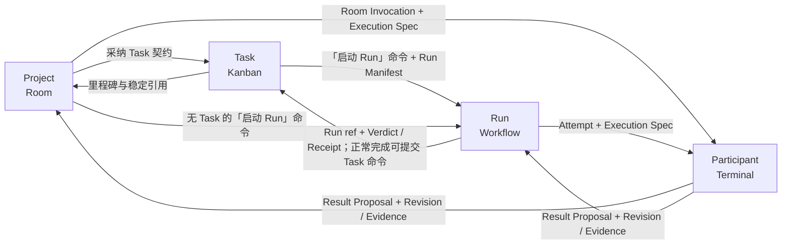

# 四模块的端到端连接

> 状态：规范性约束 · 草案 v0.16.3<br>
> 本文是 Project、Task、Run、Participant 之间连接约束的唯一权威。它不是第五个领域模块：连接的两端仍由对应模块约束（本目录）与[设计正文](../README.md)定义，共享命令、适配器与恢复机制见[系统边界](./system.md)。

## 连接模型

连接不是一份可独立漂移的共享状态，也不需要 `Handoff` 聚合。每条连接都由“目标模块的类型化命令 + 来源模块的不可变引用”组成：

1. 来源模块只能提供稳定 ID、Revision digest、状态版本、来源和已获授权的范围；不能直接写目标模块。
2. 目标模块在自己的命令准入中校验来源引用、当前版本、actor、权限和幂等键，并拥有新产生的状态。
3. 目标状态、来源关联、幂等结果和必要 outbox 由唯一 control 在同一本用户级 metadata 账本的一个事务中提交；跨 Project、Repo Instance 或模块都不得拆成 clone 本地事务再拼接。
4. 目标只以稳定引用和有序事件返回结果；来源和场景可以投影它们，但不能复制一套状态机。
5. 涉及 workflow engine、Agency、Git/SCM 或第三方平台时，提交本地意图先于外部动作；确认回执不确定时按稳定关联键回读。

连接引用必须包含对象种类、稳定 ID，以及精确 revision digest 或 state version。引用还必须携带所属 Repo/Project、生产者和适用绑定版本。`current`、显示名、外部 ID、文件路径和界面选择都不能替代这些字段。这是字段约束，不是新的持久领域对象。

## 连接图



Project → Participant 是无 Run 的显式短路；Participant → Task 不存在原始状态通道，只有经过校验的 Revision、Evidence、Verdict 或 Receipt 才能进入 Task 验收。

## 连接约束总表

| 方向 | 耐久输入 | 目标准入与提交 | 恢复依据 |
| --- | --- | --- | --- |
| Project → Task | Project/version、来源引用、可选 Task 契约及摘要、Repo Board/Project 分组锚点 | “创建 Task”命令固定不可变 `project_id` 并持久化后端创建 outbox；只有携带初始契约时才写正文 outbox，后续由“采纳契约”准入 Task Revision | 命令、幂等与关联键 → 同一 Task、外部卡和可选 Task Revision 引用 |
| Project / Task → Run | Project/version、可选精确 Task Revision、Workflow/Deployment refs、repo baseline、根 Context Manifest、Participant/参与者授权/Skill、候选、权限、预算和 Gate | Run 命令原子写 Run Manifest、Task Run 占用标记、Run 账本和引擎启动 outbox | run ID + manifest digest → Run–Engine Binding/readback |
| Project → Participant | Room Invocation + Execution Spec | Project 先持久化调用授权，Participant 模块再预留、绑定和激活运行时 | invocation id + invocation_version + Execution Spec digest |
| Run → Participant | Attempt + Execution Spec | 节点声明的外部机械事实前置由工具箱回读满足后，Run 才持久化派发授权；Participant 模块再预留、绑定和激活运行时 | attempt id + attempt_generation + Execution Spec digest |
| Participant → Project/Run | Result Proposal、逐输出的归属者/运行时/现场/Agency 绑定代次、Revision/Evidence 引用 | 归属模块去重并逐项校验身份、代次、Context Bundle、权限、写租约和输出 schema 后准入 | 提案标识符 + producer sequence + 归属者/spec digest；迟到结果只留历史 |
| human scene / Run reducer → Participant | 「合入 ChangeSet」命令、精确 ChangeSet Revision/target/证据引用 | Participant 模块准入授权并持久化 intent/outbox，工具箱执行与回读；Integration Receipt 返回发起模块作证据 | intent id + expected target head → 唯一 Receipt；结果未知不重投 |
| human Kanban / Run reducer → Task | human provenance，或正常完成 Run ref；被冻结的 Task Revision ref、Revision/Evidence/Verdict/Receipt refs | human actor 或 task-bound Run reducer 提交同一个「完成 Task」命令；Task 按当前验收约束独立校验 | 「完成 Task」命令 id → Task Completion Receipt；Harness 只提供证据 |
| Task/Run/Participant → Project | source ref、event id/sequence、版本、敏感级别 | Project 只建低噪声投影；Memo/Artifact 仍需 Project 命令发布 | source event cursor，可从源账本重建 |

## Project → Task：从讨论到承诺

Room 可以生成 Task 提炼提案的预览，但预览不是第二个 Task。确认时，「创建 Task」命令或「采纳契约」命令必须冻结：

- `project_id` 与预期 Project version；
- 来源 Message、Artifact、Memo、Request 的精确引用；
- 标题、预期结果、验收约束、角色/能力和可选外部来源绑定；
- 规范化 proposal digest、actor/permission 与 idempotency key。

Task 模块先以比较并交换校验 Project 和可选当前 Task Revision。创建命令先提交 Task 身份、后端 outbox 和关联键；只有命令携带初始契约时，才另写 Revision 准入意图和 Git 正文 outbox。确认回执未知时按原关联键分别回读，不能创建第二个 Task 或卡片。content-first 卡片只有唯一归属一个 Project 分组时，才能被认领为无契约 Task。

“采纳契约”命令在工具箱回读 Git 正文后准入不可变 Task Revision，并返回精确引用；完整恢复约束见 [Task 模块](./task.md#契约与来源)。Room 中继续编辑或删除显示内容不会改写已采纳 Revision。普通消息、总结、父分组实体和拖放都不能创建 Task，也不能改变 Task 的 Project 归属。

## Project / Task → Run：授权自动施工

批准 Workflow 只确认施工图；「启动 Run」命令才建立自动施工连接。Project 是必需且活跃的授权来源，Task Revision 是 0..1 个可选绑定；Run Manifest 的冻结清单见[Run 约束](./run.md#workflow-与-run-授权)。

control 在一个用户级账本事务中写 Run、Manifest、幂等结果、可选 Task Run 占用标记和引擎启动 outbox。外部执行实例用 `run_id + manifest_digest` 作为关联键；事务提交后崩溃或确认回执丢失时必须先回读，不能再启动第二个执行实例。

若 Project、Task 或 Workflow 在提交前已不匹配预期版本，Project 已归档，或 Task 已有 `active | completion_pending` 占用标记，命令必须拒绝。提交后发生的上游更新不改写活动 Run，只能影响新 Run 或触发显式替代。

## Project / Run → Participant：从授权到物理执行

两条入口共用同一个派发协议，但保留不同归属者：

- Project 入口先持久化 [Project 模块定义的](./project.md#room-invocation) Room Invocation 与其 Execution Spec；`repo_scope` 永远只读。它没有自动候选切换或 Gate。
- Run 入口先持久化 [Run 模块定义的](./run.md#从节点到结果) Attempt 与其 Execution Spec；候选、Seat 和语义归约仍由 Run 拥有。

两条入口共用同一份派发冻结记录 Execution Spec（票据，归属者为 Room Invocation 或 Attempt）。它至少固定：

```text
execution owner stable ref + invocation_version | attempt_generation
+ root Context Manifest ref + digest
+ consumer Context Bundle ref + digest
+ exact Participant revision
+ Project version + 参与者授权条目 digest（repo_scope 可无）
+ required/optional Skill refs + digests（Agency 申报，逐个附 known | unknown）
+ Worker Profile revision
+ Harness/Runtime Port–Provider Binding + 接入方式与降级能力
+ Participant–Agency Binding ref + version
+ terminal input policy（managed_single_writer | native_interactive_allowed；无 Terminal 时省略）
+ repo_id/base + 可选 selected Repo Instance ref / placement constraints
+ 能力与权限摘要
+ 预算与截止
+ 可选 ChangeSet / Write Lease 规则
+ 可选执行加固声明（来自 Worker Profile：OS 沙箱、凭据代用范围、网络目的地与工具接口白名单）
+ spec digest 与幂等键
```

归属者特有字段各自补充：Room Invocation 侧固定范围（`repo_scope | project_scope`）、`invocation_version`，以及 human 批准建议时的来源链字段；Attempt 侧固定 attempt、seat、run 身份与 `attempt_generation`。

Participant 确定逻辑身份；Project 的参与者授权确定该身份在当前 Project 中的职责和权限上限；Participant–Agency Binding 确定谁供给它的执行体；Skill 提供方法；Worker Profile 选择物理执行配置。Execution Spec 必须分别引用它们，任何一个都不能代替另一个。两侧不各建一份“执行规格”。

外部运行时的启动顺序固定为：

1. 归属模块提交 Execution Spec 与派发 outbox；此时只有 `invocation_version | attempt_generation`，不得预填运行时身份。
2. Agency 适配器先校验当前 control、site 和绑定代次，再向 Agency 要人。Agency 交付执行体端点：返回实际能力、物理目标、Execution Runtime ID 和新的 `runtime_generation`。实际能力缺少任何已声明的加固项时，control 必须拒绝激活并列出缺项。Agency 不能回显的代次栅栏必须记录为未生效。
3. control 在用户级账本事务中记录归属者到 Execution Runtime 的精确映射、适用的 Write Lease 和激活 outbox。
4. outbox 同时携带归属者版本或代次、运行时代次、control writer generation、site generation 与 Agency binding owner generation。适配器按完整字段组再次校验后向执行体端点提交激活并回读；本地参考实现的端点经 Herdr API 到达。声明代次栅栏回显的端点拒绝旧代次、旧租约和重复激活；未声明该能力的只在 HCTL 入口校验，绕过入口的动作按低信任处理。

代次分三组记录。第一组标识语义归属者：`invocation_version` 或 `attempt_generation`。第二组标识物理执行：`runtime_generation`。第三组排除旧基础设施写入：control、site 和 Agency 绑定代次。Participant 版本、绑定版本、producer sequence 和 content cursor 都不属于代次。六个代次的成员、权威落点与推导禁令见[代次家族总表](./system.md#代次家族)。

如果冻结的端口明确是受信任的纯进程内同步调用，Execution Spec 必须写 `execution_mode = in_process`，可以没有 Repo Instance、Runtime/Terminal、运行时/现场/Agency 绑定代次或租约。

它的 Result Proposal 改为固定归属者版本或代次、control writer generation、Extension/Port–Provider Binding、spec/bundle digest 和 producer sequence，且不能提交 ChangeSet 或声称物理隔离与连接能力。

除此之外不得省略物理字段组。派发或激活的确认回执只证明执行已被接受，不证明产生了语义结果。

## Participant → Project / Run：结果准入

Result Proposal 使用 [Participant 模块定义的字段约束](./participant.md#运行时与观测)，并精确引用本次连接的 Execution Spec；连接本身不再维护一份可变结果状态。

control inbox 先按提案标识符、producer sequence 和归属者去重。随后逐项校验归属者状态、归属者代次、适用的代次栅栏、spec/bundle/绑定摘要、租约、ChangeSet、输出范围、证据和权限。

每个输出都必须携带自己的生产者字段组；`in_process` 输出只能使用上节定义的缩减字段组，不能把一个合格项的代次套给另一个旧项。通过后：

- Room Invocation 的结果由 Project 记录并投影到 Room；
- Attempt 的结果由 Run 归约为 Seat 结果、Verdict 或 Receipt；
- Task 不消费 Harness 的进程状态、自述、终端屏幕或未经准入的 Proposal。

任一旧代次、被取消或替代的归属者，或不匹配 spec/bundle 的结果只保留审计记录，不能推进 Project、Run 或 Task。

## Human Kanban / Run reducer → Task → Project：验收与回流

无 Run 路径中，有权 human actor 在 Kanban 预览精确 ChangeSet Revision/Artifact Revision、ReviewSubjectRef 和测试/SCM 证据后提交“完成 Task”命令，不生成 Run 专属的 Gate Receipt。验收约束要求内部独立 Gate 时，Task 先授权 Run。

有 Run 路径中，Run 返回冻结的 Task Revision、终止原因及 Verdict/Receipt/评审对象引用，并按 `completion_pending` 机制提交同一命令。两条获准来源与 Task 独立验收规则见[Task 写入约束](./task.md#写入约束)。Task 拒绝自动命令时，Run 保持完成，Task 保持开放并显示需要关注。

Task、Run 和 Participant 以有序领域事件向 Project 返回里程碑。事件携带 source module、稳定引用、event ID/sequence、版本和敏感级别；Project Room 只显示 Request、失败、已验证 Task、Artifact 就绪等低噪声投影。发布 Memo/Artifact 或归档 Project 仍需 Project 自己的类型化命令，不能由投影反向触发。

## 跨模块 Request 回路

Request 由 Project 模块保存，但可以阻塞 Task 待办、Run 中的 Attempt/Seat/Obligation，或直接阻塞 Room Invocation。创建 Request 时必须固定以下字段：归属者引用、受影响 revision、阻塞范围、归属者状态版本、输入 schema、所需 actor/role、权限、截止策略和去重根。Attempt 还必须携带 `attempt_generation`，Room Invocation 使用 `invocation_version`；不得使用无法判断所属层级的裸 `generation`。

被阻塞模块只保存 `request_id` 和自己的阻塞状态，不复制 Request 生命周期。执行体只执行物理等待，不另建语义阻塞对象。

“解决 Request”命令固定 Request 与预期版本、解决摘要、actor 与委派和幂等键。对必须恢复执行的 Request，control 在同一用户级 metadata 账本事务中以比较并交换校验 Project Request 与来源阻塞项的精确版本，并提交解决结果及唯一信号与投递 outbox。Project 或来源模块都不能在事务外再次发送信号。

接收方只接受匹配归属者状态版本、适用 Attempt、运行时与代次栅栏和绑定的投递；确认回执或观测完成后，来源模块才推进阻塞项。普通 Room 回复不能解决 Request，也不能直接完成引擎节点。目标已失效时，系统安全拒绝或把结果保留为过期历史。

截止时间到达时，control 以同样的版本比较并交换写入已过期；它不伪造答案，也不产生 Task 终态命令。control 只把冻结动作投回精确归属者：Task/Project 的待办动作失败或放弃，并保留 Task 生命周期；Run 归属者按 [Attempt/Seat/Obligation 的失败与取消规则](./run.md#request重试与-gate)结束；直接 Room Invocation 的 `fail|cancel` 分别进入失败或已取消，并撤销其输入与写租约。

执行体本身没有独立语义终态，只执行所属 Attempt 或 Room Invocation 的结束动作。任何分支都不得投给替代执行，也不得留下活动 Seat 或 Attempt。

## 版本、权限与替代

端到端可追溯链固定为：

```text
Project sources → Task Revision → Run Manifest → Execution Spec → Result Proposal
Project sources → Run Manifest（0 Task）→ Execution Spec → Result Proposal
Project sources → project_scope Execution Spec → Result Proposal
Repo sources    → repo_scope Execution Spec（只读）→ Result Proposal

获准 Result Proposal → Revision / Evidence → ReviewSubjectRef / Verdict / Receipt
Task 路径的验收证据 → Task Completion Receipt
```

每一步保存上一步的 ID 与摘要或版本；current pointer 只用于预览，不能替代历史引用。上游版本变化不改写已接受的下游连接：提交前发生分歧时，比较并交换必须拒绝；提交后由冻结约束继续执行到终态，新的顶层授权使用新版本。范围、权限、候选或验收含义变化时必须显式替代，而不是原地修补；Run 的替代特例清单见[启动与 Manifest](./run.md#启动与-manifest)。

权限只能逐级缩小：actor / Project 参与者授权 → Run Manifest（有 Run 时）→ Execution Spec → Agency/adapter envelope。任何下游都不能扩展网络、secret、Git、任务源、引擎或终端输入范围；需要扩权时回到拥有该权限的上游重新预览和授权。

## 失败与恢复

命令幂等、outbox/inbox、确认回执回读、control writer generation、site generation、Agency binding owner generation 和租约恢复算法只由[系统边界](./system.md#命令与跨服务正确性)定义。本节只规定连接恢复后四模块可观察到的结果：

| 失败点 | 连接语义 |
| --- | --- |
| 目标事务提交前来源已变化 | CAS 拒绝，不创建下游事实 |
| 目标已提交、调用方未收到结果 | 恢复后返回同一目标引用，不出现第二个下游对象 |
| 归属者身份可证明但外部结果仍未知 | 连接保持待启动/需要关注，来源不会被伪装成已交接 |
| 归属者、运行时、租约或任一适用的代次栅栏无法证明 | Attempt 或 Room Invocation 必须进入丢失。control 在同一事务中撤销输入/写租约，并提交旧运行时的停止与隔离 outbox。迟到流和结果只留审计；Retry 必须创建新的归属者、Execution Spec 和运行时代次。此行是执行身份丢失处理规则的唯一定义，模块约束引用而不复述 |
| 归属者取消或被替代 | 停止新派发，撤销写入/输入权并等待物理执行静默；迟到结果只留历史 |
| chat server 不可用 | 不依赖新消息/成员/cursor 的 metadata 命令可继续；需要聊天当前回读的准入拒绝，聊天入口显示重同步中 |
| 已绑定房间被开启端到端加密 | 聊天入口显示需要关注，已冻结引用与 digest 不受影响；可继续/拒绝与换绑恢复规则见[Room 与消息](./project.md#room-与消息) |
| 任务后端不可用 | 已冻结且策略不要求来源当前回读的 metadata 命令可继续；需要 placement/drift/head/cursor 的 Create/Adopt/Start/Complete/Move 拒绝，看板不显示假成功 |
| workflow engine 不可用 | 已冻结的本地事实继续存在；Run 的完成与评审只依据账本推进，Run–Engine Binding 标为分歧待对账，对账期间 control 不创建新 Obligation |
| harness / Agency 不可用 | 执行安全暂停或按代次结束，不冒充成功 |
| 节点的外部机械事实前置读不到 | 该节点不派发并标需要关注；已派发的执行不受影响；事实可读后按当前观察重新判定 |
| 其他外部适配器不可用 | 已冻结的本地事实继续存在；连接显示待启动/需要关注或安全暂停 |
| 场景投影丢失 | 从四模块账本和 source event cursor 重建，不从外部界面反推事实 |

系统对账完成前，各模块都不得表现为已完成交接。连接需要的新尝试或替代执行必须拥有新的归属者版本或代次、Execution Spec 与运行时代次；不能复活旧归属者。

## 场景与第三方适配器

Workbench 与第三方聊天/Kanban/Workflow/Terminal 平台都通过上述目标命令、投影和事件编排连接；适配器只使用目标模块已有的连接。各模块分别声明可接受的供应端动作：Chat 的普通消息只作 content，显式结构化动作才可能成为命令请求；Task 允许满足来源信封的 Done 产生完成请求。

Run 的用户输入和执行体的结果先进入 control，持久化后再由 outbox 推动 Dagu；Dagu 原生修改只形成分歧。执行体按 Execution Spec 声明的[恢复等级](../participant.md#terminal-场景)接纳原生终端输入。能力不足时隐藏动作、保留待处理请求或安全拒绝。动作分类见[系统约束](./system.md#客户端动作与-provider-事件)。

Workbench 的跨场景卡片和 deep link 只携带 stable ref 与可重建 projection；选择、焦点、展开状态和窗口布局都是客户端状态。用户从 Room 跳到 Task、从 Kanban 打开 Run、从 Workflow 连接 Terminal 时，动作仍路由到目标模块的 Query/Preview/Submit；第三方客户端遵守同一规则。
