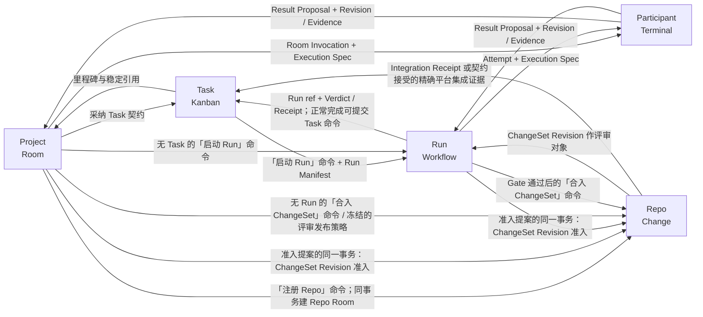

# 五模块的端到端连接

> 状态：规范性约束 · 草案 v0.18.6<br>
> 本文是 Project、Task、Run、Participant、Repo 之间连接约束的唯一权威。它不是一个领域模块：连接的两端仍由对应模块约束（本目录）与[设计正文](../README.md)定义，共享命令、适配器与恢复机制见[系统边界](./system.md)。

## 连接模型

连接不是一份可独立漂移的共享状态，也无需 `Handoff` 聚合。每条连接都由“目标模块的类型化命令 + 来源模块的不可变引用”组成：

1. 来源模块只能提供稳定 ID、Revision digest、状态版本、来源和已获授权的范围；不能直接写目标模块。
2. 目标模块在自己的命令准入中校验来源引用、当前版本、actor、权限和幂等键，并拥有新产生的状态。
3. 目标状态、来源关联、幂等结果和必要 outbox 由唯一 control 在同一个用户级控制面事务中提交；同一控制面的跨 Project 或模块命令不得拆成工作副本的本地事务再拼接。
4. 目标只以稳定引用和有序事件返回结果；来源和场景可以投影它们，但不能复制一套状态机。
5. 涉及 workflow engine、Agency、被治理仓库 Git/SCM 或第三方平台时，持久意图先于外部动作；确认不确定时按稳定关联键回读。控制面自己的治理正文按[系统存储约束](./system.md#控制面自己的存储)先保存、再事务准入，不转交 Repo 工具写入。

连接引用必须包含对象种类、稳定 ID，以及精确 revision digest 或 state version。引用还必须携带所属 Repo/Project、生产者和适用绑定版本。`current`、显示名、外部 ID、文件路径和界面选择都不能替代这些字段。这是字段约束，不是新的持久领域对象。

## 连接图



Project → Participant 是无 Run 的显式短路；Participant → Task 不存在原始状态通道，只有经过校验的 Revision、Evidence、Verdict 或 Receipt 才能进入 Task 验收。Participant → Repo 也不存在直接通道：参与者的 ChangeSet 输出由 `hctl2-tool` 封存回读，再在 Project 或 Run 准入提案的同一事务里由 Repo 模块准入版本；Repo 模块不接收 Result Proposal。

## 连接约束总表

| 方向 | 耐久输入 | 目标准入与提交 | 恢复依据 |
| --- | --- | --- | --- |
| Project → Task | Project/version、来源引用、可选 Task 契约及摘要、源引用所指任务源上的 Project 分组锚点 | “创建 Task”命令固定不可变 `project_id` 并持久化后端创建 outbox；携带初始契约时先保存治理正文，在该事务一并准入 Task Revision；后续契约由“采纳契约”准入 | 命令、幂等与关联键 → 同一 Task、外部卡和可选 Task Revision 引用 |
| Project / Task → Run | Project/version、可选精确 Task Revision、Workflow/Deployment refs、repo baseline、根 Context Manifest、席位要求与选定的施工者/Skill、候选、权限、预算和 Gate | Run 命令原子写 Run Manifest、Task Run 占用标记、Run 治理记录和引擎启动 outbox | run ID + manifest digest → Run–Engine Binding/readback |
| Project → Participant | Room Invocation + Execution Spec | Project 先持久化调用授权，Participant 模块再经 Agency 派工并激活（顺序见[下文四步](#project--run--participant从授权到派工)） | invocation id + invocation_version + Execution Spec digest + 派工引用 |
| Run → Participant | Attempt + Execution Spec | 节点声明的外部机械事实前置只认直报（`unmediated`）证据，满足后 Run 才持久化派发授权；Participant 模块再经 Agency 派工并激活（顺序见下文四步） | attempt id + attempt_generation + Execution Spec digest + 派工引用 |
| Project → Repo | 「注册 Repo」命令、人的仓库登记与平台声明、配置正文引用与摘要 | Repo 记待确认注册；有外部步骤则持久化 outbox，由有权限一方建仓、持 Git 凭据单元交付代码；确认事务激活 Repo，Project 同事务创建唯一 Repo Room；不写代码树身份、不挂接工作副本 | 原命令与关联键 → 原 Repo、外部建仓与交付结果及唯一 Repo Room |
| Participant → Project/Run | Result Proposal、逐输出的归属者语义代次与派工引用、Revision/Evidence 引用 | 归属模块去重并逐项校验身份、语义代次、派工引用、Context Bundle、权限、写租约和输出 schema 后准入 | 提案标识符 + producer sequence + 归属者/spec digest；迟到结果只留历史 |
| Project / Run → Repo | 获准提案中的 ChangeSet 输出、`hctl2-tool` 封存回读的 Git 事实 | `hctl2-tool` 先封存并回读；control 复核归属者状态、代次与租约；归属模块准入提案的同一控制面事务里，Repo 模块准入 ChangeSet Revision | change_set_revision_id + revision_digest；封存期间被取消或替代的归属者不产生获准版本 |
| Project / Run（Execution Spec 的评审发布策略）→ Repo | 冻结的评审发布策略、获准 ChangeSet Revision、被允许的描述文本 | control 在归属者准入提案与 Repo 模块准入版本的同一事务里按策略持久化「发布评审」意图与 outbox，actor 信封沿用授权它的那次 human 提交；按同一意图分阶段确认持凭据单元的 Git 交付与平台适配器的建/更新请求；开关打开时意图待处理、由人预览后提交；第一条 ChangeSet–Platform Binding 证据随回读写入 | intent id + 发布目标 → 同一条评审请求映射；确认丢失按关联键回读，不重复创建 |
| human scene / Run reducer → Repo | 「合入 ChangeSet」命令、精确 ChangeSet Revision/目标/所选授权形态/目标保护快照/证据引用 | Repo 模块准入授权并持久化 intent/outbox，`hctl2-tool`（本地目标）或平台适配器（远端目标）执行，`hctl2-tool` 回读；Integration Receipt 返回发起模块作证据 | intent id → 唯一 Receipt；本控制面同一目标同时至多一个待决意图，不论形态；结果未知不重投 |
| Repo → Run | ChangeSet Revision 引用（ReviewSubjectRef 的一种）、平台检查与评审状态作 Evidence | Run 校验 review_subject_digest、代次与证据通道等级后形成 Seat 结果或 Verdict；Artifact Revision 的评审引用是 Project → Run 的既有连接 | review_subject_digest；基线或结果树变化即新版本，旧票失效 |
| 平台事件 → Repo | 评论、批准/请求修改、检查结果、合并状态、账号映射 | 按 Repo 模块的逐项分类处理：content、外部评审证据与机械事实；按冻结前置判断分歧；控制面自己写回的事件排除 | 事件引用 + 当前回读；重复、迟到、乱序得到相同结果 |
| human Kanban / Run reducer → Task | human provenance，或正常完成 Run ref；被冻结的 Task Revision ref、Revision/Evidence/Verdict/Receipt refs（集成结果为 Repo 模块的 Integration Receipt，或该模块核验且契约事先接受的精确平台集成 Evidence） | human actor 或 task-bound Run reducer 提交同一个「完成 Task」命令；Task 按当前验收约束独立校验 | 「完成 Task」命令 id → Task Completion Receipt；Harness 只提供证据 |
| Task/Run/Participant/Repo → Project | source ref、event id/sequence、版本、敏感级别 | Project 只建低噪声投影；Memo/Artifact 仍需 Project 命令发布 | source event cursor，可从来源的治理记录重建 |

## Project → Task：从讨论到承诺

Room 可以生成 Task 提炼提案的预览，但预览不是第二个 Task。确认时，「创建 Task」命令或「采纳契约」命令必须冻结：

- `project_id` 与预期 Project version；
- 来源 Message、Artifact、Memo、Request 的精确引用；
- 标题、预期结果、验收约束、角色/能力和可选外部来源绑定；
- 规范化 proposal digest、actor/permission 与 idempotency key。

Task 模块先以比较并交换校验 Project 和可选当前 Task Revision。创建命令携带初始契约时，先在事务外保存治理正文，再提交 Task 身份、Task Revision 的准入与定位摘要、后端 outbox 和关联键；不带契约只创建无契约 Task。确认回执未知时按原关联键分别回读，不能创建第二个 Task 或卡片。content-first 卡片只有唯一归属一个 Project 分组时，才能被认领为无契约 Task。

“采纳契约”命令在控制面保存并核验精确治理正文后，以预期版本与权限校验准入不可变 Task Revision，并返回精确引用；完整恢复约束见 [Task 模块](./task.md#契约与来源)。Room 中继续编辑或删除显示内容不会改写已采纳 Revision。普通消息、总结、父分组实体和拖放都不能创建 Task，也不能改变 Task 的 Project 归属。

## Project / Task → Run：授权自动施工

批准 Workflow 只确认施工图；「启动 Run」命令才建立自动施工连接。Project 是必需且活跃的授权来源，Task Revision 是 0..1 个可选绑定；Run Manifest 的冻结清单见[Run 约束](./run.md#workflow-与-run-授权)。

control 在一个用户级控制面事务中写 Run、Manifest、幂等结果、可选 Task Run 占用标记和引擎启动 outbox。外部执行实例用 `run_id + manifest_digest` 作为关联键；事务提交后崩溃或确认回执丢失时必须先回读，不能再启动第二个执行实例。

若 Project、Task 或 Workflow 在提交前已不匹配预期版本，Project 已归档，或 Task 已有 `active | completion_pending` 占用标记，命令必须拒绝。提交后发生的上游更新不改写活动 Run，只能影响新 Run 或触发显式替代。

## Project / Run → Participant：从授权到派工

两条入口共用同一个派发协议，但保留不同归属者：

- Project 入口先持久化 [Project 模块定义的](./project.md#room-invocation) Room Invocation 与其 Execution Spec；`repo_scope` 永远只读。它没有自动候选切换或 Gate。
- Run 入口先持久化 [Run 模块定义的](./run.md#从节点到结果) Attempt 与其 Execution Spec；候选、Seat 和语义归约仍由 Run 拥有。

**选入记录**只在这里定义一次：控制面把一个工种的实例选进某处时写下的一组字段，Room 名册与 Run 席位各持一份，只写各自的差异。字段：所属 Room 或 Run 及其名册版本或 Manifest；选入项的稳定引用与冻结版本；工种引用与摘要；Agency；required/optional Skill refs+digests（Agency 申报，逐个附 known | unknown）；获准的 Worker Profile 候选范围；职责；权限与预算上限。Room 侧另有名字与人设标签。每次 Attempt 实际选用的 Worker Profile revision 与摘要记在 Attempt 上，只能在候选范围内选，不改选入记录。

两条入口共用同一份派发冻结记录 Execution Spec（票据，归属者为 Room Invocation 或 Attempt）。它至少固定：

```text
execution owner stable ref + invocation_version | attempt_generation
+ root Context Manifest ref + digest
+ consumer Context Bundle ref + digest
+ 选入记录引用与冻结版本（Room 名册记录或 Run 席位记录；`repo_scope` 调用取 Repo Room 名册的记录）
+ Project version 与选人策略摘要（`project_scope`）
+ 本次实际选用的 Worker Profile revision 与摘要（在选入记录的获准候选范围内）
+ required/optional Skill refs + digests（来自选入记录，逐个附 known | unknown）
+ Agency 端口的 Port–Provider Binding（只冻结 Agency 的公开承诺：实测能力、信任级别、权限作用域、降级策略、是否具备「代为执行工具并直报」）
+ terminal input policy（managed_single_writer | native_interactive_allowed；无 Terminal 时省略）
+ repo_id/base + 授权的写入与交付目标范围（不要求生产目录，按操作保留必要引用）
+ 能力与权限摘要
+ 预算与截止
+ 可选 ChangeSet / Write Lease 规则（对象归 Repo 模块，派工时在此冻结）
+ 可选评审发布策略（Repo、平台绑定版本、发布目标或其规则、允许创建/更新、描述来源、是否须人显式确认与审计公开范围；见 Repo 模块约束）
+ 要求的隔离效果与 Agency 的承诺（来自 Worker Profile：凭据代用范围、可访问的网络目的地、允许调用的工具能力）
+ spec digest 与幂等键
```

归属者特有字段各自补充：Room Invocation 侧固定范围（`repo_scope | project_scope`）、`invocation_version`，以及 human 批准建议时的来源链字段；Attempt 侧固定 attempt、seat、run 身份与 `attempt_generation`。

选入记录确定这次执行是哪个工种的哪位参与者、以什么职责与权限上限、由哪家 Agency 派工、允许哪些 Worker Profile；Skill 提供方法；本次实际选用的 Worker Profile 选择执行配置，候选切换只在选入记录的候选范围内换、由控制面另发一次派工。Execution Spec 必须分别引用它们，任何一个都不能代替另一个。两侧不各建一份“执行规格”。

派工的启动顺序固定为：

1. 归属模块提交 Execution Spec 与派发 outbox；此时只有 `invocation_version | attempt_generation`，不得预填派工引用。
2. control 经 Agency 端口向自己在该 Agency 上的租户提交派工；Agency 接受后返回派工引用与实际能力。实际能力缺少 Execution Spec 要求的任何隔离效果或能力项时，control 必须拒绝激活并列出缺项。
3. control 在用户级控制面事务中记录归属者到派工的精确映射、适用的 Write Lease 和激活 outbox。
4. 之后的输入、停止、观测订阅与票据都以这次派工为对象、经 Agency 执行；outbox 携带归属者版本或代次与 `control_writer_generation`，租户拒绝旧写者的动作。

代次分两组记录。第一组标识语义归属者：`invocation_version` 或 `attempt_generation`。第二组标识控制面自己的写入者：`control_writer_generation`。`engine_binding_generation` 留在 Run 与引擎之间，不进派工元组。选入记录版本、绑定版本、producer sequence 和 content cursor 都不属于代次。三种代次的成员、权威落点与推导禁令见[代次家族总表](./system.md#代次家族)。

Execution Spec 里没有物理字段组：只有派工引用、语义归属者、控制面自己的授权对象与 Agency 声明的能力。控制面内部的纯计算与引擎 noop 可以进程内执行，但不作为工种派工，不进 Proposal 通道。派发前按 [Project 的交付约束](./project.md#根-context-manifest)核验实际交付摘要与必需材料的送达，未满足时不激活执行。派发或激活的确认回执只证明派工已被 Agency 接受，不证明产生了语义结果。

## Participant → Project / Run：结果准入

Result Proposal 使用 [Participant 模块定义的字段约束](./participant.md#派工与观测)，并精确引用本次连接的 Execution Spec；连接本身不再维护一份可变结果状态。

control inbox 先按提案标识符、producer sequence 和归属者去重。随后逐项校验归属者状态、语义代次、派工引用、spec/bundle/绑定摘要、租约、ChangeSet、输出范围、证据和权限。

每个输出都必须携带自己的归属者、派工与授权引用，不能把一个合格项的引用套给另一个旧项。通过后：

- Room Invocation 的结果由 Project 记录并投影到 Room；
- Attempt 的结果由 Run 归约为 Seat 结果、Verdict 或 Receipt；
- 提案中的 ChangeSet 输出由 [Repo 模块](./repo.md#changeset-与-git-事实)在同一事务准入为 ChangeSet Revision：`hctl2-tool` 先按提案给出的 ChangeSet、租约、基线与结果位置封存并回读，control 复核归属者状态、代次与租约仍然有效，然后归属模块准入提案、Repo 模块准入版本；封存是保存，准入才算数，封存的 Git 写入在事务之外并按关联键幂等，封存期间被取消的归属者不产生获准版本，也不触发发布评审。这个顺序只适用于由执行结果提案产生的版本；有权 human actor 的显式封存由 Repo 模块按该命令准入，不经此处；
- Task 不消费 Harness 的进程状态、自述、终端屏幕或未经准入的 Proposal。

任一旧代次、被取消或替代的归属者，或不匹配 spec/bundle 的结果只保留审计记录，不能推进 Project、Run 或 Task。

## Human Kanban / Run reducer → Task → Project：验收与回流

无 Run 路径中，有权 human actor 在 Kanban 预览精确 ChangeSet Revision/Artifact Revision、ReviewSubjectRef、测试证据，以及验收契约要求代码集成时，Repo 模块的 Integration Receipt 或契约事先接受、由 Repo 核验的精确平台集成证据，然后提交“完成 Task”命令，不生成 Run 专属的 Gate Receipt。验收约束要求内部独立 Gate 时，Task 先授权 Run；接受可回读的外部评审证据时，平台的批准与检查状态由 Repo 模块回读，能证明什么由契约定。

有 Run 路径中，Run 返回冻结的 Task Revision、终止原因及 Verdict/Receipt/评审对象引用，并按 `completion_pending` 机制提交同一命令。两条获准来源与 Task 独立验收规则见[Task 写入约束](./task.md#写入约束)。Task 拒绝自动命令时，Run 保持完成，Task 保持开放并显示需要关注。

Task、Run 和 Participant 以有序领域事件向 Project 返回里程碑。事件携带 source module、稳定引用、event ID/sequence、版本和敏感级别；Project Room 只显示 Request、失败、已验证 Task、Artifact 就绪等低噪声投影。发布 Memo/Artifact 或归档 Project 仍需 Project 自己的类型化命令，不能由投影反向触发。

## 跨模块 Request 回路

Request 由 Project 模块保存，但可以阻塞 Task 待办、Run 中的 Attempt/Seat/Obligation，或直接阻塞 Room Invocation。创建 Request 时必须固定以下字段：归属者引用、受影响 revision、阻塞范围、归属者状态版本、输入 schema、所需 actor/role、权限、截止策略和去重根。Attempt 还必须携带 `attempt_generation`，Room Invocation 使用 `invocation_version`；不得使用无法判断所属层级的裸 `generation`。

被阻塞模块只保存 `request_id` 和自己的阻塞状态，不复制 Request 生命周期。参与者只执行物理等待，不另建语义阻塞对象。

“解决 Request”命令固定 Request 与预期版本、解决摘要、actor 与委派和幂等键。对必须恢复执行的 Request，control 在同一用户级控制面事务中以比较并交换校验 Project Request 与来源阻塞项的精确版本，并提交解决结果及唯一信号与投递 outbox。Project 或来源模块都不能在事务外再次发送信号。

接收方只接受匹配归属者状态版本、适用 Attempt 或 Room Invocation 的语义版本、派工引用和绑定的投递；确认回执或观测完成后，来源模块才推进阻塞项。普通 Room 回复不能解决 Request，也不能直接完成引擎节点。目标已失效时，系统安全拒绝或把结果保留为过期历史。

截止时间到达时，control 以同样的版本比较并交换写入已过期；它不伪造答案，也不产生 Task 终态命令。control 只把冻结动作投回精确归属者：Task/Project 的待办动作失败或放弃，并保留 Task 生命周期；Run 归属者按 [Attempt/Seat/Obligation 的失败与取消规则](./run.md#request重试与-gate)结束；直接 Room Invocation 的 `fail|cancel` 分别进入失败或已取消，并撤销其输入与写租约。

派工本身没有独立语义终态，只执行所属 Attempt 或 Room Invocation 的结束动作。任何分支都不得投给替代派工，也不得留下活动 Seat 或 Attempt。

## 版本、权限与替代

端到端可追溯链固定为：

```text
Project sources → Task Revision → Run Manifest → Execution Spec → Result Proposal
Project sources → Run Manifest（0 Task）→ Execution Spec → Result Proposal
Project sources → project_scope Execution Spec → Result Proposal
Repo sources    → repo_scope Execution Spec（只读）→ Result Proposal

获准 Result Proposal → Revision / Evidence → ReviewSubjectRef / Verdict / Receipt
获准 ChangeSet Revision → 集成意图（目标 + 所选授权形态）→ Integration Receipt
Task 路径的验收证据 → Task Completion Receipt
```

每一步保存上一步的 ID 与摘要或版本；current pointer 只用于预览，不能替代历史引用。上游版本变化不改写已接受的下游连接：提交前发生分歧时，比较并交换必须拒绝；提交后由冻结约束继续执行到终态，新的顶层授权使用新版本。范围、权限、候选或验收含义变化时必须显式替代，而不是原地修补；Run 的替代特例清单见[启动与 Manifest](./run.md#启动与-manifest)。

权限只能逐级缩小：actor / Project 选人策略 → Room 名册或 Run 席位记录 → Run Manifest（有 Run 时）→ Execution Spec → Agency/adapter envelope。任何下游都不能扩展网络、secret、Git、任务源、引擎、终端输入范围或评审发布的地点与范围；扩权时回到拥有该权限的上游重新预览和授权。

## 失败与恢复

命令幂等、outbox/inbox、确认回执回读、control writer generation 和租约恢复算法只由[系统边界](./system.md#命令与跨服务正确性)定义。本节只规定连接恢复后五模块可观察到的结果：

| 失败点 | 连接语义 |
| --- | --- |
| 目标事务提交前来源已变化 | CAS 拒绝，不创建下游事实 |
| 目标已提交、调用方未收到结果 | 恢复后返回同一目标引用，不出现第二个下游对象 |
| 归属者身份可证明但外部结果仍未知 | 连接保持待启动/需要关注，来源不会被伪装成已交接；单纯不可达不证明身份丢失，网络失败不触发控制面重建供应端目录 |
| 语义归属者或租约无法证明 | Attempt 或 Room Invocation 必须进入丢失。control 在同一事务中撤销输入/写租约，并向 Agency 提交对该派工的停止与隔离 outbox。迟到流和结果只留审计；Retry 必须创建新的归属者、Execution Spec 和派工。此行是执行身份丢失处理规则的唯一定义，模块约束引用而不复述；单纯联系不上、截止已过和 Agency 报无法履约都不进本行 |
| 归属者取消或被替代 | 停止新派发，撤销写入/输入权并等待物理执行静默；迟到结果只留历史 |
| chat server 不可用 | 不依赖新消息/成员/cursor 的 metadata 命令可继续；依赖聊天当前回读的准入拒绝，聊天入口显示重同步中 |
| 已绑定房间被开启端到端加密 | 聊天入口显示需要关注，已冻结引用与 digest 不受影响；可继续/拒绝与换绑恢复规则见[Room 与消息](./project.md#room-与消息) |
| 任务后端不可用 | 已冻结且策略不要求来源当前回读的 metadata 命令可继续；依赖 placement/drift/head/cursor 的 Create/Adopt/Start/Complete/Move 拒绝，看板不显示假成功 |
| workflow engine 不可用 | 已冻结的本地事实继续存在；Run 的完成与评审只依据治理记录推进，Run–Engine Binding 标为分歧待对账，对账期间 control 不创建新 Obligation |
| Agency 报无法履约 | 按所报故障与冻结规则处理：候选切换、Request、失败或取消；不冒充成功，不记成联系不上；Agency 在冻结规格内的自愈（重启会话、改派备份、换主机）对控制面无感，不是这一行 |
| Agency 不可达 | 派工标联系不上，按冻结的截止与取消条件处理，不撤权、不延长授权；仍在运行的参与者按已接受的范围、截止与取消条件行事，结果由 Agency 保管到接收方确认保全；换 Agency 由有权的人显式替代 |
| 代码协作平台不可用 | 本地物化与封存继续，面向本地目标的集成只对显式不挂平台的 Repo 继续；依赖平台当前回读的发布评审、读评审请求状态与远端合入拒绝，Change 场景显示重同步中；已投递或可能已投递的远端意图保持结果未知 |
| 远端集成或发布评审的结果未知 | 意图保持结果未知并继续占用冲突范围，不改道、不签成功 Receipt；按 [Repo 模块约束](./repo.md#恢复)分目标回读收敛，本地已有同一结果树也不解锁 |
| 节点的外部机械事实前置读不到 | 该节点不派发并标需要关注；已派发的执行不受影响；事实可读后按当前观察重新判定 |
| 其他外部适配器不可用 | 已冻结的本地事实继续存在；连接显示待启动/需要关注或安全暂停 |
| 精确结果待交，控制面离线或恢复旧备份 | 发送方保管到接收方确认同一结果已保全；恢复核原授权与既有处理，缺依据走显式恢复，不要求原进程或临时树仍在 |
| 治理正文已保存但未准入，或准入后交付未确认 | 按原命令返回同一候选或准入结果；保护待准入及待交付材料，镜像或交付失败不伪造成功 |
| 场景投影丢失 | 从五模块的治理记录和 source event cursor 重建，不从外部界面反推事实 |

系统对账完成前，各模块都不得表现为已完成交接。连接产生的新尝试或替代执行必须拥有新的归属者版本或代次、Execution Spec 与派工；不能复活旧归属者。

## 场景与第三方适配器

Workbench 与第三方聊天/Kanban/Workflow/Terminal/代码协作平台都通过上述目标命令、投影和事件编排连接；适配器只使用目标模块已有的连接。各模块分别声明可接受的供应端动作：Chat 的普通消息只作 content，显式结构化动作才可能成为命令请求；Task 允许满足来源信封的 Done 产生完成请求；Repo 模块当前不接纳任何自动提交的平台动作，批准只是外部评审证据，逐项去向见 [Repo 模块约束](./repo.md#平台动作与命令)。

Run 的用户输入和参与者的结果先进入 control，持久化后再由 outbox 推动 Dagu；Dagu 原生修改只形成分歧。Agency 按 Execution Spec 冻结的输入策略与它声明的[恢复等级](../participant.md#terminal-场景)接纳原生终端输入。能力不足时隐藏动作、保留待处理请求或安全拒绝。动作分类见[系统约束](./system.md#客户端动作与-provider-事件)。

Workbench 的跨场景卡片和 deep link 只携带 stable ref 与可重建 projection；选择、焦点、展开状态和窗口布局都是客户端状态。用户从 Room 跳到 Task、从 Kanban 打开 Run、从 Workflow 连接 Terminal 时，动作仍路由到目标模块的 Query/Preview/Submit；第三方客户端遵守同一规则。
